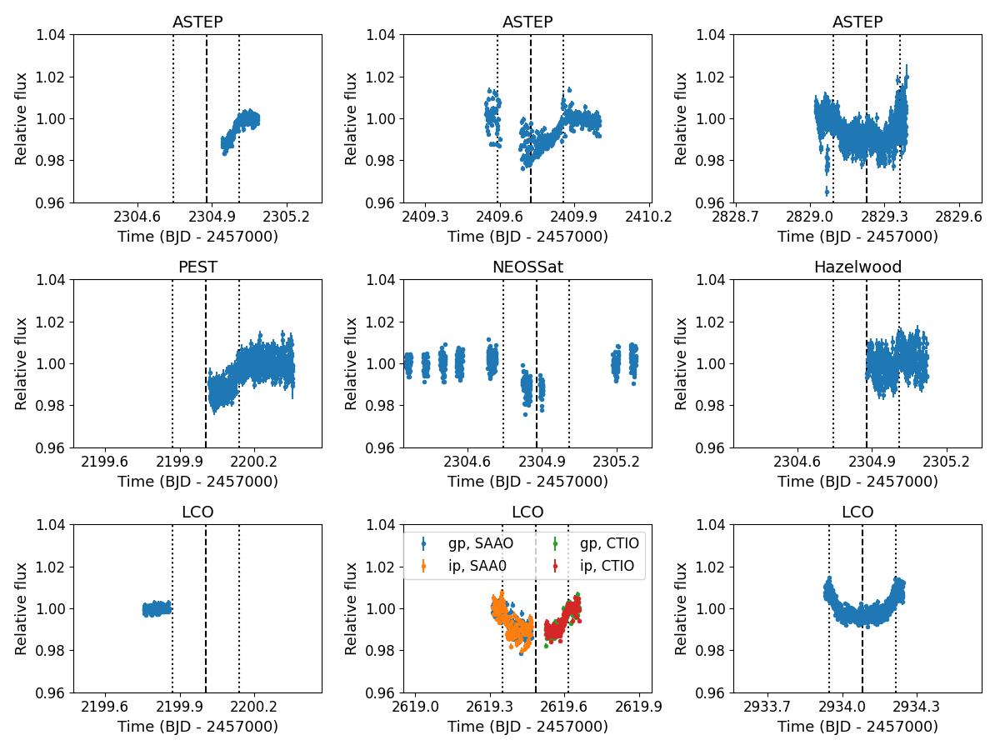
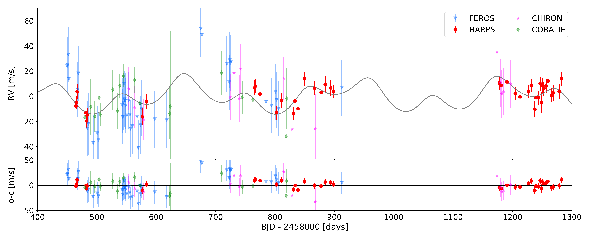
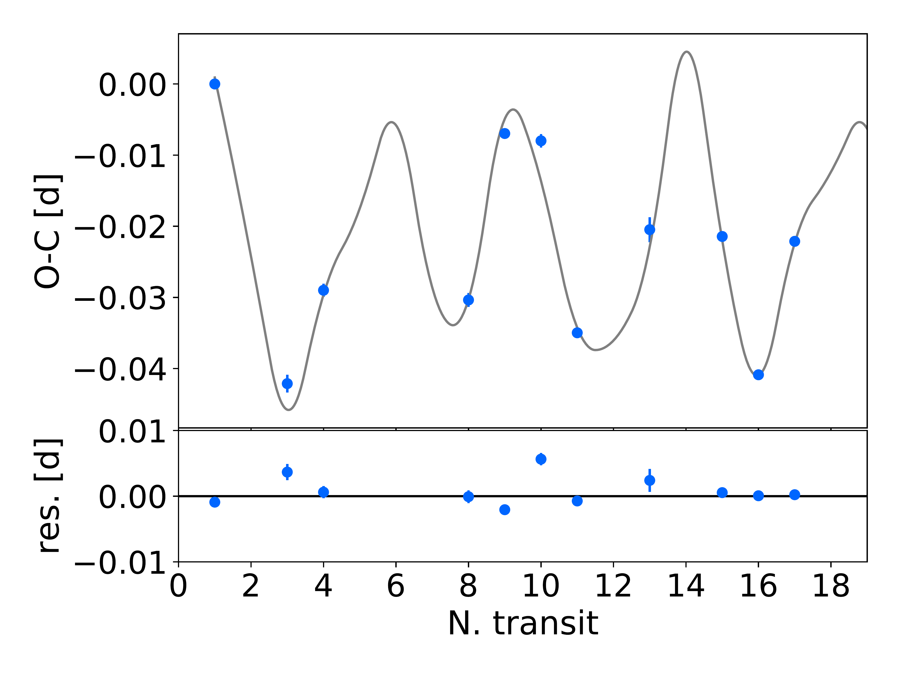
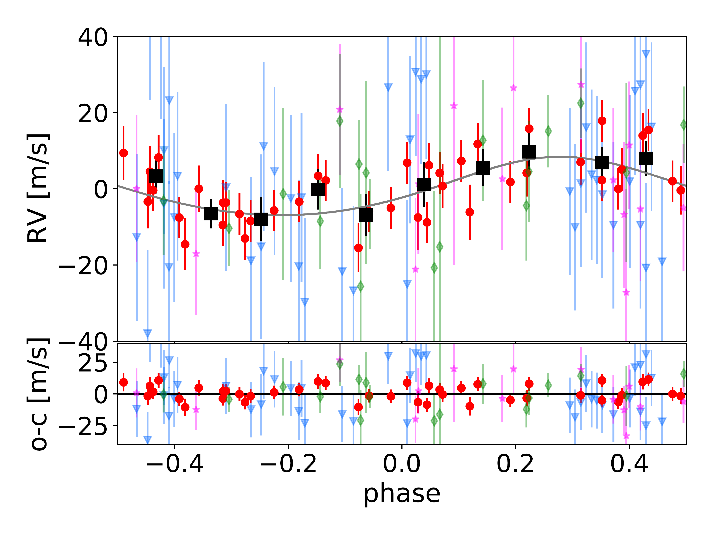
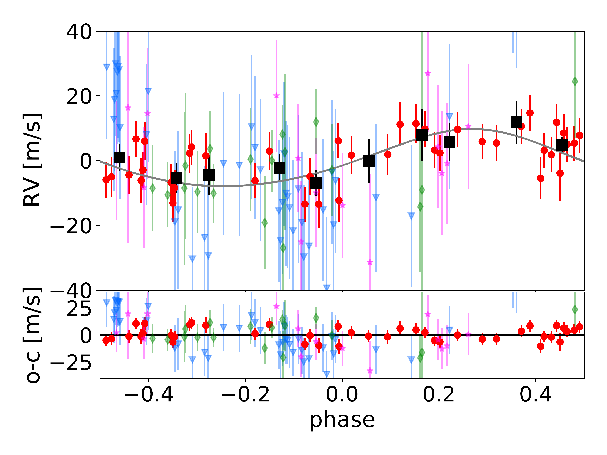
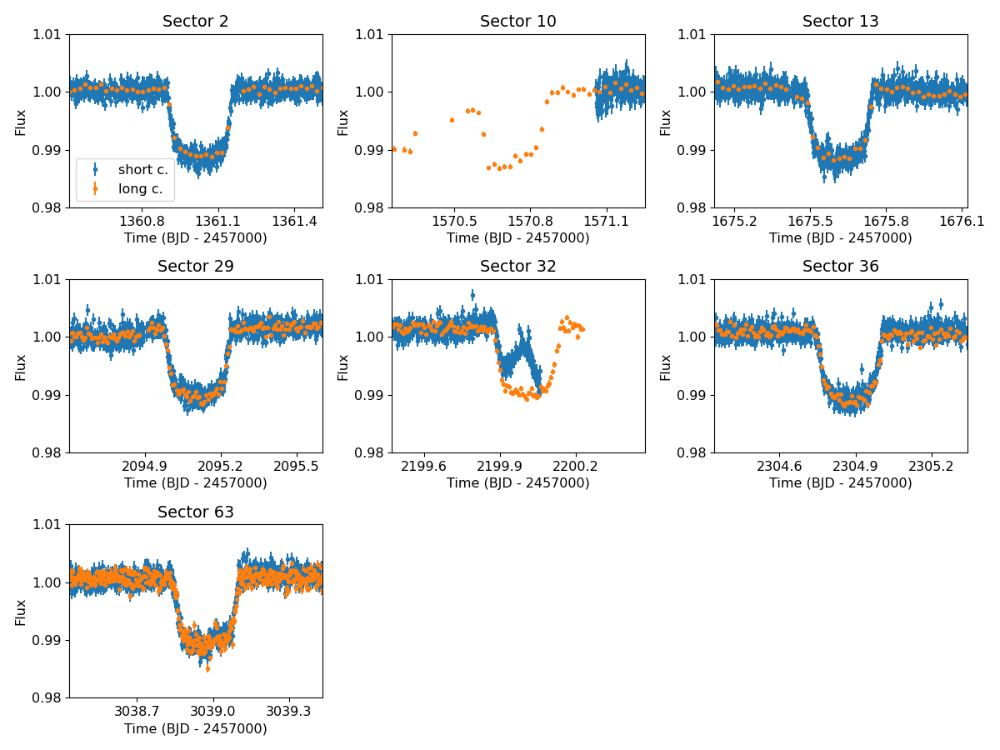

$\newcommand{\ensuremath}{}$
$\newcommand{\xspace}{}$
$\newcommand{\object}[1]{\texttt{#1}}$
$\newcommand{\farcs}{{.}''}$
$\newcommand{\farcm}{{.}'}$
$\newcommand{\arcsec}{''}$
$\newcommand{\arcmin}{'}$
$\newcommand{\ion}[2]{#1#2}$
$\newcommand{\textsc}[1]{\textrm{#1}}$
$\newcommand{\hl}[1]{\textrm{#1}}$
$\newcommand{\footnote}[1]{}$
$\newcommand{\vdag}{(v)^\dagger}$
$\newcommand$
$\newcommand$
$\newcommand{\periodplanetb}{\ensuremath{104.854_{-0.002}^{+0.001}}}$
$\newcommand{\Kplanetb}{\ensuremath{7.7\pm1.1}}$
$\newcommand{\eccplanetb}{\ensuremath{0.09_{-0.02}^{+0.01}}}$
$\newcommand{\omegaplanetb}{\ensuremath{350_{-4}^{+2}}}$
$\newcommand{\Maplanetb}{\ensuremath{111\pm2}}$
$\newcommand{\massplanetb}{\ensuremath{0.17\pm0.02}}$
$\newcommand{\axisplanetb}{\ensuremath{0.4254 \pm 0.002}}$
$\newcommand{\periodplanetc}{\ensuremath{273.69_{-0.22}^{+0.26}}}$
$\newcommand{\Kplanetc}{\ensuremath{9.1_{-0.4}^{+0.5}}}$
$\newcommand{\eccplanetc}{\ensuremath{0.096_{-0.009}^{+0.008}}}$
$\newcommand{\omegaplanetc}{\ensuremath{8_{-7}^{+4}}}$
$\newcommand{\Maplanetc}{\ensuremath{192_{-3}^{+4}}}$
$\newcommand{\massplanetc}{\ensuremath{0.28_{-0.01}^{+0.02}}}$
$\newcommand{\axisplanetc}{\ensuremath{0.807 \pm 0.003}}$
$\newcommand{\RVoffFEROS}{\ensuremath{51326.7_{-3.1}^{+2.9}}}$
$\newcommand{\RVoffHARPS}{\ensuremath{51350.4_{-0.9}^{+1.0}}}$
$\newcommand{\RVoffCHIRON}{\ensuremath{-0.5_{-3.9}^{+4.2}}}$
$\newcommand{\RVoffCORALIE}{\ensuremath{51331.0_{-3.3}^{+3.1}}}$
$\newcommand{\RVjittFEROS}{\ensuremath{19.9_{-2.1}^{+2.6}}}$
$\newcommand{\RVjittHARPS}{\ensuremath{5.5_{-0.6}^{+0.8}}}$
$\newcommand{\RVjittCHIRON}{\ensuremath{11.9_{-3.7}^{+4.8}}}$
$\newcommand{\RVjittCORALIE}{\ensuremath{5.4_{-3.5}^{+4.4}}}$
$\newcommand{\periodplanetbmaxLn}{\ensuremath{104.855} }$
$\newcommand{\KplanetbmaxLn}{\ensuremath{7.7}}$
$\newcommand{\eccplanetbmaxLn}{\ensuremath{0.102}}$
$\newcommand{\omegaplanetbmaxLn}{\ensuremath{351}}$
$\newcommand{\MaplanetbmaxLn}{\ensuremath{110}}$
$\newcommand{\massplanetbmaxLn}{\ensuremath{0.17}}$
$\newcommand{\axisplanetbmaxLn}{\ensuremath{0.4254}}$
$\newcommand{\periodplanetcmaxLn}{\ensuremath{273.55}}$
$\newcommand{\KplanetcmaxLn}{\ensuremath{8.8}}$
$\newcommand{\eccplanetcmaxLn}{\ensuremath{0.107}}$
$\newcommand{\omegaplanetcmaxLn}{\ensuremath{11}}$
$\newcommand{\MaplanetcmaxLn}{\ensuremath{190}}$
$\newcommand{\massplanetcmaxLn}{\ensuremath{0.27}}$
$\newcommand{\axisplanetcmaxLn}{\ensuremath{0.806}}$
$\newcommand{\RVoffFEROSmaxLn}{\ensuremath{51324.5}}$
$\newcommand{\RVoffHARPSmaxLn}{\ensuremath{51349.4}}$
$\newcommand{\RVoffCHIRONmaxLn}{\ensuremath{-0.2}}$
$\newcommand{\RVoffCORALIEmaxLn}{\ensuremath{51327.1}}$
$\newcommand{\RVjittFEROSmaxLn}{\ensuremath{21.1}}$
$\newcommand{\RVjittHARPSmaxLn}{\ensuremath{5.1}}$
$\newcommand{\RVjittCHIRONmaxLn}{\ensuremath{14.9}}$
$\newcommand{\RVjittCORALIEmaxLn}{\ensuremath{4.3}}$
$\newcommand{\julietpb}{\ensuremath{0.1015\pm{0.0005}}}$
$\newcommand{\julietbb}{\ensuremath{0.45_{-0.03}^{+0.02}}}$
$\newcommand{\julietrho}{\ensuremath{3431_{-140}^{+160}}}$
$\newcommand{\julietqoneTESS}{\ensuremath{0.30\pm0.03}}$
$\newcommand{\julietqtwoTESS}{\ensuremath{0.36_{-0.06}^{+0.05}}}$
$\newcommand{\julietqoneASTEP}{\ensuremath{0.62\pm0.06}}$
$\newcommand{\julietqtwoASTEP}{\ensuremath{0.07\pm0.04}}$
$\newcommand{\julietqoneLCOone}{\ensuremath{0.32_{-0.07}^{+0.08}}}$
$\newcommand{\julietqtwoLCOone}{\ensuremath{0.30\pm0.07}}$
$\newcommand{\julietqoneLCOtwo}{\ensuremath{0.61_{-0.06}^{+0.08}}}$
$\newcommand{\julietqtwoLCOtwo}{\ensuremath{0.43_{-0.06}^{+0.07}}}$
$\newcommand{\julietqoneLCOthr}{\ensuremath{0.29_{-0.06}^{+0.07}}}$
$\newcommand{\julietqtwoLCOthr}{\ensuremath{0.22_{-0.06}^{+0.07}}}$
$\newcommand{\julietqoneLCOfour}{\ensuremath{0.33_{-0.06}^{+0.07}}}$
$\newcommand{\julietqtwoLCOfour}{\ensuremath{0.25_{-0.06}^{+0.07}}}$
$\newcommand{\julietqoneLCOfive}{\ensuremath{0.71\pm0.07}}$
$\newcommand{\julietqtwoLCOfive}{\ensuremath{0.43\pm0.07}}$
$\newcommand{\julietqoneLCOsix}{\ensuremath{0.29_{-0.08}^{+0.07}}}$
$\newcommand{\julietqtwoLCOsix}{\ensuremath{0.25_{-0.05}^{+0.06}}}$
$\newcommand{\julietqonePEST}{\ensuremath{0.83\pm0.07}}$
$\newcommand{\julietqtwoPEST}{\ensuremath{0.49_{-0.07}^{+0.06}}}$
$\newcommand{\julietqoneNEOS}{\ensuremath{0.67_{-0.07}^{+0.06}}}$
$\newcommand{\julietqtwoNEOS}{\ensuremath{0.41\pm0.07}}$
$\newcommand{\julietqoneHwd}{\ensuremath{0.50_{-0.07}^{+0.08}}}$
$\newcommand{\julietqtwoHwd}{\ensuremath{0.35_{-0.07}^{+0.08}}}$
$\newcommand{\julietmfluxTESStwo}{\ensuremath{0.0002_{-0.0013}^{+0.0012}}}$
$\newcommand{\julietsigmaTESStwo}{\ensuremath{402\pm8}}$
$\newcommand{\julietmfluxTESSten}{\ensuremath{0.003\pm0.002}}$
$\newcommand{\julietsigmawTESSten}{\ensuremath{327\pm13}}$
$\newcommand{\julietmfluxTESSthir}{\ensuremath{-0.0007_{-0.0005}^{+0.0006}}}$
$\newcommand{\julietsigmawTESSthir}{\ensuremath{371_{-11}^{+10}}}$
$\newcommand{\julietmfluxTESStn}{\ensuremath{0.0010_{-0.0005}^{+0.0006}}}$
$\newcommand{\julietsigmawTESStn}{\ensuremath{641\pm9}}$
$\newcommand{\julietmfluxTESStt}{\ensuremath{0.006_{-0.006}^{+0.005}}}$
$\newcommand{\julietsigmawTESStt}{\ensuremath{419_{-7}^{+8}}}$
$\newcommand{\julietmfluxTESSts}{\ensuremath{0.0012\pm0.0008}}$
$\newcommand{\julietsigmawTESSts}{\ensuremath{604_{-9}^{+10}}}$
$\newcommand{\julietmfluxTESSst}{\ensuremath{-0.0003_{-0.0028}^{+0.0030}}}$
$\newcommand{\julietsigmawTESSst}{\ensuremath{493\pm8}}$
$\newcommand{\julietmfluxASTEPone}{\ensuremath{0.0004\pm0.0001}}$
$\newcommand{\julietsigmawASTEPone}{\ensuremath{960_{-25}^{+34}}}$
$\newcommand{\julietmfluxASTEPtwo}{\ensuremath{0.00027\pm0.00007}}$
$\newcommand{\julietsigmawASTEPtwo}{\ensuremath{999.1_{-0.6}^{+0.9}}}$
$\newcommand{\julietmfluxASTEPthr}{\ensuremath{-0.00088\pm0.00007}}$
$\newcommand{\julietsigmawASTEPthr}{\ensuremath{998_{-1}^{+2}}}$
$\newcommand{\julietmfluxPEST}{\ensuremath{0.00004_{-0.00009}^{+0.00008}}}$
$\newcommand{\julietsigmawPEST}{\ensuremath{996\pm3}}$
$\newcommand{\julietmfluxNEOS}{\ensuremath{-0.00002\pm0.00003}}$
$\newcommand{\julietsigmawNEOS}{\ensuremath{999.92_{-0.05}^{+0.08}}}$
$\newcommand{\julietmfluxHwd}{\ensuremath{-0.050\pm0.0001}}$
$\newcommand{\julietsigmawHwd}{\ensuremath{995_{-3}^{+5}}}$
$\newcommand{\julietmfluxLCOone}{\ensuremath{-0.000003_{-0.000071}^{+0.000075}}}$
$\newcommand{\julietsigmawLCOone}{\ensuremath{779_{-95}^{+91}}}$
$\newcommand{\julietmfluxLCOtwo}{\ensuremath{-0.0003\pm0.0002}}$
$\newcommand{\julietsigmawLCOtwo}{\ensuremath{989_{-7}^{+9}}}$
$\newcommand{\julietmfluxLCOthr}{\ensuremath{0.0003\pm0.0001}}$
$\newcommand{\julietsigmawLCOthr}{\ensuremath{994_{-4}^{+7}}}$
$\newcommand{\julietmfluxLCOfo}{\ensuremath{-0.0001\pm0.0001}}$
$\newcommand{\julietsigmawLCOfo}{\ensuremath{986_{-9}^{+14}}}$
$\newcommand{\julietmfluxLCOfi}{\ensuremath{-0.00003\pm0.00014}}$
$\newcommand{\julietsigmawLCOfi}{\ensuremath{990_{-7}^{+12}}}$
$\newcommand{\julietmfluxLCOsix}{\ensuremath{-0.0082\pm0.00006}}$
$\newcommand{\julietsigmawLCOsix}{\ensuremath{998_{-1}^{+2}}}$
$\newcommand{\julietGPsigmaTESStwo}{\ensuremath{0.0031_{-0.0007}^{+0.0005}}}$
$\newcommand{\julietGPrhoTESStwo}{\ensuremath{4.0_{-0.7}^{+0.5}}}$
$\newcommand{\julietGPsigmaTESSten}{\ensuremath{0.0086_{-0.0006}^{+0.0005}}}$
$\newcommand{\julietGPrhoTESSten}{\ensuremath{0.70_{-0.04}^{+0.03}}}$
$\newcommand{\julietGPsigmaTESSthir}{\ensuremath{0.0031\pm0.0002}}$
$\newcommand{\julietGPrhoTESSthir}{\ensuremath{0.71_{-0.04}^{+0.03}}}$
$\newcommand{\julietGPsigmaTESStn}{\ensuremath{0.0035\pm0.0002}}$
$\newcommand{\julietGPrhoTESStn}{\ensuremath{0.42\pm0.02}}$
$\newcommand{\julietGPsigmaTESStt}{\ensuremath{0.009_{-0.004}^{+0.002}}}$
$\newcommand{\julietGPrhoTESStt}{\ensuremath{9_{-3}^{+2}}}$
$\newcommand{\julietGPsigmaTESSts}{\ensuremath{0.0054\pm0.0003}}$
$\newcommand{\julietGPrhoTESSts}{\ensuremath{0.42\pm0.02}}$
$\newcommand{\julietGPsigmaTESSst}{\ensuremath{0.007_{-0.002}^{+0.001}}}$
$\newcommand{\julietGPrhoTESSst}{\ensuremath{4.2_{-0.8}^{+0.6}}}$
$\newcommand{\julietTTESStwo}{\ensuremath{2458361.0283\pm0.0008}}$
$\newcommand{\julietTTESSten}{\ensuremath{2458570.732\pm0.001}}$
$\newcommand{\julietTTESSthir}{\ensuremath{2458675.6182\pm0.0009}}$
$\newcommand{\julietTTESStn}{\ensuremath{2459095.1087_{-0.0009}^{+0.0010}}}$
$\newcommand{\julietTTESStt}{\ensuremath{2459200.0050\pm0.0006}}$
$\newcommand{\julietTTESSts}{\ensuremath{2459304.8770_{-0.0010}^{+0.0009}}}$
$\newcommand{\julietTTESSst}{\ensuremath{2460038.9735\pm0.0004}}$
$\newcommand{\julietTASTEPone}{\ensuremath{2459304.8774\pm0.0008}}$
$\newcommand{\julietTASTEPtwo}{\ensuremath{2459409.7229\pm0.0007}}$
$\newcommand{\julietTASTEPthr}{\ensuremath{2459829.2283\pm0.0005}}$
$\newcommand{\julietTLCOone}{\ensuremath{2459200.04\pm0.03}}$
$\newcommand{\julietTLCOtwo}{\ensuremath{2459619.482\pm0.002}}$
$\newcommand{\julietTLCOthr}{\ensuremath{2459619.480\pm0.001}}$
$\newcommand{\julietTLCOfo}{\ensuremath{2459619.486\pm0.001}}$
$\newcommand{\julietTLCOfi}{\ensuremath{2459619.485\pm0.001}}$
$\newcommand{\julietTLCOsix}{\ensuremath{2459934.0818\pm0.0003}}$
$\newcommand{\julietTPEST}{\ensuremath{2459200.019\pm0.001}}$
$\newcommand{\julietTNEOS}{\ensuremath{2459304.900_{-0.003}^{+0.002}}}$
$\newcommand{\julietTHwd}{\ensuremath{2459304.759\pm0.002}}$
$\newcommand{\julietP}{\ensuremath{104.87236\pm0.00005}}$
$\newcommand{\julietaRs}{\ensuremath{126\pm2}}$
$\newcommand{\juliettzero}{\ensuremath{2458256.1286\pm0.0006}}$
$\newcommand{\julieta}{\ensuremath{0.480_{-0.008}^{+0.007}}}$
$\newcommand{\julietRp}{\ensuremath{0.810\pm0.005}}$

# TOI-199 b: A well-characterized 100-day transiting warm giant planet with TTVs seen from Antarctica

<mark>Appeared on: 2023-09-27</mark> -  _33 pages, 23 figures. Accepted for publication in AJ_

M. J. Hobson, et al. -- incl., <mark>T. Trifonov</mark>, <mark>J. Eberhardt</mark>

**Abstract:** We present the spectroscopic confirmation and precise mass measurement of the warm giant planet TOI-199 b. This planet was first identified in _TESS_ photometry and confirmed using ground-based photometry from ASTEP in Antarctica including a full 6.5 h long transit, PEST, Hazelwood, and LCO; space photometry from NEOSSat; and radial velocities (RVs) from FEROS, HARPS, CORALIE, and CHIRON. Orbiting a late G-type star, TOI-199 b has a $\mathrm{\periodplanetb   d}$ period, a mass of $\mathrm{\massplanetb   M_J}$ , and a radius of $\mathrm{\julietRp   R_J}$ . It is the first warm exo-Saturn with a precisely determined mass and radius. The _TESS_ and ASTEP transits show strong transit timing variations, pointing to the existence of a second planet in the system. The joint analysis of the RVs and TTVs provides a unique solution for the non-transiting companion TOI-199 c, which has a period of $\mathrm{\periodplanetc   d}$ and an estimated mass of $\mathrm{\massplanetc   M_J}$ . This period places it within the conservative Habitable Zone.

**Figure 9. -** Follow-up photometry for TOI-199. Top row: Light curves for ASTEP observations - an egress on 31st March 2021 (left), a full transit on 13th July 2021 (centre), and a full transit on 6th September 2022 (right). Middle Row: Light curves for PEST (left, egress on 16th December 2020), NEOSSat (centre, full transit on 31st March 2021), and Hazelwood (right, egress on 31st March 2021) observations. Bottom row: light curves for LCO observations - a pre-ingress flat curve on 16th December 2020 (left), two ingresses and egresses on 8th February 2022 (centre), for which the points are colour-coded by filter and site, and a full transit on 20th December 2022 (right). In all panels, the dashed vertical line indicates the transit midpoint, and the dotted vertical lines the egress and ingress. (*fig:followup-lc*)

**Figure 14. -** * Top*: Radial velocity measurements (FEROS: blue, HARPS: red, CHIRON: purple, CORALIE: green) and best-fit two-planet model (grey line) for the combined data. * Bottom left*: TTVs (blue circles) and fitted model with \texttt{Exo-Striker}(grey line) for TOI-199 b (top panel) and residuals to the model (bottom panel). The model has been smoothed with a quadratic spline. * Bottom centre and right*:  phase-folded representation of the two planetary signals after the RV signal of the other companion was subtracted. The respective RV residuals are shown under each panel, accordingly. The more precise HARPS RVs, which are the main driver of the fit, are highlighted. The black squares show the binned phase-folded RVs. (*fig:RVs_TTVs*)

**Figure 8. -** _TESS_ light curves for TOI-199, for the seven sectors with transits. The short-cadence PDCSAP light curves are shown in blue, and the FFI light curves extracted with \texttt{tesseract} in orange. For Sectors 10 and 32 the transits could not be correctly recovered from the PDCSAP light curves. (*fig:lightcurve*)

