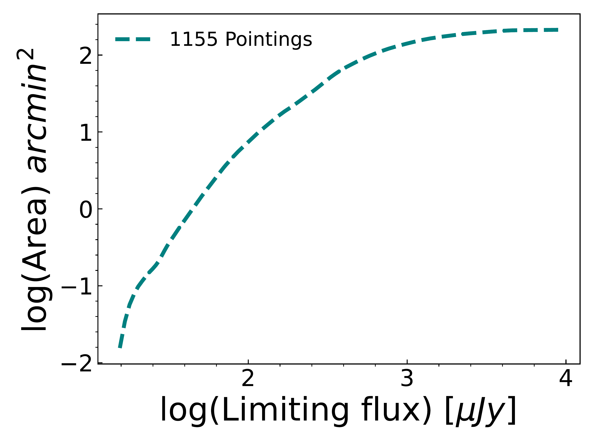
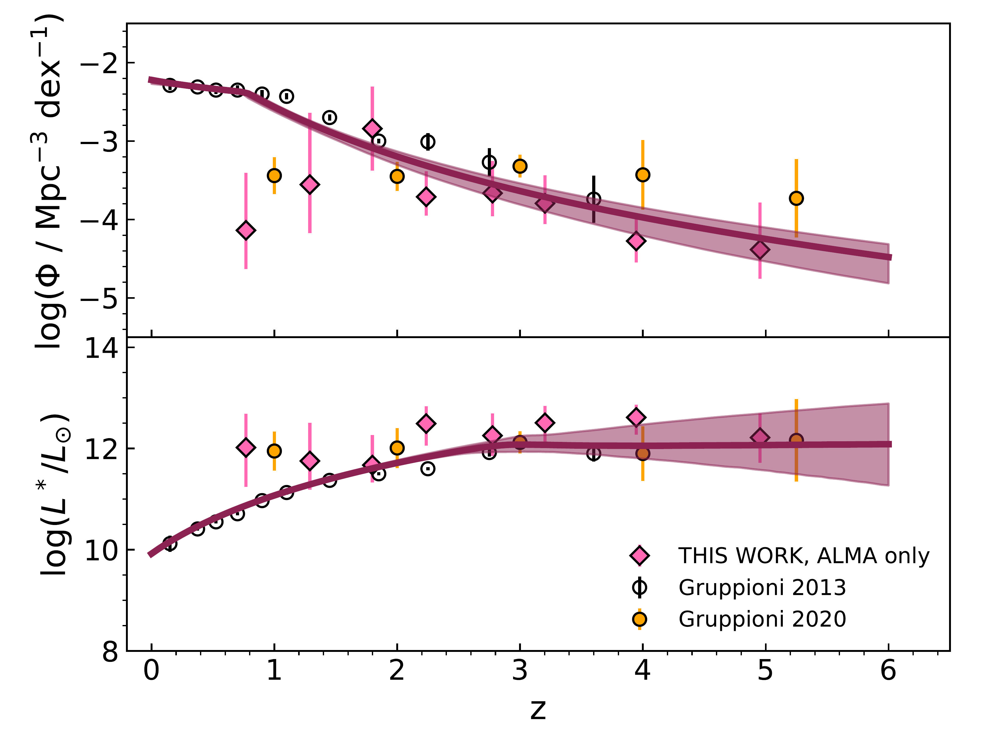
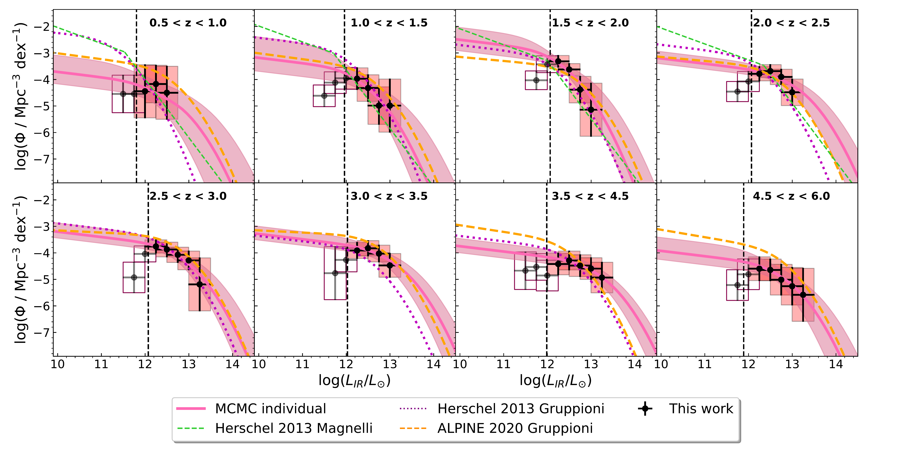

$\newcommand{\ensuremath}{}$
$\newcommand{\xspace}{}$
$\newcommand{\object}[1]{\texttt{#1}}$
$\newcommand{\farcs}{{.}''}$
$\newcommand{\farcm}{{.}'}$
$\newcommand{\arcsec}{''}$
$\newcommand{\arcmin}{'}$
$\newcommand{\ion}[2]{#1#2}$
$\newcommand{\textsc}[1]{\textrm{#1}}$
$\newcommand{\hl}[1]{\textrm{#1}}$
$\newcommand{\footnote}[1]{}$
$\newcommand{\arraystretch}{1.5}$
$\newcommand{\arraystretch}{1.5}$
$\newcommand{\arraystretch}{1.5}$
$\newcommand{\arraystretch}{1.5}$
$\newcommand{\arraystretch}{1.5}$
$\newcommand{\cha}{\textit{Chandra}}$
$\newcommand{\XMM}{{XMM-\textit{Newton}}}$
$\newcommand{\NuSTAR}{\textit{NuSTAR}}$
$\newcommand{\Nu}{\textit{NuSTAR,}}$
$\newcommand{\bat}{{{\it Swift}-BAT}}$
$\newcommand{\}{XSPEC}$
$\newcommand{\}{pexrav}$
$\newcommand{\}{MYTorus}$
$\newcommand{\}{borus}$
$\newcommand{\}{bntorus}$
$\newcommand{\}{ngc}$
$\newcommand{\}{a}$
$\newcommand{\}{ad}$

# A$^3$COSMOS: the infrared luminosity function and dust-obscured star formation rate density at $0.5<z<6$

<mark>Appeared on: 2023-09-28</mark> -  _17 pages, 15 figures, 5 tables, accepted for publication on A&A_

A. Traina, et al. -- incl., <mark>E. Schinnerer</mark>

**Abstract:** Aims: We leverage the largest available Atacama Large Millimetre/submillimetre Array (ALMA) survey from the archive (A$^3$COSMOS) to study to study infrared luminosity function and dust-obscured star formation rate density of sub-millimeter/millimeter (sub-mm/mm) galaxies from $z=0.5\,-\,6$. Methods: The A$^3$COSMOS survey utilizes all publicly available ALMA data in the COSMOS field, therefore having inhomogeneous coverage in terms of observing wavelength and depth. In order to derive the luminosity functions and star formation rate densities, we apply a newly developed method that corrects the statistics of an inhomogeously sampled survey of individual pointings to those representing an unbiased blind survey. Results: We find our sample to mostly consist of massive ($M_{\star} \sim 10^{10} - 10^{12}$ $\rm M_{\odot}$), IR-bright ($L_* \sim 10^{11}-10^{13.5} \rm L_{\odot}$), highly star-forming (SFR $\sim 100-1000$ $\rm M_{\odot}$ $\rm yr^{-1}$) galaxies. We find an evolutionary trend in the typical density ($\Phi^*$) and luminosity ($L^*$) of the galaxy population, which decrease and increase with redshift, respectively. Our IR LF is in agreement with previous literature results and we are able to extend to high redshift ($z > 3$) the constraints on the knee and bright-end of the LF, derived by using the Herschel data. Finally, we obtain the SFRD up to $z\sim 6$ by integrating the IR LF, finding a broad peak from $z \sim 1$ to $z \sim 3$ and a decline towards higher redshifts, in agreement with recent IR/mm-based studies, within the uncertainties, thus implying the presence of larger quantities of dust than what is expected by optical/UV studies. 

**Figure 6. -** Total areal coverage of the 1155 pointings after the cut for the lack of target detection within 1 arcsec.\\ (*fig:areal_coverage*)

**Figure 8. -** Evolutionary trends of $\Phi^*$ (top panel) and $L^*$ (bottom panel) with redshift. The solid dark-red lines and shaded areas show the behaviours of $\Phi^*$ and $L^*$ at all the redshifts, while pink diamonds are the estimates obtained fitting each redshift bin individually in the ALMA only case. Finally, black empty circles and yellow points represent estimates for $L^*$ and $\Phi^*$ from \cite{gruppioni2013lf and \cite{gruppioni2020alpine}, reported for comparison.} (*fig:lstar_phistar*)

**Figure 13. -** A$^3$COSMOS luminosity function (black points and red boxes). The individual redshift bin MCMC best-fit is plotted as pink solid lines and shaded error bands. The redshift ranges are reported in the upper-right corner of each subplot, while the luminosity bins are centered at each 0.25 dex, with a width of 0.5 dex (overlapping bins). The black vertical dashed lines represent the completeness limit of the L$_{IR$. The orange dashed, purple dotted and green dashed lines are the best fit LF obtained by \cite{gruppioni2013lf,magnelli2013ir,gruppioni2020alpine}.} (*fig:LF_models_a3_only*)

