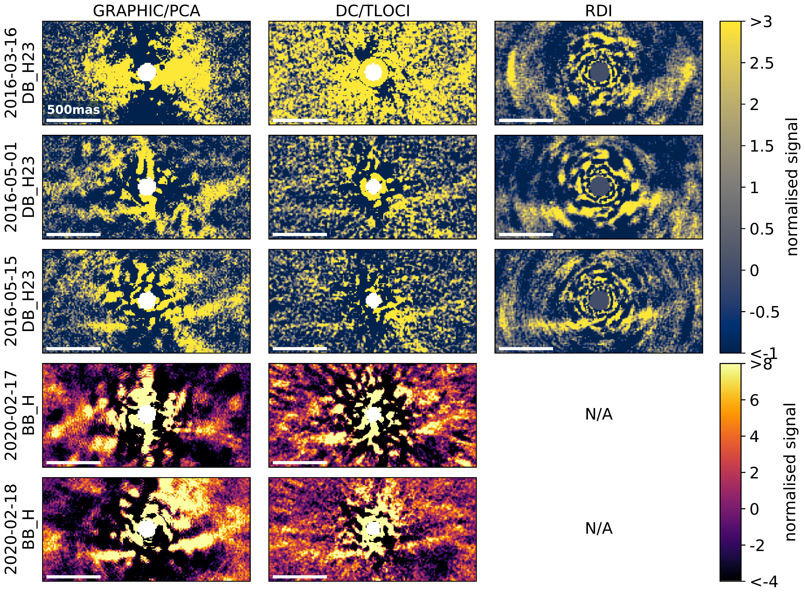
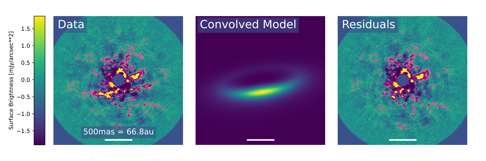
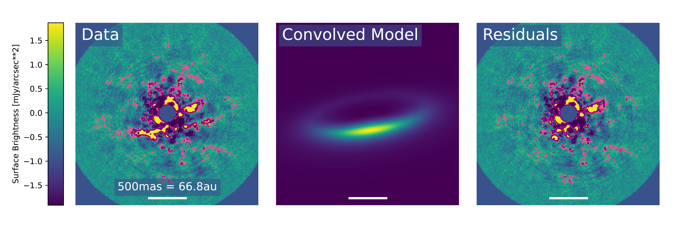
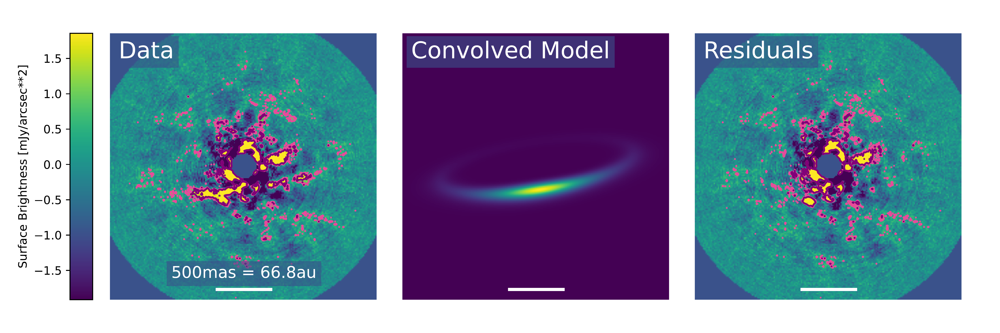
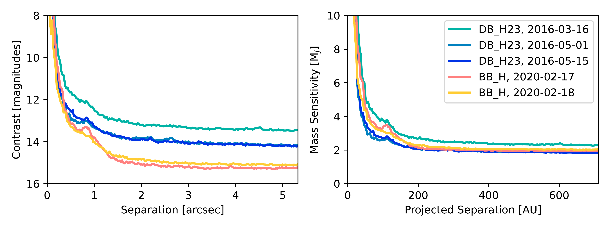

$\newcommand{\ensuremath}{}$
$\newcommand{\xspace}{}$
$\newcommand{\object}[1]{\texttt{#1}}$
$\newcommand{\farcs}{{.}''}$
$\newcommand{\farcm}{{.}'}$
$\newcommand{\arcsec}{''}$
$\newcommand{\arcmin}{'}$
$\newcommand{\ion}[2]{#1#2}$
$\newcommand{\textsc}[1]{\textrm{#1}}$
$\newcommand{\hl}[1]{\textrm{#1}}$
$\newcommand{\footnote}[1]{}$
$\newcommand{\diskpa}{{98.6\pm0.7}\deg}$
$\newcommand{\diskincl}{{75.7}^{+1.1}_{-1.3}\deg}$
$\newcommand{\diskrad}{{118\pm9}\textrm{au}}$
$\newcommand{\deg}{^\circ}$
$\newcommand{\arraystretch}{1.5}$
$\newcommand{\arraystretch}{0.666}$
$\newcommand{\arraystretch}{1.3}$
$\newcommand{\arraystretch}{0.769}$
$\newcommand{\refereeresponse}{\latexdiff}$
$\newcommand{\Lir}{L_{\textrm{IR}}/L_{\ast}}$
$\newcommand{\gaia}{\textit{Gaia}}$
$\newcommand{\hipp}{\textit{Hipparcos}}$
$\newcommand{\apjl}{ApJL}$
$\newcommand{\aj}{AJ}$
$\newcommand{\apj}{ApJ}$
$\newcommand{\apjs}{ApJS}$
$\newcommand{\pasp}{PASP}$
$\newcommand{\pasj}{PASJ}$
$\newcommand{\spie}{SPIE}$
$\newcommand{\apjs}{ApJS}$
$\newcommand{\araa}{ARAA}$
$\newcommand{\aap}{A\&A}$
$\newcommand{\aaps}{A\&AS}$
$\newcommand{\apss}{Ap\&SS}$
$\newcommand{\mnras}{MNRAS}$
$\newcommand{\memsai}{MmSAI}$
$\newcommand{\sovast}{SvA}$
$\newcommand{\rmxaa}{RMxAA}$
$\newcommand{\nat}{Nature}$
$\newcommand{\sci}{Science}$
$\newcommand{\etal}{{et al.}}$

# The first scattered light images of HD 112810, a faint debris disk in the Sco-Cen association

<mark>Appeared on: 2023-09-28</mark> -  _A&A accepted. 13 pages, 6 figures + appendix_

E. C. Matthews, et al. -- incl., <mark>C. Desgrange</mark>, <mark>J. Olofsson</mark>

**Abstract:** Circumstellar debris disks provide insight into the formation and early evolution of planetary systems. Resolved belts in particular help to locate planetesimals in exosystems, and can hint at the presence of disk-sculpting exoplanets. We study the circumstellar environment of $\object{HD 112810}$ (HIP 63439), a mid-F type star in the Sco-Cen association with a significant infrared excess indicating the presence of a circumstellar debris disk. We collected five high-contrast observations of HD 112810 with VLT/SPHERE. We identified a debris disk in scattered light, and found that the debris signature is robust over a number of epochs and a variety of reduction techniques. We modelled the disk, accounting for self-subtraction and assuming that it is optically thin. We find a single-belt debris disk, with a radius of $\diskrad$ and an inclination angle of $\diskincl$ . This is in good agreement with the constraints from SED modelling and from a partially-resolved ALMA image of the system. No planets are detected, though planets below the detection limit ( $\sim$ 2.6M $_\textrm{J}$ at a projected separation of 118au) could be present and could have contributed to sculpting the ring of debris. HD 112810 adds to the growing inventory of debris disks imaged in scattered light. The disk is faint, but the radius and the inclination of the disk are promising for follow-up studies of the dust properties.

**Figure 1. -** SPHERE/IRDIS images of the HD 112810 debris disk. Each column indicates data processed via a different method: GRAPHIC/PCA \citep[Sect. \ref{sec:dr-graphic};][]{hagelberg2016}, TLOCI as provided by the SPHERE Data Center \citep[Sect. \ref{sec:spheredc};][]{delorme2017} or RDI \citep[Sect. \ref{sec:rdi};][]{xie2022}; rows indicate each observation epoch. In each case, the two SPHERE/IRDIS channels are co-added. There are no RDI reductions for the BB\_H data, since there is far more data collected with the DB\_H23 filter in the archive, and the reference library we considered does not collate BB\_H data  ([Xie, Choquet and Vigan 2022]()) . The `normalised signal' is calculated relative to the background noise in the wide-field; note that this is _not_ a true SNR at very small separations, where the noise is higher than the background limit. (*fig:sphere_irdis_images*)

**Figure 3. -** Best fitting models to the data, alongside the raw data and the residual image with the disk subtracted. 3- and 5-$\sigma$ contours (relative to the background noise) are shown in pink and purple respectively. The three rows show the best fitting models for (a) the 5-parameter fit (b) the vertical structure fit, and (c) the radial structure fit (see Sects. \ref{sec:5parfit}--\ref{sec:diskradial}). Best-fit parameters are given in Table \ref{tab:disk_parameters}. Residual images are generated by subtracting model disks from the raw data, and then repeating the PCA reduction. The debris disk is well-subtracted in all cases. (*fig:gratermodel*)

**Figure 4. -** Contrast (left) and mass sensitivities (right) of each epoch of observations. The legend applies to both figures; cool colours indicate the narrowband DB\_H23 observations and warm colours indicate the broadband BB\_H observations. Companion magnitude limits were converted to mass limits using the ATMO models from [Phillips, Tremblin and Baraffe (2020)](). (*fig:contrastcurves*)

