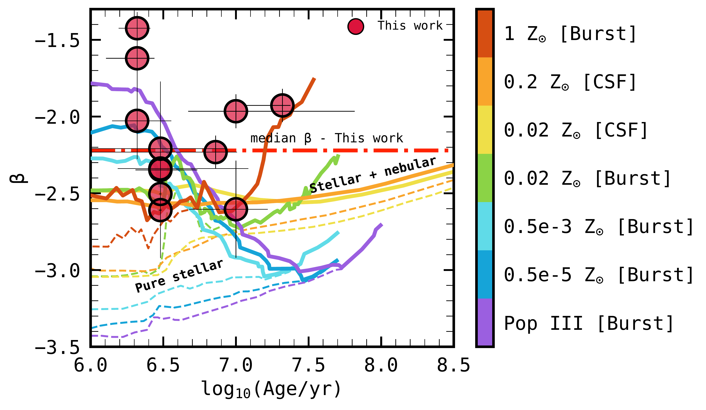
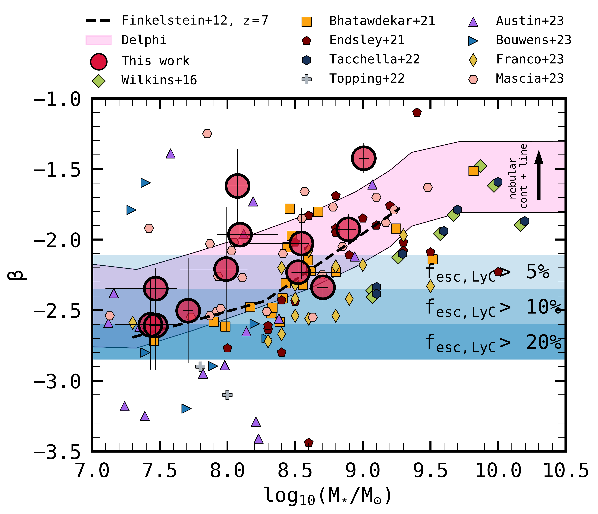
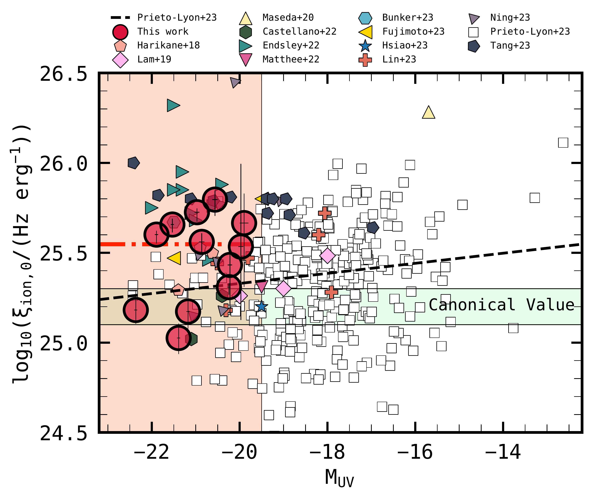

$\newcommand{\ensuremath}{}$
$\newcommand{\xspace}{}$
$\newcommand{\object}[1]{\texttt{#1}}$
$\newcommand{\farcs}{{.}''}$
$\newcommand{\farcm}{{.}'}$
$\newcommand{\arcsec}{''}$
$\newcommand{\arcmin}{'}$
$\newcommand{\ion}[2]{#1#2}$
$\newcommand{\textsc}[1]{\textrm{#1}}$
$\newcommand{\hl}[1]{\textrm{#1}}$
$\newcommand{\footnote}[1]{}$
$\newcommand{\gsim}{{\;\raise0.3ex\hbox{>\kern-0.75em\raise-1.1ex\hbox{\sim}}\;}}$

# $\bf{MIDIS:  Unveiling the Role of Strong H$\alpha$-emitters during the Epoch of Reionization with _JWST_}$

<mark>Appeared on: 2023-09-28</mark> -  _21 pages, 12 Figures, 1 table. Submitted in ApJ. Comments are welcome_

P. Rinaldi, et al. -- incl., <mark>F. Walter</mark>, <mark>L. Boogaard</mark>

**Abstract:** We make use of the deepest _JWST_ /MIRI image at 5.6 $\mu m$ , in the Hubble eXtreme Deep Field, to constrain the role of strong H $\alpha$ emitters (HAEs) in Cosmic Reionization at $z\simeq7-8$ . Our sample of bright (M $_{UV} \lesssim -20$ mag) HAEs is comprised of young ( $<30\;\rm Myr$ ) galaxies with low stellar masses ( $\lesssim 10^{9}\;\rm M_{\odot}$ ). They span a wide range of UV- $\beta$ slopes, with a median $\beta = -2.22\pm0.35$ , which broadly correlates with stellar mass. We estimate the ionizing photon production efficiency ( $\xi_{ion,0}$ ) of these sources (assuming $f_{esc,LyC} = 0$ ), which yields a median value $\rm log_{10}(\xi_{ion,0}/(Hz\;erg^{-1})) = 25.54^{+0.09}_{-0.10}$ . We show that $\xi_{ion,0}$ positively correlates with EW $_{0}$ (H $\alpha$ ) and specific star formation rate (sSFR). Instead $\xi_{ion,0}$ weakly anti-correlates with stellar mass and $\beta$ . Based on the $\beta$ values, we estimate $f_{esc, LyC}=0.07^{+0.03}_{-0.02}$ , which results in $\rm log_{10}(\xi_{ion}/(Hz\;erg^{-1})) = 25.59^{+0.06}_{-0.04}$ . By considering this result along with others from the literature, we find a mild evolution of $\xi_{ion}$ with redshift. Finally, we assess the impact of strong HAEs during Cosmic Reionization at $z\simeq7-8$ . We find that our HAEs do not need high values of $f_{esc, rel}$ (only $6-10\%$ ) to be able to reionize their surrounding intergalactic medium. They have $\dot N_{ion} = 10^{50.43\pm0.3}\;\rm s^{-1}Mpc^{-3}$ and contribute more than a factor of two in terms of emitted ionizing photons per comoving volume compared to non-H $\alpha$ emitters in the same redshift bin, suggesting that strong, young, and low stellar-mass emitters could have played a central role during the Epoch of Reionization.

**Figure 9. -** Beta slope as a function of galaxy age. The ages of galaxies have been obtained as output from LePHARE. The red dashed line refers to the median $\beta$ value that we find in our sample, which is in line with what we expect from galaxies at high redshifts. For comparison, we also include theoretical predictions by considering synthetic-model tracks from \citet{Schaerer_2002, Schaerer_2003}, which are color-coded based on metallicity. Solid lines refer to models with a combination of stellar and nebular contributions, while dashed lines refer to pure stellar models. Two different SFHs have been adopted: burst and constant star formation. (*beta_vs_age_models*)

**Figure 2. -** UV-$\beta$ slope as a function of stellar mass. A collection of results at high redshift from the recent literature is presented as well \citep{Wilkins_2016, Bhatawdekar_2021, Endsley_2021, Tacchella_2022, Topping_2022, Austin_2023, Bouwens_2023, Franco_2023, Mascia_2023}. From this plot, we can see that our sample of HAEs is dominated by low-mass galaxies ($\rm M_{\star} \leq 10^{9}\; M_{\odot}$). We also show colored regions (blue gradients) that correspond to the averages of the escape fraction of the Lyman continuum photons (5, 10, 20 per cent) by adopting Equation 11 from \citet{Chisholm_2022}. We include the $z \simeq 7$ relation from \cite{Finkelstein_2012b} as the dashed line. The purple shaded area refers to Delphi simulations at $z\simeq7$,  where we show how the nebular contribution (both continuum and emission lines) can impact the UV-$\beta$ slope as a function of $\rm M_{\star}$. Particularly, the lower limit of the shaded area refers to the pure stellar continuum + dust. The upper limit, instead, refers to the maximum contribution of stellar + nebular continuum + nebular lines + dust. (*Beta_vs_Mass*)

**Figure 3. -** $\xi_{ion,0}$ as a function of M$_{UV}$.
    We also collect data points from the recent literature at high redshifts \citep{Harikane_2018, Lam_2019, Maseda_2020, Castellano_2022, Endsley_2022, Matthee_2022, Bunker_2023, Fujimoto_2023, Hsiao_2023, Lin_2023, Ning_2023, Prieto_Lyon_2023, Tang_2023}. Our sample at $z\simeq 7-8$ is comprised of relatively bright galaxies with M$_{UV} \lesssim -20$ mag (shaded area), given their redshifts and the depth of our analysed data. The red dot-dashed line indicates the median $\xi_{ion,0}$ value that we find in our sample. The black dashed line refers to the relation between $\xi_{ion,0}$ and M$_{UV}$, as reported in \citet{Prieto_Lyon_2023}. The green shaded area refers to the canonical value of $\xi_{ion}$ that is usually assumed \citep{Robertson_2013}. No evident correlation arises by comparing these two quantities. (*Xion_f_esc_MUV*)

