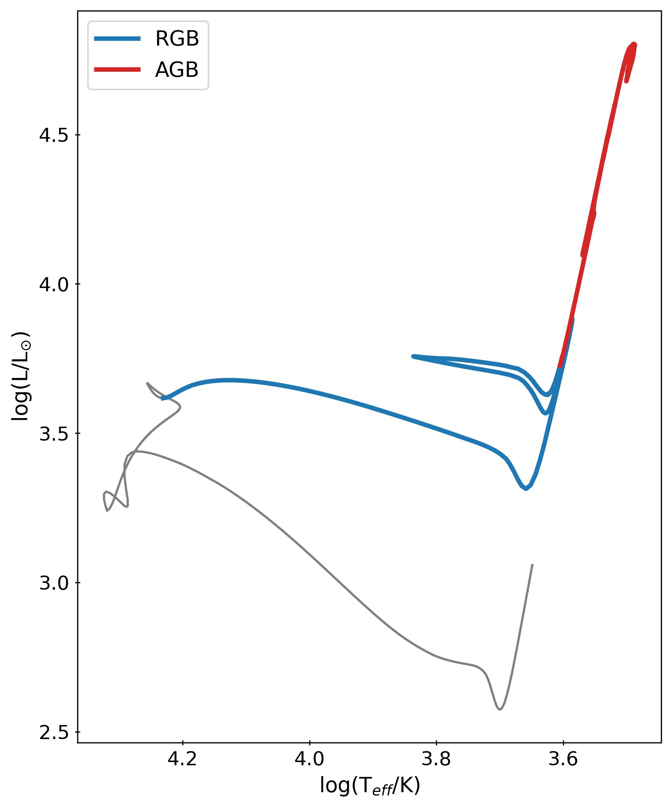
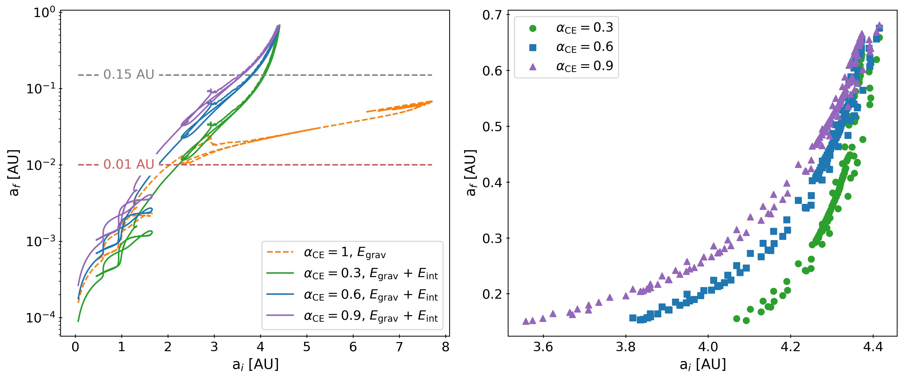
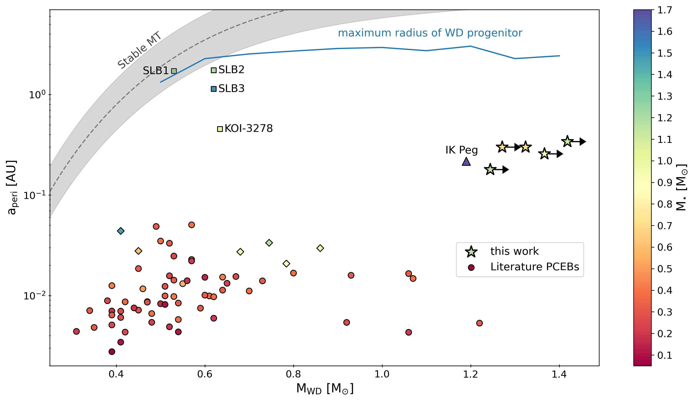
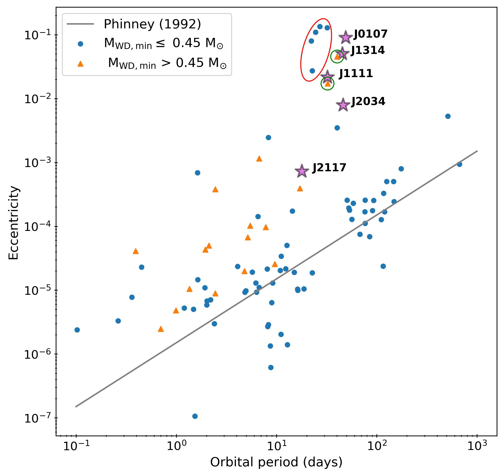

$\newcommand{\ensuremath}{}$
$\newcommand{\xspace}{}$
$\newcommand{\object}[1]{\texttt{#1}}$
$\newcommand{\farcs}{{.}''}$
$\newcommand{\farcm}{{.}'}$
$\newcommand{\arcsec}{''}$
$\newcommand{\arcmin}{'}$
$\newcommand{\ion}[2]{#1#2}$
$\newcommand{\textsc}[1]{\textrm{#1}}$
$\newcommand{\hl}[1]{\textrm{#1}}$
$\newcommand{\footnote}[1]{}$
$\newcommand{\arraystretch}{1.1}$
$\newcommand{\thebibliography}{\DeclareRobustCommand{\VAN}[3]{##3}\VANthebibliography}$
$\newcommand{\}{mn}$
$\newcommand{\}{mn}$
$\newcommand{\}{mn}$
$\newcommand{\}{mn}$
$\newcommand{\}{mn}$
$\newcommand{\}{mn}$
$\newcommand{\}{mn}$
$\newcommand{\@}{tempa}$
$\newcommand{\@}{tempa }$
$\newcommand{\@}{tempb }$
$\newcommand{\@}{tempc$
$  }$
$\newcommand{\@}{tempb }$

# Wide post-common envelope binaries containing ultramassive white dwarfs: evidence for efficient envelope ejection in massive AGB stars

<mark>Appeared on: 2023-09-29</mark> -  _19 pages, 9 figures, submitted to MNRAS_

N. Yamaguchi, et al. -- incl., <mark>K. El-Badry</mark>, <mark>M. Hobson</mark>

**Abstract:** Post-common-envelope binaries (PCEBs) containing a white dwarf (WD) and a main-sequence (MS) star can constrain the physics of common envelope evolution and calibrate binary evolution models. Most PCEBs studied to date have short orbital periods ( $P_{\rm orb} \lesssim 1$ d), implying relatively inefficient harnessing of binaries' orbital energy for envelope expulsion. Here, we present follow-up observations of five binaries from $_ Gaia_$ DR3 containing solar-type MS stars and probable ultramassive WDs ( $M\gtrsim 1.2 M_{\odot}$ ) with significantly wider orbits than previously known PCEBs, $P_{\rm orb} = 18-49$ d. The WD masses are much higher than expected for systems formed via stable mass transfer at these periods, and their near-circular orbits suggest partial tidal circularization when the WD progenitors were giants. These properties strongly suggest that the binaries are PCEBs. Forming PCEBs at such wide separations requires highly efficient envelope ejection, and we find that the observed periods can only be explained if a significant fraction of the energy released when the envelope recombines goes into ejecting it. Using 1D stellar evolution calculations, we show that the binding energy of massive AGB star envelopes is formally $_ positive_$ if recombination energy is included in the energy budget. This suggests that the star's envelope can be efficiently ejected if binary interaction causes it to recombine, and that a wide range of PCEB orbital periods can potentially result from Roche lobe overflow of an AGB star. This evolutionary scenario may also explain the formation of several wide WD+MS binaries discovered via self-lensing.

**Figure 7. -** _Left_: HR diagram showing the evolution of a $7 M_{\odot}$ star starting from pre-MS to the AGB. The blue sections indicate what we refer to as the RGB (but which also includes the SGB) and the red sections represents the AGB. _Center_: Plots of the final separation $a_f$(i.e. birth period at the end of CEE) over a range of initial separations $a_i$. $a_i$ is taken to be the orbital semi-major axis when the giant (WD progenitor) fills its Roche lobe. We mark $a_f =$ 0.01 AU $\sim 2 R_{\odot}$(red dashed line) below which the MS star would not fit in the orbit and a PCEB cannot form. The orange dashed line is the case where only the gravitational binding energy is considered and $\alpha_{\rm CE} = 1$. We see that in this case, no values of $a_i$ result in $a_f > 0.15$ AU (gray dashed line) which is approximately the minimum separation of our objects. The other three lines are the cases where internal energy is added to the binding energy for $\alpha_{\rm CE} = 0.3$, 0.6, and 0.9. We see that these lines lie above the dashed line for some range of $a_i$. _Right_: Zoom in on the region where $a_f > 0.15$ AU. We see that overall, $a_i \sim 3.5 - 4.4$ AU can result in the wide orbital separations of our systems. (*fig:mesa_af*)

**Figure 6. -** Periastron separation, $a_{\rm peri}$, vs. WD mass, $M_{\rm WD}$, for a sample of PCEBs from \citet[][circle markers]{Zorotovic2011A&A} and the five objects from this work (stars; the arrows indicate lower limits). IK Peg is distinguished from the other known PCEBs with a triangle marker as it lies very close to our objects. We also plot the PCEBs from the "white dwarf binary pathways survey" \citep[diamond markers;][]{Hernandez2021MNRAS, Hernandez2022MNRAS_vi, Hernandez2022MNRAS}. Finally, we plot self-lensing binaries (SLBs) discovered by \citet{Kawahara2018AJ} as well as  KOI-3278 \citep[][also a SLB]{Kruse2014Sci}, which were all detected by _ Kepler_. The colours of the points represents the masses of the luminous MS companions. The dashed gray shows the prediction for stable MT from \citet{Rappaport1995MNRAS} and the blue line indicates the maximum radius reached by the WD progenitor for a range of WD masses.  (*fig:avMwd*)

**Figure 1. -** Eccentricity vs. orbital period. We plot the sample of MSP + WD binaries mainly from the ATNF catalogue (\citealt{Manchester2005AJ}, with a few others, compiled by \citealt{Hui2018ApJ}), differentiating between those with minimum WD mass above and below $0.45 M_{\odot}$(orange triangles and blue circles, respectively). We show our objects with magenta stars. The gray line is the theoretical relation for MSP + He WD binaries formed through stable MT derived by \citet{Phinney1992RSPTA}. The points circled in red are eMSPs \citep[e.g., see ][for a description of the five plotted here]{Stovall2019ApJ}. We also circle in green two binaries with massive CO WDs with large eccentricities \citep{Lorimer2015MNRAS, Berezina2017MNRAS}. (*fig:PvEcc*)

