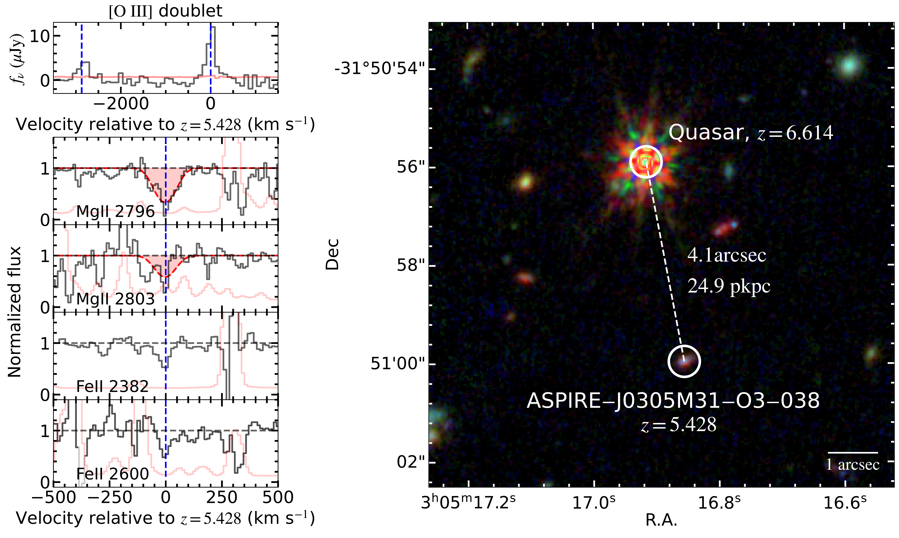
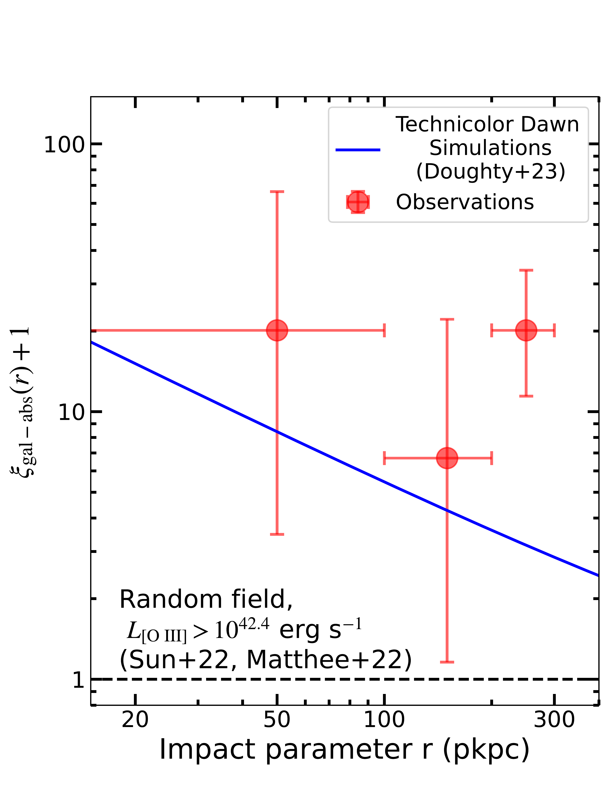
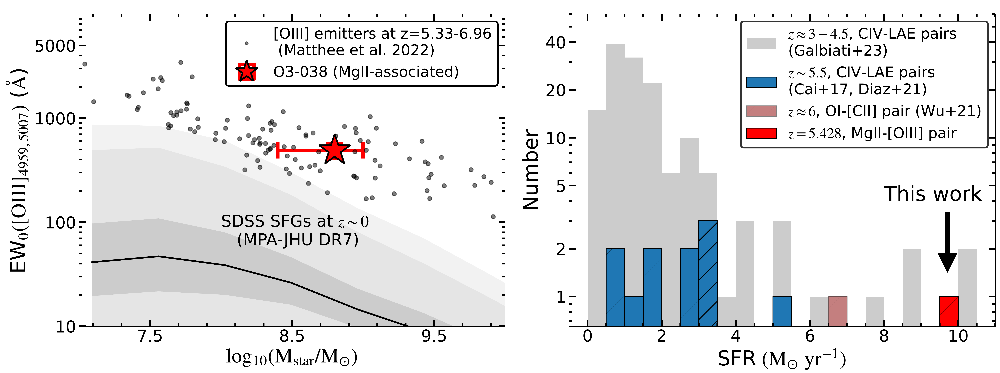

$\newcommand{\ensuremath}{}$
$\newcommand{\xspace}{}$
$\newcommand{\object}[1]{\texttt{#1}}$
$\newcommand{\farcs}{{.}''}$
$\newcommand{\farcm}{{.}'}$
$\newcommand{\arcsec}{''}$
$\newcommand{\arcmin}{'}$
$\newcommand{\ion}[2]{#1#2}$
$\newcommand{\textsc}[1]{\textrm{#1}}$
$\newcommand{\hl}[1]{\textrm{#1}}$
$\newcommand{\footnote}[1]{}$
$\newcommand{\vdag}{(v)^\dagger}$
$\newcommand$
$\newcommand$
$\newcommand{\red}{\color{red}}$
$\newcommand{\blue}{\color{blue}}$
$\newcommand{\CII}{[C \textsc{ii}]}$
$\newcommand{\Msun}{M_\odot\xspace}$
$\newcommand{\Mstar}{M_\ast\xspace}$
$\newcommand{\oi}{\mbox{\ion{O}{1}}}$
$\newcommand{\oiii}{\mbox{[\ion{O}{3}]}}$
$\newcommand{\mgii}{\ion{Mg}{2}}$
$\newcommand{\feii}{\ion{Fe}{2}}$
$\newcommand{\civ}{\ion{C}{4}}$
$\newcommand{\siiv}{\ion{Si}{4}}$
$\newcommand{\targetname}{ASPIRE-J0305M31-O3-038}$

# A SPectroscopic survey of biased halos In the Reionization Era (ASPIRE): JWST Discovers an Overdensity around a Metal Absorption-selected Galaxy at $z\sim5.5$

<mark>Appeared on: 2023-10-02</mark> -  _Accepted for publication in ApJL. Main text 8 pages, 4 figures. For more information of the JWST ASPIRE program please check this https URL_

Y. Wu, et al. -- incl., <mark>Z.-L. Xie</mark>

**Abstract:** The launch of $_ JWST_$ opens a new window for studying the connection between metal-line absorbers and galaxies at the end of the Epoch of Reionization (EoR). Previous studies have detected absorber-galaxy pairs in limited quantities through ground-based observations. To enhance our understanding of the relationship between absorbers and their host galaxies at $z>5$ , we utilized the NIRCam Wide Field Slitless Spectroscopy (WFSS) to search for absorber-associated galaxies by detecting their rest-frame optical emission lines (e.g., $\oiii$ + H $\beta$ ). We report the discovery of a $\mgii$ -associated galaxy at $z=5.428$ using data from the $_ JWST_$ ASPIRE program. The $\mgii$ absorber is detected on the spectrum of quasar J0305--3150 with a rest-frame equivalent width of 0.74 $Å$ . The associated galaxy has an $\oiii$ luminosity of $10^{42.5} {\rm erg s^{-1}}$ with an impact parameter of 24.9 proper kiloparsecs (pkpc). The joint $_ HST_$ - $_ JWST_$ spectral energy distribution (SED) implies a stellar mass and star-formation rate of ${\rm M_* \approx 10^{8.8}}$ ${\rm M_{\odot}}$ , ${\rm SFR}\approx 10 {\rm M_{\odot} yr^{-1}}$ . Its $\oiii$ equivalent width and stellar mass are typical of $\oiii$ emitters at this redshift. Furthermore, connecting the outflow starting time to the SED-derived stellar age, the outflow velocity of this galaxy is $\sim300 {\rm km s^{-1}}$ , consistent with theoretical expectations. We identified six additional $\oiii$ emitters with impact parameters of up to $\sim300$ pkpc at similar redshifts ( $|dv|<1000 {\rm km s^{-1}}$ ). The observed number is consistent with that in cosmological simulations. This pilot study suggests that systematically investigating the absorber-galaxy connection within the ASPIRE program will provide insights into the metal-enrichment history in the early universe.

**Figure 2. -** ** Top Left**: The JWST/NIRCam WFSS spectrum of $\targetname$. The error spectrum is shown in pink lines. ** Bottom Left**: Normalized X-SHOOTER spectrum of the quasar J0305 with $\mgii$$\lambda\lambda 2796, 2803$ and $\feii$${\rm \lambda} 2382, 2600$ absorptions at $z=5.4284$. Red-shaded regions denote the best-fit Voigt profile. Dashed blue lines indicate the redshift. ** Right:**_ JWST_/NIRCam composite RGB map of the quasar field with the pixel scale of 0.03$\arcsec$(blue: F115W, green: F200W, red: F356W). White circles denote the location of $\targetname$ and the quasar J0305. We note that the $\mgii$ absorber is in front of the quasar with the redshift of $z=5.428$. The impact parameter between the $\mgii$ absorber and $\targetname$ is $4.1$\arcsec, corresponding to 24.9 pkpc at $z=5.428$. (*spec_img*)

**Figure 1. -** Number excess of galaxies around $\mgii$ absorbers at $z\simeq5$, $\xi_{\rm gal-abs}(r) = \frac{1}{n_0}\frac{N}{\Delta V} - 1$.
    The red dots are the measurements obtained from our observations.
    Error bars are estimated by assuming Poissonian uncertainties in the 84\% confidence level  ([ and Gehrels 1986]()) .
    The blue-solid line indicates simulation-predicted values obtained from [Doughty and Finlator (2023)](). The observed values are consistent with that predicted from cosmological simulations.  (*Comp_with_simu*)

**Figure 3. -** ** Left:**$\oi$ii EWs and derived stellar masses at $z\sim6$, compared to these of local galaxies (shaded region) (MPA-JHU catalog  ([Kauffmann, Heckman and White 2003](), [Brinchmann, Charlot and White 2004]()) ). The measurement of the absorber-associated $\oi$ii emitter is shown as the red star. Grey dots indicate results obtained from the EIGER sample  ([Matthee, Mackenzie and Simcoe 2022]()) . ** Right:** SFR distribution of metal-absorber selected galaxies. Galaxies at $z>5$ are marked as dashed bars. At $z<5$, the $\civ$-associated LAEs selected from the MAGG survey  ([Galbiati, Fumagalli and Fossati 2023]())  are shown in grey. The blue bars show the $\civ$-associated LAEs at $z>5$ ([Cai, et. al 2017](), [Díaz, Ryan-Weber and Karman 2021]()) . At $z\approx6$, One ALMA-detected $\oi$-associated emitter is shown in pink  ([Wu, Cai and Neeleman 2021]()) . The $\oi$ii emitter detected with _ JWST_ is shown in red.  (*sample_comp*)

