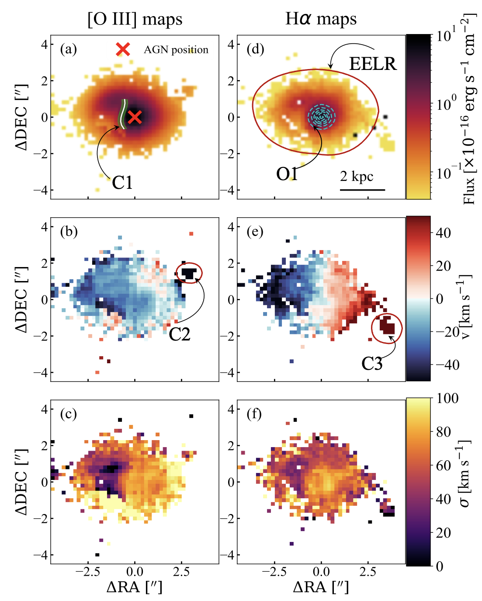
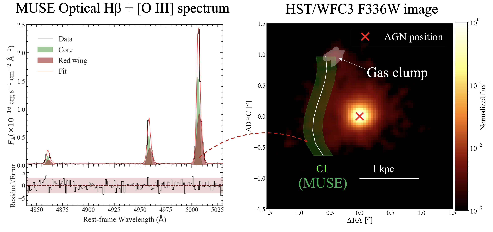
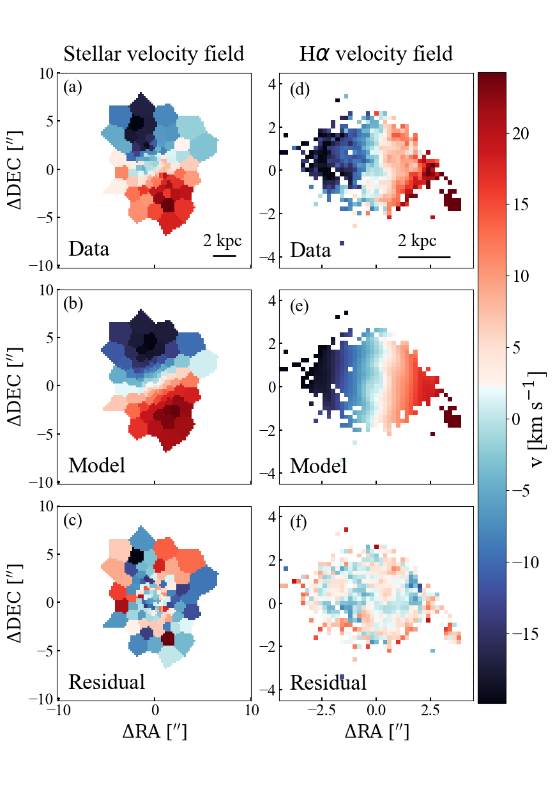

$\newcommand{\ensuremath}{}$
$\newcommand{\xspace}{}$
$\newcommand{\object}[1]{\texttt{#1}}$
$\newcommand{\farcs}{{.}''}$
$\newcommand{\farcm}{{.}'}$
$\newcommand{\arcsec}{''}$
$\newcommand{\arcmin}{'}$
$\newcommand{\ion}[2]{#1#2}$
$\newcommand{\textsc}[1]{\textrm{#1}}$
$\newcommand{\hl}[1]{\textrm{#1}}$
$\newcommand{\footnote}[1]{}$

# The Close AGN Reference Survey (CARS)$\An interplay between radio jets and AGN radiation in the radio-quiet AGN HE 0040$$-$1105

<mark>Appeared on: 2023-10-02</mark> -  _Accepted in ApJ for publication_

M.~Singha, et al.

**Abstract:** \textcolor{black}{We present a case study of HE 0040$-$1105, an unobscured radio-quiet AGN at a high accretion rate $\lambda_{Edd} = 0.19\pm0.04$. This particular AGN hosts an ionized gas outflow with the largest spatial offset from its nucleus compared to all other AGNs in the Close AGN Reference Survey (CARS). By combining multi-wavelength observations from VLT/MUSE, HST/WFC3, VLA, and EVN we probe the ionization conditions, gas kinematics, and radio emission from host galaxy scales to the central few pc. We detect four kinematically distinct components, one of which is a spatially unresolved AGN-driven outflow located within the central $500 \text{pc}$, where it locally dominates the ISM conditions. Its velocity is too low to escape the host galaxy's gravitational potential, and maybe re-accreted onto the central black hole via chaotic cold accretion. We detect compact radio emission in HE 0040$-$1105 within the region covered by the outflow, varying on $\sim 20$ yr timescale.We show that neither AGN coronal emission nor star formation processes wholly explain the radio morphology/spectrum. The spatial alignment between the outflowing ionized gas and the radio continuum emission on $100 \text{pc}$ scales is consistent with a weak jet morphology rather than diffuse radio emission produced by AGN winds.$> 90\%$ of the outflowing ionized gas emission originates from the central $100 \text{pc}$, within which the ionizing luminosity of the outflow is comparable to the mechanical power of the radio jet. Although radio jets might primarily drive the outflow in HE 0040$-$1105, radiation pressure from the AGN may contribute in this process.}

**Figure 2. -** Mapping HE 0040$-$1105's ionized gas flux and kinematics across the host galaxy. The left panels show the maps extracted from the single-component [$\ion${O}{3}] model, and the right panels are those for H$\alpha$. From top to bottom the panels show the emission line flux, rest-frame velocity $v$, and velocity dispersion $\sigma$, respectively. The EELR that is local to the galaxy (see Section \ref{subsection:energetics_comparison}) is highlighted by the red contour in panel (d). The contours of ionized gas outflow in the center (see Section \ref{subsec:ionized_gas_outflow}) are shown as dashed cyan lines. In addition, we highlight the contours of the kinematic features analyzed in Section \ref{subsec:resolved_host_galaxy_emission} where the red line in panel (b) describes the morphology of the receding shell C1, and the red line in panel (e) indicates the H$\alpha$ emitting receding region C3. Both [$\ion${O}{3}] emission line nebulae have similar morphologies. However, while the H$\alpha$ velocity field has a clear rotational pattern and a nucleated peak of the velocity dispersion, the [$\ion${O}{3}] shows a more chaotic motion with a velocity dispersion in C1 that is lower than average. (*fig:gas_maps*)

**Figure 8. -** Multi-wavelength view of the region C1. _Left panel_: MUSE optical spectra extracted from a $3 \times 3$ spaxel region (in gray), along with its multi-Gaussian component fit (in red). The green-shaded Gaussian components represent the narrow core which is a part of the EELR, whereas the dark brown-shaded components trace the red-wing component, corresponding to the region C1. _Right panel_: _HST_/WFC3 near-UV image centered at $3350 \text{Å}$. The green region describes the area covered by the deconvolved C1, and the white line denotes its centroids. A clumpy structure on the northeastern side of the nucleus is shaded with white to showcase its spatial location and morphology. C1 overlaps with the gas clumps on the north where $S/N > 5$. Such spatial coincidence indicates that C1 is a part of the clumpy region. (*fig:C1*)

**Figure 1. -** Kinematic modelling of HE 0040$-$1105's stellar (left columns) and H$\alpha$ ionized gas (right columns) velocity field. From top to bottom the panels show the velocities measured from the MUSE observations (see Section \ref{subsec:stellar_velocity_field} and Section \ref{subsubsec:EELR}), the tilted-ring model fitted to it, and the map with the residual velocities normalized by the uncertainty. In both cases, the thin rotating disc provides a good description of the velocity field, although the rotation axis between both host galaxy components is tilted by $53\arcdeg$. (*fig:stellar_vel_model*)

