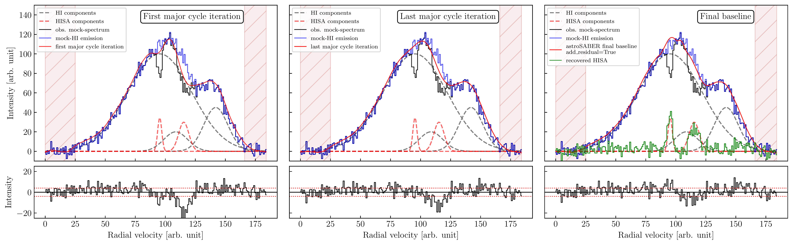
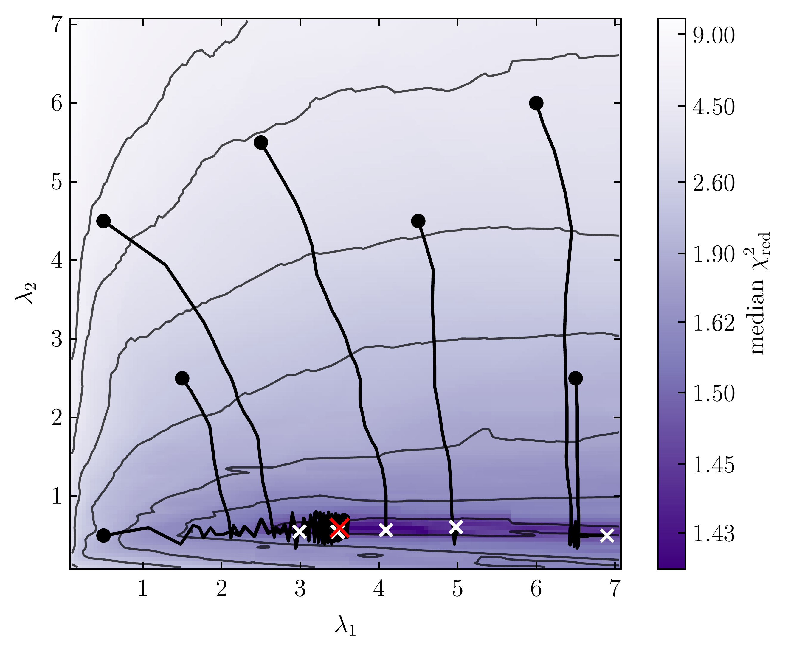
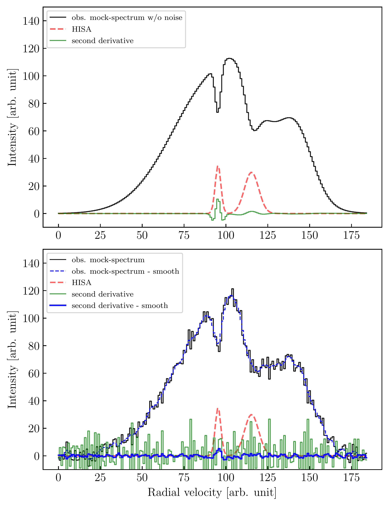

$\newcommand{\ensuremath}{}$
$\newcommand{\xspace}{}$
$\newcommand{\object}[1]{\texttt{#1}}$
$\newcommand{\farcs}{{.}''}$
$\newcommand{\farcm}{{.}'}$
$\newcommand{\arcsec}{''}$
$\newcommand{\arcmin}{'}$
$\newcommand{\ion}[2]{#1#2}$
$\newcommand{\textsc}[1]{\textrm{#1}}$
$\newcommand{\hl}[1]{\textrm{#1}}$
$\newcommand{\footnote}[1]{}$
$\newcommand{\RomanNumeralCaps}[1]{\MakeUppercase{\romannumeral #1}}$
$\newcommand{\code}[1]{\texttt{#1}}$
$\newcommand{\saber}{{\small astro}\textsc{Saber}}$

# Cold atomic gas identified by $\ion{H}{i}$ self-absorption

<mark>Appeared on: 2023-10-04</mark> -  _41 pages, 28 figures, accepted for publication in A&A_

<mark>J. Syed</mark>, et al. -- incl., <mark>H. Beuther</mark>

**Abstract:** Stars form in the dense interiors of molecular clouds. The dynamics and physical properties of the atomic interstellar medium (ISM) set the conditions under which molecular clouds and eventually stars will form. It is, therefore, critical to investigate the relationship between the atomic and molecular gas phase to understand the global star formation process. Using the high angular resolution data from The $\ion{H}{i}$ /OH/Recombination line survey of the Milky Way (THOR), we aim to constrain the kinematic and physical properties of the cold atomic hydrogen gas phase toward the inner Galactic plane. $\ion{H}{i}$ self-absorption (HISA) has proven to be a viable method to detect cold atomic hydrogen clouds in the Galactic plane. With the help of a newly developed self-absorption extraction routine ( $\saber$ ), we build upon previous case studies to identify $\ion{H}{i}$ self-absorption toward a sample of Giant Molecular Filaments (GMFs). We find the cold atomic gas to be spatially correlated with the molecular gas on a global scale. The column densities of the cold atomic gas traced by HISA are usually of the order of $10^{20}\rm cm^{-2}$ whereas those of molecular hydrogen traced by $\element[][13]{CO}$ are at least an order of magnitude higher. The HISA column densities are attributed to a cold gas component that accounts for a fraction of $\sim$ 5 \% of the total atomic gas budget within the clouds. The HISA column density distributions show pronounced log-normal shapes that are broader than those traced by $\ion{H}{i}$ emission. The cold atomic gas is found to be moderately supersonic with Mach numbers of a $\sim$ few. In contrast, highly supersonic dynamics drive the molecular gas within most filaments. While $\ion{H}{i}$ self-absorption is likely to trace just a small fraction of the total cold neutral medium within a cloud, probing the cold atomic ISM by the means of self-absorption significantly improves our understanding of the dynamical and physical interaction between the atomic and molecular gas phase during cloud formation.

**Figure 3. -** Baseline extraction workflow of $\saber$ . In each panel, the black mock spectrum represents the observed $\ion${H}{i} emission spectrum, which is the sum of the three gray dashed components,  with self-absorption features (two red dashed components) superposed. The blue spectrum shows the "pure emission" spectrum that is to be recovered by the $\saber$  algorithm. The algorithm is then applied to the observed spectrum using the optimal smoothing parameters $(\lambda_1,\lambda_2)$. Hatched red areas indicate spectral channels that are masked out due to missing signal. _Left panel:_ The $\saber$  baseline (red) after the first major cycle iteration, that is, after the minor cycle smoothing converged given the input mock spectrum (i.e. after Eq. \eqref{equ:least_squ} has been solved for $\mathbf{z}$). _Middle panel:_ The $\saber$  baseline (red) after the last major cycle iteration, that is, after the major cycle smoothing converged and before adding the residual, which is the absolute difference between the first and last major cycle iteration. _Right panel:_ The final $\saber$  baseline (red) after adding the residual. The baseline so obtained reproduces the pure emission spectrum (blue) well. The resulting HISA features expressed as equivalent emission features are shown in green, and show a good match with the the real HISA absorption features. The smaller subpanels in each column show the residual, which is the difference between the red baseline and the blue emission spectrum, with the horizontal dotted red lines marking values of $\pm\sigma_\mathrm{rms}$. (*fig:mock_spectrum*)

**Figure 1. -** Smoothing parameter optimization using gradient descent. The map shows a sampled representation of the underlying $\vec\lambda$ parameter space in terms of the median value of the reduced chi square results. Initial values, tracks, and convergence locations of the $(\lambda_1,\lambda_2)$ parameters during the optimization are represented by black circles, black lines, and white crosses, respectively. The red cross marks the global minimum in the sampled parameter space. Initial locations that start off too far from the global best solution $(\lambda_1=3.5,\lambda_2=0.6)$ might converge to local minima with less accurate fit results. (*fig:parameter_space*)

**Figure 2. -** Second derivative representation as a means to identify self-absorption. _Top panel:_ The black mock spectrum represents the $\ion${H}{i} emission spectrum, with two self-absorption features superposed (red dashed components) and without any observational noise. The green spectrum shows the second derivative of the black mock spectrum, obtained from the finite differences between spectral channels. _Bottom panel:_ The black mock spectrum represents the $\ion${H}{i} emission spectrum, with two self-absorption features superposed (red dashed components) and with added noise that is comparable to the noise of the THOR-$\ion${H}{i} observations (same spectrum as in Fig. \ref{fig:mock_spectrum}). The green spectrum shows the second derivative of the black mock spectrum, obtained from the finite differences between spectral channels. The dashed blue spectrum represents a regularized least squares solution to the $\ion${H}{i} spectrum, which minimizes the second derivative. The corresponding second derivative is shown in blue, which is now less affected by noise fluctuations. (*fig:second_derivative*)

