

$\newcommand{\ensuremath}{}$
$\newcommand{\xspace}{}$
$\newcommand{\object}[1]{\texttt{#1}}$
$\newcommand{\farcs}{{.}''}$
$\newcommand{\farcm}{{.}'}$
$\newcommand{\arcsec}{''}$
$\newcommand{\arcmin}{'}$
$\newcommand{\ion}[2]{#1#2}$
$\newcommand{\textsc}[1]{\textrm{#1}}$
$\newcommand{\hl}[1]{\textrm{#1}}$
$\newcommand{\footnote}[1]{}$

# Protoplanetary and debris disks in the $\eta$ Chamaeleontis Association:

<mark>Appeared on: 2023-10-05</mark> -  _20 pages, 9 figures, 7 tables_

V. Roccatagliata, et al. -- incl., <mark>J. Bouwman</mark>

**Abstract:** Nearby associations are ideal regions to study coeval samples of protoplanetary and debris disks down to late M-type stars. Those aged 5-10,Myrs, where most of the disk should have already dissipated forming planets, are of particular interest. We present the first complete study of both protoplanetary and debris disks in a young region, using the $\eta$ Chamaeleontis ( $\eta$ Cha) association as a test bench to study the cold disk content. We obtained sub-millimeter data for the entire core population down to late M-type stars, plus a few halo members. We performed a continuum sub-millimeter survey with APEX/LABOCA of all the core populations of $\eta$ Cha association. These data are combined with archival, multi-wavelength photometry to compile a complete spectral energy distribution. Disk properties have been derived by modeling protoplanetary and debris disks using RADMC 2D and DMS, respectively. We compute a lower limit of the disk millimeter fraction, which is then compared to the corresponding disk fraction in the infrared for $\eta$ Cha. We also revisit and refine the age estimate for the region, using the Gaia eDR3 astrometry and photometry for the core sources. We find that protoplanetary disks in $\eta$ Cha typically have holes with radii of the order of 0.01 to 0.03 AU, while ring-like emission from the debris disks is located between 20 au and 650 au from the central star. The parallaxes and Gaia eDR3 photometry, in combination with the PARSEC and COLIBRI  isochrones, enable us to confirm an age of $\eta$ Cha between 7 and 9 Myrs. In general, the disk mass seems insufficient to support accretion over a long time, even for the lowest mass accretors, a clear difference compared with other regions and also a sign that the mass budget is further underestimated. We do not find a correlation between the stellar masses, accretion rates, and disk masses, although this could be due to sample issues (the objects are few and mostly low-mass). We confirm that the presence of inner holes is not enough to stop accretion unless accompanied by dramatic changes to the total disk mass content. Comparing $\eta$ Cha with other regions at different ages, we find that the physical processes responsible for debris disks (e.g., dust growth, dust trapping) efficiently act in less than 5 Myrs.

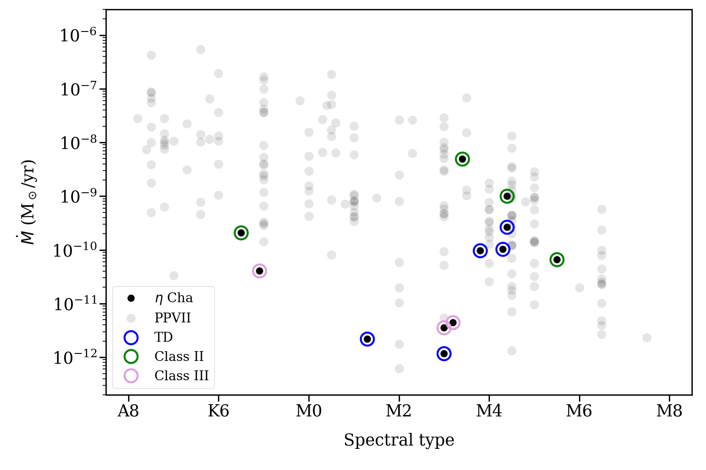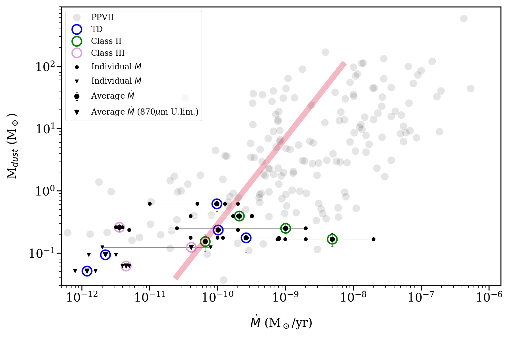

**Figure 4. -** _ Top_: Accretion rate vs spectral type. Note the lack of significant correlations between these quantities. _ Bottom_: Circumstellar dust mass derived according to Eqn. \ref{mdust-eq} vs. accretion rate.  For comparison, the objects in the list from [Manara, Ansdell and Rosotti (2023)]() are shown in grey. Note that the total disk mass would depend on the gas-to-dust ratio. APEX flux and mass upper limits are marked by inverted triangles. The red line corresponds to the model fitted by [Manara, Rosotti and Testi (2016)](). The accretion rates are taken from the literature (see Table \ref{macc}). For each object, we show the individual measurements (small symbols) together with the average rate (large symbols). A further color ring is added to specify the type of disk according to the classical SED classification.  (*mdotmdisk-fig*)

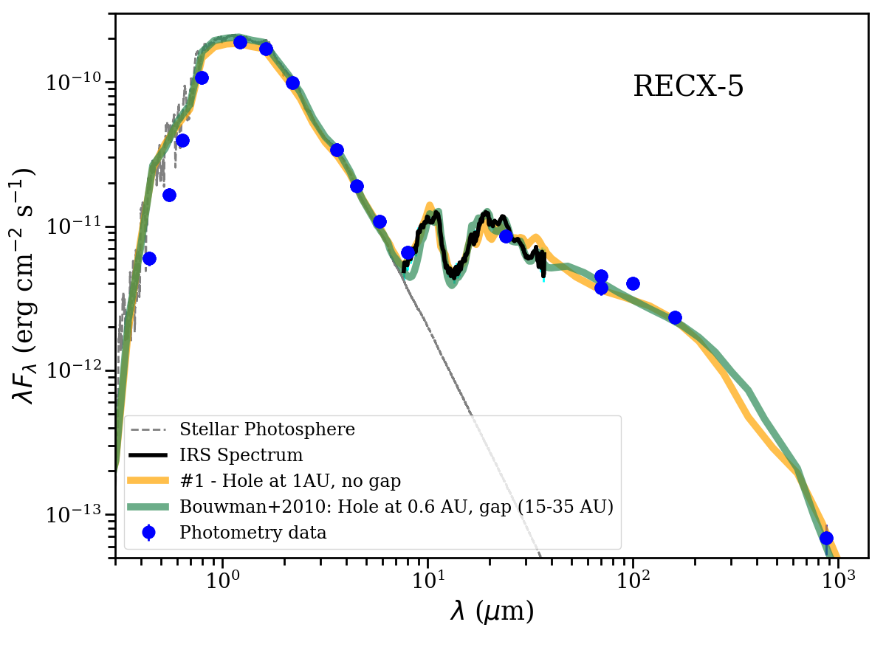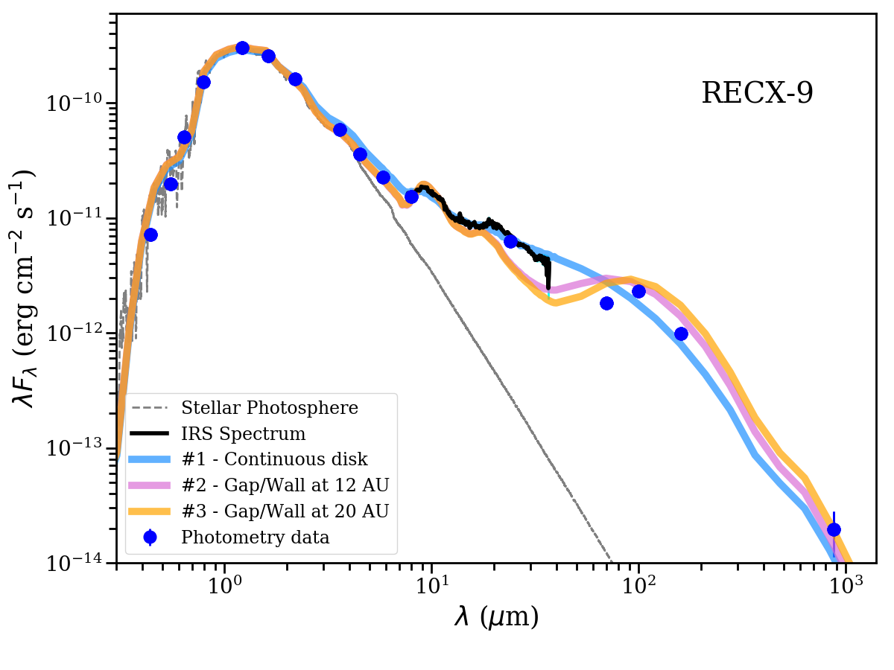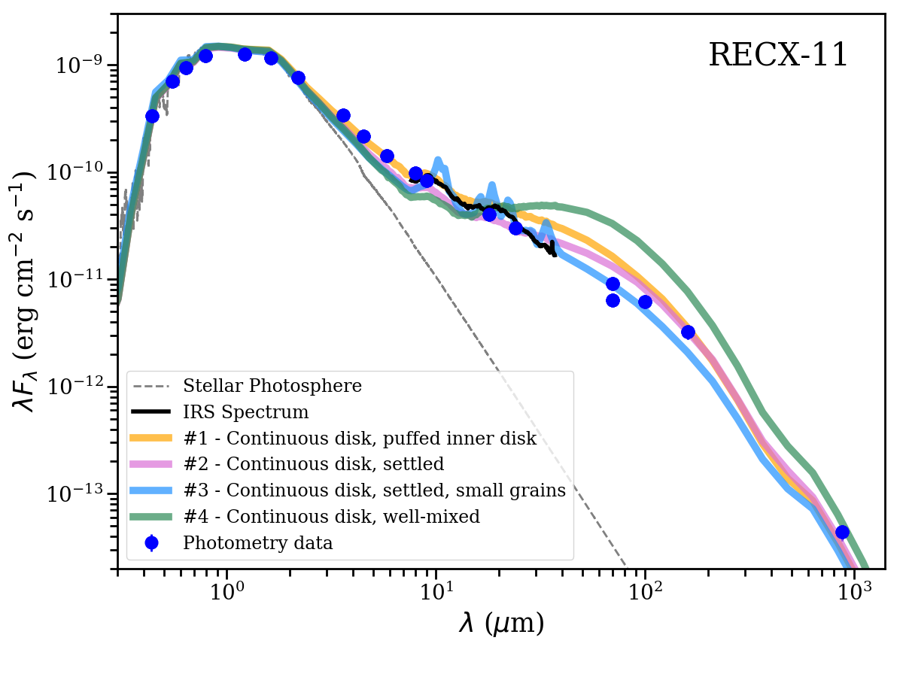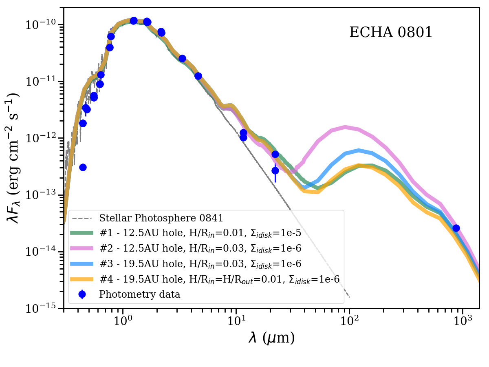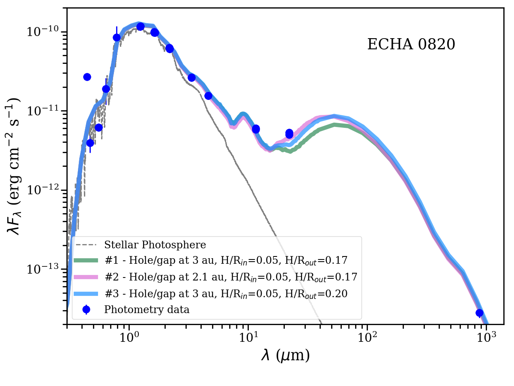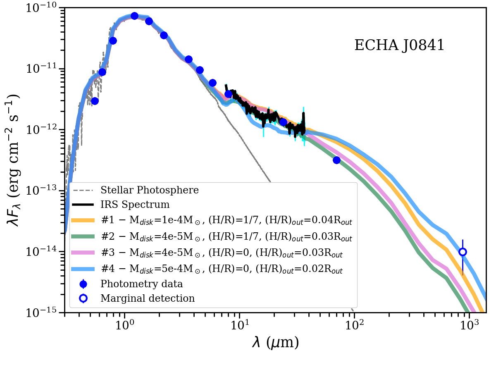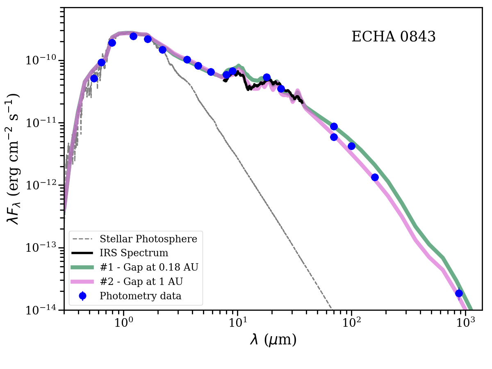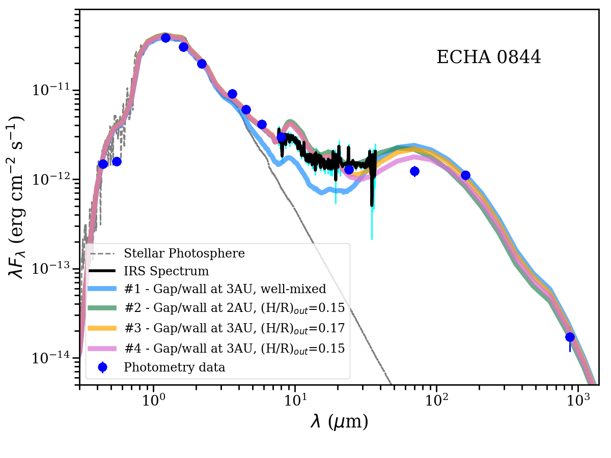

**Figure 7. -** SED models for the protoplanetary disks. For all cases, the photometry data is marked by blue circles (empty symbols for marginal detections). Spitzer/IRS spectra are plotted in black. The MARCS model stellar photospheres are marked by dotted grey lines, and the various disk models are represented by colored lines and labeled according to their main characteristics (see Table \ref{models-table}). RECX-5: A large-scale gap is not needed to reproduce the long wavelengths, which also means that SED alone cannot constrain among many diverse but equally plausible SED structures. RECX-9: A change in vertical scale height at 10-15 au is needed, which could be caused by a gap, wall, warp, or any other structure affecting the density and the scale height probably created by the existing companion at 20 au. RECX-11: Best fit with relatively massive and flattened disks. A more puffed innermost disk (either a puffed-up rim or a more extended $\sim$0.6 au region) is required, with the disk becoming increasingly flattened and settled at larger radii. J0801 and J0820 appear to be examples of relatively massive transition disks with large, strongly mass-depleted inner holes. ECHA J0841: Very flattened SED. ECHA J0843: Small gap or hole required. For ECHA J0844: Gap and/or change in the vertical scale height needed to explain the far-IR flux.  (*models-fig*)

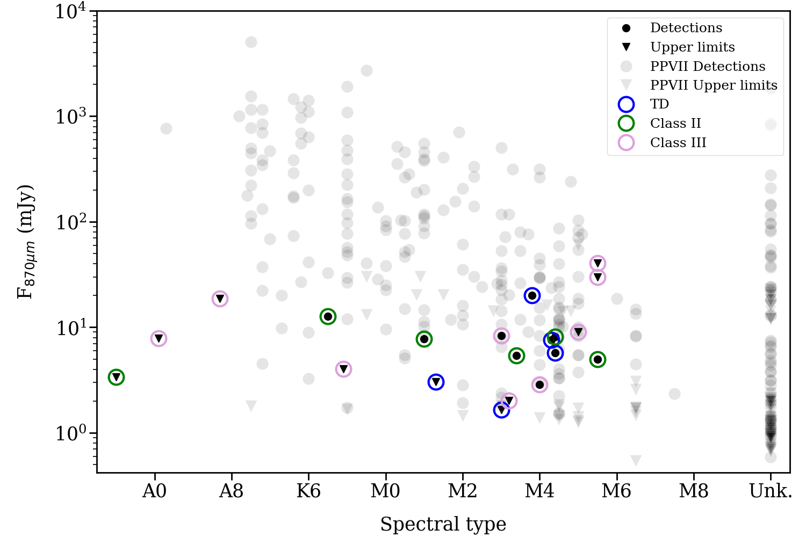

**Figure 1. -** APEX flux versus spectral type for the $\eta$ Cha members. For comparison, the objects in the list from [Manara, Ansdell and Rosotti (2023)]() are shown in grey, scaled to the distance of $\eta$ Cha. Note the lack of significant correlations between these quantities. Filled dots represent flux detections, while inverted triangles show upper limits. A further color ring is added to specify the type of disk according to the classical SED classification adopted by [Sicilia-Aguilar, Bouwman and Juhász (2009)](): transitional disks (TD), Class II, and Class III (including the debris disks). RS Cha and $\eta$ Cha are considered as upper limits due to cloud contamination.
 (*sptmdisk-fig*)

