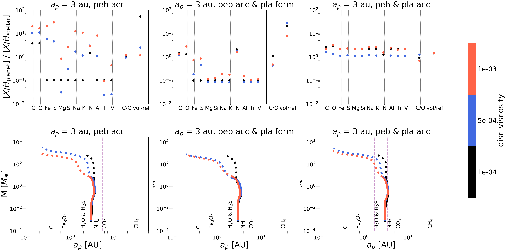
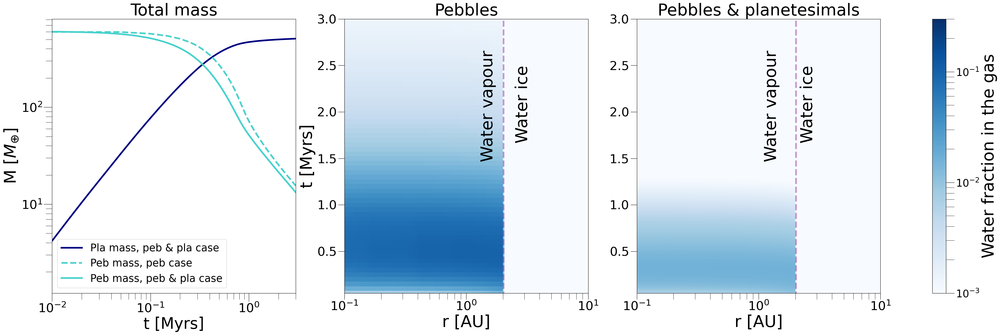
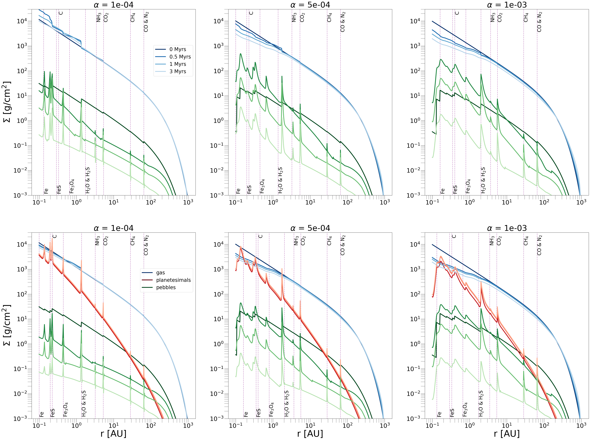

$\newcommand{\ensuremath}{}$
$\newcommand{\xspace}{}$
$\newcommand{\object}[1]{\texttt{#1}}$
$\newcommand{\farcs}{{.}''}$
$\newcommand{\farcm}{{.}'}$
$\newcommand{\arcsec}{''}$
$\newcommand{\arcmin}{'}$
$\newcommand{\ion}[2]{#1#2}$
$\newcommand{\textsc}[1]{\textrm{#1}}$
$\newcommand{\hl}[1]{\textrm{#1}}$
$\newcommand{\footnote}[1]{}$
$\newcommand{\}{natexlab}$

# Composition of giant planets: the roles of pebbles and planetesimals

<mark>Appeared on: 2023-10-05</mark> -  _12 pages, 10 figures, accepted for publication in Astronomy and Astrophysics_

<mark>C. Danti</mark>, B. Bitsch, <mark>J. Mah</mark>

**Abstract:** One of the current challenges of planet formation theory is to explain the enrichment of observed exoplanetary atmospheres.   While past studies have focused on scenarios where either pebbles or planetesimals are the main drivers of heavy element enrichment, we combine here both approaches to understand whether the composition of a planet can constrain its formation pathway. We study three different formation scenarios: pebble accretion, pebble accretion with planetesimal formation inside the disc, combined pebble and planetesimal accretion.   We use the chemcomp code to perform semi-analytical 1D simulations of protoplanetary discs, including viscous evolution, pebble drift, and simple chemistry to simulate the growth of planets from planetary embryos to gas giants as they migrate through the disc, while simultaneously tracking their composition.   Our simulations confirm that the composition of the planetary atmosphere is dominated by the accretion of gas vapour enriched by inward drifting and evaporating pebbles. Including planetesimal formation hinders this enrichment, because many pebbles are locked into planetesimals and cannot evaporate and enrich the disc. This results in a dramatic drop of the accreted heavy elements both in the planetesimal formation and accretion case, demonstrating that planetesimal formation needs to be inefficient in order to explain planets with high heavy element content.   On the other hand, accretion of planetesimals enhances the refractory component of the atmosphere, leading to low volatile to refractory ratios in the atmosphere, in contrast to the majority of pure pebble simulations. However, low volatile to refractory ratios can also be achieved in the pure pebble accretion scenario, if the planet migrates all the way into the inner disc and accretes gas that is enriched in evaporated refractories.   Distinguishing these two scenarios requires knowledge about the planet's atmospheric C/H and O/H ratios, which are much higher in the pure pebble scenario compared to the planetesimal formation and accretion scenario.   This implies that a detailed knowledge of the composition of planetary atmospheres could help to distinguish between the different formation scenarios.

**Figure 4. -** Final elemental abundances of the planetary atmospheres (top) and their corresponding growth tracks (bottom) for the three different scenarios of only pebble accretion (left), planetesimal formation (middle) and pebble and planetesimal accretion (right). The horizontal blue line in the first row marks the solar abundance, while the vertical violet lines in the second row show the evaporation fronts of the chemical species included in our model for a disc viscosity of $\alpha = 5 \cdot 10^{-4}$.The solid lines of the growth tracks correspond to core formation, while the dotted lines correspond to the gas accretion phase. The different colour codings represent different disc viscosities. (*fig:atm_comp*)

**Figure 3. -** Total mass of pebbles and planetesimal and water fraction in the gas in the disc. Left panel: Total mass of pebbles (light blue lines) and planetesimals (dark blue line) in the two scenarios: pebble accretion only (dotted line) and planetesimal formation (solid lines). Central and right panel: Water content in the gaseous phase of the disc with viscosity $\alpha=10^{-3}$ as a function of radius and time in the case of no planetesimal formation (central panel) and in presence of planetesimal formation (right panel). The vertical violet line marks the water evaporation front in the disc. (*fig:water_disk*)

**Figure 6. -** Surface densities of gas, pebbles and planetesimals for the disc described in Table \ref{tab:param_disc} in absence of planets, for different disc viscosities increasing from left to right. The top panel shows the pebble accretion scenario, where planetesimals cannot form, the bottom panel shows what happens, instead, when planetesimal formation is involved. (*fig:surface_density*)

