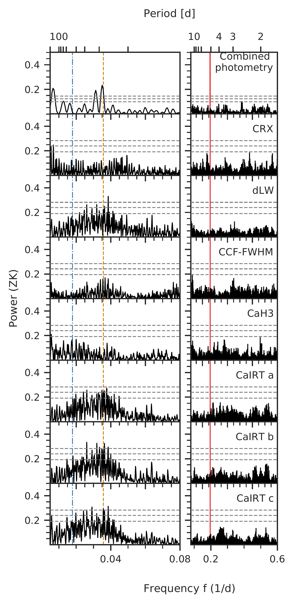
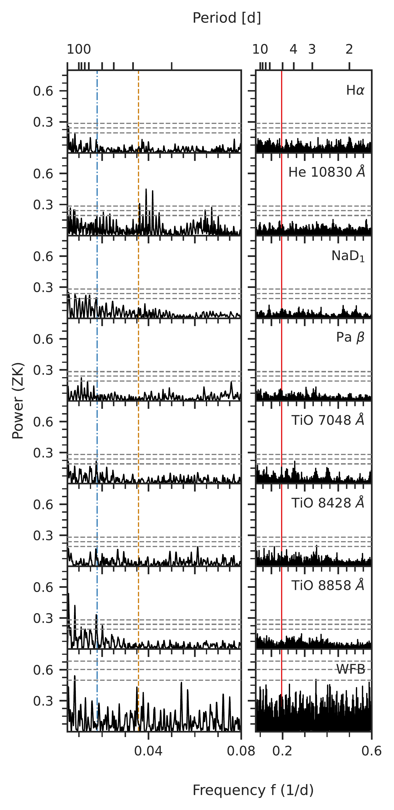
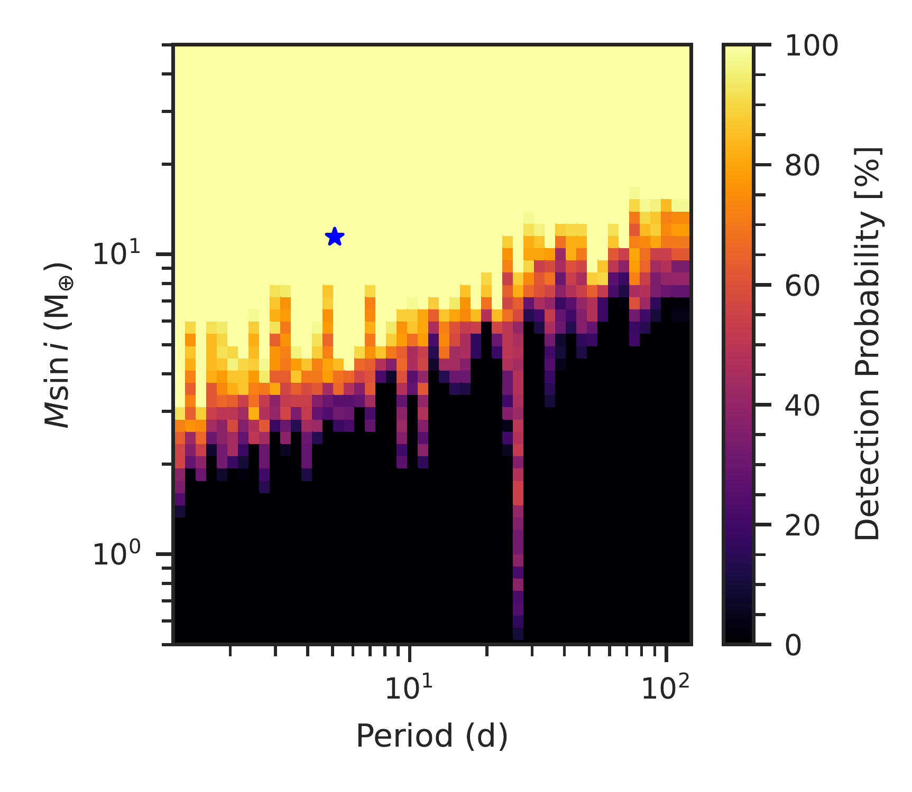
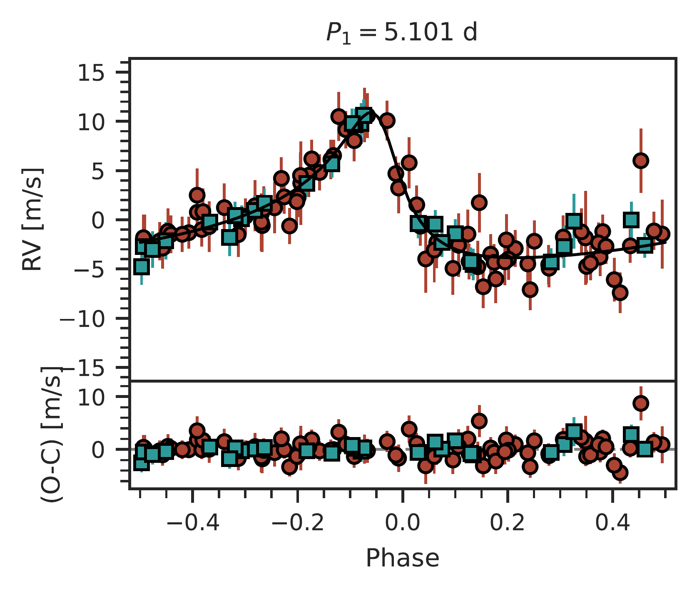

$\newcommand{\ensuremath}{}$
$\newcommand{\xspace}{}$
$\newcommand{\object}[1]{\texttt{#1}}$
$\newcommand{\farcs}{{.}''}$
$\newcommand{\farcm}{{.}'}$
$\newcommand{\arcsec}{''}$
$\newcommand{\arcmin}{'}$
$\newcommand{\ion}[2]{#1#2}$
$\newcommand{\textsc}[1]{\textrm{#1}}$
$\newcommand{\hl}[1]{\textrm{#1}}$
$\newcommand{\footnote}[1]{}$
$\newcommand{\sherlock}{{\fontfamily{pcr}\selectfont SHERLOCK} }$
$\newcommand{\matrixtk}{{\fontfamily{pcr}\selectfont MATRIX} }$
$\newcommand{\TODO}[1]{\textcolor{magenta}{\textsc{todo:} \textit{#1}}}$
$\newcommand{\autoref}$
$\newcommand{\equationautorefname}{Eq.}$
$\newcommand{\figureautorefname}{Fig.}$
$\newcommand{\sectionautorefname}{Sect.}$
$\newcommand{\subsectionautorefname}{Sect.}$
$\newcommand{\subsubsectionautorefname}{Sect.}$

# Planetary companions orbiting the M dwarfs GJ 724 and GJ 3988

<mark>Appeared on: 2023-10-10</mark> -  _A&A in press_

P. Gorrini, et al. -- incl., <mark>R. Burn</mark>, <mark>M. Kürster</mark>

**Abstract:** We report the discovery of two exoplanets around the M dwarfs GJ 724 and GJ 3988 using the radial velocity (RV) method. We obtained a total of 153 3.5 m Calar Alto/CARMENES spectra for both targets and measured their RVs and activity indicators. We also added archival ESO/HARPS data for GJ 724 and infrared RV measurements from Subaru/IRD for GJ 3988. We searched for periodic and stable signals to subsequently construct Keplerian models, considering different numbers of planets, and we selected the best models based on their Bayesian evidence. Gaussian process (GP) regression was included in some models to account for activity signals. For both systems, the best model corresponds to one single planet. The minimum masses are $10.75^{+0.96}_{-0.87}$ and $3.69^{+0.42}_{-0.41}$ Earth-masses for GJ 724 b and GJ 3988 b, respectively. Both planets have short periods ( $P < \SI{10}{\day}$ ) and, therefore, they orbit their star closely ( $a < \SI{0.05}{\astronomicalunit}$ ).  GJ 724 b has an eccentric orbit ( $e = 0.577^{+0.055}_{-0.052}$ ), whereas the orbit of GJ 3988 b is circular. The high eccentricity of GJ 724 b makes it the most eccentric single exoplanet (to this date) around an M dwarf. Thus, we suggest a further analysis to understand its configuration in the context of planetary formation and architecture. In contrast, GJ 3988 b is an example of a common type of planet around mid-M dwarfs.

**Figure 18. -** GLS periodograms of the (combined) photometric data and spectroscopic activity indicators from GJ 724 with peaks that reach at least a FAP level of 10\% in the period range of \SI{2}{\day} to \SI{200}{\day}. The gray dashed horizontal lines correspond to the FAP levels of 0.1\%, 1\%, and 10\%(from top to bottom, respectively). The mean rotation period of \SI{56}{\day} determined from the photometry is marked by the blue dashed line, while its second harmonic (${P_{rot}}/2$) of \SI{28}{\day} is depicted by the orange dashed line. The period of the 5.1-day planet is highlighted by the red solid line. (*fig:activity_GLS_GJ724*)

**Figure 7. -** Detection limit map of the RVs of GJ 724. The colour map represents the detection probability of the period-mass combination. The Grid is $50 \times 50$ in mass and period, with 50 phase samples for each combination. The blue star indicates the planet GJ 724 b.  (*fig:GJ724_detection_map*)

**Figure 3. -** Phased RVs for GJ 724 b from the best fit model ($\text{1P}_\text{(5 d-ecc)} + \text{dSHO-GP}_\text{28 d}$). The red dots show the CARMENES data while the teal squares depicts the HARPS data. The black lines show the median of \num{10000} samples from the posterior. The residuals after subtracting the median model are shown in the lower panel. (*fig:phasefolded_GJ724*)

