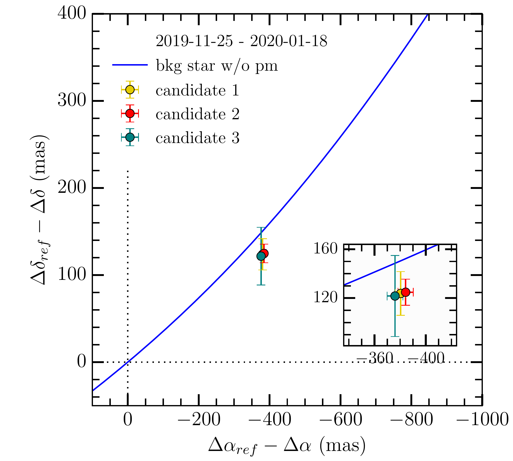
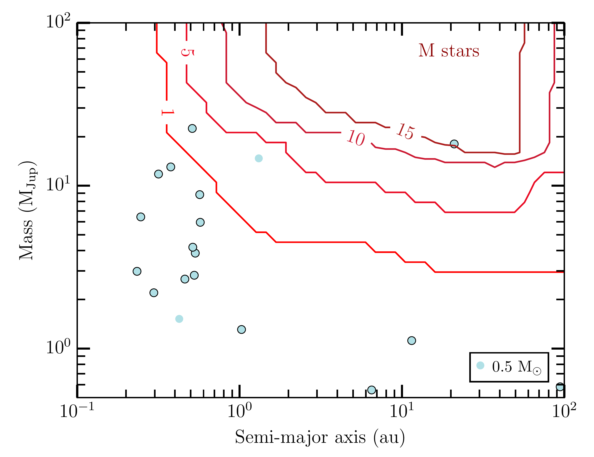
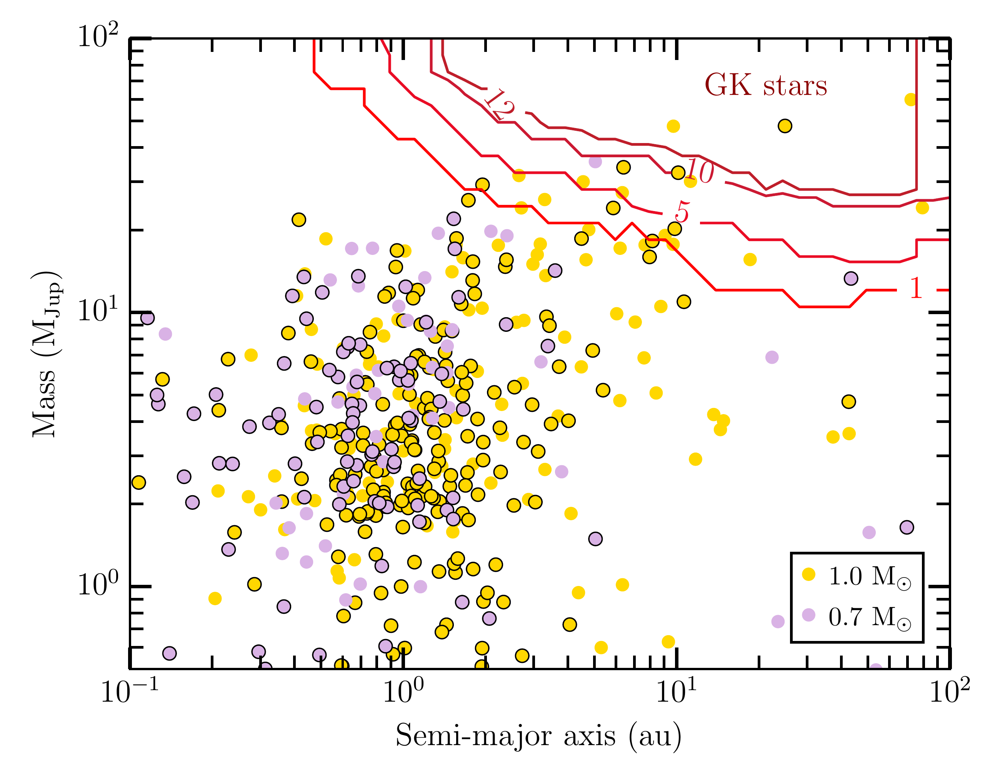

$\newcommand{\ensuremath}{}$
$\newcommand{\xspace}{}$
$\newcommand{\object}[1]{\texttt{#1}}$
$\newcommand{\farcs}{{.}''}$
$\newcommand{\farcm}{{.}'}$
$\newcommand{\arcsec}{''}$
$\newcommand{\arcmin}{'}$
$\newcommand{\ion}[2]{#1#2}$
$\newcommand{\textsc}[1]{\textrm{#1}}$
$\newcommand{\hl}[1]{\textrm{#1}}$
$\newcommand{\footnote}[1]{}$
$\newcommand{\dd}{\textnormal{d}}$
$\newcommand{\pa}[1]{\left(#1\right)}$
$\newcommand{\pac}[1]{\left[#1\right]}$
$\newcommand{\paa}[1]{\left\{#1\right\}}$
$\newcommand{\teff}{\ensuremath{\mathrm{T_{eff}}}}$
$\newcommand{\logg}{\ensuremath{\log(g)}}$
$\newcommand{\logZ}{\ensuremath{\log(Z/Z_{\odot})}}$
$\newcommand{\pc}{\ensuremath{\mathrm{pc}}}$
$\newcommand{\magg}{\ensuremath{\mathrm{mag}}}$
$\newcommand{\kelvin}{\ensuremath{\mathrm{K}}}$
$\newcommand{\mas}{\ensuremath{\mathrm{mas}}}$
$\newcommand{\yr}{\ensuremath{\mathrm{year}}}$
$\newcommand{\yrs}{\ensuremath{\mathrm{years}}}$
$\newcommand{\monthh}{\ensuremath{\mathrm{month}}}$
$\newcommand{\months}{\ensuremath{\mathrm{months}}}$
$\newcommand{\dayy}{\ensuremath{\mathrm{day}}}$
$\newcommand{\days}{\ensuremath{\mathrm{days}}}$
$\newcommand{\hr}{\ensuremath{\mathrm{hour}}}$
$\newcommand{\hrs}{\ensuremath{\mathrm{hours}}}$
$\newcommand{\khz}{\ensuremath{\mathrm{kHz}}}$
$\newcommand{\hz}{\ensuremath{\mathrm{Hz}}}$
$\newcommand{\myr}{\ensuremath{\mathrm{Myr}}}$
$\newcommand{\gyr}{\ensuremath{\mathrm{Gyr}}}$
$\newcommand{\au}{\ensuremath{\mathrm{au}}}$
$\newcommand{\mic}{\ensuremath{\mathrm{\mu m}}}$
$\newcommand{\nm}{\ensuremath{\mathrm{nm}}}$
$\newcommand{\pic}{\ensuremath{\mathrm{pm}}}$
$\newcommand{\mj}{\ensuremath{\mathrm{M_{Jup}}}}$
$\newcommand{\rj}{\ensuremath{\mathrm{R_{Jup}}}}$
$\newcommand{\mearth}{\ensuremath{\mathrm{M}_\oplus}}$
$\newcommand{\rearth}{\ensuremath{\textnormal{R}_{\oplus}}}$
$\newcommand{\densityearth}{\ensuremath{\rho_{\oplus}}}$
$\newcommand{\msun}{\ensuremath{\textnormal{M}_\odot}}$
$\newcommand{\rsun}{\ensuremath{\textnormal{R}_\odot}}$
$\newcommand{\lsun}{\ensuremath{\textnormal{L}_\odot}}$
$\newcommand{◦}{\ensuremath{^\circ}}$
$\newcommandinecolor{lagoon}{rgb}{0.5, 0.7, 0.8}$
$\newcommandinecolor{forest green}{rgb}{0.233, 0.645, 0.233}$
$\newcommand{\edc}[1]{\textcolor{lagoon}{#1}}$
$\newcommand{\celia}[1]{\textcolor{lagoon}{ [\textbf{Célia: } #1]}}$
$\newcommand{\gael}[1]{\textcolor{magenta}{ [\textbf{Gaël: } #1]}}$
$\newcommand{\JM}[1]{\textcolor{forest green}{ #1 [JM]}}$
$\setlength{\LTcapwidth}{\textwidth}$
$\setlength{\tabcolsep}{5pt}$
$\begin{document}$
$   \title{Planetary system architectures with low-mass inner planets$
$}$
$\subtitle{Direct imaging\thanks{Based on observations collected at the European Southern Observatory under ESO programmes 099.C-0255(A) 102.C-0489(A), 103.C-0484 (A and B), and 109.23F2.} exploration of mature systems beyond 1 au}$
$   \authorrunning{Desgrange et al.}$
$   \author{C.~Desgrange\inst{1}\fnmsep\inst{2}, J.~Milli\inst{1}, G.~Chauvin\inst{3}, Th.~Henning\inst{2}, A.~Luashvili\inst{4}, M.~Read\inst{5}, M.~Wyatt\inst{6}, G.~Kennedy\inst{7}\fnmsep\inst{8}, R.~Burn\inst{2}, M.~Schlecker\inst{9}, F.~Kiefer\inst{10}, V.~D'Orazi\inst{11}\fnmsep\inst{12}, S.~Messina\inst{13}, P.~Rubini\inst{14}, A.-M.~Lagrange\inst{10}, C.~Babusiaux\inst{1}, L.~Matrà\inst{15}, B.~Bitsch\inst{2}, M.~Bonavita\inst{12}\fnmsep\inst{16}, P.~Delorme\inst{1}, E.~Matthews\inst{2}, P.~Palma-Bifani\inst{3}, A.~Vigan\inst{17}$
$        }$
$   \institute{$
$    ^{1} Univ. Grenoble Alpes, CNRS, IPAG, F-38000 Grenoble, France;  e-mail: celia.desgrange@univ-grenoble-alpes.fr \^{2} Max Planck Institute for Astronomy, Königstuhl 17, D-69117 Heidelberg, Germany\^{3}\;Laboratoire Lagrange, UMR7293, Université  Cote d’Azur, CNRS, Observatoire de la C\^ote d’Azur. Boulevard de l’Observatoire, 06304 Nice, France. \^{4} Laboratoire Univers et Théories, Observatoire de Paris, Université PSL, CNRS, Université Paris Cité, 92190 Meudon, France\^{5} Space Research and Planetology Division, Physikalisches Inst., Universität Bern, Switzerland \^{6} Institute of Astronomy, University of Cambridge, Madingley Road, Cambridge CB3 0HA, United Kingdom \^{7} Department of Physics, University of Warwick, Gibbet Hill Road, Coventry, CV4 7AL, UK\^{8} Centre for Exoplanets and Habitability, University of Warwick, Gibbet Hill Road, Coventry CV4 7AL, UK\^{9} Department of Astronomy/Steward Observatory, The University of Arizona, 933 North Cherry Avenue, Tucson, AZ 85721, USA \^{10}\;LESIA, Observatoire de Paris, Université PSL, CNRS, Sorbonne Université, Université de Paris, 5 place Jules Janssen, 92195 Meudon, France \^{11} Department of Physics, University of Rome Tor Vergata, Via della Ricerca Scientifica 1, 00133 Rome, Italy\^{12} INAF-Osservatorio Astronomico di Padova, Vicolo dell’ Osservatorio 5, 35122, Padova, Italy\^{13} INAF–Osservatorio Astrofisico di Catania, via Santa Sofia, 78 Catania, Italy \^{14} Pixyl, 5 Avenue du Grand Sablon, 38700 La Tronche, France\^{15} School of Physics, Trinity College Dublin, The University of Dublin, College Green, Dublin 2, Ireland\^{16} School of Physical Sciences, The Open University, Walton Hall, Milton Keynes, MK7 6AA, UK\^{17} Aix Marseille Univ, CNRS, CNES, LAM, Marseille, France\}$
$   \date $
$  \abstract{The discovery of planets orbiting at less than 1 au from their host star and less massive than Saturn in various exoplanetary systems revolutionized our theories of planetary formation.$
$   The fundamental question is whether these close-in low-mass planets could have formed in the inner disk interior to 1 au, or whether they formed further out in the planet-forming disk and migrated inward.$
$   Exploring the role of additional giant planet(s) in these systems may help us to pinpoint their global formation and evolution.$
$   }{We searched for additional substellar companions  by using direct imaging in systems known to host close-in small planets. The use of direct imaging complemented by radial velocity and astrometric detection limits enabled us to explore the giant planet and brown dwarf demographics around these hosts to investigate the potential connection between both populations.}{We carried out a direct imaging survey with SPHERE at VLT to look for outer giant planets and brown dwarf companions in 27 systems hosting close-in low-mass planets discovered by radial velocity. Our sample is composed of very nearby (< 20 pc) planetary systems, orbiting G-, K-, and M-type mature (0.5--10 Gyr) stellar hosts. We performed homogeneous direct imaging data reduction and analysis to search for and characterize point sources, and derived robust statistical detection limits.$
$   The final direct imaging detection performances were globally considered together  with radial velocity and astrometric sensitivity. }{Of 337 point-source detections, we do not find any new bound companions. We recovered the emblematic very cool T-type brown dwarf GJ 229 B. Our typical sensitivities in direct imaging range from 5 to 30 M_{\rm Jup} beyond 2 au. The non-detection of massive companions is consistent with predictions based on models of planet formation by core accretion. Our pilot study opens the way to a multi-technique approach for the exploration of very nearby exoplanetary systems with future ground-based and space observatories.}$
$    $
$   \keywords{Planetary systems -- Instrumentation: adaptive optics, high angular resolution -- Methods: observational}$
$   \titlerunning{Architecture of systems hosting close-in sub-Saturns}$
$   \maketitle$
$\bibliographystyle{aa.bst}$
$\n\end{document}}}}$
$\newcommand{\pac}[1]{\left[#1\right]}$
$\newcommand{\paa}[1]{\left\{#1\right\}}$
$\newcommand{\teff}{\ensuremath{\mathrm{T_{eff}}}}$
$\newcommand{\logg}{\ensuremath{\log(g)}}$
$\newcommand{\logZ}{\ensuremath{\log(Z/Z_{\odot})}}$
$\newcommand{\pc}{\ensuremath{\mathrm{pc}}}$
$\newcommand{\magg}{\ensuremath{\mathrm{mag}}}$
$\newcommand{\kelvin}{\ensuremath{\mathrm{K}}}$
$\newcommand{\mas}{\ensuremath{\mathrm{mas}}}$
$\newcommand{\yr}{\ensuremath{\mathrm{year}}}$
$\newcommand{\yrs}{\ensuremath{\mathrm{years}}}$
$\newcommand{\monthh}{\ensuremath{\mathrm{month}}}$
$\newcommand{\months}{\ensuremath{\mathrm{months}}}$
$\newcommand{\dayy}{\ensuremath{\mathrm{day}}}$
$\newcommand{\days}{\ensuremath{\mathrm{days}}}$
$\newcommand{\hr}{\ensuremath{\mathrm{hour}}}$
$\newcommand{\hrs}{\ensuremath{\mathrm{hours}}}$
$\newcommand{\khz}{\ensuremath{\mathrm{kHz}}}$
$\newcommand{\hz}{\ensuremath{\mathrm{Hz}}}$
$\newcommand{\myr}{\ensuremath{\mathrm{Myr}}}$
$\newcommand{\gyr}{\ensuremath{\mathrm{Gyr}}}$
$\newcommand{\au}{\ensuremath{\mathrm{au}}}$
$\newcommand{\mic}{\ensuremath{\mathrm{\mu m}}}$
$\newcommand{\nm}{\ensuremath{\mathrm{nm}}}$
$\newcommand{\pic}{\ensuremath{\mathrm{pm}}}$
$\newcommand{\mj}{\ensuremath{\mathrm{M_{Jup}}}}$
$\newcommand{\rj}{\ensuremath{\mathrm{R_{Jup}}}}$
$\newcommand{\mearth}{\ensuremath{\mathrm{M}_\oplus}}$
$\newcommand{\rearth}{\ensuremath{\textnormal{R}_{\oplus}}}$
$\newcommand{\densityearth}{\ensuremath{\rho_{\oplus}}}$
$\newcommand{\msun}{\ensuremath{\textnormal{M}_\odot}}$
$\newcommand{\rsun}{\ensuremath{\textnormal{R}_\odot}}$
$\newcommand{\lsun}{\ensuremath{\textnormal{L}_\odot}}$
$\newcommand{◦}{\ensuremath{^\circ}}$
$\newcommandinecolor{lagoon}{rgb}{0.5, 0.7, 0.8}$
$\newcommandinecolor{forest green}{rgb}{0.233, 0.645, 0.233}$
$\newcommand{\edc}[1]{\textcolor{lagoon}{#1}}$
$\newcommand{\celia}[1]{\textcolor{lagoon}{ [\textbf{Célia: } #1]}}$
$\newcommand{\gael}[1]{\textcolor{magenta}{ [\textbf{Gaël: } #1]}}$
$\newcommand{\JM}[1]{\textcolor{forest green}{ #1 [JM]}}$
$\setlength{\LTcapwidth}{\textwidth}$
$\setlength{\tabcolsep}{5pt}$
$\begin{document}$
$   \title{Planetary system architectures with low-mass inner planets$
$}$
$\subtitle{Direct imaging\thanks{Based on observations collected at the European Southern Observatory under ESO programmes 099.C-0255(A) 102.C-0489(A), 103.C-0484 (A and B), and 109.23F2.} exploration of mature systems beyond 1 au}$
$   \authorrunning{Desgrange et al.}$
$   \author{C.~Desgrange\inst{1}\fnmsep\inst{2}, J.~Milli\inst{1}, G.~Chauvin\inst{3}, Th.~Henning\inst{2}, A.~Luashvili\inst{4}, M.~Read\inst{5}, M.~Wyatt\inst{6}, G.~Kennedy\inst{7}\fnmsep\inst{8}, R.~Burn\inst{2}, M.~Schlecker\inst{9}, F.~Kiefer\inst{10}, V.~D'Orazi\inst{11}\fnmsep\inst{12}, S.~Messina\inst{13}, P.~Rubini\inst{14}, A.-M.~Lagrange\inst{10}, C.~Babusiaux\inst{1}, L.~Matrà\inst{15}, B.~Bitsch\inst{2}, M.~Bonavita\inst{12}\fnmsep\inst{16}, P.~Delorme\inst{1}, E.~Matthews\inst{2}, P.~Palma-Bifani\inst{3}, A.~Vigan\inst{17}$
$        }$
$   \institute{$
$    ^{1} Univ. Grenoble Alpes, CNRS, IPAG, F-38000 Grenoble, France;  e-mail: celia.desgrange@univ-grenoble-alpes.fr \^{2} Max Planck Institute for Astronomy, Königstuhl 17, D-69117 Heidelberg, Germany\^{3}\;Laboratoire Lagrange, UMR7293, Université  Cote d’Azur, CNRS, Observatoire de la C\^ote d’Azur. Boulevard de l’Observatoire, 06304 Nice, France. \^{4} Laboratoire Univers et Théories, Observatoire de Paris, Université PSL, CNRS, Université Paris Cité, 92190 Meudon, France\^{5} Space Research and Planetology Division, Physikalisches Inst., Universität Bern, Switzerland \^{6} Institute of Astronomy, University of Cambridge, Madingley Road, Cambridge CB3 0HA, United Kingdom \^{7} Department of Physics, University of Warwick, Gibbet Hill Road, Coventry, CV4 7AL, UK\^{8} Centre for Exoplanets and Habitability, University of Warwick, Gibbet Hill Road, Coventry CV4 7AL, UK\^{9} Department of Astronomy/Steward Observatory, The University of Arizona, 933 North Cherry Avenue, Tucson, AZ 85721, USA \^{10}\;LESIA, Observatoire de Paris, Université PSL, CNRS, Sorbonne Université, Université de Paris, 5 place Jules Janssen, 92195 Meudon, France \^{11} Department of Physics, University of Rome Tor Vergata, Via della Ricerca Scientifica 1, 00133 Rome, Italy\^{12} INAF-Osservatorio Astronomico di Padova, Vicolo dell’ Osservatorio 5, 35122, Padova, Italy\^{13} INAF–Osservatorio Astrofisico di Catania, via Santa Sofia, 78 Catania, Italy \^{14} Pixyl, 5 Avenue du Grand Sablon, 38700 La Tronche, France\^{15} School of Physics, Trinity College Dublin, The University of Dublin, College Green, Dublin 2, Ireland\^{16} School of Physical Sciences, The Open University, Walton Hall, Milton Keynes, MK7 6AA, UK\^{17} Aix Marseille Univ, CNRS, CNES, LAM, Marseille, France\}$
$   \date $
$  \abstract{The discovery of planets orbiting at less than 1 au from their host star and less massive than Saturn in various exoplanetary systems revolutionized our theories of planetary formation.$
$   The fundamental question is whether these close-in low-mass planets could have formed in the inner disk interior to 1 au, or whether they formed further out in the planet-forming disk and migrated inward.$
$   Exploring the role of additional giant planet(s) in these systems may help us to pinpoint their global formation and evolution.$
$   }{We searched for additional substellar companions  by using direct imaging in systems known to host close-in small planets. The use of direct imaging complemented by radial velocity and astrometric detection limits enabled us to explore the giant planet and brown dwarf demographics around these hosts to investigate the potential connection between both populations.}{We carried out a direct imaging survey with SPHERE at VLT to look for outer giant planets and brown dwarf companions in 27 systems hosting close-in low-mass planets discovered by radial velocity. Our sample is composed of very nearby (< 20 pc) planetary systems, orbiting G-, K-, and M-type mature (0.5--10 Gyr) stellar hosts. We performed homogeneous direct imaging data reduction and analysis to search for and characterize point sources, and derived robust statistical detection limits.$
$   The final direct imaging detection performances were globally considered together  with radial velocity and astrometric sensitivity. }{Of 337 point-source detections, we do not find any new bound companions. We recovered the emblematic very cool T-type brown dwarf GJ 229 B. Our typical sensitivities in direct imaging range from 5 to 30 M_{\rm Jup} beyond 2 au. The non-detection of massive companions is consistent with predictions based on models of planet formation by core accretion. Our pilot study opens the way to a multi-technique approach for the exploration of very nearby exoplanetary systems with future ground-based and space observatories.}$
$    $
$   \keywords{Planetary systems -- Instrumentation: adaptive optics, high angular resolution -- Methods: observational}$
$   \titlerunning{Architecture of systems hosting close-in sub-Saturns}$
$   \maketitle$
$\bibliographystyle{aa.bst}$
$\n\end{document}}}$
$\newcommand{\paa}[1]{\left\{#1\right\}}$
$\newcommand{\teff}{\ensuremath{\mathrm{T_{eff}}}}$
$\newcommand{\logg}{\ensuremath{\log(g)}}$
$\newcommand{\logZ}{\ensuremath{\log(Z/Z_{\odot})}}$
$\newcommand{\pc}{\ensuremath{\mathrm{pc}}}$
$\newcommand{\magg}{\ensuremath{\mathrm{mag}}}$
$\newcommand{\kelvin}{\ensuremath{\mathrm{K}}}$
$\newcommand{\mas}{\ensuremath{\mathrm{mas}}}$
$\newcommand{\yr}{\ensuremath{\mathrm{year}}}$
$\newcommand{\yrs}{\ensuremath{\mathrm{years}}}$
$\newcommand{\monthh}{\ensuremath{\mathrm{month}}}$
$\newcommand{\months}{\ensuremath{\mathrm{months}}}$
$\newcommand{\dayy}{\ensuremath{\mathrm{day}}}$
$\newcommand{\days}{\ensuremath{\mathrm{days}}}$
$\newcommand{\hr}{\ensuremath{\mathrm{hour}}}$
$\newcommand{\hrs}{\ensuremath{\mathrm{hours}}}$
$\newcommand{\khz}{\ensuremath{\mathrm{kHz}}}$
$\newcommand{\hz}{\ensuremath{\mathrm{Hz}}}$
$\newcommand{\myr}{\ensuremath{\mathrm{Myr}}}$
$\newcommand{\gyr}{\ensuremath{\mathrm{Gyr}}}$
$\newcommand{\au}{\ensuremath{\mathrm{au}}}$
$\newcommand{\mic}{\ensuremath{\mathrm{\mu m}}}$
$\newcommand{\nm}{\ensuremath{\mathrm{nm}}}$
$\newcommand{\pic}{\ensuremath{\mathrm{pm}}}$
$\newcommand{\mj}{\ensuremath{\mathrm{M_{Jup}}}}$
$\newcommand{\rj}{\ensuremath{\mathrm{R_{Jup}}}}$
$\newcommand{\mearth}{\ensuremath{\mathrm{M}_\oplus}}$
$\newcommand{\rearth}{\ensuremath{\textnormal{R}_{\oplus}}}$
$\newcommand{\densityearth}{\ensuremath{\rho_{\oplus}}}$
$\newcommand{\msun}{\ensuremath{\textnormal{M}_\odot}}$
$\newcommand{\rsun}{\ensuremath{\textnormal{R}_\odot}}$
$\newcommand{\lsun}{\ensuremath{\textnormal{L}_\odot}}$
$\newcommand{◦}{\ensuremath{^\circ}}$
$\newcommandinecolor{lagoon}{rgb}{0.5, 0.7, 0.8}$
$\newcommandinecolor{forest green}{rgb}{0.233, 0.645, 0.233}$
$\newcommand{\edc}[1]{\textcolor{lagoon}{#1}}$
$\newcommand{\celia}[1]{\textcolor{lagoon}{ [\textbf{Célia: } #1]}}$
$\newcommand{\gael}[1]{\textcolor{magenta}{ [\textbf{Gaël: } #1]}}$
$\newcommand{\JM}[1]{\textcolor{forest green}{ #1 [JM]}}$
$\setlength{\LTcapwidth}{\textwidth}$
$\setlength{\tabcolsep}{5pt}$
$\begin{document}$
$   \title{Planetary system architectures with low-mass inner planets$
$}$
$\subtitle{Direct imaging\thanks{Based on observations collected at the European Southern Observatory under ESO programmes 099.C-0255(A) 102.C-0489(A), 103.C-0484 (A and B), and 109.23F2.} exploration of mature systems beyond 1 au}$
$   \authorrunning{Desgrange et al.}$
$   \author{C.~Desgrange\inst{1}\fnmsep\inst{2}, J.~Milli\inst{1}, G.~Chauvin\inst{3}, Th.~Henning\inst{2}, A.~Luashvili\inst{4}, M.~Read\inst{5}, M.~Wyatt\inst{6}, G.~Kennedy\inst{7}\fnmsep\inst{8}, R.~Burn\inst{2}, M.~Schlecker\inst{9}, F.~Kiefer\inst{10}, V.~D'Orazi\inst{11}\fnmsep\inst{12}, S.~Messina\inst{13}, P.~Rubini\inst{14}, A.-M.~Lagrange\inst{10}, C.~Babusiaux\inst{1}, L.~Matrà\inst{15}, B.~Bitsch\inst{2}, M.~Bonavita\inst{12}\fnmsep\inst{16}, P.~Delorme\inst{1}, E.~Matthews\inst{2}, P.~Palma-Bifani\inst{3}, A.~Vigan\inst{17}$
$        }$
$   \institute{$
$    ^{1} Univ. Grenoble Alpes, CNRS, IPAG, F-38000 Grenoble, France;  e-mail: celia.desgrange@univ-grenoble-alpes.fr \^{2} Max Planck Institute for Astronomy, Königstuhl 17, D-69117 Heidelberg, Germany\^{3}\;Laboratoire Lagrange, UMR7293, Université  Cote d’Azur, CNRS, Observatoire de la C\^ote d’Azur. Boulevard de l’Observatoire, 06304 Nice, France. \^{4} Laboratoire Univers et Théories, Observatoire de Paris, Université PSL, CNRS, Université Paris Cité, 92190 Meudon, France\^{5} Space Research and Planetology Division, Physikalisches Inst., Universität Bern, Switzerland \^{6} Institute of Astronomy, University of Cambridge, Madingley Road, Cambridge CB3 0HA, United Kingdom \^{7} Department of Physics, University of Warwick, Gibbet Hill Road, Coventry, CV4 7AL, UK\^{8} Centre for Exoplanets and Habitability, University of Warwick, Gibbet Hill Road, Coventry CV4 7AL, UK\^{9} Department of Astronomy/Steward Observatory, The University of Arizona, 933 North Cherry Avenue, Tucson, AZ 85721, USA \^{10}\;LESIA, Observatoire de Paris, Université PSL, CNRS, Sorbonne Université, Université de Paris, 5 place Jules Janssen, 92195 Meudon, France \^{11} Department of Physics, University of Rome Tor Vergata, Via della Ricerca Scientifica 1, 00133 Rome, Italy\^{12} INAF-Osservatorio Astronomico di Padova, Vicolo dell’ Osservatorio 5, 35122, Padova, Italy\^{13} INAF–Osservatorio Astrofisico di Catania, via Santa Sofia, 78 Catania, Italy \^{14} Pixyl, 5 Avenue du Grand Sablon, 38700 La Tronche, France\^{15} School of Physics, Trinity College Dublin, The University of Dublin, College Green, Dublin 2, Ireland\^{16} School of Physical Sciences, The Open University, Walton Hall, Milton Keynes, MK7 6AA, UK\^{17} Aix Marseille Univ, CNRS, CNES, LAM, Marseille, France\}$
$   \date $
$  \abstract{The discovery of planets orbiting at less than 1 au from their host star and less massive than Saturn in various exoplanetary systems revolutionized our theories of planetary formation.$
$   The fundamental question is whether these close-in low-mass planets could have formed in the inner disk interior to 1 au, or whether they formed further out in the planet-forming disk and migrated inward.$
$   Exploring the role of additional giant planet(s) in these systems may help us to pinpoint their global formation and evolution.$
$   }{We searched for additional substellar companions  by using direct imaging in systems known to host close-in small planets. The use of direct imaging complemented by radial velocity and astrometric detection limits enabled us to explore the giant planet and brown dwarf demographics around these hosts to investigate the potential connection between both populations.}{We carried out a direct imaging survey with SPHERE at VLT to look for outer giant planets and brown dwarf companions in 27 systems hosting close-in low-mass planets discovered by radial velocity. Our sample is composed of very nearby (< 20 pc) planetary systems, orbiting G-, K-, and M-type mature (0.5--10 Gyr) stellar hosts. We performed homogeneous direct imaging data reduction and analysis to search for and characterize point sources, and derived robust statistical detection limits.$
$   The final direct imaging detection performances were globally considered together  with radial velocity and astrometric sensitivity. }{Of 337 point-source detections, we do not find any new bound companions. We recovered the emblematic very cool T-type brown dwarf GJ 229 B. Our typical sensitivities in direct imaging range from 5 to 30 M_{\rm Jup} beyond 2 au. The non-detection of massive companions is consistent with predictions based on models of planet formation by core accretion. Our pilot study opens the way to a multi-technique approach for the exploration of very nearby exoplanetary systems with future ground-based and space observatories.}$
$    $
$   \keywords{Planetary systems -- Instrumentation: adaptive optics, high angular resolution -- Methods: observational}$
$   \titlerunning{Architecture of systems hosting close-in sub-Saturns}$
$   \maketitle$
$\bibliographystyle{aa.bst}$
$\n\end{document}}$
$\newcommand{\teff}{\ensuremath{\mathrm{T_{eff}}}}$
$\newcommand{\logg}{\ensuremath{\log(g)}}$
$\newcommand{\logZ}{\ensuremath{\log(Z/Z_{\odot})}}$
$\newcommand{\pc}{\ensuremath{\mathrm{pc}}}$
$\newcommand{\magg}{\ensuremath{\mathrm{mag}}}$
$\newcommand{\kelvin}{\ensuremath{\mathrm{K}}}$
$\newcommand{\mas}{\ensuremath{\mathrm{mas}}}$
$\newcommand{\yr}{\ensuremath{\mathrm{year}}}$
$\newcommand{\yrs}{\ensuremath{\mathrm{years}}}$
$\newcommand{\monthh}{\ensuremath{\mathrm{month}}}$
$\newcommand{\months}{\ensuremath{\mathrm{months}}}$
$\newcommand{\dayy}{\ensuremath{\mathrm{day}}}$
$\newcommand{\days}{\ensuremath{\mathrm{days}}}$
$\newcommand{\hr}{\ensuremath{\mathrm{hour}}}$
$\newcommand{\hrs}{\ensuremath{\mathrm{hours}}}$
$\newcommand{\khz}{\ensuremath{\mathrm{kHz}}}$
$\newcommand{\hz}{\ensuremath{\mathrm{Hz}}}$
$\newcommand{\myr}{\ensuremath{\mathrm{Myr}}}$
$\newcommand{\gyr}{\ensuremath{\mathrm{Gyr}}}$
$\newcommand{\au}{\ensuremath{\mathrm{au}}}$
$\newcommand{\mic}{\ensuremath{\mathrm{\mu m}}}$
$\newcommand{\nm}{\ensuremath{\mathrm{nm}}}$
$\newcommand{\pic}{\ensuremath{\mathrm{pm}}}$
$\newcommand{\mj}{\ensuremath{\mathrm{M_{Jup}}}}$
$\newcommand{\rj}{\ensuremath{\mathrm{R_{Jup}}}}$
$\newcommand{\mearth}{\ensuremath{\mathrm{M}_\oplus}}$
$\newcommand{\rearth}{\ensuremath{\textnormal{R}_{\oplus}}}$
$\newcommand{\densityearth}{\ensuremath{\rho_{\oplus}}}$
$\newcommand{\msun}{\ensuremath{\textnormal{M}_\odot}}$
$\newcommand{\rsun}{\ensuremath{\textnormal{R}_\odot}}$
$\newcommand{\lsun}{\ensuremath{\textnormal{L}_\odot}}$
$\newcommand{\edc}[1]{\textcolor{lagoon}{#1}}$
$\newcommand{\celia}[1]{\textcolor{lagoon}{ [\textbf{Célia: } #1]}}$
$\newcommand{\gael}[1]{\textcolor{magenta}{ [\textbf{Gaël: } #1]}}$
$\newcommand{\JM}[1]{\textcolor{forest green}{ #1 [JM]}}$
$\newcommand{◦}{\ensuremath{^\circ}}$

# Planetary system architectures with low-mass inner planets

<mark>Appeared on: 2023-10-11</mark> -  _49 pages including 31 pages of appendices and references, 31 figures, A&A, accepted_

<mark>C. Desgrange</mark>, et al. -- incl., <mark>R. Burn</mark>, <mark>E. Matthews</mark>

**Abstract:** The discovery of planets orbiting at less than 1 au from their host star and less massive than Saturn in various exoplanetary systems revolutionized our theories of planetary formation.   The fundamental question is whether these close-in low-mass planets could have formed in the inner disk interior to 1 au, or whether they formed further out in the planet-forming disk and migrated inward.   Exploring the role of additional giant planet(s) in these systems may help us to pinpoint their global formation and evolution. We searched for additional substellar companions  by using direct imaging in systems known to host close-in small planets. The use of direct imaging complemented by radial velocity and astrometric detection limits enabled us to explore the giant planet and brown dwarf demographics around these hosts to investigate the potential connection between both populations. We carried out a direct imaging survey with SPHERE at VLT to look for outer giant planets and brown dwarf companions in 27 systems hosting close-in low-mass planets discovered by radial velocity. Our sample is composed of very nearby (< 20 pc) planetary systems, orbiting G-, K-, and M-type mature (0.5--10 Gyr) stellar hosts. We performed homogeneous direct imaging data reduction and analysis to search for and characterize point sources, and derived robust statistical detection limits.   The final direct imaging detection performances were globally considered together  with radial velocity and astrometric sensitivity. Of 337 point-source detections, we do not find any new bound companions. We recovered the emblematic very cool T-type brown dwarf GJ 229 B. Our typical sensitivities in direct imaging range from 5 to 30 M $_{\rm Jup}$ beyond 2 au. The non-detection of massive companions is consistent with predictions based on models of planet formation by core accretion. Our pilot study opens the way to a multi-technique approach for the exploration of very nearby exoplanetary systems with future ground-based and space observatories.

**Figure 9. -** SPHERE/IRDIS relative astrometry differences of the offset positions of all the point-like sources detected around GJ 422
    in both the second and third epochs (2018-01-28 and 2020-01-18).
    The expected variation of offset positions, if the companion candidates are stationary background objects are shown in blue solid line. The variation is estimated based on the parallactic and proper motions of the primary star. The five companion candidates are clearly identified as background contaminants. At the _bottom-right_ corner, the insert shows a zoom on the location of the candidates.
     (*fig:PMD_GJ422_2+3epochs*)

**Figure 33. -** Detection sensitivity of companions for our direct imaging SPHERE observations of 15 M-stars (_left_) and 12 GK-stars (_right_).  The isocontours give the number of stars from our survey that have the sensitivity to detect companions at a probability of $50\%$.
    The theoretical population of companions formed via the Bern core-accretion models considering $1000$ systems are indicated in circles of colors associated to stellar masses \citep{Burn2021_NGPPS}. These symbols have a black outline if the systems also host close-in ($\leq1 $\au$$) low-mass ($\leq95 $\mearth$$) planets.
     (*fig:Fig4_Vigan_detlim_obs_vs_theory*)

**Figure 21. -** 
    Reduced images from SPHERE-IRDIS for the whole survey for SpeCal-cADI reductions. The factor in the bottom left hand corner of each figure indicates the number by which to multiply the color bar to have the corresponding contrast values.
     (*fig:mosaic_super-earths_survey_IRDIS_cADI*)

