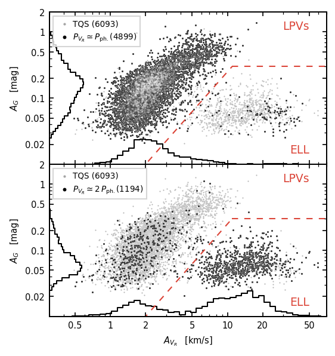
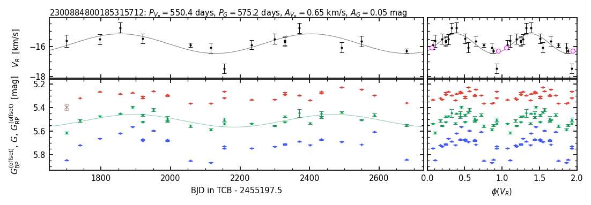
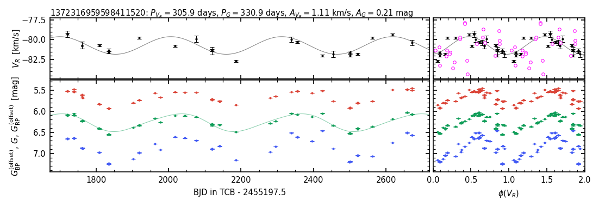
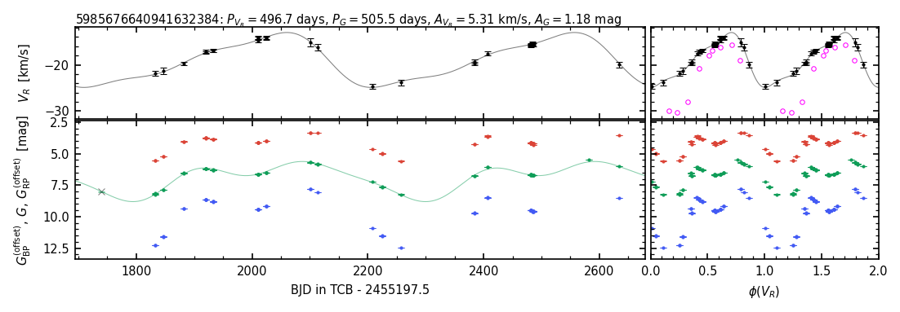
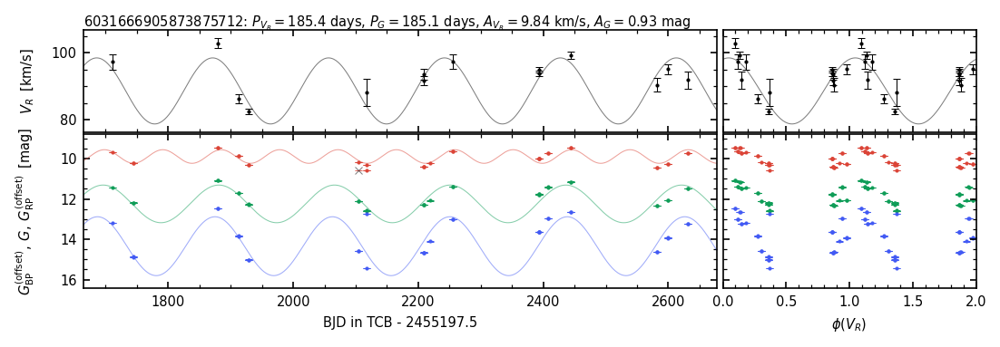

$\newcommand{\ensuremath}{}$
$\newcommand{\xspace}{}$
$\newcommand{\object}[1]{\texttt{#1}}$
$\newcommand{\farcs}{{.}''}$
$\newcommand{\farcm}{{.}'}$
$\newcommand{\arcsec}{''}$
$\newcommand{\arcmin}{'}$
$\newcommand{\ion}[2]{#1#2}$
$\newcommand{\textsc}[1]{\textrm{#1}}$
$\newcommand{\hl}[1]{\textrm{#1}}$
$\newcommand{\footnote}[1]{}$
$\newcommand{\STAB}[1]{\begin{tabular}{@ c@ }#1\end{tabular}}$
$\newcommand{\orcit}[1]{\protect\href{https://orcid.org/#1}{\protect\includegraphics[width=8pt]{orcid.png}}}$
$\newcommand{\Gaia}{\textit{Gaia}\xspace}$
$\newcommand{\rvflag}{\texttt{flag\_rv}\xspace}$
$\newcommand{\mags}{{\rm mag}}$
$\newcommand{\kms}{{\rm km s}^{-1}}$
$\newcommand{\days}{{\rm days}}$
$\newcommand{\Teff}{T_{\rm eff}}$
$\newcommand{\gbp}{G_{\rm BP}}$
$\newcommand{\grp}{G_{\rm RP}}$
$\newcommand{\grvs}{G_{\rm RVS}}$
$\newcommand{\rv}{V_R}$
$\newcommand{\meanrv}{\overline{\rv}}$
$\newcommand{\medianrv}{\langle\rv\rangle}$
$\newcommand{\zprv}{\rv^0}$
$\newcommand{\pubrv}{\rv^{\rm DR3}}$
$\newcommand{\erv}{\varepsilon_{\rv}}$
$\newcommand{\meanerv}{\overline{\varepsilon}_{\rv}}$
$\newcommand{\pg}{P_{G}}$
$\newcommand{\pbp}{P_{G_{\rm BP}}}$
$\newcommand{\prp}{P_{G_{\rm RP}}}$
$\newcommand{\prv}{P_{\rv}}$
$\newcommand{\pph}{P_{\rm ph}}$
$\newcommand{\durationrv}{\Delta t_{\rv}}$
$\newcommand{\ncycrv}{n_{\rv}^{\rm cyc}}$
$\newcommand{\ampg}{A_G}$
$\newcommand{\amprv}{A_{\rv}}$
$\newcommand{\nobsrv}{N_{\rv}}$
$\newcommand{\nobsrvraw}{N_{\rv}^{\rm raw}}$
$\newcommand{\noutrv}{N_{\rv}^{\rm out}}$
$\newcommand{\snrv}{{\rm SN}_{\rv}}$
$\newcommand{\wbprp}{W_{\scaleto{\rm BP,RP}{4.5pt}}}$
$\newcommand$

# $\Gaia$ Focused Product Release: Radial velocity time series of long-period variables

<mark>Appeared on: 2023-10-11</mark> -  _36 pages, 38 figures_

G. Collaboration, et al. -- incl., <mark>M. Smith</mark>, <mark>C. Bailer-Jones</mark>

**Abstract:** The third $\Gaia$ Data Release (DR3) provided photometric time series of more than 2 million long-period variable (LPV) candidates. Anticipating the publication of full radial-velocity data planned with Data Release 4, this Focused Product Release (FPR) provides radial-velocity time series for a selection of LPV candidates with high-quality observations. We describe the production and content of the $\Gaia$ catalog of LPV radial-velocity time series, and the methods used to compute the variability parameters published as part of the $\Gaia$ FPR. Starting from the DR3 catalog of LPV candidates, we applied several filters to construct a sample of sources with high-quality radial-velocity measurements. We modeled their radial-velocity and photometric time series to derive their periods and amplitudes, and further refined the sample by requiring compatibility between the radial-velocity period and at least one of the $G$ , $\gbp$ , or $\grp$ photometric periods. The catalog includes radial-velocity time series and variability parameters for 9 614 sources in the magnitude range $6\lesssim G/\mags\lesssim 14$ , including a flagged top-quality subsample of 6 093 stars whose radial-velocity periods are fully compatible with the values derived from the $G$ , $\gbp$ , and $\grp$ photometric time series.    The radial-velocity time series contain a mean of 24 measurements per source taken unevenly over a duration of about three years.    We identify the great majority of the sources (88 \% ) as genuine LPV candidates, with about half of them showing a pulsation period and the other half displaying a long secondary period. The remaining 12 \% of the catalog consists of candidate ellipsoidal binaries. Quality checks against radial velocities available in the literature show excellent agreement. We provide some illustrative examples and cautionary remarks. The publication of radial-velocity time series for almost ten thousand LPV candidates constitutes, by far, the largest such database available to date in the literature. The availability of simultaneous photometric measurements gives a unique added value to the $\Gaia$ catalog.

**Figure 9. -** Comparison between the semi-amplitudes $\ampg$, $\amprv$ of the best-fit models of the $G$-band and RV time series for the TQS (light gray symbols in the background). The darker symbols indicate sources whose RV period is consistent with the photometric periods in a 1:1 ratio (top panel) or in a 2:1 ratio (bottom panel). The dashed red line corresponds to Eq. \ref{eq:amp_condition_ell}, and the size of each sample is indicated in the legend. (*fig:drv_dg_2panels*)

**Figure 34. -** Similar to Fig. \ref{fig:RVTS_ex_mixPph}, but showing the $\Gaia$ time series for the sources compared with literature as discussed in Sect. \ref{sec:catalog_quality:comparison_with_rv_data_from_literature:multi_epoch_rv_data}(see also Table \ref{tab:table_cf_rvcurves}). The sources displayed from top to bottom are the SRb star $\object${AR Cep}\citep[compared with][]{alvarez_etal_2001}, the binary SRa star $\object${RS CrB}\citep[compared with][]{hinkle_etal_2002}, and the O-rich Mira $\object${R Nor}\citep[compared with][]{lebzelter_etal_2005a}. Literature RV time series are displayed as magenta circles (with arbitrary phase offset) in the panels showing the folded RV curve. In each case, the $\Gaia$ RV period (indicated in the header of each panel) is used for folding. (*fig:RVTS_cf_lit*)

**Figure 29. -** Example time series for a source with mixed consistency between the photometric and RV time series. This source has $\pg\simeq$\pbp$\simeq$\prv$$, while $\prp \simeq 0.5 $\prv$$. The panels in the top row show the RV data and model, while the photometric data and corresponding models are shown in the panels in the bottom row (in red, green, and blue for the $\grp$, $G$, and $\gbp$ bands, respectively). For visualization purposes, an arbitrary offset is applied to the $\grp$ and $\gbp$ time series. The $\Gaia$ DR3 source ID of this object is indicated in the title, together with the period and semi-amplitude of the best-fit $G$-band and RV time series models. The panels on the right show the four time series folded by the RV period. (*fig:RVTS_ex_mixPph*)

