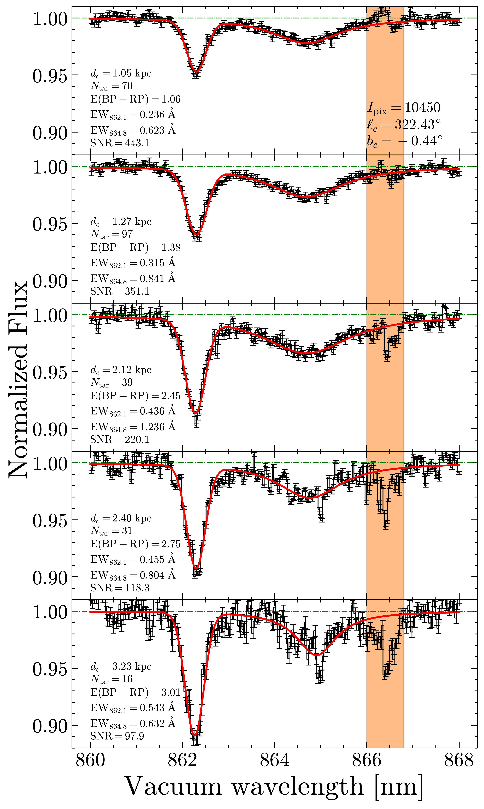
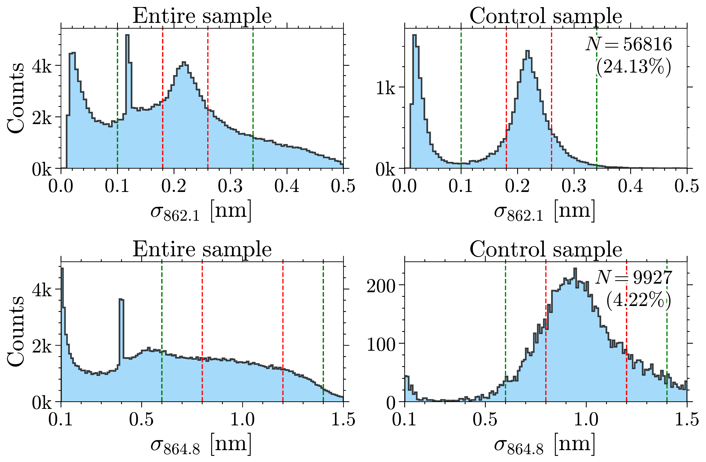

$\newcommand{\ensuremath}{}$
$\newcommand{\xspace}{}$
$\newcommand{\object}[1]{\texttt{#1}}$
$\newcommand{\farcs}{{.}''}$
$\newcommand{\farcm}{{.}'}$
$\newcommand{\arcsec}{''}$
$\newcommand{\arcmin}{'}$
$\newcommand{\ion}[2]{#1#2}$
$\newcommand{\textsc}[1]{\textrm{#1}}$
$\newcommand{\hl}[1]{\textrm{#1}}$
$\newcommand{\footnote}[1]{}$
$\newcommand{\gaia}{\textit{Gaia}\xspace}$
$\newcommand{\gdr}[1]{\textit{Gaia}~DR{#1}\xspace}$
$\newcommand{\dibspec}{DIB-Spec}$
$\newcommand{\gspspec}{GSP-Spec}$
$\newcommand{\gspphot}{GSP-Phot}$
$\newcommand{\orcit}[1]{\protect\href{https://orcid.org/#1}{\protect\includegraphics[width=8pt]{orcid.png}}}$
$\newcommand{\metaDgrad}{\partial \meta / \partial D}$
$\newcommand{\metaZgrad}{\partial \meta / \partial Z}$
$\newcommand{\teff}{T_{\rm eff}}$
$\newcommand{\logg}{\log{g}}$
$\newcommand{\feh}{\rm[Fe/H]}$
$\newcommand{\meta}{{\rm[M/H]}}$
$\newcommand{\afe}{{\rm[\alpha/Fe]}}$
$\newcommand{\vrad}{V_{\rm rad}}$
$\newcommand{\vraderr}{\sigma_{V_{\rm rad}}}$
$\newcommand{\um}{\rm \mu m}$
$\newcommand{\EBV}{E(B {-} V)}$
$\newcommand{\EBPRP}{\rm E(BP {-} RP)}$
$\newcommand{\dibdepth}{\mathcal{D}}$
$\newcommand{\diblambda}{\lambda_{\rm DIB}}$
$\newcommand{\dibwidth}{\sigma_{\rm DIB}}$
$\newcommand{\Tomaz}[1]{{\color{magenta} [Tomaz: #1] \color{black}}}$
$\newcommand{\Mathias}[1]{{\color{blue} [Mathias:#1]}}$
$\newcommand{\hzhao}[1]{{\color{red} [He: #1]}}$
$\newcommand$
$\newcommand{\kms}{ {\rm km s^{-1}}}$
$\newcommand{\d}{{\rm d}}$
$\newcommand{\}{kpc}$
$\newcommand{\rg}{r_{\rm g}}$
$\newcommand{\}{rp}$
$\newcommand{\}{ra}$
$\newcommand{\dex}{ {\rm dex}}$
$\newcommand{\Myr}{ {\rm Myr}}$
$\newcommand{\}{Gyr}$
$\newcommand{\}{url}$

# $\gaia$ Focused Product Release: Spatial distribution of two diffuse interstellar bands

<mark>Appeared on: 2023-10-11</mark> -  _29 pages, accepted for publication in A&A_

M. Schultheis, et al. -- incl., <mark>C. Bailer-Jones</mark>, <mark>M. Fouesneau</mark>

**Abstract:** Diffuse interstellar bands (DIBs) are absorption features seen in optical and infrared spectra of stars and extragalactic objectsthat are probably caused by large and complex molecules in the galactic interstellar medium (ISM). Here we investigate the Galacticdistribution and properties of two DIBs identified in almost six million stellar spectra collected by the $\gaia$ Radial VelocitySpectrometer. These measurements constitute a part of the $\gaia$ Focused Product Release to be made public between the $\gaia$ DR3 andDR4 data releases. In order to isolate the DIB signal from the stellar features in each individual spectrum, we identified a set of160 000 spectra at high Galactic latitudes ( $|b| {\geqslant} 65^{\circ}$ ) covering a range of stellar parameters which weconsider to be the DIB-free reference sample. Matching each target spectrum to its closest reference spectra in stellar parameter spaceallowed us to remove the stellar spectrum empirically, without reference to stellar models, leaving a set of six million ISM spectra.Using the star's parallax and sky coordinates, we then allocated each ISM spectrum to a voxel (VOlume piXEL) on a contiguousthree-dimensional grid with an angular size of $1.8^{\circ}$ (level 5 HEALPix) and 29 unequally sized distance bins. Identifying thetwo DIBs at 862.1 nm ( $\lambda$ 862.1) and 864.8 nm ( $\lambda$ 864.8) in the stacked spectra, we modelled their shapes and report thedepth, central wavelength, width, and equivalent width (EW) for each, along with confidence bounds on these measurements. We thenexplored the properties and distributions of these quantities and compared them with similar measurements from other surveys. Our mainresults are as follows: (1) the strength and spatial distribution of the DIB $\lambda$ 862.1 are very consistent with what was found in $\gaia$ DR3,but for this work we attained a higher signal-to-noise ratio in the stacked spectra to larger distances, which allowed us to trace DIBs in the outerspiral arm and beyond the Scutum--Centaurus spiral arm; (2) we produced an all-sky map below ${\pm}65^{\circ}$ of Galactic latitudeto $\sim$ 4000 pc of both DIB features and their correlations; (3) we detected the signals of DIB $\lambda$ 862.1 inside theLocal Bubble ( $\lesssim$ 200 pc); and (4) there is a reasonable correlation with the dust reddening found from stellar absorption and EWsof both DIBs with a correlation coefficient of 0.90 for $\lambda$ 862.1 and 0.77 for $\lambda$ 864.8.

**Figure 5. -** Examples of the fits to DIBs $\lambda$862.1 and $\lambda$864.8 in stacked ISM spectra in five voxels in the same
  direction, whose HEALPix number ($I_{\rm pix} {=} 10 450$) and GC $(\ell_c,b_c) {=} (322.43^{\circ},{-}0.44^{\circ})$
  are marked in the top panel. The black and red lines are the ISM spectra and fitted DIB profiles, respectively, normalized
  by the fitted linear continuum. The error bars indicate the flux uncertainties at each pixel. Orange indicates the region
  that was masked during the fittings. The central heliocentric distance ($d_c$), the number of target spectra ($N_{\rm tar}$),
  mean $\EBPRP$, EWs of two DIBs, and the S/N of the stacked ISM spectrum in each voxel are indicated as well. (*fig:stack-fit*)

**Figure 16. -** Corner plot of the DIB fitting in the voxel with $I_{\rm pix}=10450$ and $d_c=1.05$ kpc (the first panel in Fig.
  \ref{fig:stack-fit} from top to bottom). The histograms and scatter plots show the one- and two-dimensional projections of the
  posterior distributions of the fitted parameters. The red squares and lines indicate the best-fit estimates for each parameter
  in the reproduced fitting. And the dashed blue lines mark the fitted parameters in the output table of {$\dibspec$}. (*fig:corner0*)

**Figure 8. -** Distribution of $\dibwidth$ for DIBs $\lambda$862.1 and $\lambda$864.8 (top and bottom, respectively). The dashed red and
green lines correspond to the "best range" and the "secondary range" of $\dibwidth$ defined in Sect. \ref{subsect:qf} for the
DIB QF, respectively. The distribution of the full {$\dibspec$} results (235 428 voxels) is shown in the left panels, while the right
panels show a quality-controlled sample with $\rm S/N {>} 100$ and $\dibdepth{>} 3R_C$(see Sect. \ref{subsect:dib-width}).
The latter criterion implies QF values of 0 or 2. The number of detected DIBs and the percentage after the quality control
is indicated as well. (*fig:dib-width*)

