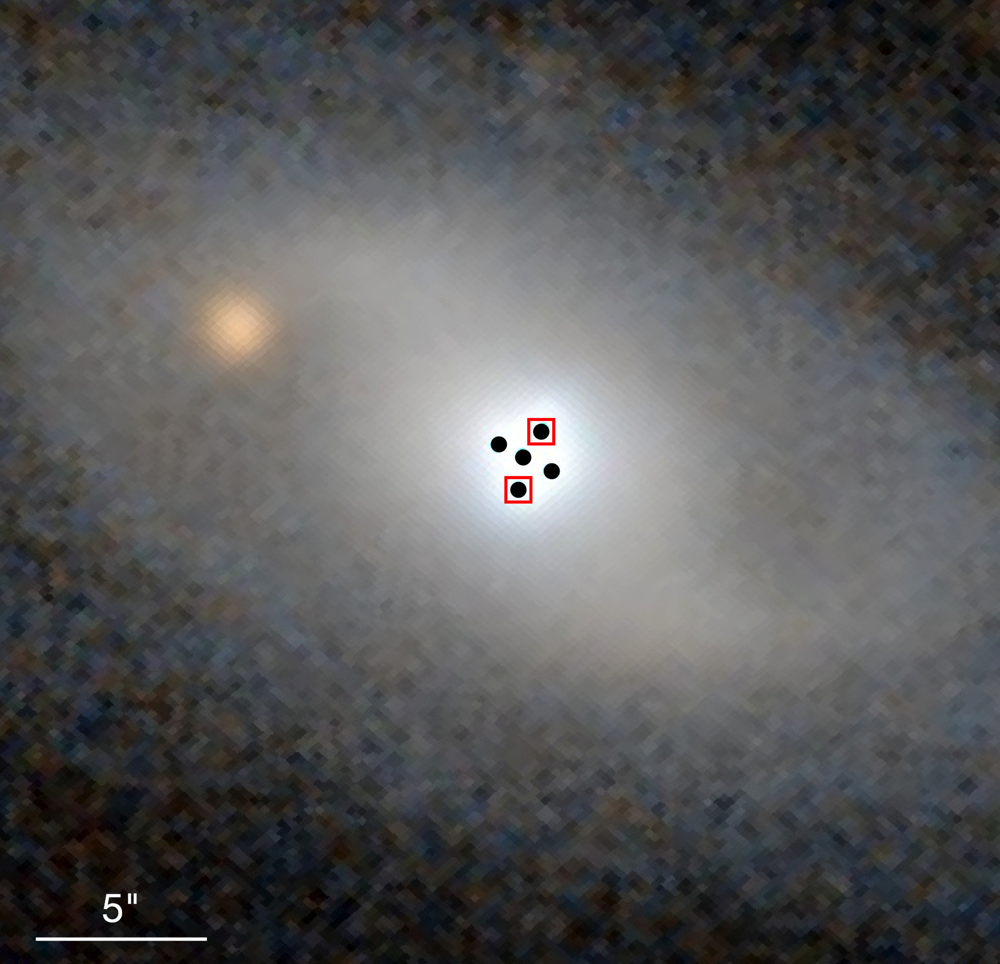
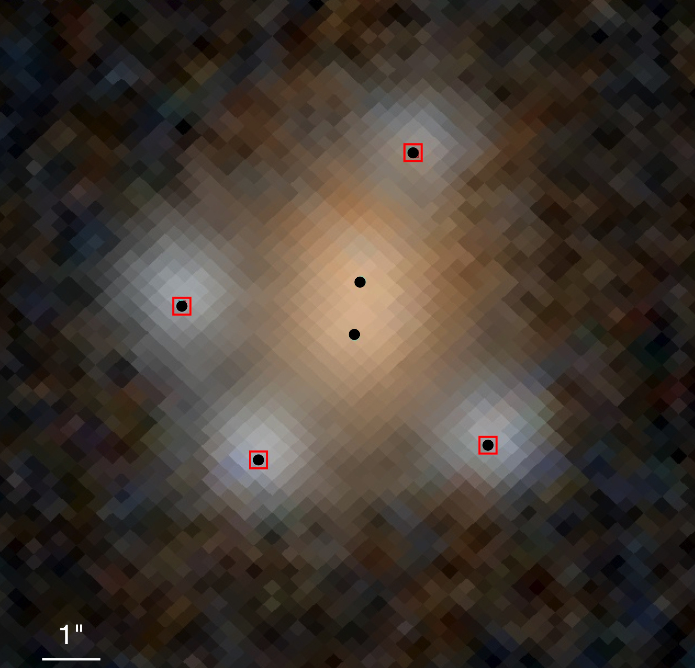
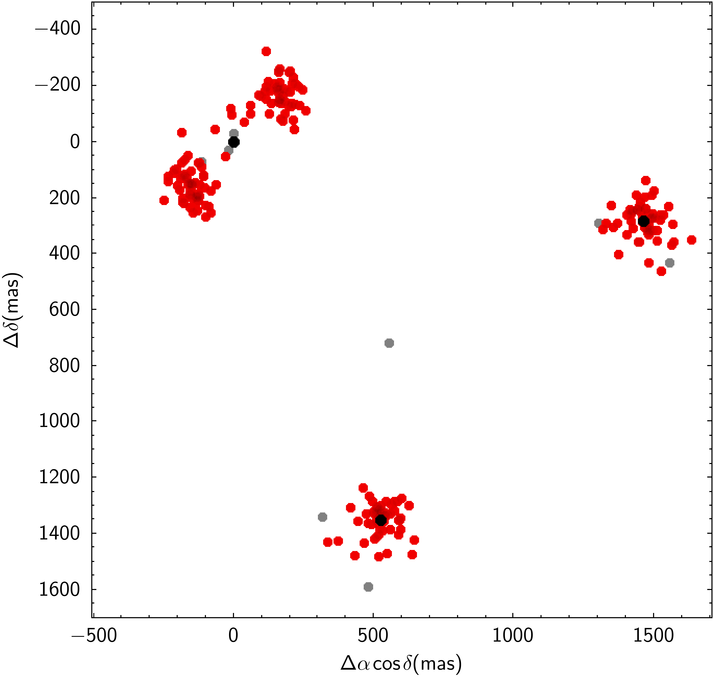
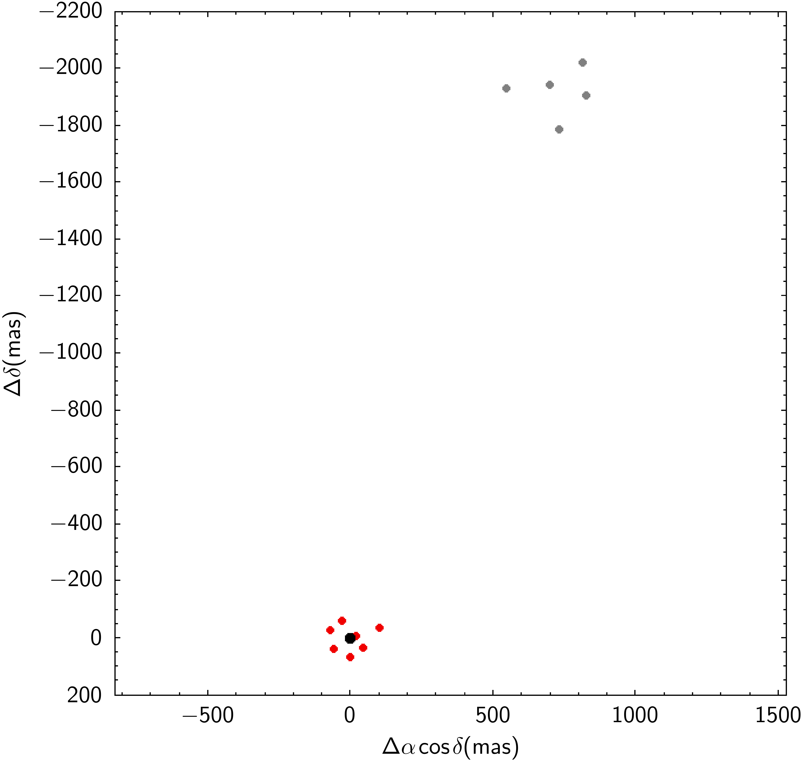
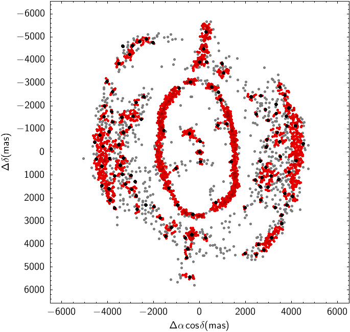
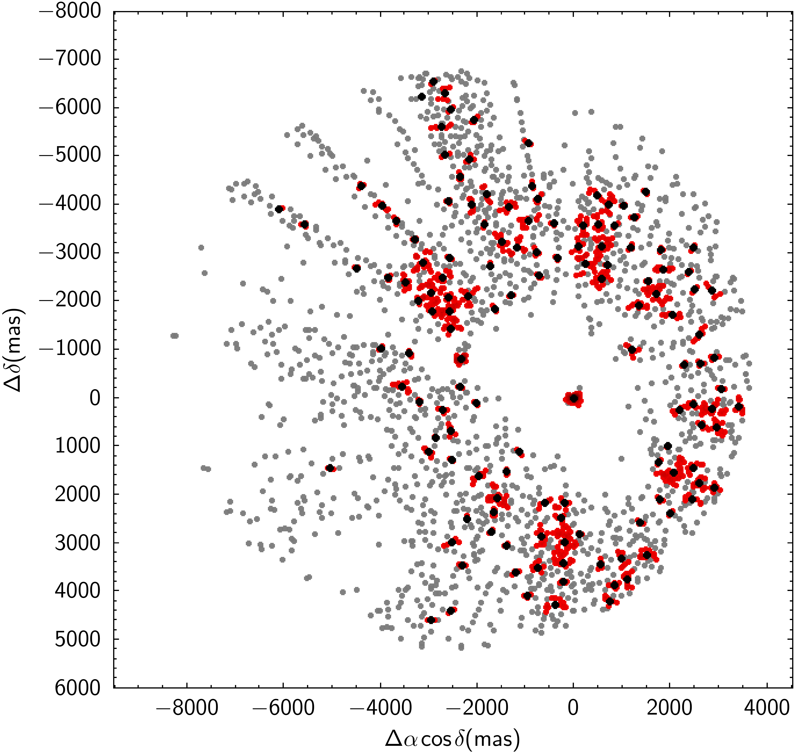
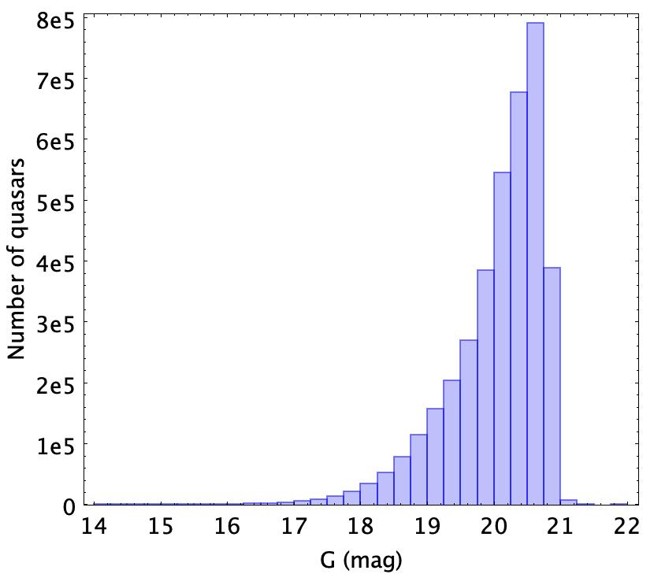
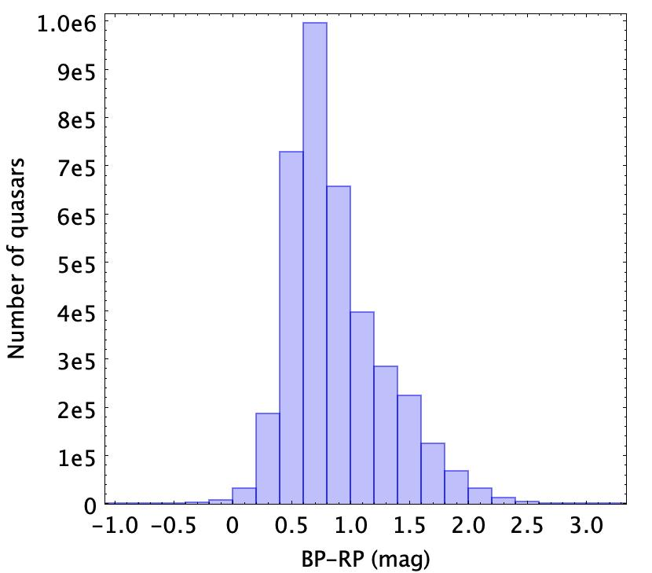
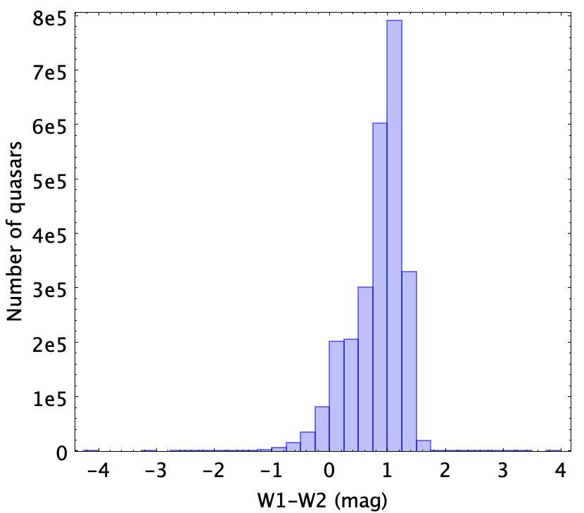
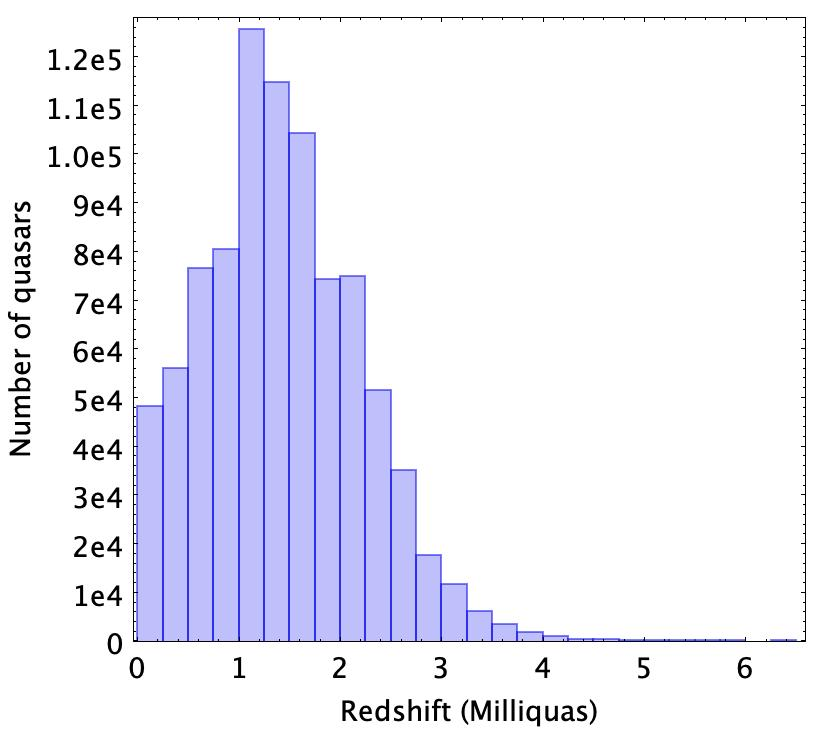

$\newcommand{\ensuremath}{}$
$\newcommand{\xspace}{}$
$\newcommand{\object}[1]{\texttt{#1}}$
$\newcommand{\farcs}{{.}''}$
$\newcommand{\farcm}{{.}'}$
$\newcommand{\arcsec}{''}$
$\newcommand{\arcmin}{'}$
$\newcommand{\ion}[2]{#1#2}$
$\newcommand{\textsc}[1]{\textrm{#1}}$
$\newcommand{\hl}[1]{\textrm{#1}}$
$\newcommand{\footnote}[1]{}$
$\newcommand{\ra}{\ensuremath{\alpha}}$
$\newcommand{\dec}{\ensuremath{\delta}}$
$\newcommand{\glon}{\ensuremath{l}}$
$\newcommand{\glat}{\ensuremath{b}}$
$\newcommand{\parallax}{\ensuremath{\varpi}}$
$\newcommand{\sigparallax}{\ensuremath{\sigma_{\varpi}}}$
$\newcommand{\pmra}{\ensuremath{\mu_{\ra\ast}}}$
$\newcommand{\pmdec}{\ensuremath{\mu_\dec}}$
$\newcommand{\propm}{\ensuremath{\mu}}$
$\newcommand{\ms}{\ensuremath{\textrm{m s}^{-1}}}$
$\newcommand{\kms}{\ensuremath{\textrm{km s}^{-1}}}$
$\newcommand{\mas}{\ensuremath{\textrm{mas}}}$
$\newcommand{\maspyr}{\ensuremath{\textrm{mas yr}^{-1}}}$
$\newcommand{\deg}{\ensuremath{^\circ}}$
$\newcommand{\gmag}{\ensuremath{G}~}$
$\newcommand{\gbp}{\ensuremath{G_{\rm BP}}}$
$\newcommand{\grp}{\ensuremath{G_{\rm RP}}}$
$\newcommand{\red}{\textcolor{red}}$
$\newcommand{\blue}{\textcolor{blue}}$
$\newcommand{\orange}{\textcolor{orange}}$
$\newcommand{\green}{\textcolor{OliveGreen}}$
$\newcommand{\brown}{\textcolor{brown}}$
$\newcommand$
$\newcommand$
$\newcommand{\sersic}{Sérsic\xspace}$
$\newcommand{\gaia}{\textit{Gaia}\xspace}$
$\newcommand{\matfont}[1]{\ensuremath{\boldsymbol{\mathsf{#1}}}}$
$\newcommand{\mat}[1]{\matfont{#1}}$
$\newcommand{\orcit}[1]{\protect\href{https://orcid.org/#1}{\protect\includegraphics[width=8pt]{orcid.png}}}$
$\newcommand$
$\newcommand{\deg}{\ensuremath{^\circ}}$

# $\gaia$ Focused Product Release: A catalogue of sources around quasars to search for strongly lensed quasars.

<mark>Appeared on: 2023-10-11</mark> -  _35 pages, 60 figures, accepted for publication by Astronomy and Astrophysics_

G. Collaboration, et al. -- incl., <mark>C. Bailer-Jones</mark>, <mark>M. Fouesneau</mark>

**Abstract:** Strongly lensed quasars are fundamental sources for cosmology. The $\gaia$ space mission covers the entire sky with the unprecedented resolution of $0.18$ " in the optical, making it an ideal instrument to search for gravitational lenses down to the limiting magnitude of 21. Nevertheless, the previous $\gaia$ Data Releases are known to be incomplete for small angular separations such as those expected for most lenses. We present the Data Processing and Analysis Consortium GravLens pipeline, which was built to analyse all $\gaia$ detections around quasars and to cluster them into sources, thus producing a catalogue of secondary sources around each quasar. We analysed the resulting catalogue to produce scores that indicate source configurations that are compatible with strongly lensed quasars. GravLens uses the DBSCAN unsupervised clustering algorithm to detect sources around quasars. The resulting catalogue of multiplets is then analysed with several methods to identify potential gravitational lenses. We developed and applied an outlier scoring method, a comparison between the average BP and RP spectra of the components, and we also used an extremely randomised tree algorithm. These methods produce scores to identify the most probable configurations and to establish a list of lens candidates. We analysed the environment of 3 760 032 quasars. A total of 4 760 920 sources, including the quasars, were found within 6 $\arcsec$ of the quasar positions. This list is given in the $\gaia$ archive. In 87 \% of cases, the quasar remains a single source, and in 501 385 cases neighbouring sources were detected. We propose a list of 381 lensed candidates, of which we identified 49 as the most promising. Beyond these candidates, the associate tables in this Focused Product Release allow the entire community to explore the unique $\gaia$ data for strong lensing studies further.

**Figure 11. -** Pan-STARRS images  ([Chambers, Magnier and Metcalfe 2016]())  of two known gravitational lenses with an indication of GravLens components in black (filled circles) and entry in \gdr3 in red (squares). Left: the Einstein cross (G2237+0305). Right: 2MASSJ13102005-1714579. The central sources in 2MASSJ13102005-1714579 encompasses two lensing galaxies recovered as  GravLens components. (*panstarrs*)

**Figure 9. -** Examples of known issues. Black dots are the mean positions of the components, red points correspond to individual observations no matter the component and  gray dots are outliers. In (d) a planetary nebula (IC 351) that unduly entered in the quasar catalogue is decomposed by the algorithm into numerous sources. as well as in (d) for the halo of a bright star. (*Fig:clusteringIssues*)

**Figure 8. -** Distributions of
(a): $\gaia$$G$ magnitudes (phot\_g\_mean\_mag) from the \gdr3 gaia\_source table, (b): $G_$\mat$hrm{BP}-G_$\mat$hrm{RP}$ colours (phot\_bp\_mean\_mag -- phot\_rp\_mean\_mag), (c): W1-W2  colours (from catWISE), (d): redshifts (from Milliquas) of the quasars and candidates from the input list. (*qso_G*)

