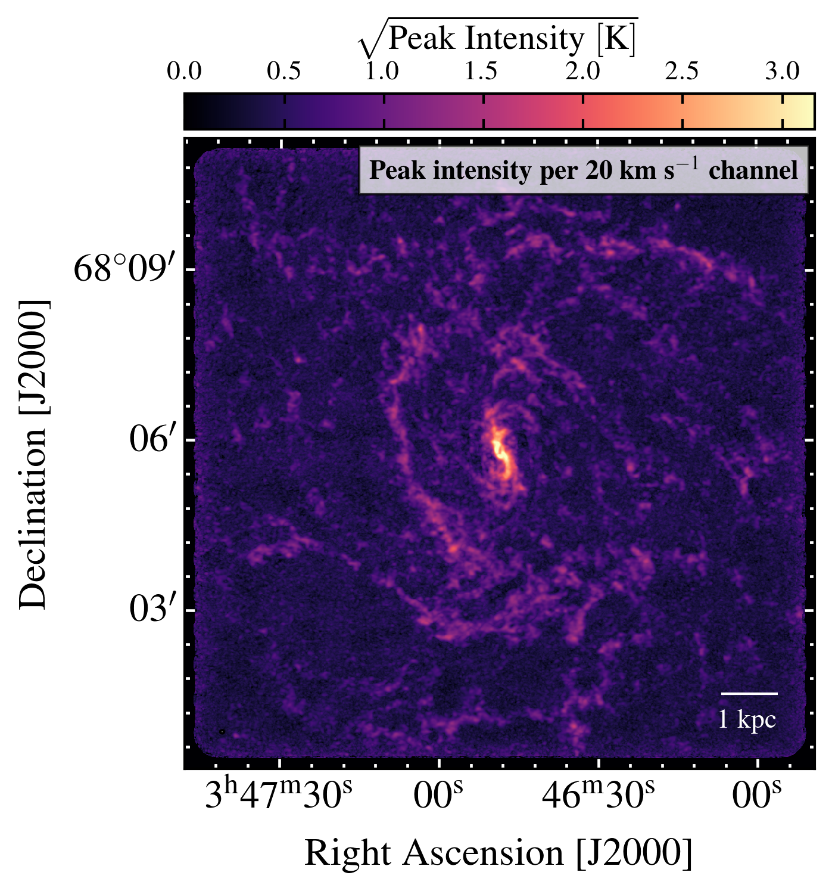
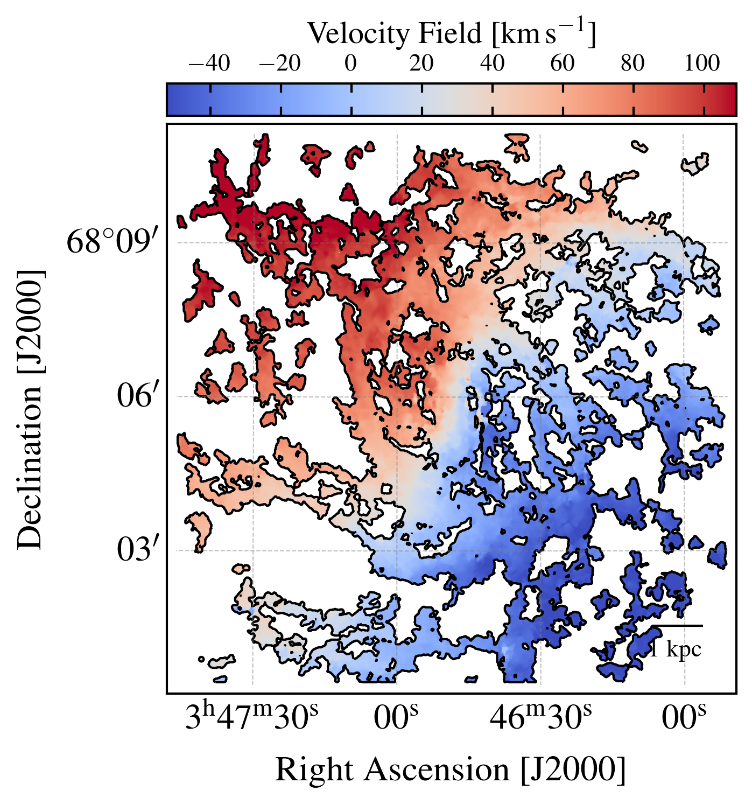
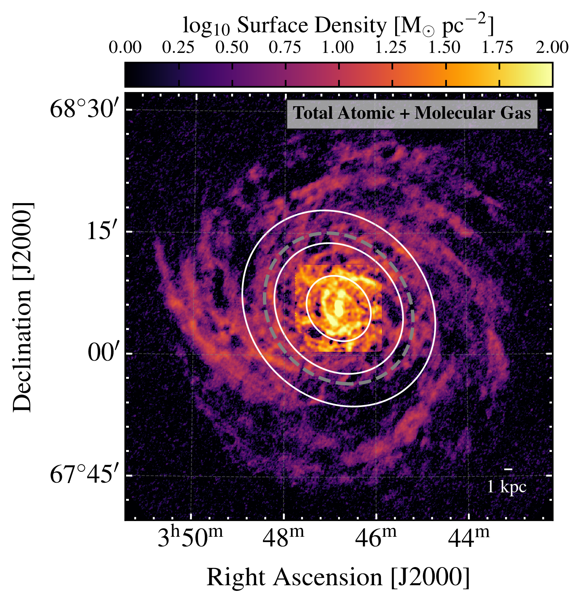
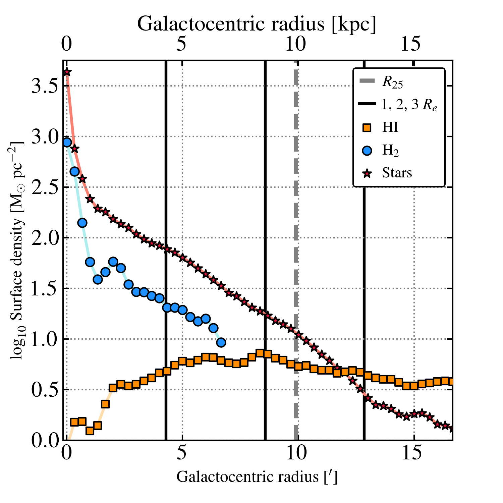
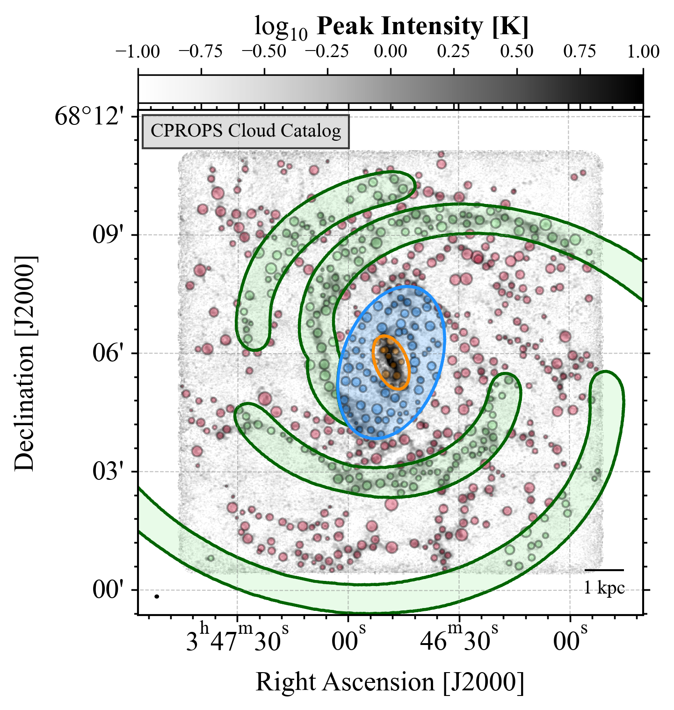
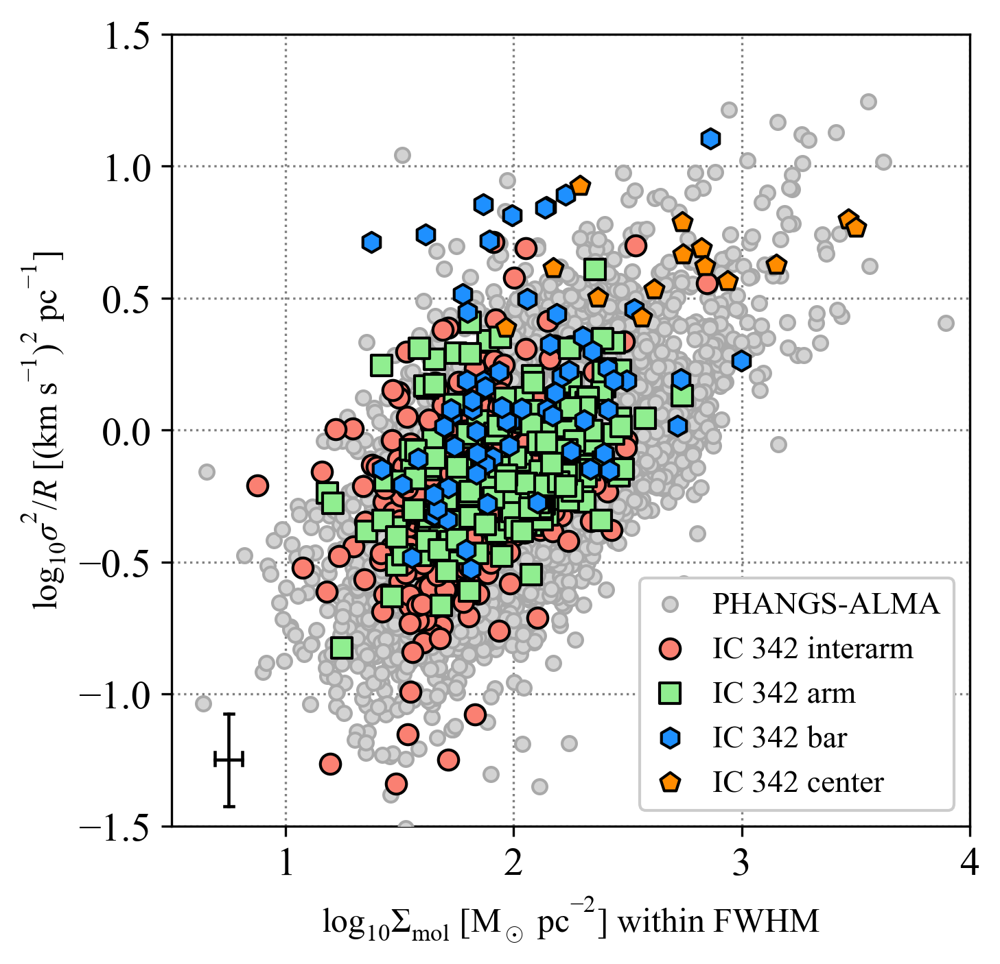
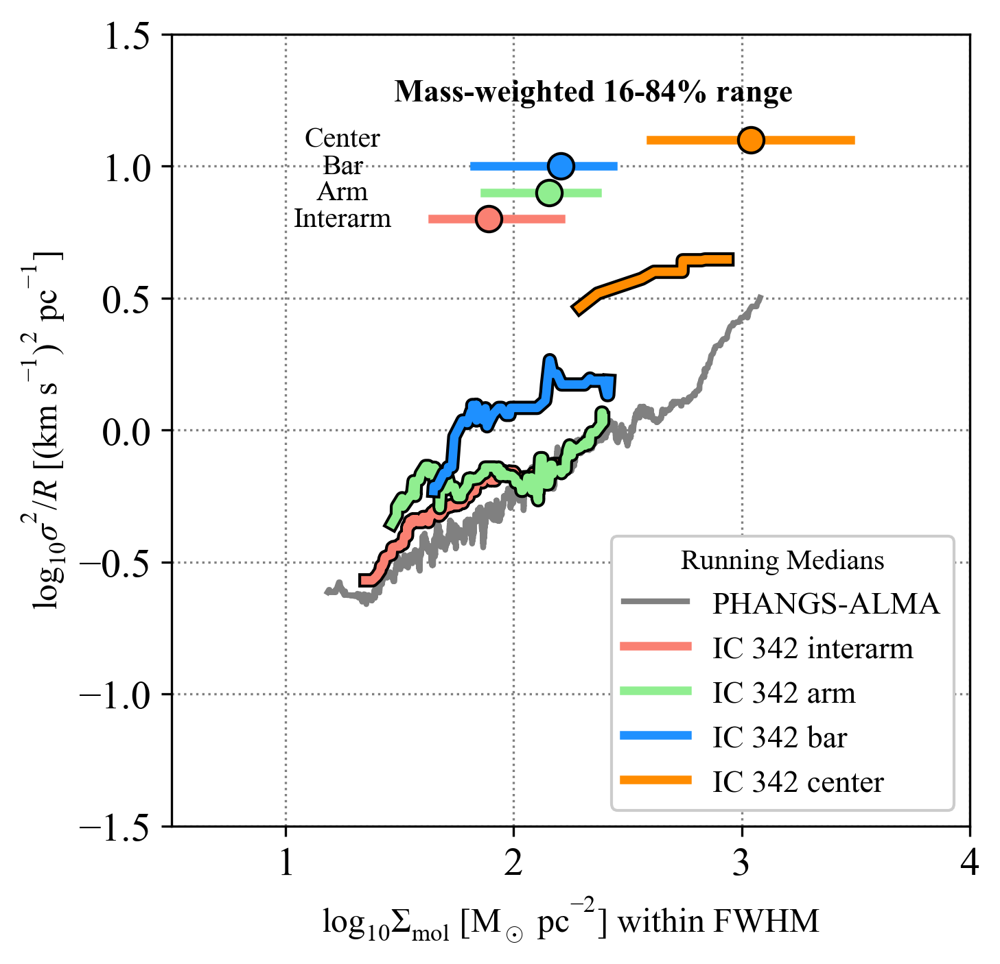
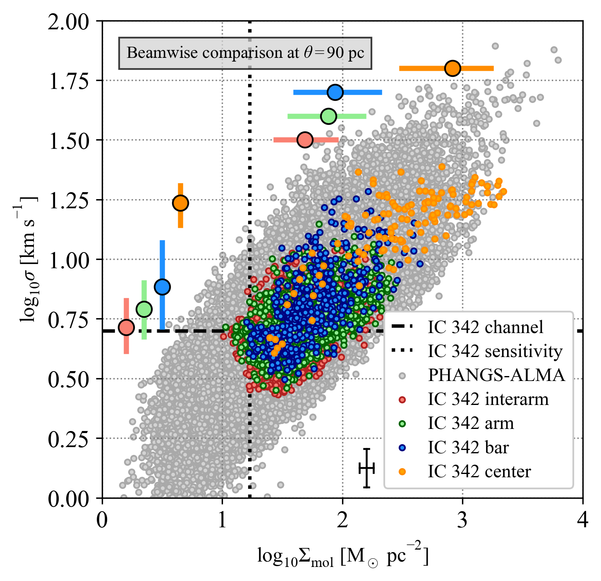
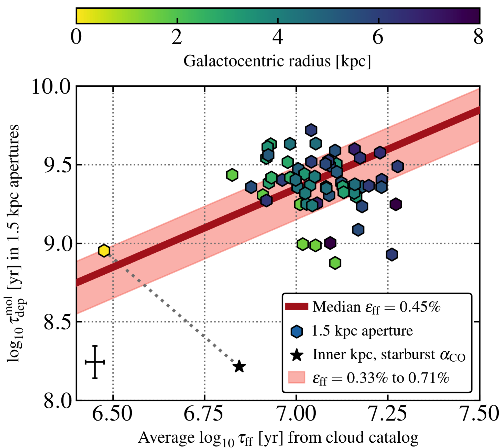

$\newcommand{\ensuremath}{}$
$\newcommand{\xspace}{}$
$\newcommand{\object}[1]{\texttt{#1}}$
$\newcommand{\farcs}{{.}''}$
$\newcommand{\farcm}{{.}'}$
$\newcommand{\arcsec}{''}$
$\newcommand{\arcmin}{'}$
$\newcommand{\ion}[2]{#1#2}$
$\newcommand{\textsc}[1]{\textrm{#1}}$
$\newcommand{\hl}[1]{\textrm{#1}}$
$\newcommand{\footnote}[1]{}$
$\newcommand{\emm}[1]{\ensuremath{#1}}$
$\newcommand{\emr}[1]{\emm{\mathrm{#1}}}$
$\newcommand{\unit}[1]{\emr{ #1}}$
$\newcommand{\kms}{\unit{km s^{-1}}}$
$\newcommand{\tint}[1][]{\emm{\Delta t_\emr{#1}}}$
$\newcommand{\beam}[1][]{\emm{\theta_\emr{#1}}}$
$\newcommand{\Msun}{\emm{M_\odot}}$
$\newcommand{\Msunperyr}{\emm{M_\odot \emr{yr^{-1}}}}$
$\newcommand{\Msunperyrperkpcsq}{\emm{M_\odot \emr{yr^{-1}} \emr{kpc^{-2}}}}$
$\newcommand{\MJypersr}{\emm{\emr{MJy} \emr{sr^{-1}}}}$
$\newcommand{\ngmc}{637}$
$\newcommand{\hi}{\ion{H}{I}}$
$\newcommand{\FigRGB}{$
$\begin{figure*}$
$\centering$
$\includegraphics[width=0.95\linewidth]{figures/ic0342_dss2_vla_noema_mayall_rgrid_small.png}$
$\caption{Molecular, atomic, and ionized gas in IC 342. This is a false-color composite of IC 342 showing molecular gas traced by our new NOEMA \chem{CO}{10} survey (green), along with stellar light from DSS2 (white), atomic gas traced by the 21 cm line using the VLA (blue), and H\alpha emission from ionized gas (red). \mod{The dashed rectangle delimits} the field of view observed with NOEMA and solid ellipses show galactocentric radii at 5, 10, 15, and 20 kpc.}$
$\label{fig:ic342:false-color}$
$\end{figure*}}$
$\newcommand{\FigData}{$
$\begin{figure*}$
$\centering$
$\includegraphics[width=0.475\textwidth]{figures/ic342_tpeak.png}$
$\includegraphics[width=0.475\textwidth]{figures/ic342_mom1.png} \\includegraphics[width=0.475\textwidth]{figures/ic342_wide_logtg.png}$
$\includegraphics[width=0.475\textwidth]{figures/ic0342_rprof.png}$
$\caption{{NOEMA survey of \chem{CO}{10} emission from IC 342.} The distribution of the \chem{CO}{10} peak intensity at the native angular resolution (\textit{top left}) and the intensity-weighted mean CO velocity at 90 pc resolution (\textit{top right}) as revealed by our new CO survey. The images show spiral arms, abundant inter-arm emission, and a velocity field that mostly reflects a regularly rotating gas disk. The \textit{bottom} panels show the molecular gas traced by CO in the context of atomic gas and stars. In these panels, the CO and \hi  data are shown at a common {\sim}350 pc resolution. The \textit{bottom left} panel shows a map of the total neutral gas surface density adding molecular gas surface density to atomic gas surface density from [Chiang, Sandstrom and Chastenet (2021)](). The white ellipses show 1, 2, 3 \times R_e and the gray dashed ellipse indicates 1 R_{25}. The \textit{lower right} panel shows the azimuthally averaged mass surface density profiles for atomic gas, molecular gas, and stellar mass estimated from the near-infrared. The stellar mass distribution using \textit{HST} imaging is consistent with a nuclear star cluster and an exponential disk  ([Carson, Barth and Seth 2015]()) , while the presented profile suffers from the resolution of the \textit{WISE} data.  Our NOEMA survey covers the inner molecule-dominated region where the \hi  emission is depressed, including the CO-bright center.$
$}$
$\label{fig:bigpicture}$
$\end{figure*}}$
$\newcommand{\FigGMCs}{$
$\begin{figure*}[t!]$
$\centering$
$\includegraphics[width=0.43\textwidth]{figures/MQ_ic342_clouds.png}$
$\includegraphics[width=0.43\textwidth]{figures/MQ_ic342_cprops.png} \\includegraphics[width=0.43\textwidth]{figures/MQ_ic342_cprops_binned.png}$
$\includegraphics[width=0.43\textwidth]{figures/MQ_ic342_beamwise.png}$
$\caption{{Giant molecular clouds or associations in IC 342.} The top left panel shows the location of the molecular clouds that we catalog at 90 pc resolution. The size of each circle corresponds to the deconvolved radius and the color indicates which dynamical environment the cloud is assigned to (red shows interarm clouds, green arm cloud, and blue center clouds). The top right and bottom left panels show the cloud properties in \sigma^2/R vs. \Sigma_{\rm mol} space, in which clouds with a fixed virial parameter follow a diagonal line with a slope of unity in log--log space. \mod{\Sigma_{\rm mol} is the average surface density within the FWHM size of each cloud, \Sigma_{\rm mol} = M_{\rm CO} / (2\pi R^2).} We show the IC 342 clouds for each environment and clouds at the same resolution and sensitivity, but better velocity resolution, from PHANGS--ALMA \citep[][and A. Hughes et al. in preparation]{ROSOLOWSKY21}. The bottom left panel replaces individual clouds with running medians. The bottom right panel adopts a beam-wise approach in which each independent line of sight at a fixed 90 pc resolution supplies a measurement of line width and surface density  ([Sun, Leroy and Schruba 2018](), [Sun, Leroy and Schinnerer 2020]()) . Again we compare the IC 342 points to those from a large sample of PHANGS--ALMA galaxies and here we mark the channel width and approximate sensitivity limit for the IC 342 data with dashed lines \mod{(for a Gaussian CO line, \mathrm{FWHM}=2.35 \sigma, so we always have more than one channel across the FWHM of the emission line)}. The bottom row also indicates the mass-weighted median \mod{(position of the color circles)} and 16{-}84\% range \mod{(span of the color horizontal or vertical line)} for surface densities and line widths. \mod{These refer to the corresponding horizontal or vertical axis, with an arbitrary positioning along the perpendicular direction.} The \textit{mass-weighted} averages tend to lie at higher values than the bulk of the individual measurements because much of the molecular gas mass resides in a few high-mass clouds or associations. All panels tell a consistent story: arm clouds show mildly enhanced surface density and line width compared to inter-arm clouds, and the center shows significant enhancements in surface density and line width. The elevated line widths in the center indicate high virial parameters suggesting clouds with additional contributions to their line widths. The deviations from self-gravity virialization would be even more extreme if we adopted a CO-to-H_2 conversion factor below the Galactic value used to construct these plots. \mod{The black crosses in the right panels show representative error bars for our measurements in IC 342, as explained in the main text.}}$
$\label{fig:clouds}$
$\end{figure*}}$
$\newcommand{\FigSFE}{$
$\begin{figure}$
$\centering$
$\includegraphics[width=0.475\textwidth]{figures/MQ_ic342_t_dep_vs_t_eff.png}$
$\caption{{Star formation efficiency per gravitational free-fall time in 1.5 kpc regions.} Each hexagonal point shows the integrated molecular gas depletion time for a 1.5 kpc diameter region as a function of the mass-weighted average \tau_{\rm ff} (see Eq.~\ref{eq:tau_ff}) for 90 pc resolution clouds in that region. A straight, diagonal line in this space, such as the dark red one, corresponds to a fixed \epsilon_{\rm ff}, which could be expected if density variations represent the primary drivers of depletion time variations. We color the regions by galactocentric radius and calculate the implied \epsilon_{\rm ff} for each region. We estimate a median \epsilon_{\rm ff} of 0.45\% with a 16{-}84\% range of 0.33{-}0.71\%, and we illustrate these with the solid red line and shaded pink region. For the central 1.5 kpc region, we illustrate the effect of switching from our adopted Galactic \alpha_{\rm CO} to a starburst conversion factor. \mod{The black cross shows a representative error bar as explained in the main text. The plotted values can be found in Table~\ref{table:hexagons}.}}$
$\label{fig:eff}$
$\end{figure}}$
$\newcommand{\FigZoom}{$
$\begin{figure*}$
$\centering$
$\includegraphics[width=0.95\linewidth]{figures/deprojected-zoom-2}$
$\caption{Zooms of the molecular surface density, peak temperature, and line width towards the galaxy center. The images have been deprojected from the galaxy inclination on the plane of sky, and then converted to kpc using a distance of 3.45 Mpc. \mod{The yellow lines show our spiral mask, while the red and white ellipses delimit the extent of the bar and center environment, respectively (see Appendix~\ref{app:environment} for the newcommandinition of these environment)}.}$
$\label{fig:zoom}$
$\end{figure*}}$
$\newcommand{\FigNIR}{$
$\begin{figure}$
$\centering$
$\includegraphics[width=\linewidth]{figures/irac.png}$
$\caption{\mod{\textit{Spitzer} IRAC 3.6 \mum image showing the newcommandinition of our adopted environments. The inset on the bottom-right highlights the center with a different color stretch.}$
$}$
$\label{fig:NIR}$
$\end{figure}}$
$\newcommand{\OSU}{\label{OSU} Department of Astronomy, The Ohio State University, 140 West 18th Avenue, Columbus, Ohio 43210, USA}$
$\newcommand{\Alberta}{\label{Alberta} Department of Physics, University of Alberta, Edmonton, AB T6G 2E1, Canada}$
$\newcommand{\ANU}{\label{ANU} Research School of Astronomy and Astrophysics, Australian National University, Canberra, ACT 2611, Australia}$
$\newcommand{\IPAC}{\label{IPAC} Caltech-IPAC, 1200 E. California Blvd. Pasadena, CA 91125, USA}$
$\newcommand{\Carnegie}{\label{Carnegi} Observatories of the Carnegie Institution for Science, 813 Santa Barbara Street, Pasadena, CA 91101, USA}$
$\newcommand{ÇAPP}{\label{CCAPP} Center for Cosmology and Astroparticle Physics, 191 West Woodruff Avenue, Columbus, OH 43210, USA}$
$\newcommand{\CfA}{\label{CfA} Harvard-Smithsonian Center for Astrophysics, 60 Garden Street, Cambridge, MA 02138, USA}$
$\newcommand{\CITEVA}{\label{CITEVA} Centro de Astronomía (CITEVA), Universidad de Antofagasta, Avenida Angamos 601, Antofagasta, Chile}$
$\newcommand{\CNRS}{\label{CNRS} CNRS, IRAP, 9 Av. du Colonel Roche, BP 44346, F-31028 Toulouse cedex 4, France}$
$\newcommand{\ESO}{\label{ESO} European Southern Observatory, Karl-Schwarzschild Stra{\ss}e 2, D-85748 Garching bei München, Germany}$
$\newcommand{\Heidelberg}{\label{Heidelberg} Astronomisches Rechen-Institut, Zentrum für Astronomie der Universität Heidelberg, Mönchhofstra\ss e 12-14, D-69120 Heidelberg, Germany}$
$\newcommand{\COOL}{\label{COOL} Cosmic Origins Of Life (COOL) Research DAO, coolresearch.io}$
$\newcommand{\ICRAR}{\label{ICRAR} International Centre for Radio Astronomy Research, University of Western Australia, 35 Stirling Highway, Crawley, WA 6009, Australia}$
$\newcommand{\IRAM}{\label{IRAM} Institut de Radioastronomie Millimétrique (IRAM), 300 Rue de la Piscine, F-38406 Saint Martin d'Hères, France}$
$\newcommand{\ITA}{\label{ITA} Universität Heidelberg, Zentrum für Astronomie, Institut für Theoretische Astrophysik, Albert-Ueberle-Str 2, D-69120 Heidelberg, Germany}$
$\newcommand{\IWR}{\label{IWR} Universität Heidelberg, Interdisziplinäres Zentrum für Wissenschaftliches Rechnen, Im Neuenheimer Feld 205, D-69120 Heidelberg, Germany}$
$\newcommand{\JHU}{\label{JHU} Department of Physics and Astronomy, The Johns Hopkins University, Baltimore, MD 21218, USA}$
$\newcommand{\Leiden}{\label{Leiden} Leiden Observatory, Leiden University, P.O. Box 9513, 2300 RA Leiden, The Netherlands}$
$\newcommand{\Maryland}{\label{Maryland} Department of Astronomy, University of Maryland, College Park, MD 20742, USA}$
$\newcommand{\MPE}{\label{MPE} Max-Planck-Institut für extraterrestrische Physik, Giessenbachstra{\ss}e 1, D-85748 Garching, Germany}$
$\newcommand{\MPIA}{\label{MPIA} Max-Planck-Institut für Astronomie, Königstuhl 17, D-69117, Heidelberg, Germany}$
$\newcommand{\Nagoya}{\label{Nagoya} Department of Physics, Nagoya University, Furo-cho, Chikusa-ku, Nagoya, Aichi 464-8602, Japan}$
$\newcommand{\NRAO}{\label{NRAO} National Radio Astronomy Observatory, 520 Edgemont Road, Charlottesville, VA 22903-2475, USA}$
$\newcommand{\OAN}{\label{OAN} Observatorio Astronómico Nacional (IGN), C/Alfonso XII, 3, E-28014 Madrid, Spain}$
$\newcommand{\ObsParis}{\label{ObsParis} Sorbonne Université, Observatoire de Paris, Université PSL, CNRS, LERMA, F-75014, Paris, France}$
$\newcommand{\Princeton}{\label{Princeton} Department of Astrophysical Sciences, Princeton University, Princeton, NJ 08544 USA}$
$\newcommand{\UToledo}{\label{UToledo} University of Toledo, 2801 W. Bancroft St., Mail Stop 111, Toledo, OH, 43606}$
$\newcommand{\Toulouse}{\label{Toulouse} Université de Toulouse, UPS-OMP, IRAP, F-31028 Toulouse cedex 4, France}$
$\newcommand{\UBonn}{\label{UBonn} Argelander-Institut für Astronomie, Universität Bonn, Auf dem Hügel 71, 53121 Bonn, Germany}$
$\newcommand{\UChile}{\label{UChile} Departamento de Astronomía, Universidad de Chile, Camino del Observatorio 1515, Las Condes, Santiago, Chile}$
$\newcommand{\UConn}{\label{UConn} Department of Physics, University of Connecticut, Storrs, CT, 06269, USA}$
$\newcommand{\UCSD}{\label{UCSD} Center for Astrophysics and Space Sciences, Department of Physics,  University of California, San Diego, 9500 Gilman Drive, La Jolla, CA 92093, USA}$
$\newcommand{\UCSDAA}{\label{UCSDAA} Department of Astronomy \& Astrophysics,  University of California, San Diego, 9500 Gilman Drive, La Jolla, CA 92093, USA}$
$\newcommand{\UGent}{\label{UGent} Sterrenkundig Observatorium, Universiteit Gent, Krijgslaan 281 S9, B-9000 Gent, Belgium}$
$\newcommand{\ULyon}{\label{ULyon} Univ Lyon, Univ Lyon 1, ENS de Lyon, CNRS, Centre de Recherche Astrophysique de Lyon UMR5574,\F-69230 Saint-Genis-Laval, France}$
$\newcommand{\UMass}{\label{UMass} University of Massachusetts—Amherst, 710 N. Pleasant Street, Amherst, MA 01003, USA}$
$\newcommand{\UWyoming}{\label{UWyoming} Department of Physics and Astronomy, University of Wyoming, Laramie, WY 82071, USA}$
$\newcommand{\LAM}{\label{LAM} Aix Marseille Univ, CNRS, CNES, LAM (Laboratoire d’Astrophysique de Marseille), Marseille, France}$
$\newcommand{\UHawaii}{\label{UHawaii} Institute for Astronomy, University of Hawaii, 2680 Woodlawn Drive, Honolulu, HI 96822, USA}$
$\newcommand{\UCM}{\label{UCM} Departamento de Física de la Tierra y Astrofísica, Universidad Complutense de Madrid, E-28040, Spain}$
$\newcommand{\IPARC}{\label{IPARC} Instituto de Física de Partículas y del Cosmos IPARCOS, Facultad de Ciencias Físicas, Universidad Complutense de Madrid, E-28040, Spain}$
$\newcommand{\STScI}{\label{STScI} Space Telescope Science Institute, 3700 San Martin Drive, Baltimore, MD 21218, USA}$
$\newcommand{\McMaster}{\label{McMaster} Department of Physics and Astronomy, McMaster University, 1280 Main Street West, Hamilton, ON L8S 4M1, Canada}$
$\newcommand{\INAF}{\label{INAF} INAF -- Osservatorio Astrofisico di Arcetri, Largo E. Fermi 5, I-50157, Firenze, Italy}$
$\newcommand{\Sydney}{\label{Sydney} Sydney Institute for Astronomy, School of Physics A28, The University of Sydney, NSW 2006, Australia}$
$\newcommand{\UA}{\label{UA} Centro de Astronomía (CITEVA), Universidad de Antofagasta, Avenida Angamos 601, Antofagasta, Chile}$
$\newcommand{\CITA}{\label{CITA} Canadian Institute for Theoretical Astrophysics (CITA), University of Toronto, 60 St George St, Toronto, ON M5S 3H8, Canada}$
$\newcommand{\ASIAA}{\label{ASIAA} Institute of Astronomy and Astrophysics, Academia Sinica, No. 1, Sec. 4, Roosevelt Road, Taipei 10617, Taiwan}$
$\newcommand{\TKU}{\label{TKU} Department of Physics, Tamkang University, No.151, Yingzhuan Rd., Tamsui Dist., New Taipei City 251301, Taiwan}$
$\newcommand{\PSMA}{\label{PSMA} Penn State Mont Alto, 1 Campus Drive, Mont Alto, PA  17237, USA}$
$\newcommand{\ILL}{\label{ILL} Institut Laue-Langevin, 71 avenue des Martyrs, F-38042 Grenoble, France}$
$\newcommand{\TUM}{\label{TUM} Technical University of Munich, School of Engineering and Design, Department of Aerospace and Geodesy, Chair of Remote Sensing Technology, Arcisstr. 21, 80333 Munich, Germany}$
$\newcommand{\}{mod}$

# A sensitive, high-resolution, wide-field IRAM NOEMA CO(1-0) survey of the very nearby spiral galaxy IC 342

<mark>Appeared on: 2023-10-11</mark> -  _16 pages, 6 figures, accepted for publication in A&A_

M. Querejeta, et al. -- incl., <mark>E. Schinnerer</mark>, <mark>A. Hughes</mark>, <mark>K. Kreckel</mark>, <mark>N. Neumayer</mark>

**Abstract:** We present a new wide-field $10.75\times10.75$ arcmin $^2$ ( $\approx 11\times11$ kpc $^2$ ), high-resolution ( $\mod{$\theta = 3.6\arcsec \approx 60$ pc}$ ) NOEMA $\chem{CO}{10}$ survey of the very nearby ( $d=3.45$ Mpc) spiral galaxy IC 342. The survey spans out to about $1.5$ effective radii and covers most of the region where molecular gas dominates the cold interstellar medium. We resolved the CO emission into ${>}600$ individual giant molecular clouds and associations. We assessed their properties and found that overall the clouds show approximate virial balance, with typical virial parameters of $\alpha_{\rm vir} = 1{-}2$ . The typical surface density and line width of molecular gas increase from the inter-arm region to the arm $\mod{and bar}$ region, and they reach their highest values in the inner $\mod{kiloparsec}$ of the galaxy ${(median $\Sigma_{\rm mol} \approx 80, 140, 160$, and $1100 M_\odot$ pc$^{-2}$, $\sigma_{\rm CO} \approx 6.6$, $7.6$, $9.7$, and $18.4$ km s$^{-1}$ for inter-arm, arm, bar, and center clouds, respectively)}$ . Clouds in the central part of the galaxy show an enhanced line width relative to their surface densities and evidence of additional sources of dynamical broadening. All of these results agree well with studies of clouds in more distant galaxies at a similar physical resolution. Leveraging our measurements to estimate the density and gravitational free-fall time at $90$ pc resolution, ${averaged on 1.5 kpc hexagonal apertures,}$ we estimate a typical star formation efficiency per free-fall time of $0.45\%$ with a $16{-}84$ \% variation of $0.33{-}0.71\%$ ${among such $1.5$ kpc regions.}$ $\mod{We speculate that bar-driven gas inflow could explain the large gas concentration in the central kiloparsec and the buildup of the massive nuclear star cluster.}$ This wide-area CO map of the closest face-on massive spiral galaxy demonstrates the current mapping power of NOEMA and has many potential applications. The data and products are publicly available.

**Figure 4. -** {NOEMA survey of \chem{CO}{10} emission from IC 342.} The distribution of the \chem{CO}{10} peak intensity at the native angular resolution (_top left_) and the intensity-weighted mean CO velocity at $90$ pc resolution (_top right_) as revealed by our new CO survey. The images show spiral arms, abundant inter-arm emission, and a velocity field that mostly reflects a regularly rotating gas disk. The _bottom_ panels show the molecular gas traced by CO in the context of atomic gas and stars. In these panels, the CO and $\hi$  data are shown at a common ${\sim}350$ pc resolution. The _bottom left_ panel shows a map of the total neutral gas surface density adding molecular gas surface density to atomic gas surface density from [Chiang, Sandstrom and Chastenet (2021)](). The white ellipses show $1, 2, 3 \times R_e$ and the gray dashed ellipse indicates $1 R_{25}$. The _lower right_ panel shows the azimuthally averaged mass surface density profiles for atomic gas, molecular gas, and stellar mass estimated from the near-infrared. The stellar mass distribution using _HST_ imaging is consistent with a nuclear star cluster and an exponential disk  ([Carson, Barth and Seth 2015]()) , while the presented profile suffers from the resolution of the _WISE_ data.  Our NOEMA survey covers the inner molecule-dominated region where the $\hi$  emission is depressed, including the CO-bright center.
 (*fig:bigpicture*)

**Figure 5. -** {Giant molecular clouds or associations in IC 342.} The top left panel shows the location of the molecular clouds that we catalog at $90$ pc resolution. The size of each circle corresponds to the deconvolved radius and the color indicates which dynamical environment the cloud is assigned to (red shows interarm clouds, green arm cloud, and blue center clouds). The top right and bottom left panels show the cloud properties in $\sigma^2/R$ vs. $\Sigma_{\rm mol}$ space, in which clouds with a fixed virial parameter follow a diagonal line with a slope of unity in log--log space. \mod{$\Sigma_{\rm mol}$ is the average surface density within the FWHM size of each cloud, $\Sigma_{\rm mol} = M_{\rm CO} / (2\pi R^2)$.} We show the IC 342 clouds for each environment and clouds at the same resolution and sensitivity, but better velocity resolution, from PHANGS--ALMA \citep[][and A. Hughes et al. in preparation]{ROSOLOWSKY21}. The bottom left panel replaces individual clouds with running medians. The bottom right panel adopts a beam-wise approach in which each independent line of sight at a fixed $90$ pc resolution supplies a measurement of line width and surface density  ([Sun, Leroy and Schruba 2018](), [Sun, Leroy and Schinnerer 2020]()) . Again we compare the IC 342 points to those from a large sample of PHANGS--ALMA galaxies and here we mark the channel width and approximate sensitivity limit for the IC 342 data with dashed lines \mod{(for a Gaussian CO line, $\mathrm{FWHM}=2.35 \sigma$, so we always have more than one channel across the FWHM of the emission line)}. The bottom row also indicates the mass-weighted median \mod{(position of the color circles)} and $16{-}84$\% range \mod{(span of the color horizontal or vertical line)} for surface densities and line widths. \mod{These refer to the corresponding horizontal or vertical axis, with an arbitrary positioning along the perpendicular direction.} The _mass-weighted_ averages tend to lie at higher values than the bulk of the individual measurements because much of the molecular gas mass resides in a few high-mass clouds or associations. All panels tell a consistent story: arm clouds show mildly enhanced surface density and line width compared to inter-arm clouds, and the center shows significant enhancements in surface density and line width. The elevated line widths in the center indicate high virial parameters suggesting clouds with additional contributions to their line widths. The deviations from self-gravity virialization would be even more extreme if we adopted a CO-to-$H_2$ conversion factor below the Galactic value used to construct these plots. \mod{The black crosses in the right panels show representative error bars for our measurements in IC 342, as explained in the main text.} (*fig:clouds*)

**Figure 1. -** {Star formation efficiency per gravitational free-fall time in $1.5$ kpc regions.} Each hexagonal point shows the integrated molecular gas depletion time for a $1.5$ kpc diameter region as a function of the mass-weighted average $\tau_{\rm ff}$(see Eq. \ref{eq:tau_ff}) for $90$ pc resolution clouds in that region. A straight, diagonal line in this space, such as the dark red one, corresponds to a fixed $\epsilon_{\rm ff}$, which could be expected if density variations represent the primary drivers of depletion time variations. We color the regions by galactocentric radius and calculate the implied $\epsilon_{\rm ff}$ for each region. We estimate a median $\epsilon_{\rm ff}$ of $0.45\%$ with a $16{-}84$\% range of $0.33{-}0.71\%$, and we illustrate these with the solid red line and shaded pink region. For the central $1.5$ kpc region, we illustrate the effect of switching from our adopted Galactic $\alpha_{\rm CO}$ to a starburst conversion factor. \mod{The black cross shows a representative error bar as explained in the main text. The plotted values can be found in Table \ref{table:hexagons}.} (*fig:eff*)

