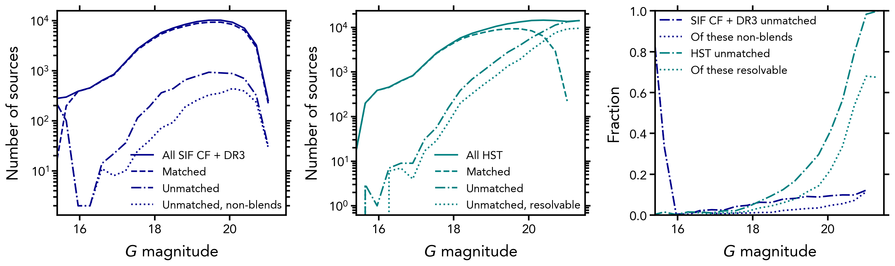
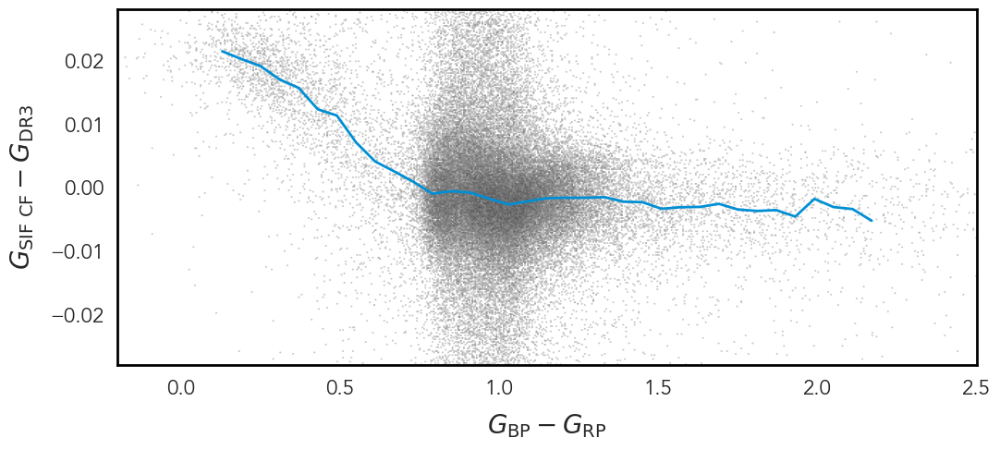
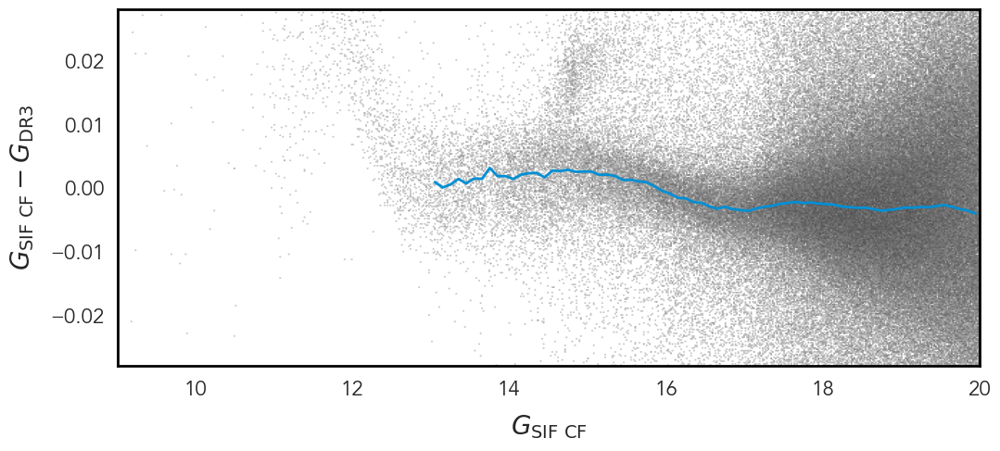
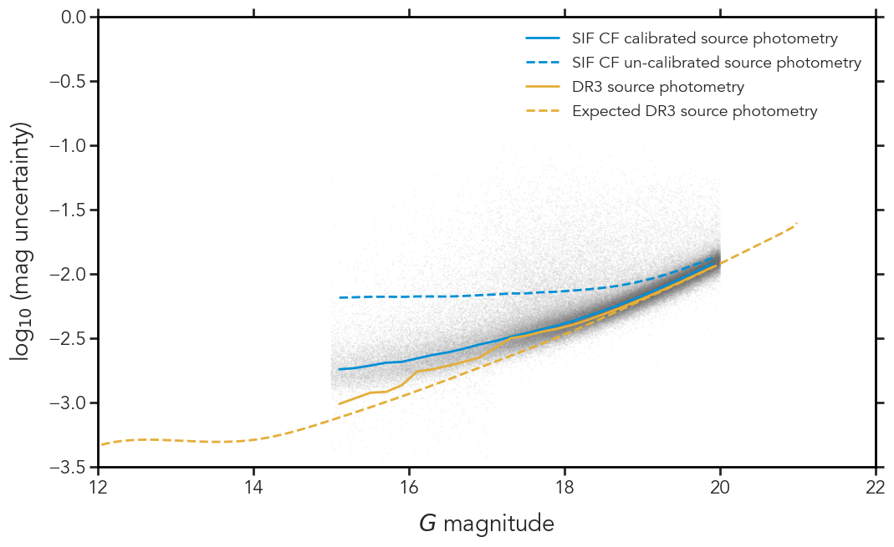

$\newcommand{\ensuremath}{}$
$\newcommand{\xspace}{}$
$\newcommand{\object}[1]{\texttt{#1}}$
$\newcommand{\farcs}{{.}''}$
$\newcommand{\farcm}{{.}'}$
$\newcommand{\arcsec}{''}$
$\newcommand{\arcmin}{'}$
$\newcommand{\ion}[2]{#1#2}$
$\newcommand{\textsc}[1]{\textrm{#1}}$
$\newcommand{\hl}[1]{\textrm{#1}}$
$\newcommand{\footnote}[1]{}$
$\newcommand{\linktodm}{https://gea.esac.esa.int/archive/documentation/GDR3/Gaia_archive/chap_datamodel}$
$\newcommand{\linktoparam}[2]{\href{\linktodm/sec_dm_main_source_catalogue/ssec_dm_#1.html\##1-#2}{ \texttt{\small#2}\xspace}}$
$\newcommand{\linktotable}[1]{\href{\linktodm/sec_dm_main_source_catalogue/ssec_dm_#1.html}{ \texttt{\small#1}\xspace}}$
$\newcommand{\linktodmfpr}{https://gea.esac.esa.int/archive/documentation/FPR/chap_datamodel}$
$\newcommand{\linktoparamfpr}[2]{\href{\linktodmfpr/sec_dm_focused_product_release/ssec_dm_#1.html\##1-#2}{ \texttt{\small#2}\xspace}}$
$\newcommand{\linktotablefpr}[1]{\href{\linktodmfpr/sec_dm_focused_product_release/ssec_dm_#1.html}{\texttt{ \small#1}\xspace}}$
$\newcommand{\orcit}[1]{\protect\href{https://orcid.org/#1}{\protect\includegraphics[width=8pt]{orcid.png}}}$
$\newcommand$

# $_ Gaia_$ Focused Product Release:\\Sources from Service Interface Function image analysis

<mark>Appeared on: 2023-10-11</mark> - 

G. Collaboration, et al. -- incl., <mark>C. Bailer-Jones</mark>, <mark>M. Fouesneau</mark>

**Abstract:** $_ Gaia_$ 's readout window strategy is challenged by very dense fields in the sky. Therefore, in addition to standard $_ Gaia_$ observations, full Sky Mapper (SM) images were recorded for nine selected regions in the sky. A new software pipeline exploits these Service Interface Function (SIF) images of crowded fields (CFs),  making use of the availability of the full two-dimensional (2D) information. This new pipeline produced half a million additional $_ Gaia_$ sources in the region of the omega Centauri ( $\omega$ Cen) cluster, which are published with this Focused Product Release. We discuss the dedicated SIF CF data reduction pipeline, validate its data products, and introduce their $_ Gaia_$ archive table. Our aim is to improve the completeness of the $_ Gaia_$ source inventory in a very dense region in the sky, $\omega$ Cen. An adapted version of $_ Gaia_$ 's Source Detection and Image Parameter Determination software located sources in the 2D SIF CF images. These source detections were clustered and assigned to new SIF CF or existing $_ Gaia_$ sources by $_ Gaia_$ 's cross-match software. For the new sources, astrometry was calculated using the Astrometric Global Iterative Solution software, and photometry was obtained in the $_ Gaia_$ DR3 reference system. We validated the results by comparing them to the public $_ Gaia_$ DR3 catalogue and external Hubble Space Telescope data. With this Focused Product Release, 526 587 new sources have been added to the $_ Gaia_$ catalogue in $\omega$ Cen. Apart from positions and brightnesses, the additional catalogue contains parallaxes and proper motions, but no meaningful colour information. While SIF CF source parameters generally have a lower precision than nominal $_ Gaia_$ sources, in the cluster centre they increase the depth of the combined catalogue by three magnitudes and improve the source density by a factor of ten. This first SIF CF data publication already adds great value to the $_ Gaia_$ catalogue. It demonstrates what to expect for the fourth $_ Gaia_$ catalogue, which will contain additional sources for all nine SIF CF regions.

**Figure 17. -** Comparison of SIF CF data extended with _ Gaia_ DR3 and HST data. Left: Distribution of the combined _ Gaia_ SIF CF and _ Gaia_ DR3 sources (solid dark blue) versus _ Gaia_ G magnitude; of these, sources matched (dashed) and not matched (dash-dotted) to HST; of the latter, not blended  sources (dotted).
        Centre: Distribution of all HST sources (solid teal) versus _ Gaia_ G magnitude; HST sources matched (dashed) and not matched (dash-dotted) to SIF CF sources; Unmatched HST sources potentially resolvable by SIF CF (dotted).
        Right: Fraction of combined SIF CF and _ Gaia_ DR3 sources not matched to HST (dash-dotted dark blue); of these, not HST blends (dotted dark blue); fraction of HST sources not matched to SIF CF (dash-dotted teal); fraction of resolvable, unmatched HST sources (dotted teal) versus (estimated) G magnitude (*fig:bellini*)

**Figure 2. -** Colour and magnitude terms between the SIF CF calibrated magnitudes and the reference magnitudes from _ Gaia_ DR3. The magnitude terms have been corrected for in this FPR. (*fig:phot_colmagterms*)

**Figure 5. -** Median G magnitude uncertainty versus G magnitude. G magnitude uncertainty for all calibrators with data density in grey, see the legend and text for a description of the various overlaid curves. (*fig:phot_calibrators*)

