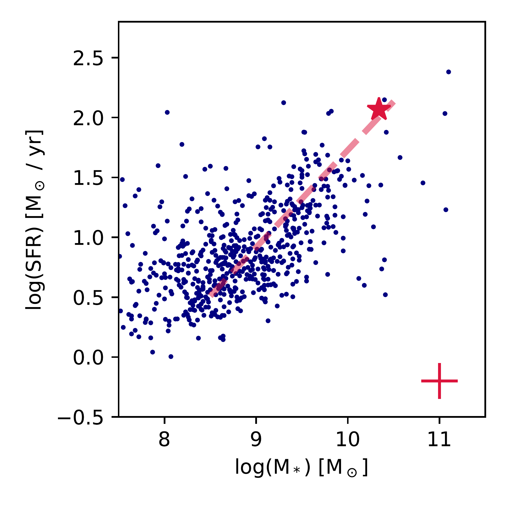
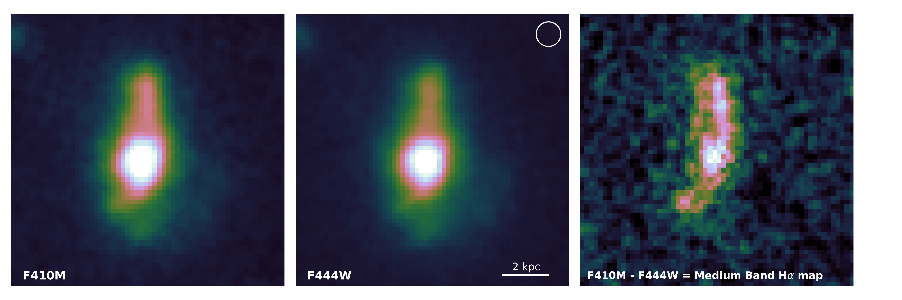
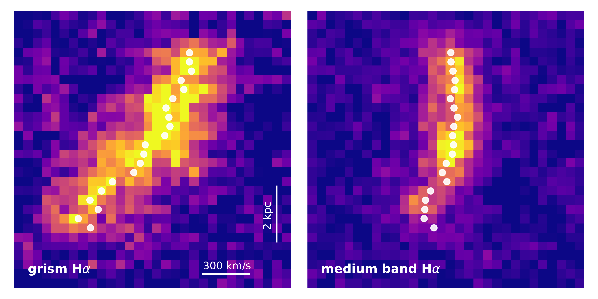
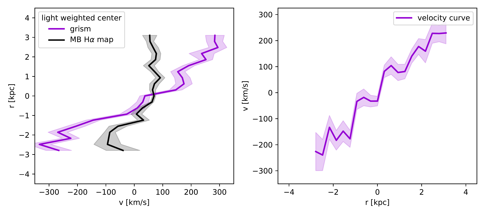

$\newcommand{\ensuremath}{}$
$\newcommand{\xspace}{}$
$\newcommand{\object}[1]{\texttt{#1}}$
$\newcommand{\farcs}{{.}''}$
$\newcommand{\farcm}{{.}'}$
$\newcommand{\arcsec}{''}$
$\newcommand{\arcmin}{'}$
$\newcommand{\ion}[2]{#1#2}$
$\newcommand{\textsc}[1]{\textrm{#1}}$
$\newcommand{\hl}[1]{\textrm{#1}}$
$\newcommand{\footnote}[1]{}$
$\newcommand{\vdag}{(v)^\dagger}$
$\newcommand$
$\newcommand$
$\newcommand{\ha}{H\alpha\xspace}$
$\newcommand{\mstar}{M_*\xspace}$
$\newcommand{\msun}{M_\odot\xspace}$
$\newcommand{\twister}{Twister-z5}$

# FRESCO: An extended, massive, rapidly rotating galaxy at $z=5.3$

<mark>Appeared on: 2023-10-12</mark> -  _Fig. 3 shows the main result_

E. Nelson, et al. -- incl., <mark>A. d. Graaff</mark>

**Abstract:** With the remarkable sensitivity and resolution of JWST in the infrared, measuring rest-optical kinematics of galaxies at $z>5$ has become possible for the first time. This study pilots a new method for measuring galaxy dynamics for highly multiplexed, unbiased samples by combining FRESCO NIRCam grism spectroscopy and JADES medium-band imaging. Here we present one of the first JWST kinematic measurements for a galaxy at $z>5$ . We find a significant velocity gradient, which, if interpreted as rotation yields $V_{rot} = 240\pm50$ km/s and we hence refer to this galaxy as Twister-z5. With a rest-frame optical effective radius of $r_e=2.25$ kpc, the high rotation velocity in this galaxy is not due to a compact size as may be expected in the early universe but rather a high total mass, ${\rm log(M}_{dyn}/{\rm M}_\odot)=11.0\pm0.2$ . This is a factor of roughly 4 $\times$ higher than the stellar mass within $r_e$ . We also observe that the radial H $\alpha$ equivalent width profile and the specific star formation rate map from resolved stellar population modeling is centrally depressed by a factor of $\sim1.5$ from the center to $r_e$ . Combined with the morphology of the line-emitting gas in comparison to the continuum, this centrally suppressed star formation is consistent with a star-forming disk surrounding a bulge growing inside-out. While large, rapidly rotating disks are common to $z\sim2$ , the existence of one after only 1Gyr of cosmic time, shown for the first time in ionized gas, adds to the growing evidence that some galaxies matured earlier than expected in the history of the universe.

**Figure 3. -** Star-forming main sequence for galaxies with grism spectroscopic redshifts $4.5<z<6$ in FRESCO with detected $\ha$. Star formation rates are computed from the measured $\ha$ fluxes corrected for dust attenuation using empirical relations based on the UV slope \citep{shivaei:20}. A fit to the SFMS from \cite{speagle:14} is indicated by the red line for context. The typical measurement error is indicated by the cross in the lower right corner. $\twister$, the galaxy featured in the present study, is at the very massive end of this distribution on the upper end of a continuation of the locus of points. (*fig:sfms*)

**Figure 6. -** We infer the spatial distribution of $\ha$(right) from the difference between the F444W broadband filter (center) and F410M medium band filter (left) which covers the $\ha$ emission line at this redshift. The circle in the middle panel shows the size (FWHM) of the PSF. (*fig:mbha*)

**Figure 7. -** Velocity gradient.  As  described  in \S\ref{kinematics}, we fit the light weighted center along the x-axis in the grism image, which corresponds to the dispersion direction (left), F444W direct image (center), and a stack of the rest-frame UV emission (right).
    The grism has a spectral resolution of $R\sim1600$, meaning that the grism spectrum contains both spatial and spectral information across in the dispersion direction. The difference between the grism and direct image centroids is the velocity in that spatial pixel. The error bars on the velocity curve are given by the difference between using the rest-UV emission and F444W direct image. (*fig:kinmodel*)

