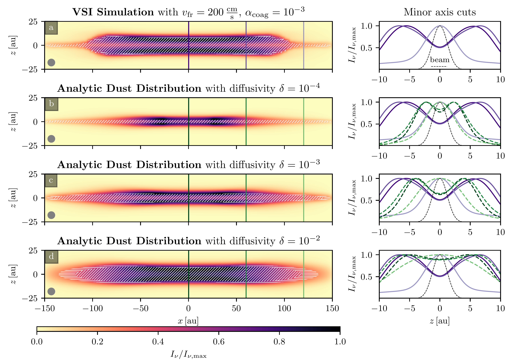
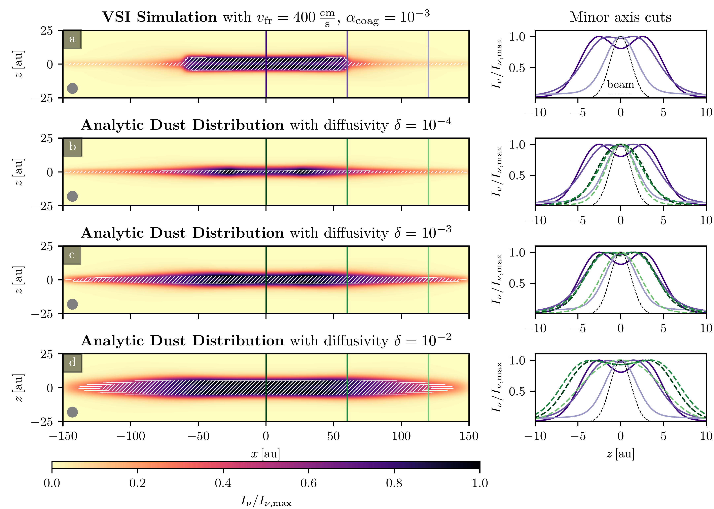
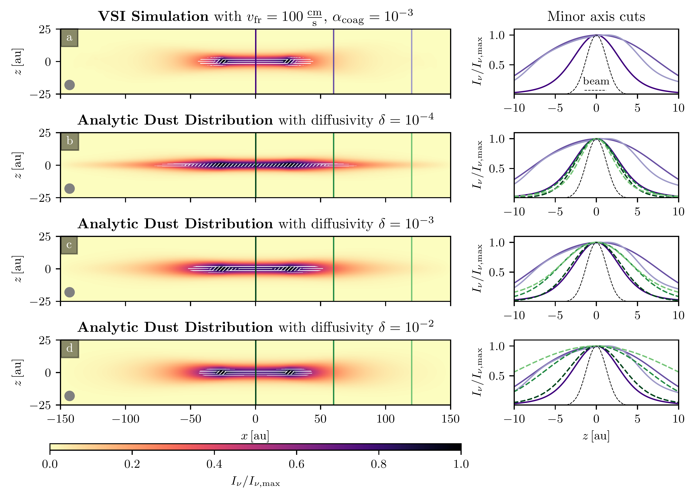

$\newcommand{\ensuremath}{}$
$\newcommand{\xspace}{}$
$\newcommand{\object}[1]{\texttt{#1}}$
$\newcommand{\farcs}{{.}''}$
$\newcommand{\farcm}{{.}'}$
$\newcommand{\arcsec}{''}$
$\newcommand{\arcmin}{'}$
$\newcommand{\ion}[2]{#1#2}$
$\newcommand{\textsc}[1]{\textrm{#1}}$
$\newcommand{\hl}[1]{\textrm{#1}}$
$\newcommand{\footnote}[1]{}$
$\newcommand{\expnum}[1]{\num[scientific-notation=true, exponent-product=\times, round-mode=places, round-precision=2]{#1}}$
$\newcommand{\rev}[1]{{#1}}$
$\newcommand{\hubert}[1]{{#1}}$
$\newcommand{\report}[1]{{{#1}}}$
$\newcommand{\reporttwo}[1]{{{#1}}}$
$\newcommand{\rhog}{\rho_{\mathrm{g}}}$
$\newcommand{\rhod}{\rho_{\mathrm{d}}}$
$\newcommand{\vg}{\vec{v}_{\mathrm{g}}}$
$\newcommand{\vd}{\vec{v}_{\mathrm{d}}}$
$\newcommand{\amax}{a_{\mathrm{max}}}$
$\newcommand{\amin}{a_{\mathrm{min}}}$
$\newcommand{\aint}{a_{\mathrm{int}}}$
$\newcommand{\adr}{a_{\mathrm{dr}}}$
$\newcommand{\vdr}{v_{\mathrm{dr}}}$
$\newcommand{\tfr}{t_\mathrm{fric}}$
$\newcommand{\St}{\mathrm{St}}$
$\newcommand{\Rey}{\mathfrak{Re}}$
$\newcommand{\OmK}{\Omega_\mathrm{K}}$
$\newcommand{\der}[2]{\frac{\partial{#1}}{\partial{#2}}}$
$\newcommand{\hd}{h_{\mathrm{d}}}$
$\newcommand{\Mp}{m_{\mathrm{p}}}$
$\newcommand{\Sd}{\Sigma_{\mathrm{d}}}$
$\newcommand{\planck}{\kappa_{\mathrm{P}}}$
$\newcommand{\dpy}{{\normalfont\texttt{DustPy}}}$
$\newcommand{\pluto}{{\normalfont\texttt{PLUTO}}}$
$\newcommand{\radmc}{{\normalfont\texttt{RADMC-3D}}}$
$\newcommand{\tpop}{{\normalfont\texttt{2pop}}}$
$\newcommand{\noref}{{\textbf{\color{red}!!!}}}$
$\newcommand{\equationautorefname}{Equation}$
$\newcommand{\figureautorefname}{Figure}$
$\newcommand{\subsectionautorefname}{Section}$
$\newcommand{\sectionautorefname}{Section}$
$\newcommand{\tableautorefname}{Table}$

# Dust Coagulation Reconciles Protoplanetary Disk Observations with the Vertical Shear Instability $\$$\footnotesize$ Part I: Dust Coagulation and the VSI Dead Zone

<mark>Appeared on: 2023-10-12</mark> -  _27 pages, 15 figures, Accepted for publication in The Astrophysical Journal_

<mark>T. Pfeil</mark>, T. Birnstiel, <mark>H. Klahr</mark>

**Abstract:** Protoplanetary disks exhibit a vertical gradient in angular momentum, rendering them susceptible to the Vertical Shear Instability (VSI). The most important condition for the onset of this mechanism is a short timescale of thermal relaxation ( $\lesssim 0.1$ orbital timescales). Simulations of fully VSI active disks are characterized by turbulent, vertically extended dust layers. This is in contradiction with recent observations of the outer regions of some protoplanetary disks, which appear highly settled.In this work, we demonstrate that the process of dust coagulation can diminish the cooling rate of the gas in the outer disk and extinct the VSI activity.Our findings indicate that the turbulence strength is especially susceptible to variations in the fragmentation velocity of the grains.A small fragmentation velocity of $\report{$\approx$}$ $\SI{100}{\centi \meter \per \second}$ results in a fully turbulent simulation, whereas a value of $\report{$\approx$}$ $\SI{400}{\centi \meter \per \second}$ results in a laminar outer disk, being consistent with observations.We show that VSI turbulence remains relatively unaffected by variations in the maximum particle size in the inner disk regions. However, we find that dust coagulation can significantly suppress the occurrence of VSI turbulence at larger distances from the central star.

**Figure 7. -** Upper row a: $\radmc$  intensity maps of our VSI simulation with $v_\mathrm{fr}=\SI{200}{\centi \meter \per \second}$ and $\alpha=10^{-3}$, seen edge-on.
    Rows b, c, and d show intensity maps calculated from analytic dust distribution that assume different diffusivities $\delta$. The grain sizes are identical in all simulations.
    We convolve the images with a typical ALMA beam with FWHM of \SI{35}{mas} for a distance of \SI{100}{pc} shown as a grey circle.
    Hatched areas mark regions that have optical depth $\tau\geq 1$. Horizontal hatches correspond to areas for which the $\tau=1$ surface lies on the far side of the disk.
    Diagonally hatched regions mark $\tau=1$ surfaces that lie on the observer's side of the disk.
    The panels on the right-hand side show minor axis cuts through the images along the vertical lines in the intensity maps. $\report${Purple lines in all plots are the minor axis cuts from the VSI simulation (panel a).} (*fig:radmc200*)

**Figure 8. -** Upper row a: $\radmc$  intensity maps of our VSI simulation with $v_\mathrm{fr}=\SI{400}{\centi \meter \per \second}$ and $\alpha=10^{-3}$, seen edge-on.
    Rows b, c, and d show intensity maps calculated from analytic dust distribution that assume different diffusivities $\delta$. The grain sizes are identical in all simulations.
    We convolve the images with a typical ALMA beam with FWHM of \SI{35}{mas} for a distance of \SI{100}{pc} shown as a grey circle.
    Hatched areas mark regions that have optical depth $\tau\geq 1$. Horizontal hatches correspond to areas for which the $\tau=1$ surface lies on the far side of the disk.
    Diagonally hatched regions mark $\tau=1$ surfaces that lie on the observer's side of the disk.
    The panels on the right-hand side show minor axis cuts through the images along the vertical lines in the intensity maps. $\report${Purple lines in all plots are the minor axis cuts from the VSI simulation (panel a).} (*fig:radmc400*)

**Figure 6. -** Upper row a: $\radmc$  intensity maps of our VSI simulation with $v_\mathrm{fr}=\SI{100}{\centi \meter \per \second}$ and $\alpha=10^{-3}$, seen edge-on.
    Rows b, c, and d show intensity maps calculated from analytic dust distribution that assume different diffusivities $\delta$. The grain sizes are identical in all simulations.
    We convolve the images with a typical ALMA beam with FWHM of \SI{35}{mas} for a distance of \SI{100}{pc} shown as a grey circle.
    Hatched areas mark regions that have optical depth $\tau\geq 1$. Horizontal hatches correspond to areas for which the $\tau=1$ surface lies on the far side of the disk.
    Diagonally hatched regions mark $\tau=1$ surfaces that lie on the observer's side of the disk.
    The panels on the right-hand side show minor axis cuts through the images along the vertical lines in the intensity maps. $\report${Purple lines in all plots are the minor axis cuts from the VSI simulation (panel a).} (*fig:radmc100*)

