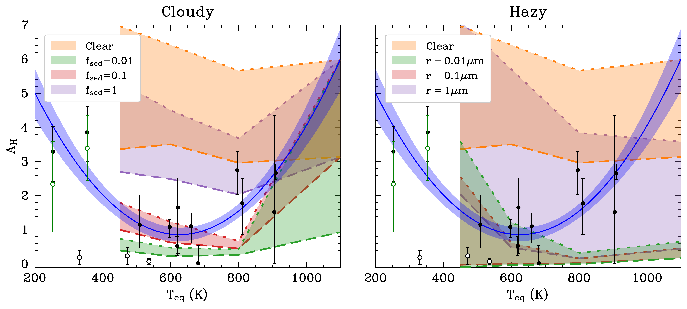
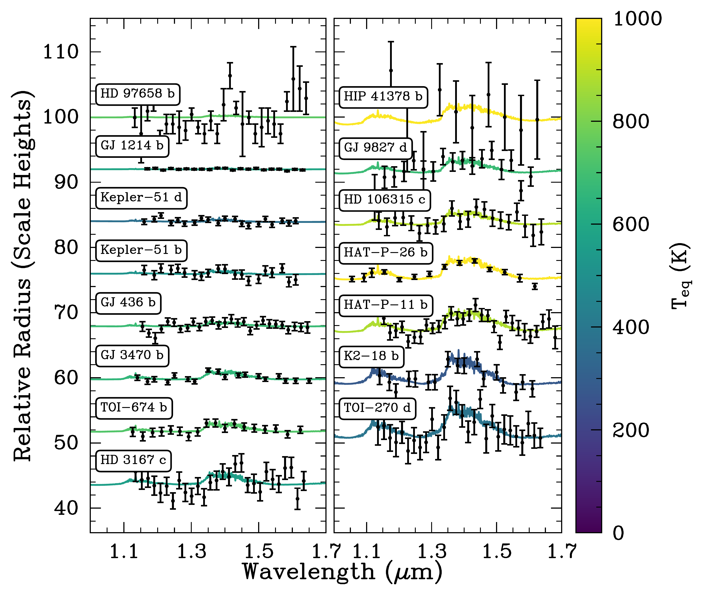
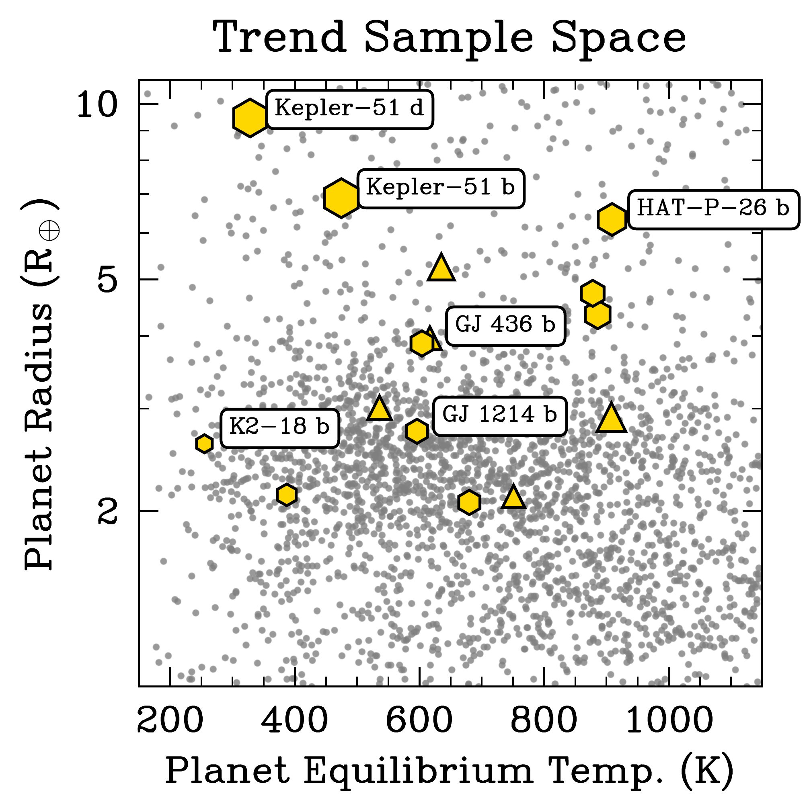

$\newcommand{\ensuremath}{}$
$\newcommand{\xspace}{}$
$\newcommand{\object}[1]{\texttt{#1}}$
$\newcommand{\farcs}{{.}''}$
$\newcommand{\farcm}{{.}'}$
$\newcommand{\arcsec}{''}$
$\newcommand{\arcmin}{'}$
$\newcommand{\ion}[2]{#1#2}$
$\newcommand{\textsc}[1]{\textrm{#1}}$
$\newcommand{\hl}[1]{\textrm{#1}}$
$\newcommand{\footnote}[1]{}$
$\newcommand{\vdag}{(v)^\dagger}$
$\newcommand$
$\newcommand$
$\newcommand{\hst}{\textit{HST}}$
$\newcommand{\jwst}{\textit{JWST}}$
$\newcommand{\tess}{\textit{TESS}}$
$\newcommand{\rearth}{R_\oplus}$
$\newcommand{\mearth}{M_\oplus}$
$\newcommand{\rsun}{R_\odot}$
$\newcommand{\msun}{M_\odot}$
$\newcommand{\um}{\mum}$
$\newcommand{\ah}{A_{H}}$
$\newcommand{\water}{\mathrm{H}_2\mathrm{O}}$
$\newcommand{\methane}{\mathrm{CH}_4}$
$\newcommand{\dioxide}{\mathrm{CO}_2}$
$\newcommand{\ammonia}{\mathrm{NH}_3}$

# Clouds and Clarity: Revisiting Atmospheric Feature Trends in Neptune-size Exoplanets

<mark>Appeared on: 2023-10-12</mark> -  _Submitted to ApJL. 11 pages, 3 figures, 4 tables_

J. Brande, et al. -- incl., <mark>L. Kreidberg</mark>, <mark>T. Mikal-Evans</mark>

**Abstract:** Over the last decade, precise exoplanet transmission spectroscopy has revealed the atmospheres of dozens of exoplanets, driven largely by observatories like the _Hubble_ Space Telescope. One major discovery has been the ubiquity of atmospheric aerosols, often blocking access to exoplanet chemical inventories. Tentative trends have been identified, showing that the clarity of planetary atmospheres may depend on equilibrium temperature. Previous work has often grouped dissimilar planets together in order to increase the statistical power of any trends, but it remains unclear from observed transmission spectra whether these planets exhibit the same atmospheric physics and chemistry. We present a re-analysis of a smaller, more physically similar sample of 15 exo-Neptune transmission spectra across a wide range of temperatures (200-1000 K). Using condensation cloud and hydrocarbon haze models, we find that the exo-Neptune population is best described by very low cloud sedimentation efficiency ( $\mathrm{f_{sed}}\sim0.01$ ) and high metallicity ( $100\times$ Solar). There is an intrinsic astrophysical scatter of $\sim0.5$ scale height, perhaps evidence of stochasticity in these planets’ formation processes. Observers should expect significant attenuation in transmission spectra of Neptune-size exoplanets, up to 6 scale heights for equilibrium temperatures between 500 and 800 K. With $\jwst$ ’s greater wavelength sensitivity, colder ( $<500$ K) planets should be high-priority targets given their comparative rarity, clearer atmospheres, and the need to distinguish between the "super-puffs’’ and more typical gas-dominated planets.

**Figure 3. -** Retrieved spectral feature amplitude, $\ah$ , compared to clear, cloudy, and hazy atmosphere models from [Morley, Fortney and Marley (2015)](). For the clear and cloudy models, the dotted lines indicate a $100\times$ Solar metallicity atmosphere, and the dot-dashed lines a $300\times$ Solar atmosphere. All hazy models were calculated at $50\times$ Solar metallicity, the dotted lines are 1\% haze precursor conversion, and the dashed lines are 10\%. The green open markers, shown for context, are the measured $\methane$ -retrieved $\ah$  values for K2-18 b and TOI-270 d. The black open markers, shown for context, are the Kepler-51 planets, which are excluded from the trend analysis due to their exceptionally low densities, and GJ 1214 b, which was found to significantly bias the trend fit due to the extremely precise flatness of its spectrum. (*fig:clear_compare*)

**Figure 2. -** All $\hst$ /WFC3 G141 transmission spectra of our exo-Neptunes, scaled to show the relative $\ah$  values. The retrieved models are colored by the planetary equilibrium temperature, and the spectra are ordered by $\ah$ . (*fig:spectra_stack*)

**Figure 1. -** This work's sample overlaid with known transiting planets. Hexagons indicate planets in our sample also being observed by $\jwst$  through Cycle 2, while triangles are not yet scheduled or approved for $\jwst$  observations. Selected targets have been labeled. (*fig:my_label*)

