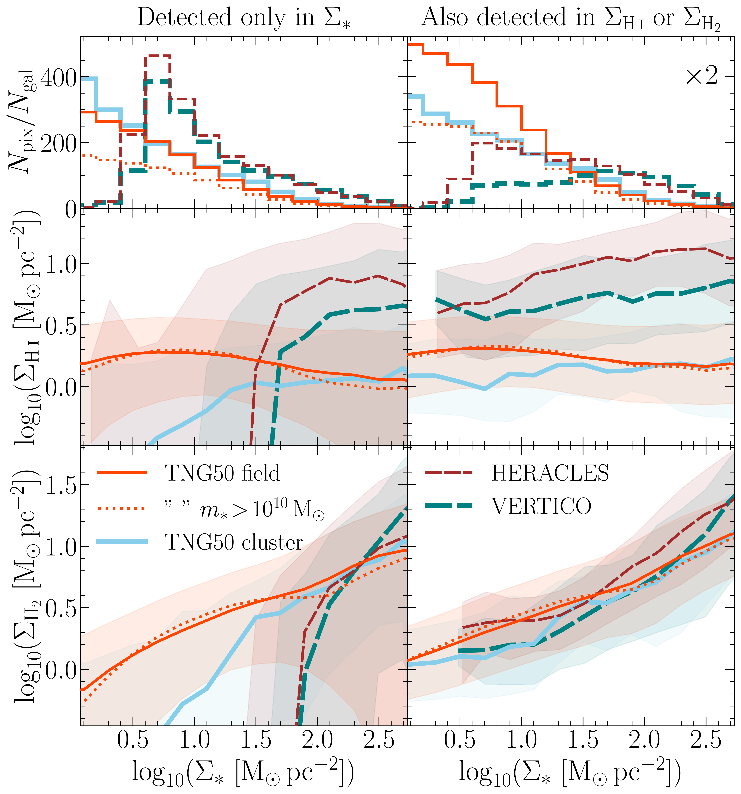

$\newcommand{\ensuremath}{}$
$\newcommand{\xspace}{}$
$\newcommand{\object}[1]{\texttt{#1}}$
$\newcommand{\farcs}{{.}''}$
$\newcommand{\farcm}{{.}'}$
$\newcommand{\arcsec}{''}$
$\newcommand{\arcmin}{'}$
$\newcommand{\ion}[2]{#1#2}$
$\newcommand{\textsc}[1]{\textrm{#1}}$
$\newcommand{\hl}[1]{\textrm{#1}}$
$\newcommand{\footnote}[1]{}$
$\newcommand{\vdag}{(v)^\dagger}$
$\newcommand$
$\newcommand$
$\newcommand$
$\newcommand$
$\newcommand$
$\newcommand$
$\newcommand$
$\newcommand$

# VERTICO and IllustrisTNG: The spatially resolved effects of environment on galactic gas

<mark>Appeared on: 2023-10-13</mark> -  _9 pages, 4 figures, accepted in ApJL_

A. R.~H.~Stevens, et al. -- incl., <mark>A. Pillepich</mark>

**Abstract:** $\noindent$ It has been shown in previous publications that the TNG100 simulation quantitatively reproduces the observed reduction in each of the total atomic and total molecular hydrogen gas for galaxies within massive halos, i.e. dense environments.In this Letter, we study how well TNG50 reproduces the $*resolved*$ effects of a Virgo-like cluster environment on the gas surface densities of satellite galaxies with $m_* > \! 10^9 {\rm M}_\odot$ and ${\rm SFR} \! > 0.05 {\rm M}_\odot{\rm yr}^{-1}$ .We select galaxies in the simulation that are analogous to those in the HERACLES and VERTICO surveys, and mock-observe them to the common specifications of the data.Although TNG50 does not quantitatively match the observed gas surface densities in the centers of galaxies, the simulation does qualitatively reproduce the trends of gas truncation and central density suppression seen in VERTICO in both $\HI$ and $\Htwo$ .This result promises that modern cosmological hydrodynamic simulations can be used to reliably model the post-infall histories of cluster satellite galaxies.

**Figure 2. -** Resolved scaling relations for TNG50 galaxies per their field and cluster samples (and a high-mass field sub-sample), compared respectively with HERACLES and VERTICO.
Lines are running medians in 0.2-dex bins of $\Sigma_*$.
Shaded regions cover the 16th to 84th percentiles (not shown for the high-mass field sub-sample).
The left column accounts for all pixels in both the observations (provided they were detected in stellar emission) and simulations, setting non-detections in either \SHI or \SHtwo in the observations to zero, which are accounted for in the percentiles.
The right column removes any non-detections in the observations by cutting out any pixels that would fall below the axes as plotted.
The lower boundary of each axis represents the 1st percentile of all gas-detected pixels (irrespective of whether the pixel is a detection in \Ss) across both observational surveys.
This boundary also represents the cut in gas surface density applied to TNG50 in the right-hand panels, as to emulate a detection threshold.
The top two panels show the one-dimensional histograms of \Ss for pixels in each sample, normalised by the number of galaxies in that sample.
The $y$-axis in the top-right panel is stretched by a factor of two for clarity.
 (*fig:scalings*)

**Figure 3. -** Individual \HI sequences for the nine most \HI-deficient galaxies among VERTICO analogues in TNG50.
Points are pixels from the TNG50 galaxies, with thick solid lines the running median of those points.
The thin, solid, red line that repeats in each panel is the median for the TNG50 field sample.
Each dashed line is the running median for the VERTICO galaxy that the TNG50 galaxy is matched to, based on its stellar mass and distance from the star-forming main sequence.
NGC4533 lacks any detected resolved \HI.
The lower bound of the $y$-axis in each panel is $\sim$0.5 dex lower than what is detected in VERTICO galaxies.
 (*fig:HI*)

**Figure 1. -** The \HI (top panel) and \Htwo (bottom panel) fractions of TNG50 and TNG100 galaxies as a function of stellar mass at $z\!=\!0$.
Only galaxies with $m_* \! \geq \! 10^9 {\rm M}_\odot$ and ${\rm SFR} \! \geq 0.05 {\rm M_\odot yr}^{-1}$ are included (without any environmental sub-sampling).
Hex bins show the number density of TNG50 galaxies.
Lines are the running median (thick) and 16th and 84th percentiles (thin) for TNG50 (solid) and TNG100 (dashed).
Points with approximate errors compare the VERTICO and HERACLES galaxies that we use in this paper (a subset of the full surveys; cf. fig. 1 of  ([Zabel, Brown and Wilson 2022]()) ).
We show these observational data for reference, but we do *not* necessarily expect the simulation medians to align closely with them (but they should be closer to HERACLES than VERTICO).
Individual points from our TNG50 cluster and field samples, shown, can be respectively compared to VERTICO and HERACLES. (*fig:HIH2frac*)

