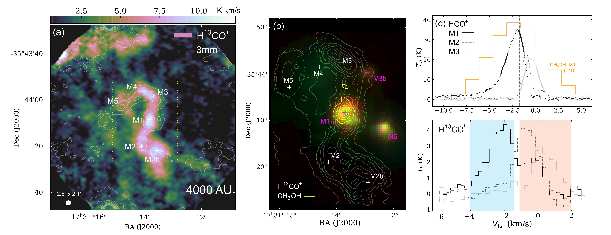
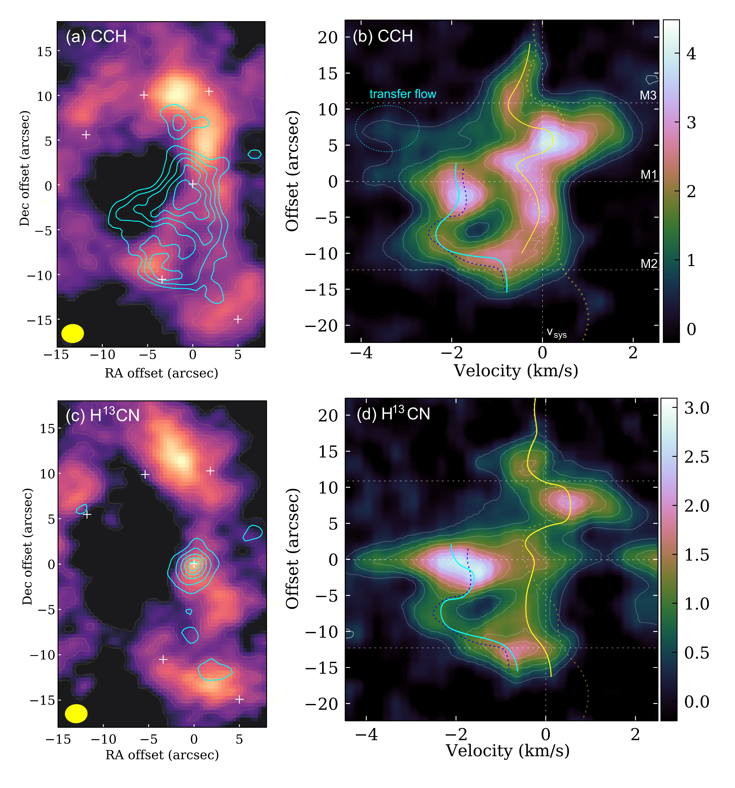

$\newcommand{\ensuremath}{}$
$\newcommand{\xspace}{}$
$\newcommand{\object}[1]{\texttt{#1}}$
$\newcommand{\farcs}{{.}''}$
$\newcommand{\farcm}{{.}'}$
$\newcommand{\arcsec}{''}$
$\newcommand{\arcmin}{'}$
$\newcommand{\ion}[2]{#1#2}$
$\newcommand{\textsc}[1]{\textrm{#1}}$
$\newcommand{\hl}[1]{\textrm{#1}}$
$\newcommand{\footnote}[1]{}$
$\newcommand{\url}[1]{\href{#1}{#1}}$
$\newcommand{\vdag}{(v)^\dagger}$
$\newcommand$
$\newcommand$
$\newcommand{\}{aj}$
$\newcommand{\}{araa}$
$\newcommand{\}{apj}$
$\newcommand{\}{icarus}$
$\newcommand{\}{apjs}$
$\newcommand{\}{apjl}$
$\newcommand{\}{apss}$
$\newcommand{\}{aap}$
$\newcommand{\}{aapr}$
$\newcommand{\}{aaps}$
$\newcommand{\}{baas}$
$\newcommand{\}{memras}$
$\newcommand{\}{mnras}$
$\newcommand{\}{pasp}$
$\newcommand{\}{prl}$
$\newcommand{\}{jqsrt}$
$\newcommand{\}{actaa}$
$\newcommand{\pc}{{\rm pc}}$
$\newcommand{\lsun}{L_\odot}$
$\newcommand{\msun}{M_\odot}$
$\newcommand{\klms}{{\rm km s^{-1}}}$
$\newcommand{\kms}{{\rm km s^{-1}}}$
$\newcommand{ç}{{\rm cm^{-3}}}$
$\newcommand{\yr}{{\rm yr^{-1}}}$
$\newcommand{\sc}{{\rm cm^{-2}}}$
$\newcommand{\cm2}{{\rm cm^{-2}}}$
$\newcommand{\sqc}{{\rm cm^{-2}}}$
$\newcommand{\um}{{\rm \mu m}}$
$\newcommand{\micron}{{\rm \mu m}}$
$\newcommand{\htwo}{{\rm H_2}}$
$\newcommand{\hone}{{\rm HI}}$
$\newcommand{\nht}{{\rm NH_3}}$
$\newcommand{\hcn}{{\rm HCN}}$
$\newcommand{\nthp}{{\rm N_2H^+}}$
$\newcommand{\hctn}{{\rm HC_3N}}$
$\newcommand{\ceto}{{\rm C^{18}O}}$
$\newcommand{\hcop}{{\rm HCO^+}}$
$\newcommand{\chtcn}{{\rm CH_3CN}}$
$\newcommand{\htcop}{{\rm H^{13}CO^+}}$
$\newcommand{\chtoh}{{\rm CH_3OH}}$
$\newcommand{\htcn}{{\rm H^{13}CN}}$
$\newcommand{\tco}{{\rm ^{13}CO}}$
$\newcommand{çh}{{\rm CCH}}$
$\newcommand{\cth}{{\rm C_2H}}$
$\newcommand{\mjbm}{{\rm mJy  beam^{-1}}}$
$\newcommand{\}{natexlab}$

# A High-Mass Young Star-forming Core Escaping from Its Parental Filament

<mark>Appeared on: 2023-10-13</mark> -  _15 pages, 6 figures, accepted for publication in the Astrophysical Journal_

Z. Ren, et al. -- incl., <mark>S. Li</mark>

**Abstract:** We studied the unique kinematic properties in massive filament G352.63-1.07 at $10^3$ -AU spatial scale with the dense molecular tracers observed with the Atacama Large Millimeter/submillimeter Array (ALMA). We find the central massive core M1 ( $12 \msun$ ) being separated from the surrounding filament with a velocity difference of $v- \overline{v}_{\rm sys}=-2 \kms$ and a transverse separation within 3 arcsec. Meanwhile, as shown in multiple dense-gas tracers, M1 has a spatial extension closely aligned with the main filament and is connected to the filament towards its both ends. M1 thus represents a very beginning state for a massive young star-forming core escaping from the parental filament, within a time scale of $\sim 4000$ years. Based on its kinetic energy ( $3.5\times10^{44}$ erg), the core escape is unlikely solely due to the original filament motion or magnetic field, but requires more energetic events such as a rapid intense anisotropic collapse. The released energy also seems to noticeably increase the environmental turbulence. This may help the filament to become stabilized again.

**Figure 2. -** \small** (a)** Contours: emission region of the $\htcop$(1-0) line in three velocity intervals. The background image is the $\htcop$ emission in (-1.5,+1.5) $\kms$(red-center component). For the blue-wing component, the contour levels are 4, 6, and 8 times of the rms level (0.3 K $\kms$). For the other components, the contour levels are 10\% to 90\% in 20\%-step of the peak intensity, which is 15, 11, and 3 K $\kms$ for the blue-center, red-center, and red-wing, respectively. The green arrows label the mass transfer flow directions onto the main filament (Chen21). The green circles labels the possible arrival points of the transfer flows onto the filament. ** (b)** PV plot and intensity profile along the major axis of the main filament. The sampling direction is labelled in dashed line in panel (a). The vertical dashed lines denote the projected offset of the three dense cores on the sampling direction. The horizontal dotted line represents the average systemic velocity of the filament.  (*fig:m1_blue*)

**Figure 1. -** \small** (a)** The velocity-integrated intensity of the $\htcop$(1-0) line (false-color) and 3 mm continuum. The contour levels are $4\sigma_{\rm rms}$($1.6 $\mjbm$$) to $84\sigma_{\rm rms}$(peak) in step of $16\sigma_{\rm rms}$.  ** (b)** The $\htcop$ and $\chtoh$ emission regions around the main filament, overlaid on the IRAC-RGB image (3.6, 4.5, and 8.0 $\micron$ bands). The $\htcop$ contours are 15\% to 90\% in 15\%-step of the peak intensity (8.5 K $\kms$). The $\chtoh$ contours are 10\% to 90\% in 20\%-step of the peak intensity (18.7 K $\kms$). The dashed circles labels the area of each core. ** (c)** The spectra at the selected core centers. The blue and red-shaded areas indicate the velocity ranges of the two velocity components, respectively. The vertical dashed line denotes the division between the blue and main-filament components.  (*fig:spec_img*)

**Figure 3. -** \small** Left column:** The emission regions of the blue- (contours) and redshifted (false-color) components in CCS and $\htcn$(1-0) lines. The contour levels are 20\% to 90\% of the peak intensity. ** Right column:** The PV diagrams of the two molecular lines. the $\htcn$ emission at $v_{\rm lsr}=2$ to 4 $\kms$ is from anther HFC of $F=1-1$. The HFCs of $\htcn$ are separated for 6-7 $\kms$ and would not blend with each other. The CCH (1-0) emission shows an additional small blueshift wings around M3, which should correspond to the transfer flow onto the filament (Chen21). This feature is not seen in other lines probably because of their lower optical depths.  (*fig:pv_3mol*)

