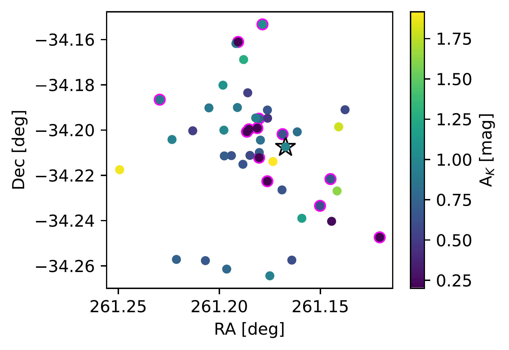
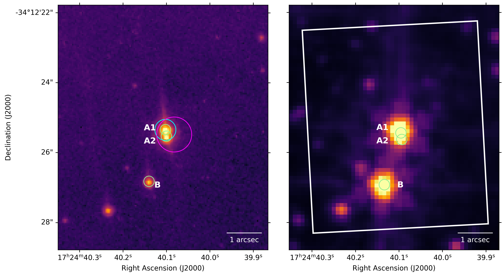
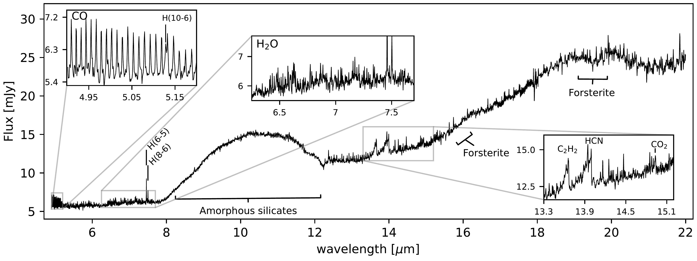

$\newcommand{\ensuremath}{}$
$\newcommand{\xspace}{}$
$\newcommand{\object}[1]{\texttt{#1}}$
$\newcommand{\farcs}{{.}''}$
$\newcommand{\farcm}{{.}'}$
$\newcommand{\arcsec}{''}$
$\newcommand{\arcmin}{'}$
$\newcommand{\ion}[2]{#1#2}$
$\newcommand{\textsc}[1]{\textrm{#1}}$
$\newcommand{\hl}[1]{\textrm{#1}}$
$\newcommand{\footnote}[1]{}$
$\newcommand{\vdag}{(v)^\dagger}$
$\newcommand$
$\newcommand$
$\newcommand{\arraystretch}{1.1}$
$\newcommand{\arraystretch}{1.1}$
$\newcommand{\nodata}{...}$
$\newcommand{\Hii}{H {\sc ii}}$
$\newcommand{\micron}{\mum}$
$\newcommand{\kms}{km s^{-1}}$
$\newcommand{\cmss}{cm s^{-2}}$
$\newcommand{\lsol}{L_{\odot}}$
$\newcommand{\msun}{M_{\odot}}$
$\newcommand{\msol}{M_{\odot}}$
$\newcommand{\rsol}{R_{\odot}}$
$\newcommand{\rsun}{R_{\odot}}$
$\newcommand{\Rsun}{R_{\odot}}$
$\newcommand{\s}{\sigma}$
$\newcommand{\w}{\omega}$
$\newcommand{\vsini}{v \sin i}$
$\newcommand{\sigrms}{\sigma_\mathrm{rms}}$
$\newcommand{\srv}{\sigma_\mathrm{RV}}$
$\newcommand{\Msol}{M_\odot}$
$\newcommand{\Msun}{M_\odot}$
$\newcommand{\Lsol}{L_\odot}$
$\newcommand{\Lsun}{L_\odot}$
$\newcommand{\s}{\sigma}$
$\newcommand{\feros}{{\sc feros}}$
$\newcommand{\lco}{{\sc lco}}$
$\newcommand{\uves}{{\sc uves}}$
$\newcommand{\iacob}{{\sc iacob}}$
$\newcommand{\l}{\lambda}$
$\newcommand{\ll}{\lambda\lambda}$
$\newcommand{\palp}{Pa~\alpha}$
$\newcommand{\palph}{Pa~\alpha}$
$\newcommand{\palpha}{Pa~\alpha}$
$\newcommand{\pbet}{Pa~\beta}$
$\newcommand{\pbeta}{Pa~\beta}$
$\newcommand{\pdelt}{Pa~\delta}$
$\newcommand{\pgam}{Pa~\gamma}$
$\newcommand{\peps}{Pa~\epsilon}$
$\newcommand{\halp}{H~\alpha}$
$\newcommand{\halph}{H~\alpha}$
$\newcommand{\halpha}{H~\alpha}$
$\newcommand{\hbet}{H~\beta}$
$\newcommand{\hdelt}{H~\delta}$
$\newcommand{\hgam}{H~\gamma}$
$\newcommand{\ha}{H {\sc i}}$
$\newcommand{\hb}{H {\sc ii}}$
$\newcommand{\hea}{He {\sc i}}$
$\newcommand{\heb}{He {\sc ii}}$
$\newcommand{\nc}{N {\sc iii}}$
$\newcommand{\fea}{Fe {\sc i}}$
$\newcommand{\nd}{N {\sc iv}}$
$\newcommand{\ne}{N {\sc v}}$
$\newcommand{\mgb}{Mg {\sc ii}}$
$\newcommand{\ob}{O {\sc ii}}$
$\newcommand{\sic}{Si {\sc iii}}$
$\newcommand{\sid}{Si {\sc iv}}$
$\newcommand{\H2O}{H_{2}O}$
$\newcommand{\C2H2}{C_{2}H_{2}}$
$\newcommand{\CO2}{^{12}CO_{2}}$
$\newcommand{\13CO}{^{13}CO_{2}}$
$\newcommand{\13CO2}{^{13}CO_{2}}$

# XUE. Molecular inventory in the inner region of an extremely irradiated Protoplanetary Disk

<mark>Appeared on: 2023-10-18</mark> -  _Accepted for publication in ApJ Letters. 20 pages, 7 figures_

M. C. Ramírez-Tannus, et al. -- incl., <mark>G. Perotti</mark>, <mark>R. v. Boekel</mark>

**Abstract:** We present the first results of the eXtreme UV Environments (XUE) James Webb Space Telescope (JWST) program, that focuses on the characterization of planet forming disks in massive star forming regions. These regions are likely representative of the environment in which most planetary systems formed. Understanding the impact of environment on planet formation is critical in order to gain insights into the diversity of the observed exoplanet populations.  XUE targets 15 disks in three areas of NGC 6357, which hosts numerous massive OB stars, among which some of the most massive stars in our galaxy. Thanks to JWST we can, for the first time, study the effect of external irradiation on the inner ( $< 10$ au), terrestrial-planet forming regions of proto-planetary disks. In this study, we report on the detection of abundant water, CO, $\CO$ 2, HCN and $\C$ 2H2 in the inner few au of XUE 1, a highly irradiated disk in NGC 6357. In addition, small, partially crystalline silicate dust is present at the disk surface.The derived column densities, the oxygen-dominated gas-phase chemistry, and the presence of silicate dust are surprisingly similar to those found in inner disks located in nearby, relatively isolated low-mass star-forming regions. Our findings imply that the inner regions of highly irradiated disks can retain similar physical and chemical conditions as disks in low-mass star-forming regions, thus broadening the range of environments with similar conditions for inner disk rocky planet formation to the most extreme star-forming regions in our Galaxy.

**Figure 2. -** _Top:_ Extinction $A_K$ for a sample of stars in Pis24, $A_K$ is shown in colors. The position of XUE 1 in this diagram is indicated with a star. The O stars from the bottom panel are indicated with magenta borders. _Bottom:_ Radiation field towards XUE 1. The lines show the 2D distance from the massive stars to XUE 1 (indicated with the black star) and the colors of the dots show their temperature. The FUV radiation felt by XUE 1 from each massive star is shown by the color and width =of the lines (*fig:ext_radiation*)

**Figure 3. -** _Left:_ HST/ACS  F850LP band image of the target position for XUE 1.
   The three point-like objects are marked by green circles
with radii of $0.1$\arcsec$$.
The cyan circle on A1  marks the position of the Gaia DR3 source 5976051168205228416.
The magenta circle ($0.5$\arcsec$$ radius) marks the position of the
_Chandra_ X-ray source. A grid of J2000 coordinates is shown.
_Right:_ MIRI F560W image (log intensity scale) of the target position for XUE 1. The white box marks the observed field of view with MRS. The optical positions of the three point-like objects A1, A2, and B are marked by green circles
with radii of $0.1$\arcsec$$. (*fig:HST-MIRI-images*)

**Figure 4. -** MIRI MRS spectrum of XUE 1. The most prominent dust features are labeled. The insets show the P-branch transitions of the CO ro-vibrational fundamental band, the water emission around 7 $\micron$ and the 13 to 15 $\micron$ region featuring $\C$2H2, HCN, and $\C$O2.  (*fig:MIRIspectrum*)

