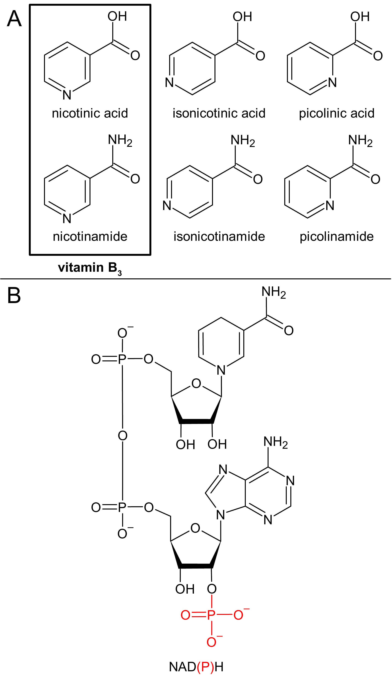
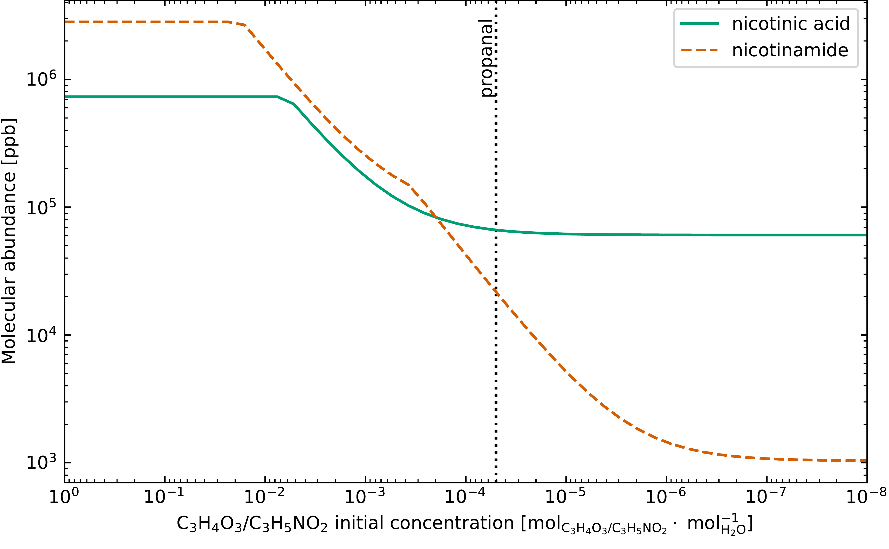
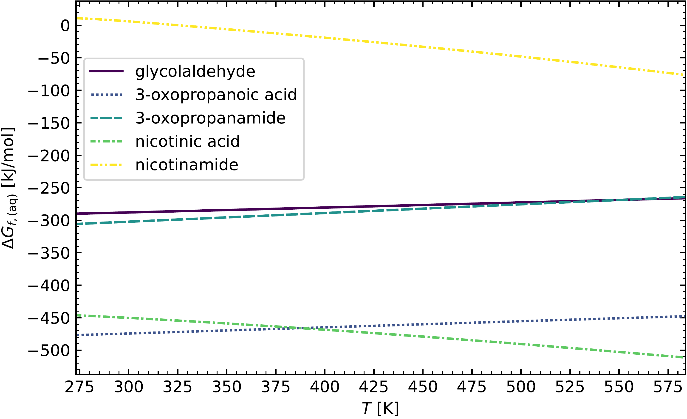

$\newcommand{\ensuremath}{}$
$\newcommand{\xspace}{}$
$\newcommand{\object}[1]{\texttt{#1}}$
$\newcommand{\farcs}{{.}''}$
$\newcommand{\farcm}{{.}'}$
$\newcommand{\arcsec}{''}$
$\newcommand{\arcmin}{'}$
$\newcommand{\ion}[2]{#1#2}$
$\newcommand{\textsc}[1]{\textrm{#1}}$
$\newcommand{\hl}[1]{\textrm{#1}}$
$\newcommand{\footnote}[1]{}$
$\newcommand{\affiliation}{$
$\begin{itemize}$
$\item[{[a]}] K. Paschek*, M. Lee, Dr. D. A. Semenov, Prof. T. K. Henning\Max Planck Institute for Astronomy, Königstuhl 17, D-69117 Heidelberg, Germany\E-mail: paschek@mpia.de\item[{[b]}] Dr. D. A. Semenov\Department of Chemistry, Ludwig Maximilian University of Munich, Butenandtstraße 5-13, House F, D-81377 Munich, Germany\item[{[\texttt{+}]}] These authors contributed equally.$
$\end{itemize}$
$}$
$\newcommand{\keywords}{$
$    Meteorites \textbullet     Nitrogen heterocycles \textbullet     Origins of life \textbullet     Prebiotic chemistry \textbullet     Thermochemistry$
$}$
$\newcommand{\dedication}{$
$	\begin{minipage}{\textwidth}$
$	\end{minipage}$
$}$
$\newcommand{\abstract}{Aqueous chemistry within carbonaceous planetesimals is promising for synthesizing prebiotic organic matter essential to all life. Meteorites derived from these planetesimals delivered these life building blocks to the early Earth, potentially facilitating the origins of life. Here, we studied the formation of vitamin B_3 as it is an important precursor of the coenzyme NAD(P)(H), which is essential for the metabolism of all life as we know it. We propose a new reaction mechanism based on known experiments in the literature that explains the synthesis of vitamin B_3. It combines the sugar precursors glyceraldehyde or dihydroxyacetone with the amino acids aspartic acid or asparagine in aqueous solution without oxygen or other oxidizing agents. We performed thermochemical equilibrium calculations to test the thermodynamic favorability. The predicted vitamin B_3 abundances resulting from this new pathway were compared with measured values in asteroids and meteorites. We conclude that competition for reactants and decomposition by hydrolysis are necessary to explain the prebiotic content of meteorites. In sum, our model fits well into the complex network of chemical pathways active in this environment.}$

# $\raggedright$ Prebiotic Vitamin B$_\text{3}$ Synthesis in Carbonaceous Planetesimals

<mark>Appeared on: 2023-10-18</mark> -  _Accepted for publication in ChemPlusChem. The authors Klaus Paschek and Mijin Lee contributed equally. 18 pages, 7 figures (all colored). Supporting Information is available at this https URL_

<mark>K. Paschek</mark>, M. Lee, D. A. Semenov, <mark>T. K. Henning</mark>

**Abstract:** Aqueous chemistry within carbonaceous planetesimals is promising for synthesizing prebiotic organic matter essential to all life. Meteorites derived from these planetesimals delivered these life building blocks to the early Earth, potentially facilitating the origins of life. Here, we studied the formation of vitamin $B_3$ as it is an important precursor of the coenzyme NAD(P)(H), which is essential for the metabolism of all life as we know it. We propose a new reaction mechanism based on known experiments in the literature that explains the synthesis of vitamin $B_3$. It combines the sugar precursors glyceraldehyde or dihydroxyacetone with the amino acids aspartic acid or asparagine in aqueous solution without oxygen or other oxidizing agents. We performed thermochemical equilibrium calculations to test the thermodynamic favorability. The predicted vitamin $B_3$ abundances resulting from this new pathway were compared with measured values in asteroids and meteorites. We conclude that competition for reactants and decomposition by hydrolysis are necessary to explain the prebiotic content of meteorites. In sum, our model fits well into the complex network of chemical pathways active in this environment. 

**Figure 2. -** Structures of **A** vitamin $B_3$(in box) and its isomers, and **B** the coenzyme nicotinamide adenine dinucleotide (phosphate), abbreviated as NAD(P)H, in its reduced form. The phosphorylated form is indicated in red. (*fig:structures*)

**Figure 5. -** Simulated vitamin $B_3$ abundances depending on variable initial concentrations of the aldehydes 3-oxopropanoic acid (\ce{C3H4O3}) and 3-oxopropanamide (\ce{C3H5NO2}), which are reactants in the Strecker synthesis (**S1** in \cref{sch:reaction}). All simulations were performed at \SI{0}{\celsius} and \SI{100}{bar}. The vertical dotted black line indicates the initial concentration of propanal (mean of the range given in \cref{tab:concs}), which was used in the simulations as a surrogate for these aldehydes that have not yet been detected in comets. (*fig:variable_aldehyde*)

**Figure 6. -** Gibbs free energies of formation $\Delta G_{f,\mathrm{(aq)}}$ as a function of temperature $T$ for the molecules not included in the CHNOSZ database. All energies are given in an aqueous solution at a pressure of \SI{100}{bar}, assuming an ideal infinite dilution. (*fig:Gibbs_add*)

