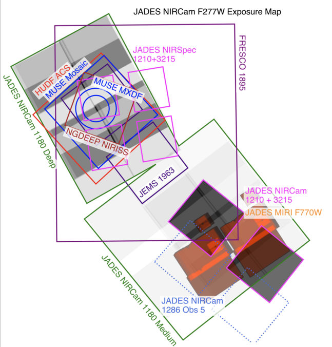
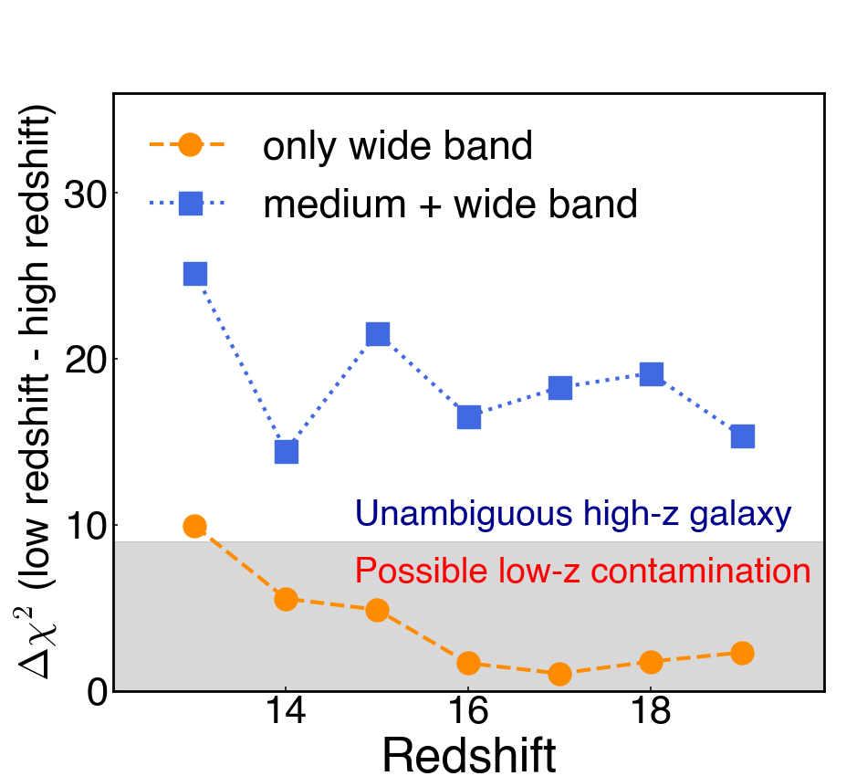
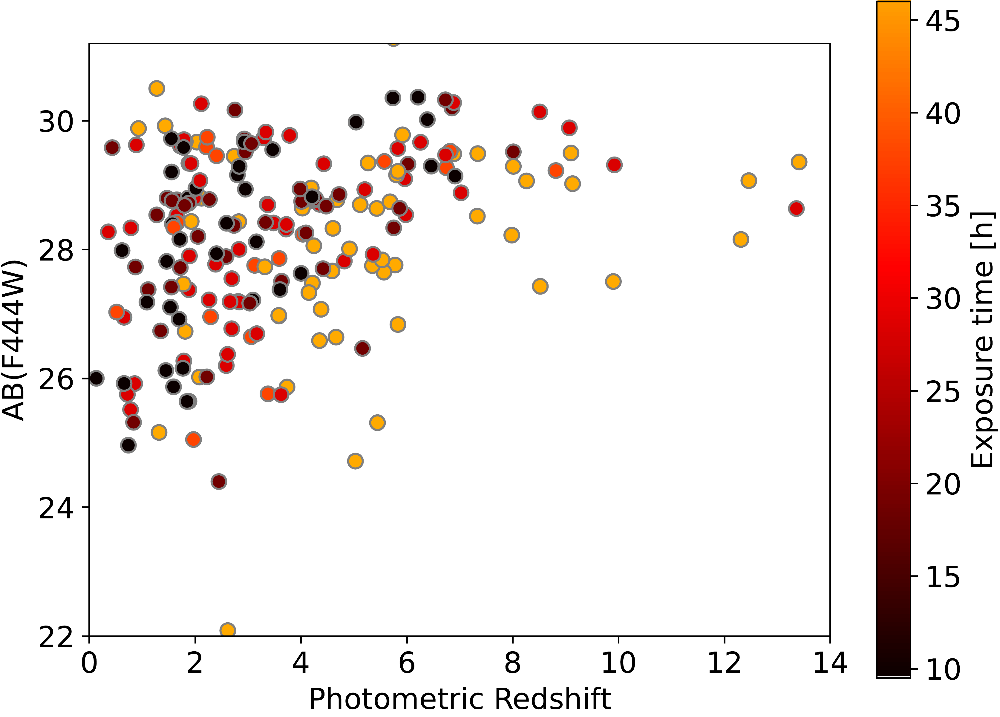

$\newcommand{\ensuremath}{}$
$\newcommand{\xspace}{}$
$\newcommand{\object}[1]{\texttt{#1}}$
$\newcommand{\farcs}{{.}''}$
$\newcommand{\farcm}{{.}'}$
$\newcommand{\arcsec}{''}$
$\newcommand{\arcmin}{'}$
$\newcommand{\ion}[2]{#1#2}$
$\newcommand{\textsc}[1]{\textrm{#1}}$
$\newcommand{\hl}[1]{\textrm{#1}}$
$\newcommand{\footnote}[1]{}$
$\newcommand{\lya}{\ensuremath{{\rm Ly}\alpha}}$
$\newcommand{\kms}{\ensuremath{{\rm\;km\;s^{-1}}}}$
$\newcommand{\Mpc}{\ensuremath{{\rm\;Mpc}}}$
$\newcommand{\Myr}{\ensuremath{{\rm\;Myr}}}$
$\newcommand{\Msun}{\ensuremath{{\rm\;M_\odot}}}$
$\newcommand{\yr}{\ensuremath{{\rm\;yr}}}$
$\newcommand{\cm}{\ensuremath{{\rm\;cm}}}$
$\newcommand{\ergscms}{\ensuremath{{\rm\;ergs\;cm^{-2}\;s^{-1}}}}$
$\newcommand{\ergss}{\ensuremath{{\rm\;ergs\;s^{-1}}}}$
$\newcommand{\mic}{\ensuremath{\mu\rm m}}$
$\newcommand{\todo}[1]{{\color{blue} \tt #1}}$
$\newcommand{\tbc}[1]{#1 ({\color{red} \tt TBC})}$
$\newcommand{\tbd}{({\color{red} \tt TBD})}$
$\newcommand{\outline}[1]{{\color{black}\it #1}}$
$\newcommand{\BRC}[1]{{\color{red!55!black} BR: #1}}$
$\newcommand{\CWC}[1]{{\color{purple!55!black} CW: #1}}$
$\newcommand{\RM}[1]{{\color{green!25!black} RM: #1}}$
$\newcommand{\DJE}[1]{{\color{blue!25!black} DE: #1}}$
$\newcommand{\um}{\ensuremath{\mu{\rm m}}}$
$\newcommand{\nod}{---}$

# The JADES Origins Field: A New JWST Deep Field in the JADES Second NIRCam Data Release

<mark>Appeared on: 2023-10-20</mark> -  _Submitted to ApJ Supplement. Images and catalogs are available at this https URL . A FITSmap portal to view the images is at this https URL_

D. J. Eisenstein, et al. -- incl., <mark>A. d. Graaff</mark>, <mark>H.-W. Rix</mark>

**Abstract:** We summarize the properties and initial data release of the JADES Origins Field (JOF),which will soon be the deepest imaging field yet observed with the James Webb Space Telescope (JWST).This field falls within the GOODS-S region about 8' south-west of the Hubble Ultra Deep Field (HUDF), where it was formed initially in Cycle 1 as a parallel field of HUDF spectroscopic observations within the JWST AdvancedDeep Extragalactic Survey (JADES).This imaging will be greatly extended in Cycle 2 program 3215,which will observe the JOF for 5 days in six medium-bandfilters, seeking robust candidates for $z>15$ galaxies.This program will also include ultra-deep parallel NIRSpec spectroscopy (up to 104 hours on-source, summing over the dispersion modes) on the HUDF.Cycle 3 observations from program 4540 will add 20 hours of NIRCam slitless spectroscopy to the JOF.With these three campaigns, the JOF will be observed for 380 open-shutter hours with NIRCam using 15 imaging filters and 2 grism bandpasses.  Further, parts of the JOF have deep 43 hr MIRI observations in F770W.Taken together, the JOF will soon be one of the most compelling deep fields availablewith JWST and a powerful window into the early Universe.  This paper presents the second data release from JADES, featuring the imaging and catalogs from the year 1 JOF observations.

**Figure 1. -** 
The layout of data sets in the GOODS-S field most immediate to this paper, showing the context of observations most germane to this deep field.  The grey-scale shows the F277W exposure map, as rendered from the Cycle 1 program 1180 \& 1210 APT files.  The parallel imaging in 1210 is the deepest portion; program 3215 is extending this with 6 medium-bands. The forthcoming JADES 1286 Observation 5 NIRCam footprint is also shown.
The footprints of the HUDF ACS field  ([Beckwith, Stiavelli and Koekemoer 2006]()) , deep MUSE spectroscopy  ([Bacon, Brinchmann and Conseil 2023]()) , FRESCO grism \citep[][program 1895;]{Oesch23}, JEMS medium-band
\citep[program 1963;][]{Williams2023}, and the
NGDEEP NIRISS field \citep[program 2079;][]{Bagley23} are shown, as these are immediately supportive of the target selection for the 3215 NIRSpec observations.  There are many other powerful data sets in this region, not shown for brevity! (*fig:layout*)

**Figure 2. -** 
We now take the high-redshift fit and shift it in redshift, holding F277W $S/N=7$, and fit with Prospector both for the case of only the Cycle 1 wide-bands and for the case with the Cycle 2 imaging.  We report the $\Delta\chi^2$ that a true high-$z$ galaxy would be mistaken at low-$z$.  The combined imaging allows the two solutions to be robustly separated, with $\Delta\chi^2>15$.  One also sees how the wide-bands alone fail to separate these cases, with the confusion increasing badly at $z>15$, where the dropout shifts from F150W to F200W.
 (*fig:mb2*)

**Figure 3. -** 
F444W magnitude versus photometric redshift for the galaxies for which shutters were allocated for NIRSpec observations in program 3215. The color coding indicates the exposure time with the prism for each target.
 (*fig:ns_targets*)

