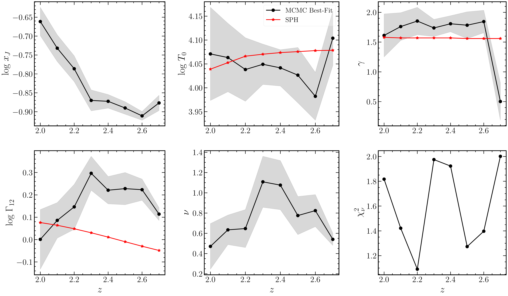
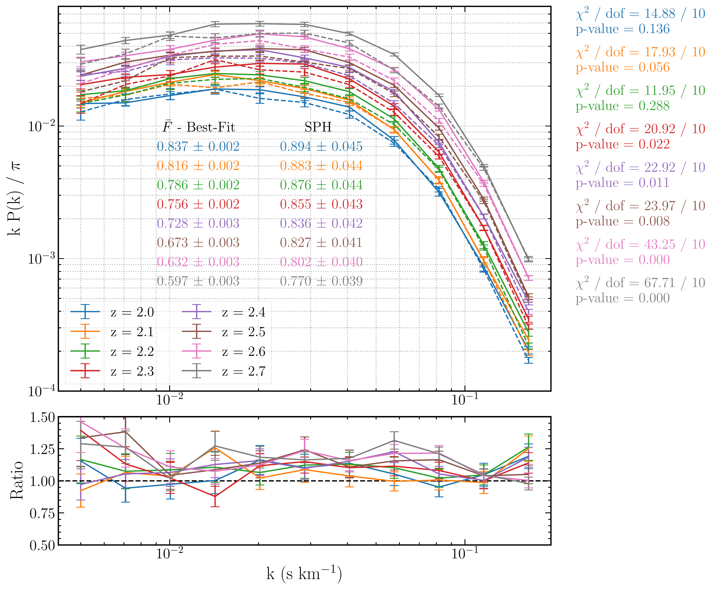
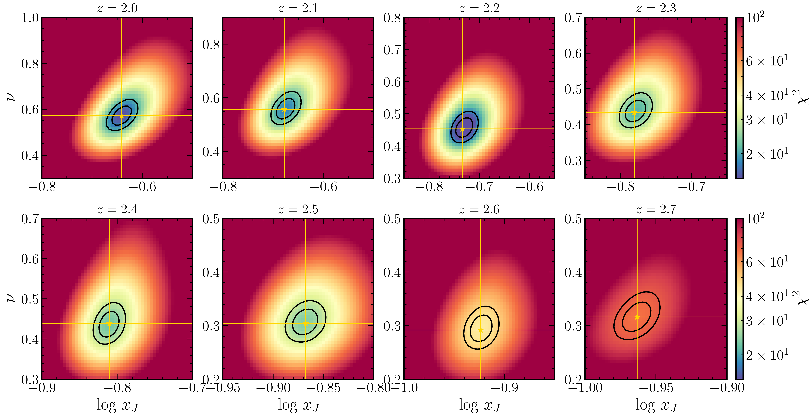

$\newcommand{\ensuremath}{}$
$\newcommand{\xspace}{}$
$\newcommand{\object}[1]{\texttt{#1}}$
$\newcommand{\farcs}{{.}''}$
$\newcommand{\farcm}{{.}'}$
$\newcommand{\arcsec}{''}$
$\newcommand{\arcmin}{'}$
$\newcommand{\ion}[2]{#1#2}$
$\newcommand{\textsc}[1]{\textrm{#1}}$
$\newcommand{\hl}[1]{\textrm{#1}}$
$\newcommand{\footnote}[1]{}$
$\newcommand{\keywords}[1]$
$\newcommand{\p}{\ensuremath{\partial}}$
$\newcommand{\Msun}{\ensuremath{M_{\odot}}}$
$\newcommand{\Mh}{\ensuremath{h^{-1}M_{\odot}}}$
$\newcommand{\Mhsq}{\ensuremath{h^{-2}M_{\odot}}}$
$\newcommand{\Mpch}{\ensuremath{h^{-1}{\rm Mpc}}}$
$\newcommand{\kpch}{\ensuremath{h^{-1}{\rm kpc}}}$
$\newcommand{\avg}[1]{\ensuremath{\left\langle #1  \right\rangle}}$
$\newcommand{\e}[1]{\ensuremath{{\rm e}^{#1}}}$
$\newcommand{\der}{\ensuremath{{\rm d}}}$
$\newcommand{\Der}{\ensuremath{{\rm D}}}$
$\newcommand{\dir}{\ensuremath{\delta_{\rm D}}}$
$\newcommand{\erfc}[1]{\ensuremath{{\rm erfc}\left(#1\right)}}$
$\newcommand{\erf}[1]{\ensuremath{{\rm erf}\left(#1\right)}}$
$\newcommand{\eqn}[1]{equation~\eqref{#1}}$
$\newcommand{\eqns}[1]{equations~\eqref{#1}}$
$\newcommand{\ph}[1]{\phantom{#1}}$
$\newcommand{\be}{\begin{equation}}$
$\newcommand{\ee}{\end{equation}}$
$\newcommand{\Cal}[1]{\ensuremath{\mathcal{#1}}}$
$\newcommand{\AP}[1]{\emph{\color{blue}[AP: #1]}}$
$\newcommand{\TRC}[1]{{\color{Green}[{\bf TRC:} #1]}}$
$\newcommand{\BA}[1]{\emph{\color{red}[BA: #1]}}$
$\newcommand{\red}[1]{\textcolor{red}{#1}}$
$\newcommand{\PG}[1]{{\color{magenta}{\bf #1}}}$
$\title{\boldmath A modified lognormal approximation of the Lyman-\alpha forest: comparison with full hydrodynamic simulations at 2\leq z\leq 2.7}$
$\author[a,1]{B. Arya,\note{Corresponding author.}}$
$\author[b]{T. Roy Choudhury,}$
$\author[a]{A. Paranjape.}$
$\author[c]{and P. Gaikwad}$
$\affiliation[a]{Inter-University Centre for Astronomy \& Astrophysics,\Ganeshkhind, Post Bag 4, Pune 411007, India}$
$\affiliation[b]{National Centre for Radio Astrophysics, TIFR,\\Post Bag 3, Ganeshkhind, Pune 411007, India}$
$\affiliation[c]{Max-Planck-Institut für Astronomie,\Königstuhl 17, D-69117 Heidelberg, Germany}$
$\emailAdd{bharya@iucaa.in}$
$\emailAdd{tirth@ncra.tifr.res.in}$
$\emailAdd{aseem@iucaa.in}$
$\emailAdd{gaikwad@mpia-hd.mpg.de}$
$\abstract{Observations of the Lyman-\alpha forest in distant quasar spectra with upcoming surveys are expected to new significantly larger and higher-quality datasets. To interpret these datasets, it is imperative to develop efficient simulations. One such approach is based on the assumption that baryonic densities in the intergalactic medium (IGM) follow a lognormal distribution.$
$We extend our earlier work to assess the robustness of the lognormal model of the Lyman-\alpha forest in recovering the parameters characterizing IGM state, namely, the mean-density IGM temperature (T_0), the slope of the temperature-density relation (\gamma), and the hydrogen photoionization rate (\Gamma_{12}), by comparing with high-resolution Sherwood SPH simulations across the redshift range 2 \leq z \leq 2.7. These parameters are estimated through a Markov Chain Monte Carlo (MCMC) technique, using the mean and power spectrum of the transmitted flux.$
$We find that the usual lognormal distribution of IGM densities cannot recover the parameters of the SPH simulations. This limitation arises from the fact that the SPH baryonic density distribution cannot be described by a simple lognormal form. To address this, we extend the model by scaling the linear density contrast by a parameter \nu. While the resulting baryonic density is still lognormal, the additional parameter gives us extra freedom in setting the variance of density fluctuations. With this extension, values of T_0 and \gamma implied in the SPH simulations are recovered at \sim 1-\sigma (\lesssim 10\%) of the median (best-fit) values for most redshifts bins. However, this extended lognormal model cannot recover \Gamma_{12} reliably, with the best-fit value discrepant by \gtrsim 3-\sigma for z > 2.2. Despite this limitation in the recovery of \Gamma_{12}, whose origins we explain, we argue that the model remains useful for constraining cosmological parameters.}$
$\keywords{intergalactic media, Lyman-\alpha forest, power spectrum}$
$\begin{document}$
$\label{firstpage}$
$\maketitle$
$\flushbottom$
$\n\end{document}\end{equation}}}}}$
$\newcommand{\e}[1]{\ensuremath{{\rm e}^{#1}}}$
$\newcommand{\der}{\ensuremath{{\rm d}}}$
$\newcommand{\Der}{\ensuremath{{\rm D}}}$
$\newcommand{\dir}{\ensuremath{\delta_{\rm D}}}$
$\newcommand{\erfc}[1]{\ensuremath{{\rm erfc}\left(#1\right)}}$
$\newcommand{\erf}[1]{\ensuremath{{\rm erf}\left(#1\right)}}$
$\newcommand{\eqn}[1]{equation~\eqref{#1}}$
$\newcommand{\eqns}[1]{equations~\eqref{#1}}$
$\newcommand{\ph}[1]{\phantom{#1}}$
$\newcommand{\be}{\begin{equation}}$
$\newcommand{\ee}{\end{equation}}$
$\newcommand{\Cal}[1]{\ensuremath{\mathcal{#1}}}$
$\newcommand{\AP}[1]{\emph{\color{blue}[AP: #1]}}$
$\newcommand{\TRC}[1]{{\color{Green}[{\bf TRC:} #1]}}$
$\newcommand{\BA}[1]{\emph{\color{red}[BA: #1]}}$
$\newcommand{\red}[1]{\textcolor{red}{#1}}$
$\newcommand{\PG}[1]{{\color{magenta}{\bf #1}}}$
$\title{\boldmath A modified lognormal approximation of the Lyman-\alpha forest: comparison with full hydrodynamic simulations at 2\leq z\leq 2.7}$
$\author[a,1]{B. Arya,\note{Corresponding author.}}$
$\author[b]{T. Roy Choudhury,}$
$\author[a]{A. Paranjape.}$
$\author[c]{and P. Gaikwad}$
$\affiliation[a]{Inter-University Centre for Astronomy \& Astrophysics,\Ganeshkhind, Post Bag 4, Pune 411007, India}$
$\affiliation[b]{National Centre for Radio Astrophysics, TIFR,\\Post Bag 3, Ganeshkhind, Pune 411007, India}$
$\affiliation[c]{Max-Planck-Institut für Astronomie,\Königstuhl 17, D-69117 Heidelberg, Germany}$
$\emailAdd{bharya@iucaa.in}$
$\emailAdd{tirth@ncra.tifr.res.in}$
$\emailAdd{aseem@iucaa.in}$
$\emailAdd{gaikwad@mpia-hd.mpg.de}$
$\abstract{Observations of the Lyman-\alpha forest in distant quasar spectra with upcoming surveys are expected to new significantly larger and higher-quality datasets. To interpret these datasets, it is imperative to develop efficient simulations. One such approach is based on the assumption that baryonic densities in the intergalactic medium (IGM) follow a lognormal distribution.$
$We extend our earlier work to assess the robustness of the lognormal model of the Lyman-\alpha forest in recovering the parameters characterizing IGM state, namely, the mean-density IGM temperature (T_0), the slope of the temperature-density relation (\gamma), and the hydrogen photoionization rate (\Gamma_{12}), by comparing with high-resolution Sherwood SPH simulations across the redshift range 2 \leq z \leq 2.7. These parameters are estimated through a Markov Chain Monte Carlo (MCMC) technique, using the mean and power spectrum of the transmitted flux.$
$We find that the usual lognormal distribution of IGM densities cannot recover the parameters of the SPH simulations. This limitation arises from the fact that the SPH baryonic density distribution cannot be described by a simple lognormal form. To address this, we extend the model by scaling the linear density contrast by a parameter \nu. While the resulting baryonic density is still lognormal, the additional parameter gives us extra freedom in setting the variance of density fluctuations. With this extension, values of T_0 and \gamma implied in the SPH simulations are recovered at \sim 1-\sigma (\lesssim 10\%) of the median (best-fit) values for most redshifts bins. However, this extended lognormal model cannot recover \Gamma_{12} reliably, with the best-fit value discrepant by \gtrsim 3-\sigma for z > 2.2. Despite this limitation in the recovery of \Gamma_{12}, whose origins we explain, we argue that the model remains useful for constraining cosmological parameters.}$
$\keywords{intergalactic media, Lyman-\alpha forest, power spectrum}$
$\begin{document}$
$\label{firstpage}$
$\maketitle$
$\flushbottom$
$\n\end{document}\end{equation}}}}$
$\newcommand{\erf}[1]{\ensuremath{{\rm erf}\left(#1\right)}}$
$\newcommand{\eqn}[1]{equation~\eqref{#1}}$
$\newcommand{\eqns}[1]{equations~\eqref{#1}}$
$\newcommand{\ph}[1]{\phantom{#1}}$
$\newcommand{\be}{\begin{equation}}$
$\newcommand{\ee}{\end{equation}}$
$\newcommand{\Cal}[1]{\ensuremath{\mathcal{#1}}}$
$\newcommand{\AP}[1]{\emph{\color{blue}[AP: #1]}}$
$\newcommand{\TRC}[1]{{\color{Green}[{\bf TRC:} #1]}}$
$\newcommand{\BA}[1]{\emph{\color{red}[BA: #1]}}$
$\newcommand{\red}[1]{\textcolor{red}{#1}}$
$\newcommand{\PG}[1]{{\color{magenta}{\bf #1}}}$
$\title{\boldmath A modified lognormal approximation of the Lyman-\alpha forest: comparison with full hydrodynamic simulations at 2\leq z\leq 2.7}$
$\author[a,1]{B. Arya,\note{Corresponding author.}}$
$\author[b]{T. Roy Choudhury,}$
$\author[a]{A. Paranjape.}$
$\author[c]{and P. Gaikwad}$
$\affiliation[a]{Inter-University Centre for Astronomy \& Astrophysics,\Ganeshkhind, Post Bag 4, Pune 411007, India}$
$\affiliation[b]{National Centre for Radio Astrophysics, TIFR,\\Post Bag 3, Ganeshkhind, Pune 411007, India}$
$\affiliation[c]{Max-Planck-Institut für Astronomie,\Königstuhl 17, D-69117 Heidelberg, Germany}$
$\emailAdd{bharya@iucaa.in}$
$\emailAdd{tirth@ncra.tifr.res.in}$
$\emailAdd{aseem@iucaa.in}$
$\emailAdd{gaikwad@mpia-hd.mpg.de}$
$\abstract{Observations of the Lyman-\alpha forest in distant quasar spectra with upcoming surveys are expected to new significantly larger and higher-quality datasets. To interpret these datasets, it is imperative to develop efficient simulations. One such approach is based on the assumption that baryonic densities in the intergalactic medium (IGM) follow a lognormal distribution.$
$We extend our earlier work to assess the robustness of the lognormal model of the Lyman-\alpha forest in recovering the parameters characterizing IGM state, namely, the mean-density IGM temperature (T_0), the slope of the temperature-density relation (\gamma), and the hydrogen photoionization rate (\Gamma_{12}), by comparing with high-resolution Sherwood SPH simulations across the redshift range 2 \leq z \leq 2.7. These parameters are estimated through a Markov Chain Monte Carlo (MCMC) technique, using the mean and power spectrum of the transmitted flux.$
$We find that the usual lognormal distribution of IGM densities cannot recover the parameters of the SPH simulations. This limitation arises from the fact that the SPH baryonic density distribution cannot be described by a simple lognormal form. To address this, we extend the model by scaling the linear density contrast by a parameter \nu. While the resulting baryonic density is still lognormal, the additional parameter gives us extra freedom in setting the variance of density fluctuations. With this extension, values of T_0 and \gamma implied in the SPH simulations are recovered at \sim 1-\sigma (\lesssim 10\%) of the median (best-fit) values for most redshifts bins. However, this extended lognormal model cannot recover \Gamma_{12} reliably, with the best-fit value discrepant by \gtrsim 3-\sigma for z > 2.2. Despite this limitation in the recovery of \Gamma_{12}, whose origins we explain, we argue that the model remains useful for constraining cosmological parameters.}$
$\keywords{intergalactic media, Lyman-\alpha forest, power spectrum}$
$\begin{document}$
$\label{firstpage}$
$\maketitle$
$\flushbottom$
$\n\end{document}\end{equation}}}$
$\newcommand{\eqn}[1]{equation~\eqref{#1}}$
$\newcommand{\eqns}[1]{equations~\eqref{#1}}$
$\newcommand{\ph}[1]{\phantom{#1}}$
$\newcommand{\be}{\begin{equation}}$
$\newcommand{\ee}{\end{equation}}$
$\newcommand{\Cal}[1]{\ensuremath{\mathcal{#1}}}$
$\newcommand{\AP}[1]{\emph{\color{blue}[AP: #1]}}$
$\newcommand{\TRC}[1]{{\color{Green}[{\bf TRC:} #1]}}$
$\newcommand{\BA}[1]{\emph{\color{red}[BA: #1]}}$
$\newcommand{\red}[1]{\textcolor{red}{#1}}$
$\newcommand{\PG}[1]{{\color{magenta}{\bf #1}}}$
$\title{\boldmath A modified lognormal approximation of the Lyman-\alpha forest: comparison with full hydrodynamic simulations at 2\leq z\leq 2.7}$
$\author[a,1]{B. Arya,\note{Corresponding author.}}$
$\author[b]{T. Roy Choudhury,}$
$\author[a]{A. Paranjape.}$
$\author[c]{and P. Gaikwad}$
$\affiliation[a]{Inter-University Centre for Astronomy \& Astrophysics,\Ganeshkhind, Post Bag 4, Pune 411007, India}$
$\affiliation[b]{National Centre for Radio Astrophysics, TIFR,\\Post Bag 3, Ganeshkhind, Pune 411007, India}$
$\affiliation[c]{Max-Planck-Institut für Astronomie,\Königstuhl 17, D-69117 Heidelberg, Germany}$
$\emailAdd{bharya@iucaa.in}$
$\emailAdd{tirth@ncra.tifr.res.in}$
$\emailAdd{aseem@iucaa.in}$
$\emailAdd{gaikwad@mpia-hd.mpg.de}$
$\abstract{Observations of the Lyman-\alpha forest in distant quasar spectra with upcoming surveys are expected to new significantly larger and higher-quality datasets. To interpret these datasets, it is imperative to develop efficient simulations. One such approach is based on the assumption that baryonic densities in the intergalactic medium (IGM) follow a lognormal distribution.$
$We extend our earlier work to assess the robustness of the lognormal model of the Lyman-\alpha forest in recovering the parameters characterizing IGM state, namely, the mean-density IGM temperature (T_0), the slope of the temperature-density relation (\gamma), and the hydrogen photoionization rate (\Gamma_{12}), by comparing with high-resolution Sherwood SPH simulations across the redshift range 2 \leq z \leq 2.7. These parameters are estimated through a Markov Chain Monte Carlo (MCMC) technique, using the mean and power spectrum of the transmitted flux.$
$We find that the usual lognormal distribution of IGM densities cannot recover the parameters of the SPH simulations. This limitation arises from the fact that the SPH baryonic density distribution cannot be described by a simple lognormal form. To address this, we extend the model by scaling the linear density contrast by a parameter \nu. While the resulting baryonic density is still lognormal, the additional parameter gives us extra freedom in setting the variance of density fluctuations. With this extension, values of T_0 and \gamma implied in the SPH simulations are recovered at \sim 1-\sigma (\lesssim 10\%) of the median (best-fit) values for most redshifts bins. However, this extended lognormal model cannot recover \Gamma_{12} reliably, with the best-fit value discrepant by \gtrsim 3-\sigma for z > 2.2. Despite this limitation in the recovery of \Gamma_{12}, whose origins we explain, we argue that the model remains useful for constraining cosmological parameters.}$
$\keywords{intergalactic media, Lyman-\alpha forest, power spectrum}$
$\begin{document}$
$\label{firstpage}$
$\maketitle$
$\flushbottom$
$\n\end{document}\end{equation}}$
$\newcommand{\ee}{\end{equation}}$
$\newcommand{\Cal}[1]{\ensuremath{\mathcal{#1}}}$
$\newcommand{\AP}[1]{\emph{\color{blue}[AP: #1]}}$
$\newcommand{\TRC}[1]{{\color{Green}[{\bf TRC:} #1]}}$
$\newcommand{\BA}[1]{\emph{\color{red}[BA: #1]}}$
$\newcommand{\red}[1]{\textcolor{red}{#1}}$
$\newcommand{\PG}[1]{{\color{magenta}{\bf #1}}}$

# $\boldmath$ A modified lognormal approximation of the Lyman-$\alpha$ forest: comparison with full hydrodynamic simulations at $2\leq z\leq 2.7$

<mark>Appeared on: 2023-10-20</mark> -  _17 pages, 8 figures_

B. A. author.}, T. R. Choudhury,, A. Paranjape., a. P. Gaikwad

**Abstract:** Observations of the Lyman- $\alpha$ forest in distant quasar spectra with upcoming surveys are expected to provide significantly larger and higher-quality datasets. To interpret these datasets, it is imperative to develop efficient simulations. One such approach is based on the assumption that baryonic densities in the intergalactic medium (IGM) follow a lognormal distribution.We extend our earlier work to assess the robustness of the lognormal model of the Lyman- $\alpha$ forest in recovering the parameters characterizing IGM state, namely, the mean-density IGM temperature ( $T_0$ ), the slope of the temperature-density relation ( $\gamma$ ), and the hydrogen photoionization rate ( $\Gamma_{12}$ ), by comparing with high-resolution Sherwood SPH simulations across the redshift range $2 \leq z \leq 2.7$ . These parameters are estimated through a Markov Chain Monte Carlo (MCMC) technique, using the mean and power spectrum of the transmitted flux.We find that the usual lognormal distribution of IGM densities cannot recover the parameters of the SPH simulations. This limitation arises from the fact that the SPH baryonic density distribution cannot be described by a simple lognormal form. To address this, we extend the model by scaling the linear density contrast by a parameter $\nu$ . While the resulting baryonic density is still lognormal, the additional parameter gives us extra freedom in setting the variance of density fluctuations. With this extension, values of $T_0$ and $\gamma$ implied in the SPH simulations are recovered at $\sim 1-\sigma$ ( $\lesssim$ 10 \% ) of the median (best-fit) values for most redshifts bins. However, this extended lognormal model cannot recover $\Gamma_{12}$ reliably, with the best-fit value discrepant by $\gtrsim 3-\sigma$ for $z > 2.2$ . Despite this limitation in the recovery of $\Gamma_{12}$ , whose origins we explain, we argue that the model remains useful for constraining cosmological parameters.

**Figure 7. -** Redshift evolution of parameters and reduced $\chi^2$ shown with black circles. Gray shaded regions 16 and 84 percentiles from MCMC chains. Red triangles are true values of parameters in SPH. (*fig:param_evol*)

**Figure 2. -** Flux statistics for SPH data and best-fit parameters obtained from 2D $\chi^2$ analysis. Solid curves are best-fit lognormal and dashed curves are SPH. (*fig:2d_chi2_stat*)

**Figure 1. -** $\chi^2$ colormap on log $x_{\textrm{J}}$ - $\nu$ grid with \{$T_0, \gamma, \Gamma_{12}$\} fixed to their true values for all 8 redshift bins. We get acceptable fits for $z \leq 2.5$. Black contours show 1 and 2-$\sigma$ confidence levels and gold stars show position of best-fit \{$x_{\mathrm{J}}$, $\nu$\}. (*fig:2d_chi2*)

