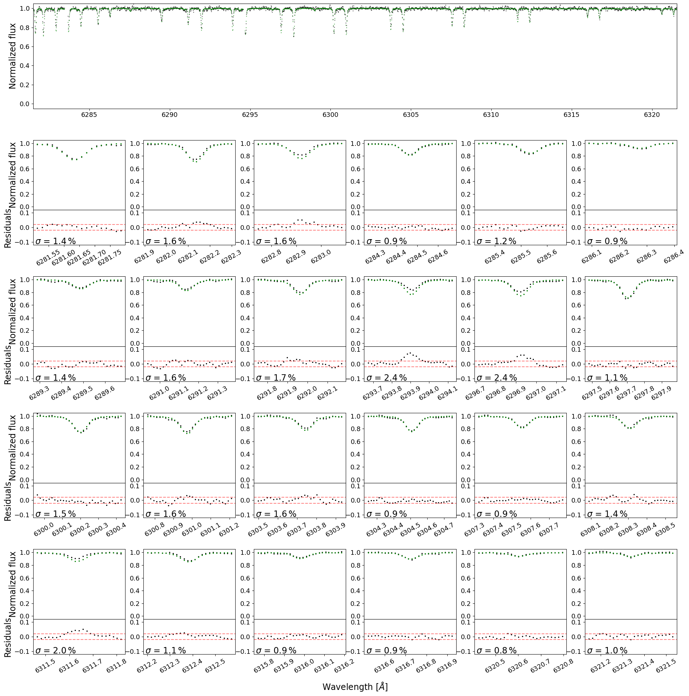
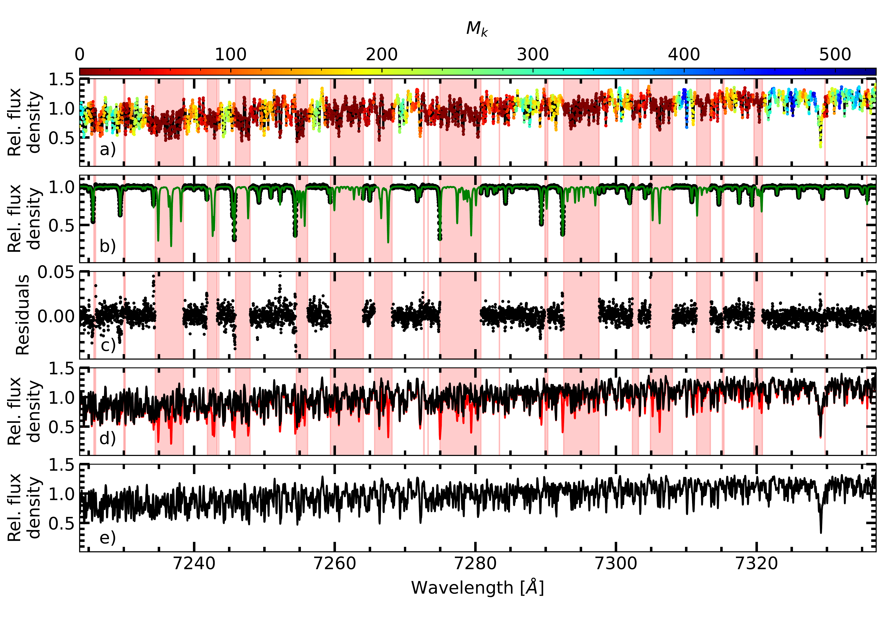
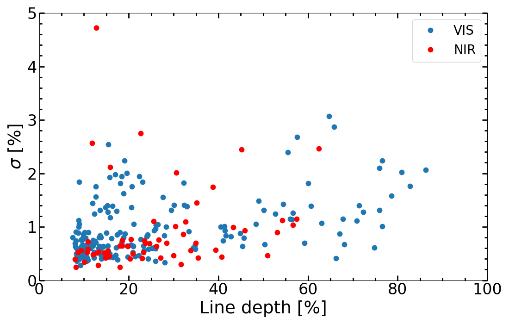
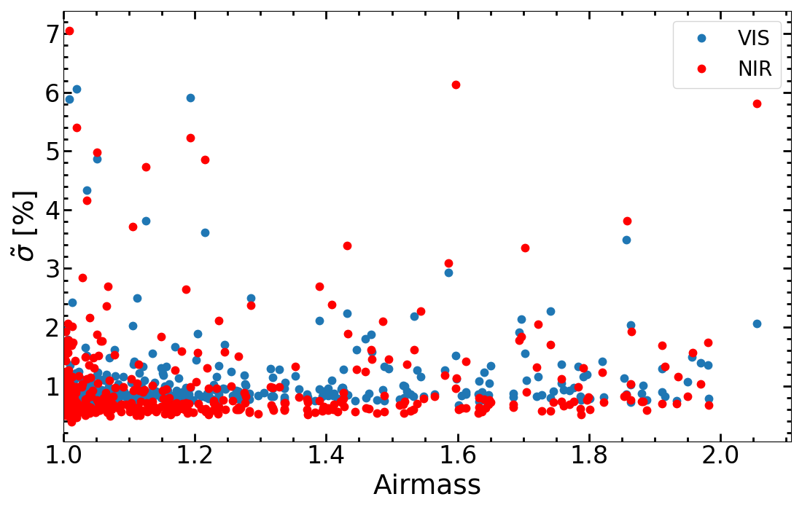
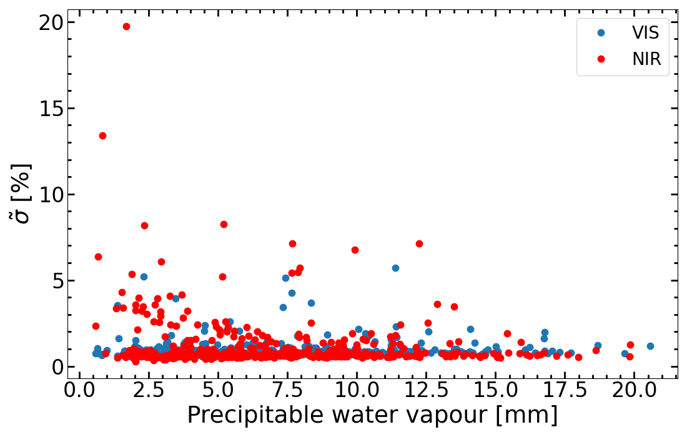

$\newcommand{\ensuremath}{}$
$\newcommand{\xspace}{}$
$\newcommand{\object}[1]{\texttt{#1}}$
$\newcommand{\farcs}{{.}''}$
$\newcommand{\farcm}{{.}'}$
$\newcommand{\arcsec}{''}$
$\newcommand{\arcmin}{'}$
$\newcommand{\ion}[2]{#1#2}$
$\newcommand{\textsc}[1]{\textrm{#1}}$
$\newcommand{\hl}[1]{\textrm{#1}}$
$\newcommand{\footnote}[1]{}$

# The CARMENES search for exoplanets around M dwarfs

<mark>Appeared on: 2023-10-24</mark> -  _31 pages, 24 figures, 3 tables, accepted for publication by A&A_

E. Nagel, et al. -- incl., <mark>M. Kürster</mark>

**Abstract:** Light from celestial objects interacts with the molecules of the Earth's atmosphere,resulting in the production of telluric absorption lines in ground-based spectral data.Correcting for these lines, which strongly affect red and infrared wavelengths,is often needed in a wide variety of scientific applications.Here, we present the template division telluric modeling (TDTM) technique,a method for accurately removing telluric absorption lines in stars thatexhibit numerous intrinsic features.Based on the Earth's barycentric motionthroughout the year, our approach is suited for disentangling telluric andstellar spectral components.By fitting a synthetic transmission model, telluric-free spectra are derived.We demonstrate the performance of the TDTM technique in correctingtelluric contaminationusing a high-resolution optical spectral time series of thefeature-rich M3.0 dwarf star Wolf 294 that was obtained with the CARMENES spectrograph.We apply the TDTM approach to the CARMENES survey sample, which consists of382 targets encompassing 22 357 optical and 20 314 near-infrared spectra,to correct for telluric absorption.The corrected spectra are coadded to constructtemplate spectra for each of our targets.This library of telluric-free, high signal-to-noise ratio, high-resolution ( $\mathcal{R}>80 000$ ) templates comprisesthe most comprehensive collection of spectralM-dwarf data available to date, both in terms of quantity and quality,and is available at the project website.

**Figure 12. -** 
            Example of telluric line fits for the $O_2$ band in a single Wolf 294 spectrum.
            The top panel displays the residual telluric spectrum (black dots)
            after dividing the science spectrum by the stellar template,
            and the best-fit telluric model (green dots) derived with \texttt{molecfit}.
            The subplots illustrate the individual telluric lines (top) and
            the residuals (bottom, black dots), with dashed red lines marking
            a $2 \%$ deviation between data and model. The standard deviation $\sigma$
            of the residuals is also shown in each subplot.
             (*figure:accuracy_O2*)

**Figure 7. -** 
Illustration of the TDTM method.
_Panel a:_ Segment of the VIS template spectrum of Wolf 294.
The number $M_k$ of exposure pixels that contribute to each template knot is color-coded.
The red shaded wavelength ranges mark knots with $M_k = 0$.
_Panel b:_
        One residual telluric spectrum $F_{n,i} / S(\lambda_{n,i})$(black dots)
after the division of the science spectrum by the template,
and the best-fit telluric model ($T(\lambda_{n,i})$, green line) derived with \texttt{molecfit}.
The red shaded wavelength ranges are excluded from the transmission model fit.
_Panel c:_
	Absolute residuals $F_{n,i}/S(\lambda_{n,i}) - T(\lambda_{n,i})$ of the fit.
_Panel d:_
CARMENES spectrum before ($F_{n,i}$, red line) and after ($F_{n,i} / T(\lambda_{n,i})$)
correction with the transmission model derived with \texttt{molecfit}(black line).
_Panel e:_
	Telluric free high S/N template spectrum of Wolf 294 (black line) built using 444 telluric absorption-corrected
CARMENES observations. The order has an S/N of 2310.
 (*figure:tdtm_vis*)

**Figure 3. -** 
        Metrics for assessing the quality of the telluric correction.
        _Top panel:_
        Residual standard deviation ($\sigma$) vs. line depth for a single Wolf 294 VIS (blue) and NIR (red) spectrum.
        _Middle panel:_ Median residual standard deviation ($\tilde{\sigma}$) vs. airmass for all Wolf 294 VIS and NIR spectra.
        _Bottom panel:_ Median $\tilde{\sigma}$ for telluric water bands vs. precipitable water vapor for all Wolf 294 VIS and NIR spectra. (*figure:residuals-vs-linedepth*)

