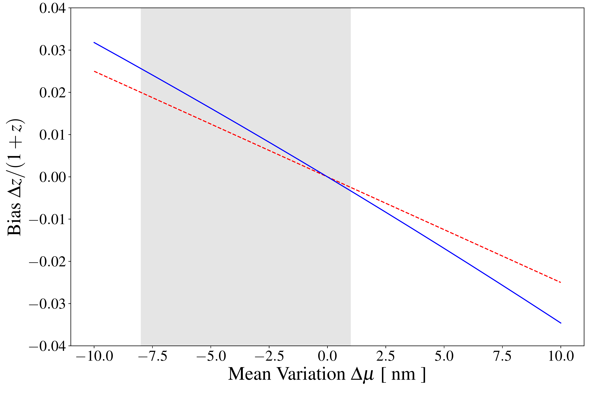
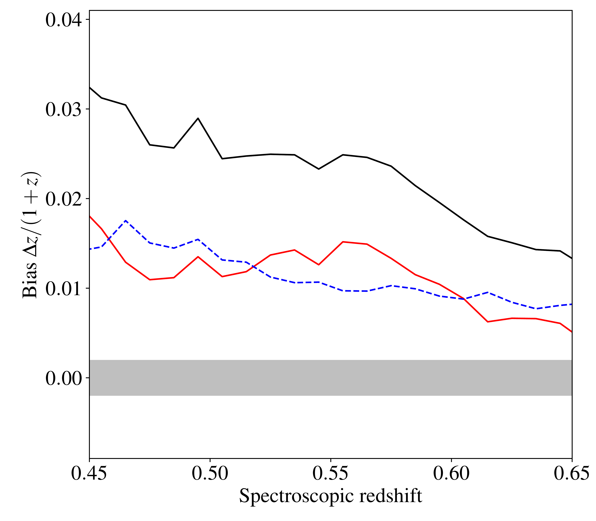

$\newcommand{\ensuremath}{}$
$\newcommand{\xspace}{}$
$\newcommand{\object}[1]{\texttt{#1}}$
$\newcommand{\farcs}{{.}''}$
$\newcommand{\farcm}{{.}'}$
$\newcommand{\arcsec}{''}$
$\newcommand{\arcmin}{'}$
$\newcommand{\ion}[2]{#1#2}$
$\newcommand{\textsc}[1]{\textrm{#1}}$
$\newcommand{\hl}[1]{\textrm{#1}}$
$\newcommand{\footnote}[1]{}$
$\newcommand{\rom}[1]{\uppercase\expandafter{\romannumeral #1\relax}}$
$\newcommand{\phz}{photometric redshift}$
$\newcommand{\phdz}{photometric-redshift}$
$\newcommand{\dd}{\mathrm{d}}$
$\newcommand{\orcid}[1]$

# $\Euclid$ preparation. XXXI. The effect of the variations in photometric passbands on photometric-redshift accuracy

<mark>Appeared on: 2023-10-24</mark> -  _19 pages, 13 figures; Accepted for publication in A&A_

E. Collaboration, et al. -- incl., <mark>M. Schirmer</mark>

**Abstract:** The technique of photometric redshifts has become essential for the exploitation of multi-band extragalactic surveys. While the requirements on $\phz$ s for the study of galaxy evolution mostly pertain to the precision and to the fraction of outliers, the most stringent requirement ${in}$ their use in cosmology is on the accuracy, with a level of bias at the sub-percent level for the $\Euclid$ cosmology mission. A separate, and challenging, calibration process is needed to control the bias at this level of accuracy. ${The bias in \phz s has several distinct origins that may not always be easily overcome.}$ We identify here one source of bias linked to the spatial or time variability of the passbands used to determine the photometric colours of galaxies. We first quantified the effect as observed on several well-known photometric cameras, and ${found in particular that, due to the properties of optical filters, the redshifts of off-axis sources are usually overestimated}$ . We show using simple simulations that the detailed and complex changes in the shape can be mostly ignored and that it is sufficient to know the ${mean}$ wavelength of the passbands of each photometric observation to correct almost exactly for this bias; ${the key point is that this mean wavelength is independent of the spectral energy distribution of the source}$ . We use this property to propose a ${correction that can be computationally efficiently implemented in some \phdz algorithms}$ , in particular template-fitting. We verified that our algorithm, implemented in the new $\phdz$ code \texttt{Phosphoros} , can effectively reduce the bias in $\phz$ s on real data using the CFHTLS T007 survey, with an average measured bias $\Delta z$ over the redshift range $0.4\le z\le 0.7$ decreasing by about 0.02, ${specifically from $\Delta z\simeq 0.04$ to $\Delta z\simeq 0.02$ around $z=0.5$}$ . Our algorithm is also able to produce corrected photometry for other applications.

**Figure 2. -** Bias $\Delta z$ resulting from a shift of $\Delta\mu$ in the $G$ passband for $z=0.15$(solid blue line). The dashed red line is the `theoretical' bias $\Delta\mu/400$ nm, where $\Delta\mu$ is the error on the location of the Balmer break. The grey area shows the domain of variations of the mean wavelengths of the measured MegaCam $r$ passbands (from 0 to 8 nm). (*fig:toy_mean*)

**Figure 4. -** Median bias in $\phdz$ predictions as a function of redshift for the original catalogue (black line) and when taking into account the correction in the mean passband wavelengths (red line). {The dashed blue line shows the reduction in the bias between the two solid curves.} The grey area indicates the \Euclid requirement. While it is clear that the passband correction reduces the bias significantly, there is still a need for a post-processing calibration step in order to meet the \Euclid requirements. (*fig:shift_bias*)

**Figure 5. -** Correction factors $C^{\alpha}_T(\Delta\lambda)$(blue points) and the corresponding approximation with a second-degree polynomial (red line) for four arbitrary values of the passband $T(\lambda)$ and of the coordinates $\alpha$ in the model grid. (*fig:corr_factor*)

