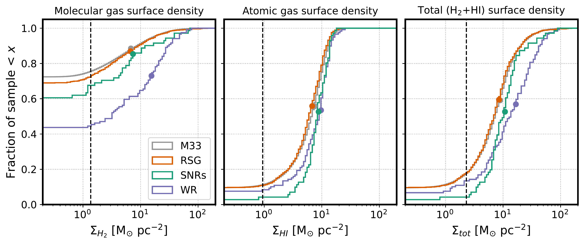

$\newcommand{\ensuremath}{}$
$\newcommand{\xspace}{}$
$\newcommand{\object}[1]{\texttt{#1}}$
$\newcommand{\farcs}{{.}''}$
$\newcommand{\farcm}{{.}'}$
$\newcommand{\arcsec}{''}$
$\newcommand{\arcmin}{'}$
$\newcommand{\ion}[2]{#1#2}$
$\newcommand{\textsc}[1]{\textrm{#1}}$
$\newcommand{\hl}[1]{\textrm{#1}}$
$\newcommand{\footnote}[1]{}$
$\newcommand{\vdag}{(v)^\dagger}$
$\newcommand$
$\newcommand$
$\newcommand{\Msun}{M_{\odot}}$
$\newcommand{\Mdot}{M_{\odot} yr^{-1}\xspace}$
$\newcommand{\kms}{km s^{-1}\xspace}$
$\newcommand{\Msunpc}{M_{\odot} pc^{-2}\xspace}$
$\newcommand{\fmol}{f_{\mathrm{H_2}}\xspace}$
$\newcommand{\hi}{\ion{H}{1}\xspace}$
$\newcommand{\hii}{\ion{H}{2}\xspace}$
$\newcommand{\cmc}{cm^{-3}\xspace}$
$\newcommand{\mum}{\mum\xspace}$
$\newcommand{\cmipsunit}{(erg s^{-1})(M_{\odot} yr^{-1})^{-1}\xspace}$

# Where do stars explode in the ISM? -- The distribution of dense gas around massive stars and supernova remnants in M33

<mark>Appeared on: 2023-10-30</mark> -  _34 pages, 14 figures. Submitted to ApJ. Comments welcome! The density distributions will be made publicly available after journal acceptance of manuscript. Please feel free to contact us in the meantime if you would like to use them_

S. K. Sarbadhicary, et al. -- incl., <mark>F. Walter</mark>

**Abstract:** Star formation in galaxies is regulated by turbulence, outflows, gas heating and cloud dispersal -- processes which depend sensitively on the properties of the interstellar medium (ISM) into which supernovae (SNe) explode. Unfortunately, direct measurements of ISM environments around SNe remain scarce, as SNe are rare and often distant. Here we demonstrate a new approach: mapping the ISM around the massive stars that are soon to explode. This provides a much larger census of explosion sites than possible with only SNe, and allows comparison with sensitive, high-resolution maps of the atomic and molecular gas from the Jansky VLA and ALMA. In the well-resolved Local Group spiral M33, we specifically observe the environments of red supergiants (RSGs, progenitors of Type II SNe), Wolf-Rayet stars (WRs, tracing stars $>$ 30 $\Msun$ , and possibly future stripped-envelope SNe), and supernova remnants (SNRs, locations where SNe have exploded). We find that massive stars evolve not only in dense, molecular-dominated gas (with younger stars in denser gas), but also a substantial fraction ( $\sim$ 45 \% of WRs; higher for RSGs) evolve in lower-density, atomic-gas-dominated, inter-cloud media. We show that these measurements are consistent with expectations from different stellar-age tracer maps, and can be useful for validating SN feedback models in numerical simulations of galaxies. Along with the discovery of a 20-pc diameter molecular gas cavity around a WR, these findings re-emphasize the importance of pre-SN/correlated-SN feedback evacuating the dense gas around massive stars before explosion, and the need for high-resolution (down to pc-scale) surveys of the multi-phase ISM in nearby galaxies.

**Figure 8. -** Cumulative distribution functions showing $H_2$, $\hi$, and total ($H_2$ + $\hi$) surface densities. Distributions are shown for the locations of WRs (blue lines), SNRs (green lines) and RSGs (red lines), while grey histograms denote the distribution of densities of the full M33 region, representing what would be expected for a random distribution. Vertical dashed lines denote the completeness limit of each dataset. Colored circles show the median of the distribution above the completeness limit. The distributions show a higher probability of more massive stars (e.g. the WRs) to evolve in denser gas. (*fig:3paneldensities*)

**Figure 7. -** The spatial distribution of red supergiants (RSGs), Wolf-Rayet stars (WRs) and supernova remnants (SNRs) with respect to the cold ($H_2$ + $\hi$) ISM in the M33 ACA survey region (shown in the inset plot). Orange circles represent RSGs with log $(L/L_{\odot})\geq 4.7$(roughly corresponding to $\gtrsim$12$\Msun$). Bluish circles show WRs and green stars show SNRs. $\hi$ is shown in grey-scale with the density range shown in the bottom colorbar. Contours of CO (2-1) emission (converted to $H_2$ surface densities) are also shown at levels of 1.9, 7.6, 15.3 and 30.6 M$_{\odot}$ pc$^{-2}$. The prominent star-forming regions in the ACA footprint -- NGC 604, IC 142 and NGC 595 -- are specifically labelled (showing high WR concentrations). The black box shows a region containing a WR and SNR with higher-resolution ALMA data in Figure 6. The map shows the 50 pc-scale cold ISM environments where core-collapse SNe will occur in the future (or have occured in the case of SNRs). Statistical analysis of these environments and their implications are discussed in Section \ref{sec:results} and \ref{sec:discussion}. (*fig:maps*)

**Figure 11. -** Cumulative density histograms of the observed and modeled populations of RSGs, WRs, and SNRs from Section \ref{sec:sfrtracers}. Dark grey histogram in each panel shows the bulk $H_2$ distribution in M33 in the ACA area. Solid colored line denotes the $H_2$ surface density of the star category. Colored shaded region shows the 5th-95th percentile region of the mock populations drawn according to Section \ref{sec:sfrtracers}.  (*fig:mocks*)

