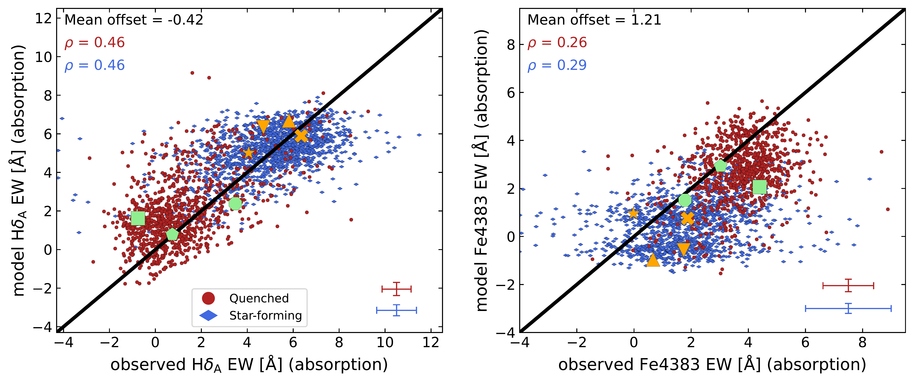
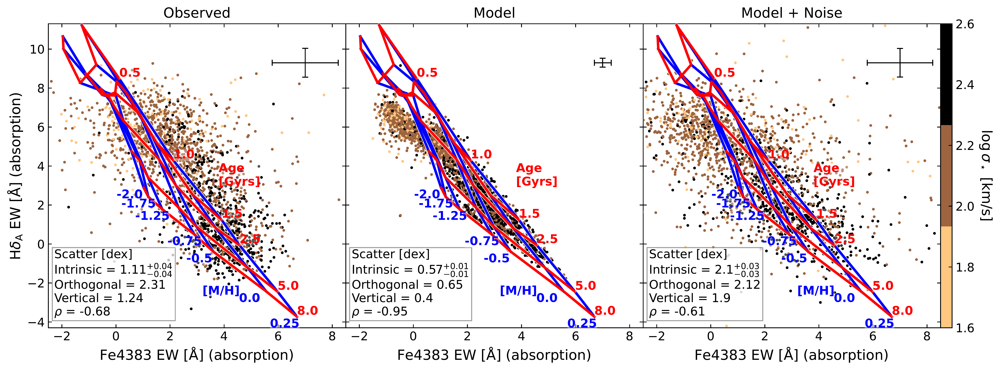
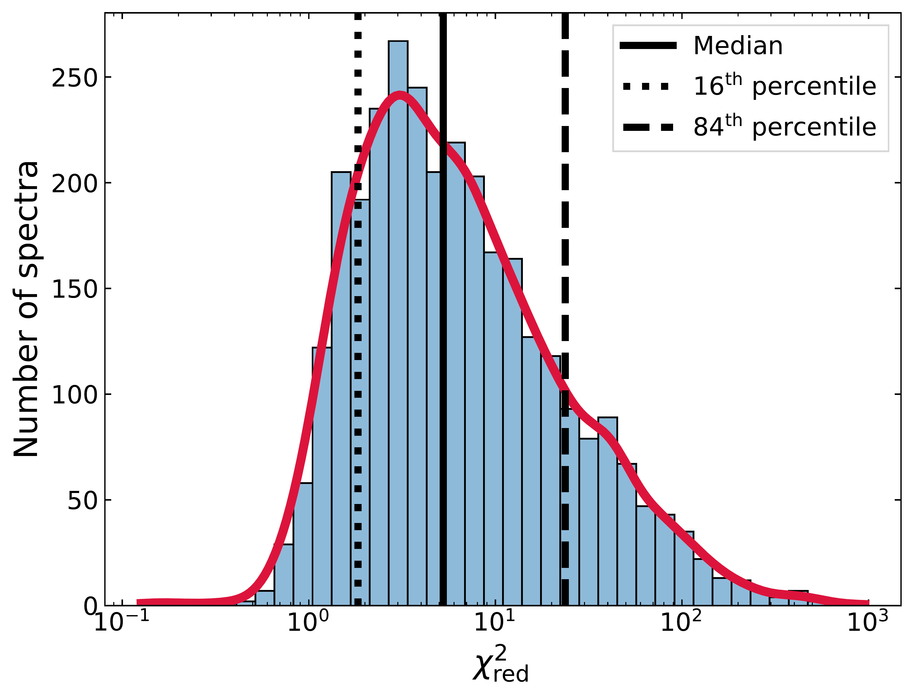

$\newcommand{\ensuremath}{}$
$\newcommand{\xspace}{}$
$\newcommand{\object}[1]{\texttt{#1}}$
$\newcommand{\farcs}{{.}''}$
$\newcommand{\farcm}{{.}'}$
$\newcommand{\arcsec}{''}$
$\newcommand{\arcmin}{'}$
$\newcommand{\ion}[2]{#1#2}$
$\newcommand{\textsc}[1]{\textrm{#1}}$
$\newcommand{\hl}[1]{\textrm{#1}}$
$\newcommand{\footnote}[1]{}$
$\newcommand$
$\newcommand{\vsig}{v_{5}/\sigma_{0}}$
$\newcommand{\rA}{\mathrm{Å}}$
$\newcommand{\msun}{\mathrm{M}_{\sun}}$
$\newcommand{\logm}{\mathrm{logM/\msun}}$
$\newcommand{\sigs}{\sigma'_{\star,\rm{int}}}$
$\newcommand{\sigg}{\sigma'_{g,\rm{int}}}$
$\newcommand{\ha}{H\alpha}$
$\newcommand{\hb}{H\beta}$
$\newcommand{\hg}{H\gamma}$
$\newcommand{\hd}{H\delta}$
$\newcommand{\dfn}{D4000_n}$
$\newcommand{\hda}{\hd_\mathrm{A}}$
$\newcommand{\mgt}{\mathrm{Mg_{2}}}$
$\newcommand{\vdag}{(v)^\dagger}$
$\newcommand$
$\newcommand{\e}{é}$
$\newcommand{\amen}[1]{\textbf{\textit{#1}}}$
$\newcommand{\arraystretch}{2.0}$

# Less is less: photometry alone cannot predict the observed spectral indices of $z\sim1$ galaxies from the LEGA-C spectroscopic survey

<mark>Appeared on: 2023-10-30</mark> -  _13 pages, 8 figures, accepted 26 October 2023_

A. Nersesian, et al. -- incl., <mark>A. d. Graaff</mark>

**Abstract:** We test whether we can predict optical spectra from deep-field photometry of distant galaxies. Our goal is to perform a comparison in data space, highlighting the differences between predicted and observed spectra. The Large Early Galaxy Astrophysics Census (LEGA-C) provides high-quality optical spectra of thousands of galaxies at redshift $0.6<z<1$. Broad-band photometry of the same galaxies, drawn from the recent COSMOS2020 catalog, is used to predict the optical spectra with the spectral energy distribution (SED) fitting code Prospector and the MILES stellar library. The observed and predicted spectra are compared in terms of two age and metallicity-sensitive absorption features (H$\delta_\mathrm{A}$ and Fe4383). The global bimodality of star-forming and quiescent galaxies in photometric space is recovered with the model spectra. But the presence of a systematic offset in the Fe4383 line strength and the weak correlation between the observed and modeled line strength imply that accurate age or metallicity determinations cannot be inferred from photometry alone. For now we caution that photometry-based estimates of stellar population properties are determined mostly by the modeling approach and not the physical properties of galaxies, even when using the highest-quality photometric datasets and state-of-the-art fitting techniques. When exploring a new physical parameter space (i.e. redshift or galaxy mass) high-quality spectroscopy is always needed to inform the analysis of photometry. 

**Figure 3. -** Predicted $\hd$a and Fe4383 absorption features from {\tt Prospector} fits to the COSMOS2020 photometry compared to observations. Galaxies are color-coded by their $UVJ$--diagram classification to star-forming (blue diamonds) and quenched (red points). The absorption-only models are compared to the observed values (corrected for emission). The black line shows the one-to-one relation. The various markers correspond to the star-forming (orange) and quenched (green) galaxies shown in Fig. \ref{fig:sed_examples}. The statistics of the mean offset and the Spearman's rank correlation coefficient ($\rho$), are shown in the top-left corner of each panel. (*fig:hd_fe4383_obs_vs_prd*)

**Figure 4. -** Left: Observed $\hd$a versus Fe4383. Middle: Predicted $\hd$a versus Fe4383. Right: Perturbed model values according to the individual observed errors. Galaxies are color-coded with $\log \sigma_\star$ from the LEGA-C DR3 catalog. The SSP model grid is shown with the red (Age) and blue (metallicity) lines. The statistics of the scatter and the Spearman's rank correlation coefficient ($\rho$) are shown in the bottom-left corner of each panel. The median uncertainties of each axis are shown in the top-right corner of each panel. (*fig:hd_vs_fe4383*)

**Figure 1. -** Distribution of the reduced $\chi^2$ between the predicted spectra with {\tt Prospector} and the observed LEGA-C spectra. The Kernel Density Estimate (KDE) distribution is shown in red, while the solid black line shows the median value. The dotted and dashed black lines indicate the $16^\mathrm{th}$ and $84^\mathrm{th}$ percentiles of the distribution, respectively. (*fig:chisqr*)

