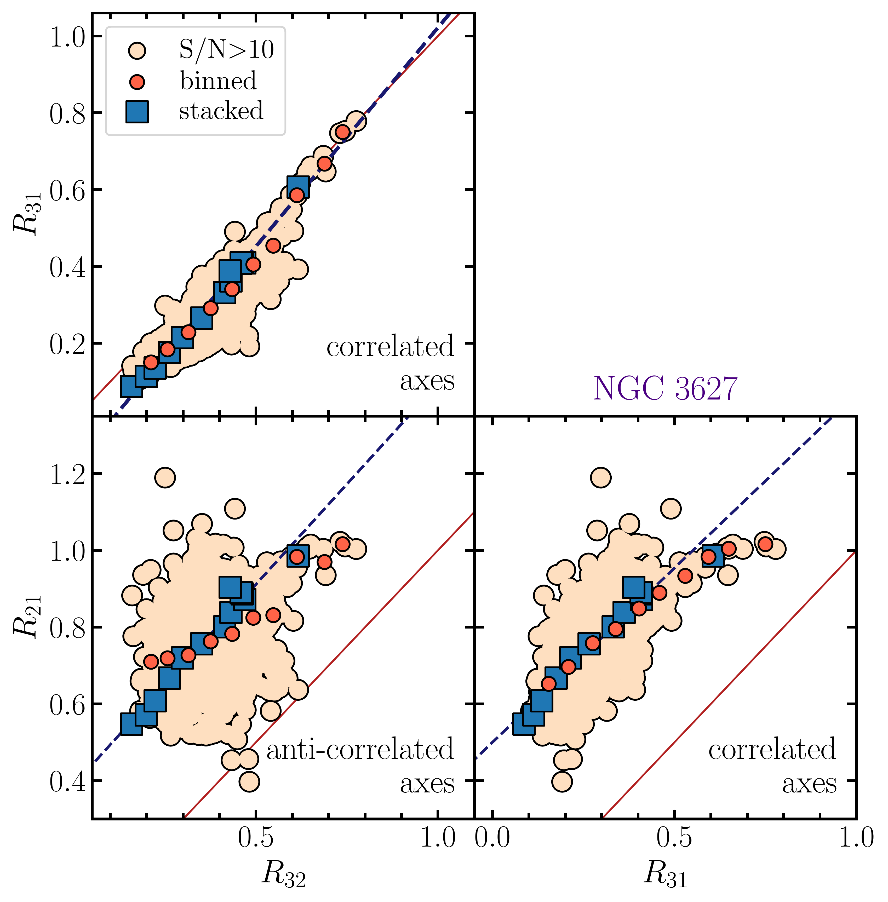

$\newcommand{\ensuremath}{}$
$\newcommand{\xspace}{}$
$\newcommand{\object}[1]{\texttt{#1}}$
$\newcommand{\farcs}{{.}''}$
$\newcommand{\farcm}{{.}'}$
$\newcommand{\arcsec}{''}$
$\newcommand{\arcmin}{'}$
$\newcommand{\ion}[2]{#1#2}$
$\newcommand{\textsc}[1]{\textrm{#1}}$
$\newcommand{\hl}[1]{\textrm{#1}}$
$\newcommand{\footnote}[1]{}$
$\newcommand{  \Hi      }{\ifmmode{\rm H} \textsc{i} \else H \textsc{i}\fi}$
$\newcommand{\delim}{{-}}$
$\newcommand{\figureautorefname}{Fig.}$
$\newcommand{\equationautorefname}{Eq.}$
$\newcommand{\sectionautorefname}{Section}$
$\newcommand{\subsectionautorefname}{Section}$
$\newcommand{\subsubsectionautorefname}{Section}$
$\newcommand{\appendixautorefname}{Appendix}$
$\newcommand{\arraystretch}{1.5}$
$\newcommand{\thebibliography}{\DeclareRobustCommand{\VAN}[3]{##3}\VANthebibliography}$

# Resolved low-$J$ $^{12}$CO excitation at $190$ parsec resolution across NGC 2903 and NGC 3627

<mark>Appeared on: 2023-10-31</mark> -  _accepted for publication in MNRAS, 17 pages, 16 figures_

J. S. d. Brok, et al. -- incl., <mark>E. Schinnerer</mark>

**Abstract:** The low- $J$ rotational transitions of $\chem{^{12}CO}$ are commonly used to trace the distribution of molecular gas in galaxies. Their ratios are sensitive to excitation and physical conditions in the molecular gas. Spatially resolved studies of CO ratios are still sparse and affected by flux calibration uncertainties, especially since most do not have high angular resolution or do not have short-spacing information and hence miss any diffuse emission. We compare the low- $J$ CO ratios across the disk of two massive, star-forming spiral galaxies NGC 2903 and NGC 3627 to investigate whether and how local environments drive excitation variations at GMC scales. We use Atacama Large Millimeter Array (ALMA) observations of the three lowest- $J$ CO transitions at a common angular resolution of 4 $"$ (190 pc).We measure median line ratios of $R_{21}=0.67^{+0.13}_{-0.11}$ , $R_{32}=0.33^{+0.09}_{-0.08}$ , and $R_{31}=0.24^{+0.10}_{-0.09}$ across the full disk of NGC 3627. We see clear CO line ratio variation across the galaxy consistent with changes in temperature and density of the molecular gas. In particular, toward the center, $R_{21}$ , $R_{32}$ , and $R_{31}$ increase by 35 \% , 50 \% , and 66 \% , respectively compared to their average disk values.The overall line ratio trends suggest that CO(3-2) is more sensitive to changes in the excitation conditions than the two lower- $J$ transitions. Furthermore, we find a similar radial $R_{32}$ trend in NGC 2903, albite a larger disk-wide average of $\langle R_{32}\rangle=0.47^{+0.14}_{-0.08}$ . We conclude that the CO low- $J$ line ratios vary across environments in such a way that they can trace changes in the molecular gas conditions, with the main driver being changes in temperature.

**Figure 4. -** ** CO ratio-to-ratio comparison in NGC 3627**. The panels depict the three permutations of comparing $R_{21}$, $R_{32}$, and $R_{31}$ to each other. The light-colored points have S/N${>}5$ in all lines. The filled circles are the binned trend. The filled squares represent the result when computing the line ratio from the spectral stacks by SFR (using all lines of sight irrespective of S/N). For reference, the red line indicates the 1:1 relation. We perform a linear regression to the stacked data points, represented as a black dashed line. We note that the axes of the different panels are correlated. The sense of the implicit correlation between the plotted variables is indicated in each panel.  (*fig:ratio_vs_ratio*)

**Figure 13. -** ** CO line ratio trends with $\Sigma_{\rm SFR**$ and dust tracers $I_{7.7 \mu\rm m}$ (PAH) and  $I_{7.7 \mu\rm m}$ (hot dust)}. The different panels show the trends of $R_{21}$(_top_), $R_{32}$(_middle_), and $R_{31}$(_bottom_) for the different environments. The orange hexagonal bins represent the 2D histogram of $\rm S/N{\ge}5$ sightlines. We note that the stacked trends also include the sightlines $\rm S/N{<}5$.
     (*fig:ratio_comp*)

**Figure 11. -** ** CO line ratio trends with galactocentric radius in NGC 3627**. The panels on the left show the radial trend of $R_{21}$(_top_), $R_{32}$(_center_), and $R_{31}$(_bottom_). The red-shaded region shows the radial extent beyond which our sampling is limited by the map size. The large filled circles show the stacked (we stack datapoints irrespective of the different regions).  The sightlines are color-coded by different environmental regions. For reference, the gray ellipses indicate deprojected radial distances of 1, 2, 3, 4, 5, and 6 kpc. The extent of the different regions is shown in the CO line ratio maps on the right-hand side. For these panels, we only select data points where line intensities have ${\rm S/N}{>5}$ for both the denominator and numerator of the ratio. (*fig:ngc3627_ratio*)

