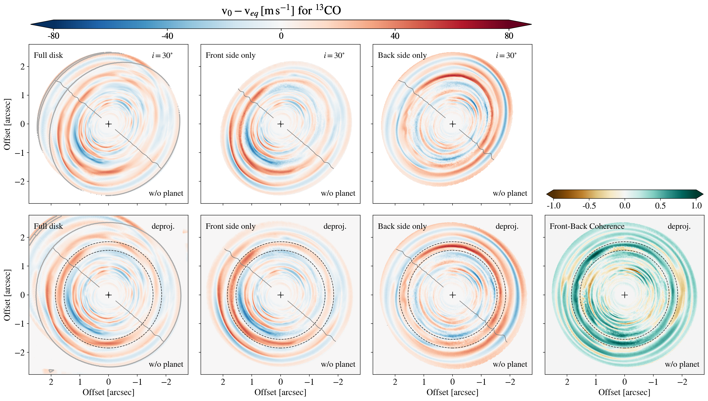

$\newcommand{\ensuremath}{}$
$\newcommand{\xspace}{}$
$\newcommand{\object}[1]{\texttt{#1}}$
$\newcommand{\farcs}{{.}''}$
$\newcommand{\farcm}{{.}'}$
$\newcommand{\arcsec}{''}$
$\newcommand{\arcmin}{'}$
$\newcommand{\ion}[2]{#1#2}$
$\newcommand{\textsc}[1]{\textrm{#1}}$
$\newcommand{\hl}[1]{\textrm{#1}}$
$\newcommand{\footnote}[1]{}$
$\newcommand{\sgn}{\text{sgn}}$

# Kinematic signatures of planet-disk interactions$\in VSI-turbulent protoplanetary disks$

<mark>Appeared on: 2023-10-31</mark> -  _Accepted for publication in Astronomy & Astrophysics. 27 pages, 17 figures and 2 tables_

M. Barraza-Alfaro, <mark>M. Flock</mark>, T. Henning

**Abstract:** Planets are thought to form inside weakly ionized regions of protoplanetary disks, in which turbulence creates ideal conditions for solid growth. However, the nature of this turbulence is still uncertain. In fast cooling parts of this zone the vertical shear instability (VSI) can operate, inducing a low level of gas turbulence and large-scale gas motions. Resolving kinematic signatures of active VSI could reveal the origin of turbulence in planet-forming disk regions. However, an exploration of kinematic signatures of the interplay between VSI and forming planets is needed for a correct interpretation of radio interferometric observations. A robust detection of VSI would open the door for a deeper understanding of the impact of gas turbulence on planet formation. The objective of this study is to explore the effect of the VSI on the disk substructures triggered by an embedded fairly massive planet. We will focus on the impact of this interplay on CO kinematic observations with the ALMA interferometer. We conducted global 3D hydrodynamical simulations of VSI-unstable disks with and without embedded massive planets, exploring Saturn- and Jupiter-mass cases. We studied the effect of planets on the VSI gas dynamics, comparing with viscous disks.   Post-processing the simulations with a radiative transfer code, we examined the kinematic signatures expected in CO molecular line emission, varying disk inclination. Further, we simulate deep ALMA high-resolution observations of our synthetic images, to test the observability of VSI and planetary signatures. The embedded planet produces a damping of the VSI along a radial region, most effective at the disk midplane. For the Saturn case, the VSI modes are distorted by the planet's spirals producing mixed kinematic signatures. For the Jupiter case, the planet's influence dominates the overall disk gas kinematics. The presence of massive planets embedded in the disk can weaken the VSI large-scale gas flows, limiting its observability in CO kinematic observations with ALMA.

**Figure 1. -** Snapshots of the VSI-unstable hydrodynamical simulations at the disk midplane. From top to bottom: simulation without an embedded planet, with an embedded Saturn-mass planet, and with an Jupiter-mass planet. From left to right: gas density relative to the initial value ($\rho/\rho_0$), radial velocity field ($v_r$), meridional velocity field ($v_{\theta}$), and azimuthal velocity deviations from Keplerian rotation ($v_{\phi}-v_{\rm Kep}$).
The included planets are orbiting at $100$ au from the central star, marked with dotted lines in the second and third rows. The dashed lines in the first panel indicate the buffer zones applied in the hydro simulations. (*fig:simulationsvsimidplane*)

**Figure 2. -** Snapshots of the VSI-unstable hydrodynamical simulations at the disk surface. Same as Figure \ref{fig:simulationsvsimidplane}, but obtained at 3 pressure scale heights from the disk midplane ($Z\sim 3H$). (*fig:simulationsvsisurface*)

**Figure 9. -** Deviations from Keplerian rotation for $^{13}$CO$(3-2)$ synthetic images of the post-processed simulations, for a VSI unstable disk without embedded planets. In the first row, from left to right, we show models including the full disk, only the disk hemisphere closer to the observer (front side), and the farther hemisphere of the disk (back side), for a disk inclination of 30 degrees. In the second row, a deprojected view of the residual maps (first row) is shown. The fourth panel, shows a normalized square root of the product of the front and back sides deprojected residual maps, times the sign of the initial multiplication of both residuals. A ring of interest is enclosed by black-dashed lines, drawn at 1.55 and 1.85 arcsec. The black solid line along the semi-minor axis in the non-Keplerian residuals shows the line of zero gas velocity projected into the line-of-sight. (*fig:residualstwolayersvsi*)

