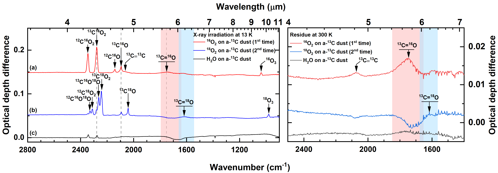
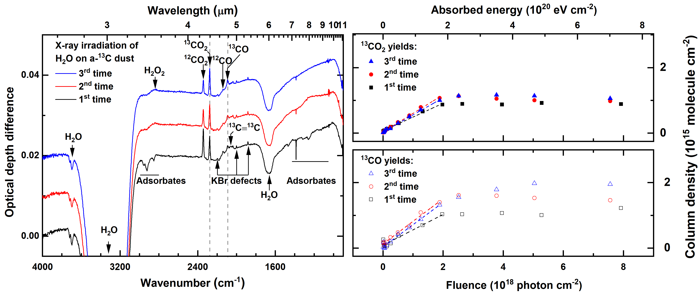
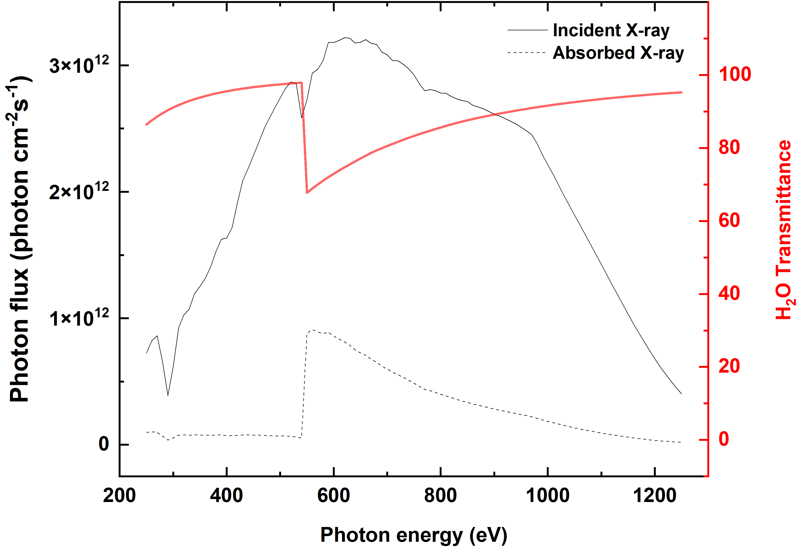

$\newcommand{\ensuremath}{}$
$\newcommand{\xspace}{}$
$\newcommand{\object}[1]{\texttt{#1}}$
$\newcommand{\farcs}{{.}''}$
$\newcommand{\farcm}{{.}'}$
$\newcommand{\arcsec}{''}$
$\newcommand{\arcmin}{'}$
$\newcommand{\ion}[2]{#1#2}$
$\newcommand{\textsc}[1]{\textrm{#1}}$
$\newcommand{\hl}[1]{\textrm{#1}}$
$\newcommand{\footnote}[1]{}$
$\newcommand{\vdag}{(v)^\dagger}$
$\newcommand$
$\newcommand$

# Interstellar carbonaceous dust erosion induced by X-ray irradiation of water ice in star-forming regions

<mark>Appeared on: 2023-10-31</mark> -  _12 pages, 9 figures, 1 table_

K.-J. Chuang, et al. -- incl., <mark>C. Jäger</mark>

**Abstract:** The chemical inventory of protoplanetary midplanes is the basis for forming planetesimals. Among them, solid-state reactions based on CO/$CO_2$ toward molecular complexity on interstellar dust grains have been studied in theoretical and laboratory work.The physicochemical interactions between ice, constituted mainly of $H_2$ O, and dust surfaces are limited to a few experimental studies focusing on vacuum ultraviolet and cosmic-ray processing.In this work, the erosion of C dust grains induced by X-ray irradiation of $H_2$ O ice was systematically investigated for the first time. The work aims to provide a better understanding of the reaction mechanism using selectively isotope-labeled oxygen/carbon species in kinetic analysis.Ultrahigh vacuum experiments were performed to study the interstellar ice analog on sub- $\mu$ m thick C dust at $\sim$ 13 K. $H_2$ O or $O_2$ ice was deposited on the pre-synthesized amorphous C dust and exposed to soft X-ray photons (250--1250 eV). Fourier-transform infrared spectroscopy was used to monitor in situ the newly formed species as a function of the incident photon fluence. Field emission scanning electron microscopy was used to monitor the morphological changes of (non-)eroded carbon samples.The X-ray processing of the ice/dust interface leads to the formation of $CO_2$ , which further dissociates and forms CO.Carbonyl groups are formed by oxygen addition to grain surfaces and are confirmed as intermediate species in the formation process. The yields of CO and $CO_2$ were found to be dependent on the thickness of the carbon layer.The astronomical relevance of the experimental findings is discussed.

**Figure 8. -** Left: the IR difference spectra obtained before and after X-ray irradiation of (a) $^{(16)}$O$_{2}$ and (b) $^{18}$O$_{2}$ ices on the same a-$^{13}$C dust analog as well as (c) $H_2$O on a-$^{13}$C dust analog at 15 K for 60 minutes. Right: the corresponding residual spectra measured at 300 K. The thickness of a-$^{13}$C dust is $\sim$100 nm, and the deposited abundances of $H_2$O and $^{(16/18)}$O$_{2}$ are $\sim$5 $\times$ 10$^{17}$ molecule cm$^{-2}$. The total fluence of X-ray photons is (7.6--7.9) $\times$ 10$^{18}$ photon cm$^{-2}$. The dashed lines highlight the peak position of $^{13}$C-labeled products, and the shadowed area highlights the regions of the carbonyl group feature. The spectra are offset for clarity.
             (*Fig2*)

**Figure 7. -** Left: the IR difference spectra obtained before and after X-ray irradiation of $H_2$O ice on a-$^{13}$C dust analog at 15 K for 60 minutes. The thickness of a-$^{13}$C dust is $\sim$100 nm, and the deposited abundance of $H_2$O is $\sim$5 $\times$ 10$^{17}$ molecule cm$^{-2}$. The dashed lines highlight the peak position of $^{13}$C-labeled products. The spectra are offset for clarity. Right: abundance evolution of the product $^{13}$$CO_2$(solid) and $^{13}$CO (open) obtained from the X-ray irradiation of $H_2$O ice on the same a-$^{13}$C dust over X-ray photons fluence of (7.6--8.0) $\times$ 10$^{18}$ photon cm$^{-2}$(i.e., (7.0--7.4) $\times$ 10$^{20}$ eV cm$^{-2}$). The dashed lines show the linear fit for the initial formation rate. (*Fig1*)

**Figure 4. -** The X-ray photon flux and $H_2$O transmittance as a function of photon energy. (*FigA1*)

