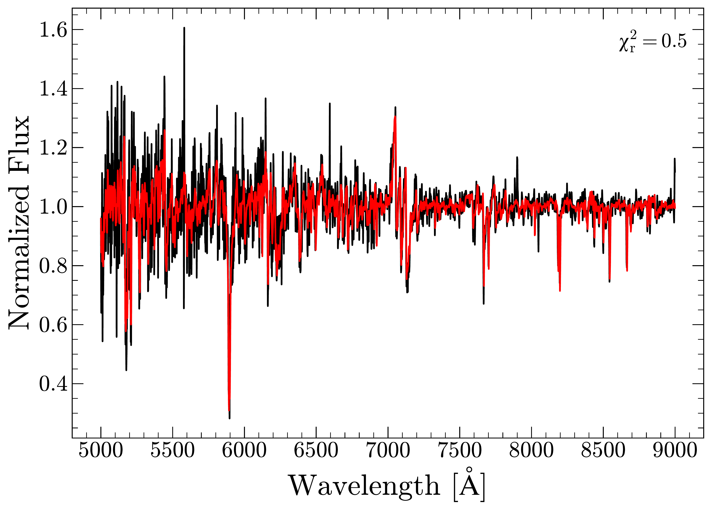

 to $2\sigma$, mean absolute error of $14.2$ km s$^{-1}$, and bias of $0.2$ km s$^{-1}$. (*fig:koester-falcon*)

**Figure 4. -** Main sequence radial velocity fit using templates from MaStar. Radial velocity is calculated from a template spectrum via $\chi^2$ minimization. _Red:_ MaStar template spectrum. _Black:_ Observed main sequence spectrum from SDSS-IV. (*fig:ms_rv*)

