

$\newcommand{\ensuremath}{}$
$\newcommand{\xspace}{}$
$\newcommand{\object}[1]{\texttt{#1}}$
$\newcommand{\farcs}{{.}''}$
$\newcommand{\farcm}{{.}'}$
$\newcommand{\arcsec}{''}$
$\newcommand{\arcmin}{'}$
$\newcommand{\ion}[2]{#1#2}$
$\newcommand{\textsc}[1]{\textrm{#1}}$
$\newcommand{\hl}[1]{\textrm{#1}}$
$\newcommand{\footnote}[1]{}$
$\newcommand{\sourceid}{\texttt{source\_id}}$
$\newcommand{\deriv}{\ensuremath{\mathrm{d}}}$
$\newcommand{\given}{\ensuremath{\hspace{0.05em}\mid\hspace{0.05em}}}$
$\newcommand{\logten}{\ensuremath{\log_{\rm 10}}}$
$\newcommand{\deriv}{\ensuremath{\mathrm{d}}}$
$\newcommand{\given}{\ensuremath{\hspace{0.01em}\mid\hspace{0.01em}}}$
$\newcommand{\logten}{\ensuremath{\log_{\rm 10}}}$
$\newcommand{\gaia}{Gaia}$
$\newcommand{\gdr}[1]{GDR{#1}}$
$\newcommand{\gedr}[1]{GeDR{#1}}$
$\newcommand{\mock}{GeDR3mock}$
$\newcommand{\release}{GDR3}$
$\newcommand{\gmag}{\ensuremath{G}}$
$\newcommand{\parallax}{\ensuremath{\varpi}}$
$\newcommand{\parallaxzp}{\ensuremath{\varpi_{\rm zp}}}$
$\newcommand{\fpu}{\ensuremath{\sigparallax/\parallax}}$
$\newcommand{\propm}{\ensuremath{\mu}}$
$\newcommand{\pmra}{\ensuremath{\mu_{\alpha*}}}$
$\newcommand{\pmdec}{\ensuremath{\mu_{\delta}}}$
$\newcommand{\sigparallax}{\ensuremath{\sigma_{\varpi}}}$
$\newcommand{\cov}{\ensuremath{\Sigma}}$
$\newcommand{\glon}{\ensuremath{l}}$
$\newcommand{\glat}{\ensuremath{b}}$
$\newcommand{\hp}{\ensuremath{p}}$
$\newcommand{\dist}{\ensuremath{r}}$
$\newcommand{\rest}{\ensuremath{\dist_{\rm est}}}$
$\newcommand{\rlo}{\ensuremath{\dist_{\rm lo}}}$
$\newcommand{\rhi}{\ensuremath{\dist_{\rm hi}}}$
$\newcommand{\rmode}{\ensuremath{\dist_{\rm mode}}}$
$\newcommand{\rmed}{\ensuremath{\dist_{\rm med}}}$
$\newcommand{\rEDSDmode}{\ensuremath{\dist^{\rm EDSD}_{\rm mode}}}$
$\newcommand{\rinit}{\ensuremath{\dist_{\rm init}}}$
$\newcommand{\rlen}{\ensuremath{L}}$
$\newcommand{\myalpha}{\ensuremath{\alpha}}$
$\newcommand{\mybeta}{\ensuremath{\beta}}$
$\newcommand{\vra}{\ensuremath{v_{\alpha*}}}$
$\newcommand{\vdec}{\ensuremath{v_{\delta}}}$
$\newcommand{◦ee}{\ensuremath{^\circ}}$
$\newcommand{\kms}{\ensuremath{\mathrm{km} \mathrm{s}^{-1}}}$
$\newcommand{\pc}{\ensuremath{\mathrm{pc}}}$
$\newcommand{\kpc}{\ensuremath{\mathrm{kpc}}}$
$\newcommand{\mas}{\ensuremath{\mathrm{mas}}}$
$\newcommand{\maspyr}{\ensuremath{\mathrm{mas \mathrm{yr}^{-1}}}}$
$\newcommand{\red}{\textcolor{red}}$

# Estimating distances from parallaxes. VI:$\A method for inferring distances and transverse velocities from parallaxes and proper motions$\\demonstrated on Gaia Data Release 3

<mark>Appeared on: 2023-11-02</mark> -  _Accepted to AJ. Details on the velocity prior for each HEALpixel are available at this https URL_

<mark>C. Bailer-Jones</mark>

**Abstract:** The accuracy of stellar distances inferred purely from parallaxes degrades rapidly with distance.Proper motion measurements, when combined with some idea of typical velocities, provide independent information on stellar distances.  Here I build a direction- and distance-dependent model of the distribution of stellar velocities in the Galaxy, then use this together with parallaxes and proper motions to infer kinegeometric distances and transverse velocities for stars in $\gaia$ DR3.  Using noisy simulations I assess the performance of the method and compare its accuracy to purely parallax-based (geometric) distances. Over the whole $\gaia$ catalogue, kinegeometric distances are on average 1.25 times  more accurate than geometric ones. This average masks a large variation in the relative performance, however. Kinegeometric distances are considerably better than geometric ones  beyond several $\kpc$ , for example.    On average, kinegeometric distances can be measured to an accuracy of 19 \% and velocities( $\sqrt{\vra^2 + \vdec^2}$ )  to 16 $\kms$ (median absolute deviations).In $\gaia$ DR3, kinegeometric distances are smaller than geometric ones on average for distant stars, but the pattern is more complex in the bulge and disk.With the much more accurate proper motions expected in $\gaia$ DR5, a further improvement in the distance accuracy by a factor of (only) 1.35 on average is predicted(with kinegeometric distances still 1.25 times more accurate than geometric ones).The improvement attained from proper motions is limited by the width of the velocity prior, in a way that the improvement from better parallaxes is not limited by the width of the distance prior.

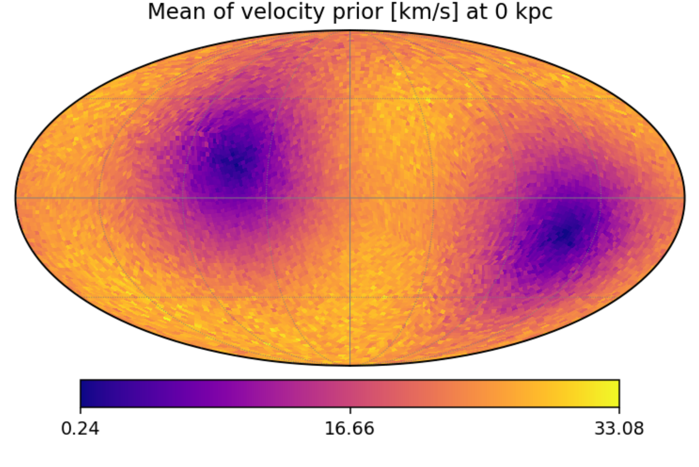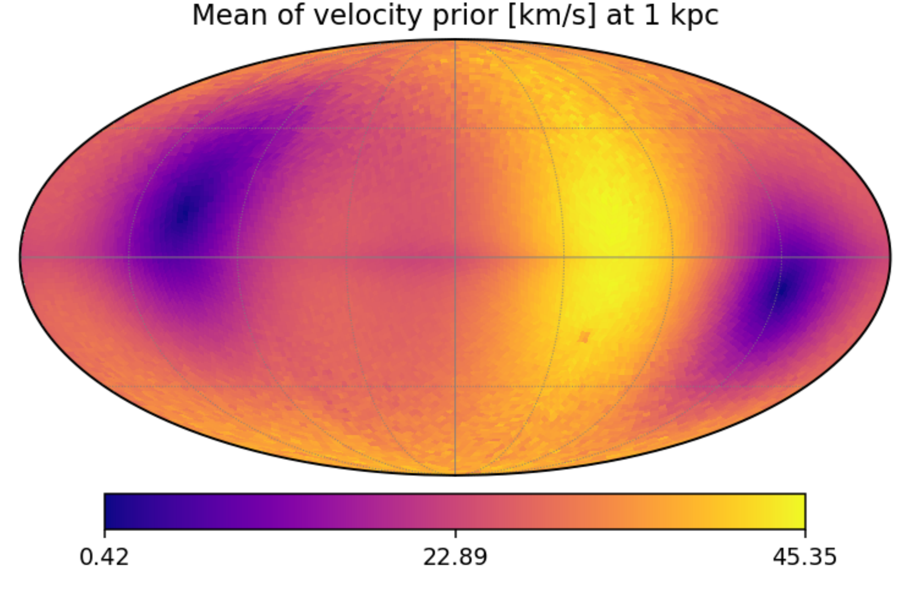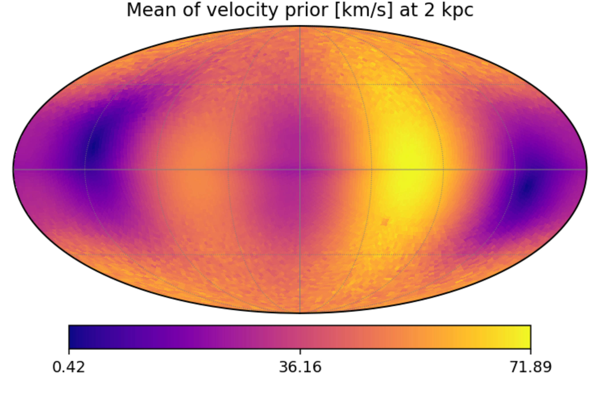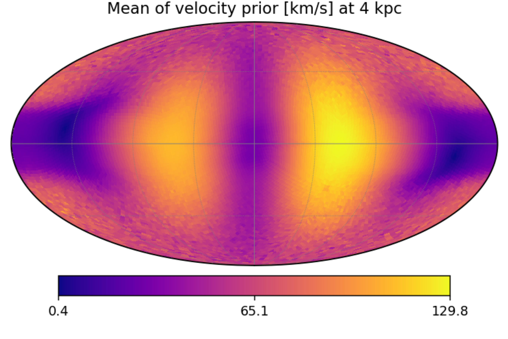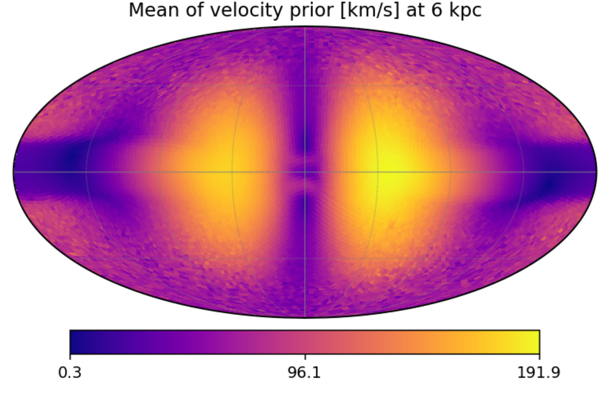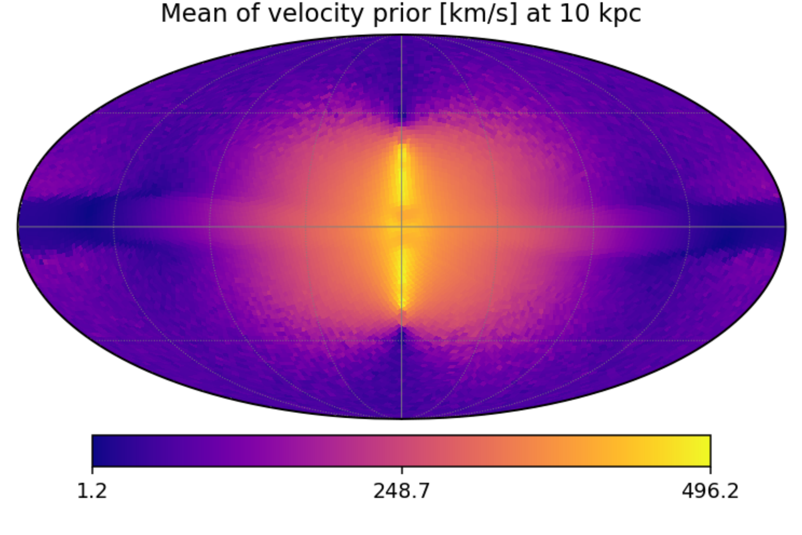

**Figure 13. -** Variation of the mean of the velocity prior over the Galactic sky at six different distances. The quantity shown
    is $\sqrt{$\vra$^2 + $\vdec$^2}$, where $\vra$ and $\vdec$ are the means of the two components of the velocity prior at the specified distance in each HEALpixel. In each distance slice the colour bar covers the full range of velocities plotted, and is different for each slice.
 (*fig:veltotmeanprior_skyplot*)

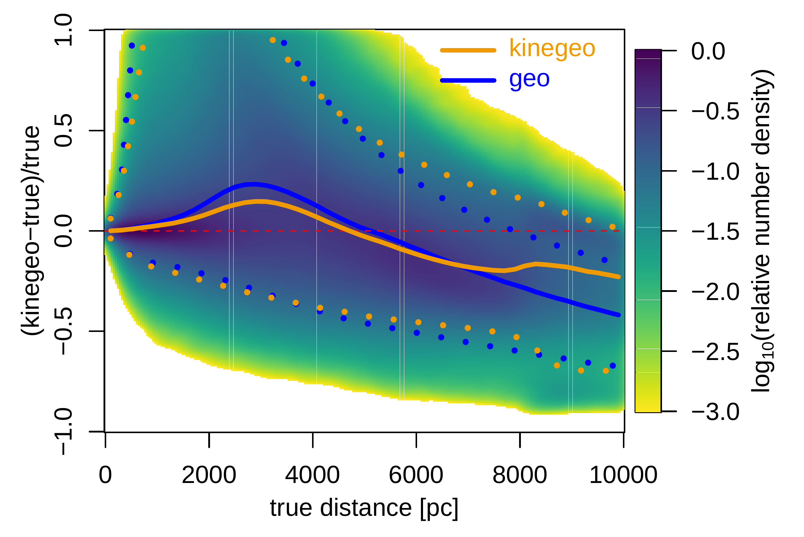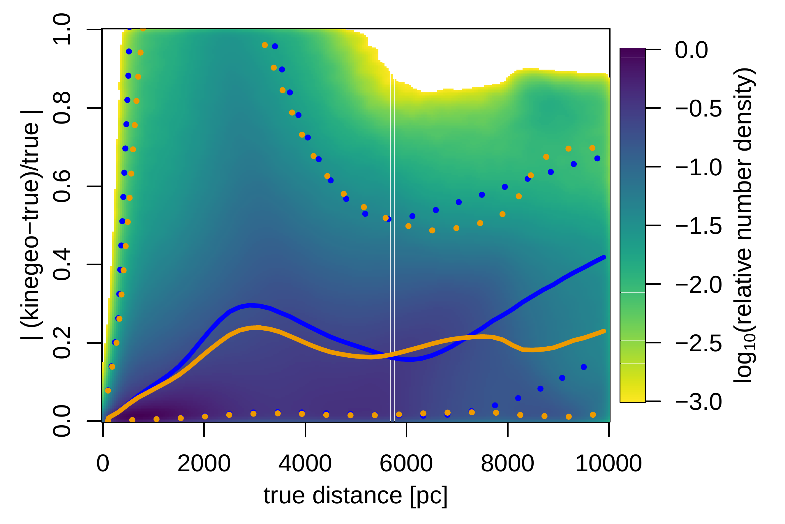

**Figure 16. -** Performance of the kinegeometric distance estimate (median of the posterior) as a function of distance for the constant fraction sample in the mock catalogue. The left panel shows the fractional bias in the estimates, the right panel the fractional scatter. The colour scale shows the density of stars on a log scale. The solid orange line shows the median bias or scatter at each distance, the dotted lines are the 5th and 95th percentiles. The blue lines show the same metrics for the geometric distances for comparison.
 (*fig:results_mock_rMedKinogeo_bias_scatter_vs_distance*)

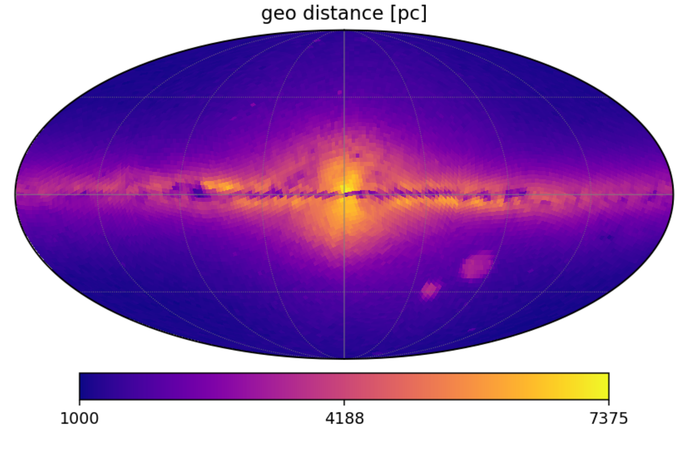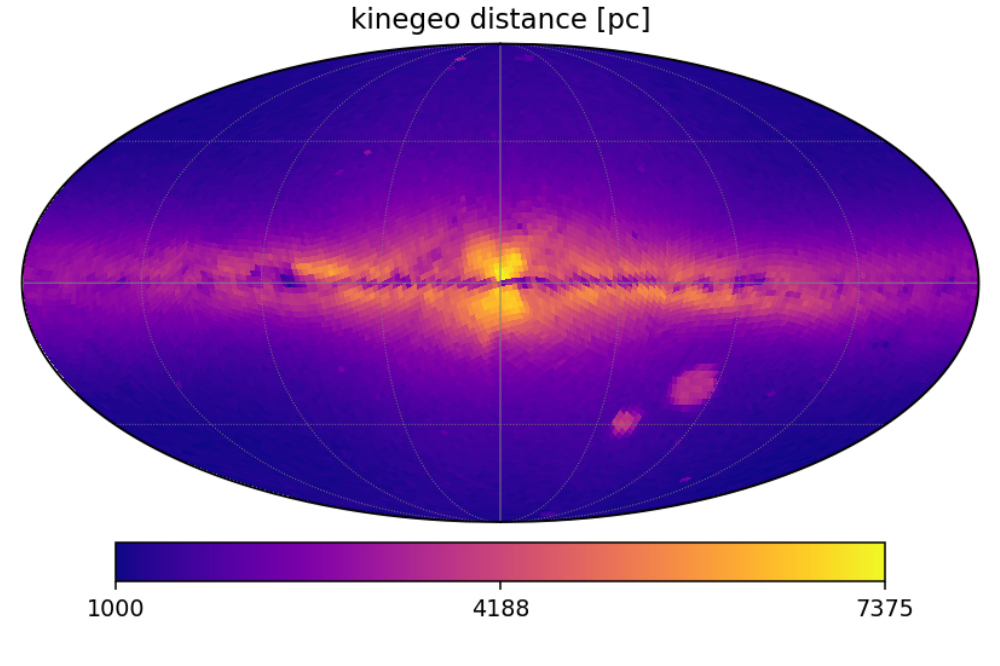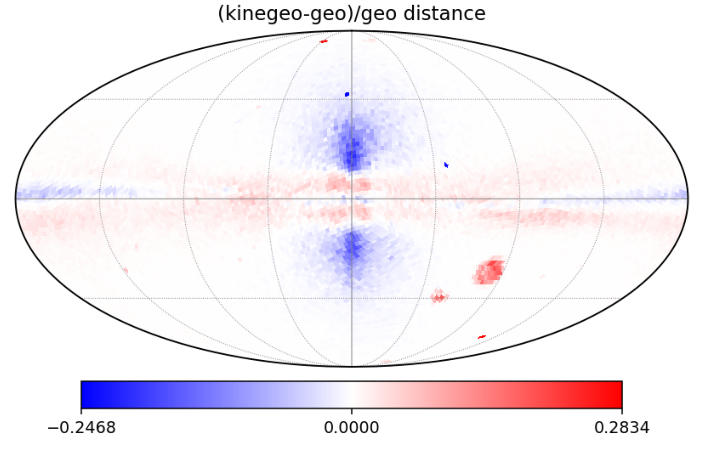

**Figure 5. -** Median distance per HEALpixel for the constant number sample in $\release$: Geometric (top) and kinegeometric (middle).
  The linear colour bar spans the full common range. The bottom panel shows
  the median fractional differences between these (computed on the individual stars). It
uses a bilinear colour bar with white at zero and diverges on different linear scales to the maximum negative and positive differences.
 (*fig:results_rMedGeo_rMedKinogeo_skyplot*)

