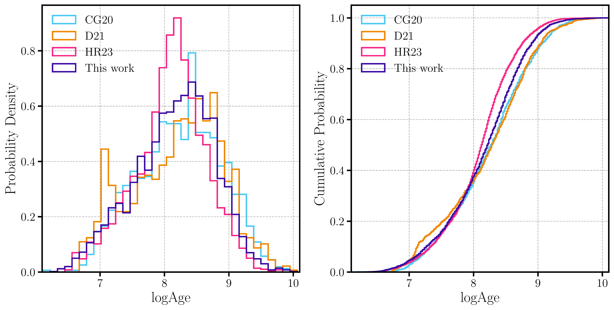
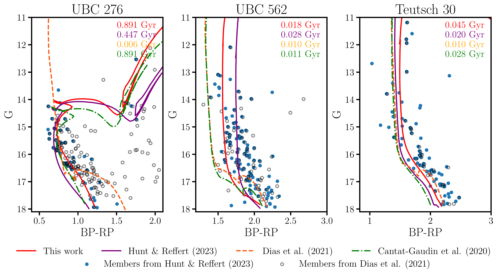

$\newcommand{\ensuremath}{}$
$\newcommand{\xspace}{}$
$\newcommand{\object}[1]{\texttt{#1}}$
$\newcommand{\farcs}{{.}''}$
$\newcommand{\farcm}{{.}'}$
$\newcommand{\arcsec}{''}$
$\newcommand{\arcmin}{'}$
$\newcommand{\ion}[2]{#1#2}$
$\newcommand{\textsc}[1]{\textrm{#1}}$
$\newcommand{\hl}[1]{\textrm{#1}}$
$\newcommand{\footnote}[1]{}$
$\newcommand{\vdag}{(v)^\dagger}$
$\newcommand$
$\newcommand$
$\newcommand{\}{cg}$
$\newcommand{\}{ep}$
$\newcommand{\}{lm}$
$\newcommand{\}{lc}$
$\newcommand{\}{ls}$
$\newcommand{\}{mp}$
$\newcommand{\}{lg}$
$\newcommand{\}{sl}$
$\newcommand{\gaia}{\textit{Gaia}}$
$\newcommand{\gbp}{G_{\rm BP}}$
$\newcommand{\grp}{G_{\rm RP}}$
$\newcommand{\mudist}{\mu_{\rm dist}}$

# Parameter Estimation for Open Clusters using an Artificial Neural Network with a QuadTree-based Feature Extractor

<mark>Appeared on: 2023-11-07</mark> -  _24 pages, 15 figures, Accepted in The Astronomical Journal. Temporally, data produced in this work are available at this https URL_

L. Cavallo, et al. -- incl., <mark>T. Cantat-Gaudin</mark>

**Abstract:** With the unprecedented increase of known star clusters, quick and modern tools are needed for their analysis. In this work, we develop an artificial neural network trained on synthetic clusters to estimate the age, metallicity, extinction, and distance of $\gaia$ open clusters. We implement a novel technique to extract features from the colour-magnitude diagram of clusters by means of the QuadTree tool and we adopt a multi-band approach. We obtain reliable parameters for $\sim 5400$ clusters $\footnote{The catalogue of clusters analysed in this work is available at \url{https://phisicslollo0.github.io/cavallo23.html}. See Appendix \ref{sec:appendix} for more details.}$ . We demonstrate the effectiveness of our methodology in accurately determining crucial parameters of $\gaia$ open clusters by performing a comprehensive scientific validation. In particular, with our analysis we have been able to reproduce the Galactic metallicity gradient as it is observed by high-resolution spectroscopic surveys. This demonstrates that our method reliably extracts information on metallicity from colour-magnitude diagrams (CMDs) of stellar clusters. For the sample of clusters studied, we find an intriguing systematic older age compared to previous analyses present in the literature. This work introduces a novel approach to feature extraction using a QuadTree algorithm, effectively tracing sequences in CMDs despite photometric errors and outliers. The adoption of ANNs, rather than Convolutional Neural Networks, maintains the full positional information and improves performance, while also demonstrating the potential for deriving clusters' parameters from simultaneous analysis of multiple photometric bands, beneficial for upcoming telescopes like the Vera Rubin Observatory. The implementation of ANN tools with robust isochrone fit techniques could provide further improvements in the quest for open clusters' parameters.

**Figure 9. -** Age distributions of $\gaia$ open clusters as predicted by \citetalias{CG20}, \citetalias{D21}, \citetalias{H23}, and in this work. Left panel: differential age distribution. Right panel: cumulative age distribution. (*fig:age_distribution*)

**Figure 8. -** Comparison between parameters derived in this work with the ones present in literature. In the top left corners is reported the value of the root main square error. Top row: comparison of age, extinction, and distance for clusters that are in common with \citetalias{CG20}. Middle row: comparison of age, [Fe/H], extinction, and distance for clusters in common with \citetalias{D21}. Bottom row: comparison of age, extinction, and distance for clusters contained in \citetalias{H23}. (*fig:comparison*)

**Figure 10. -** Predicted isochrones for three open clusters UBC 276  (left panel), UBC 562 (middle panel), and Teutsch 30 (right panel) from \citetalias{CG20}(dot-dashed green line), \citetalias{D21}(dashed orange line), \citetalias{H23}(solid purple line), and this work (solid red line). In the top right, we annotate the ages that correspond to the plotted isochrones (coloured accordingly). With blue and full dots we plot the members of the clusters retrieved by \citetalias{H23}, with empty black dots are plotted the ones of \citetalias{D21}. (*fig:examples*)

