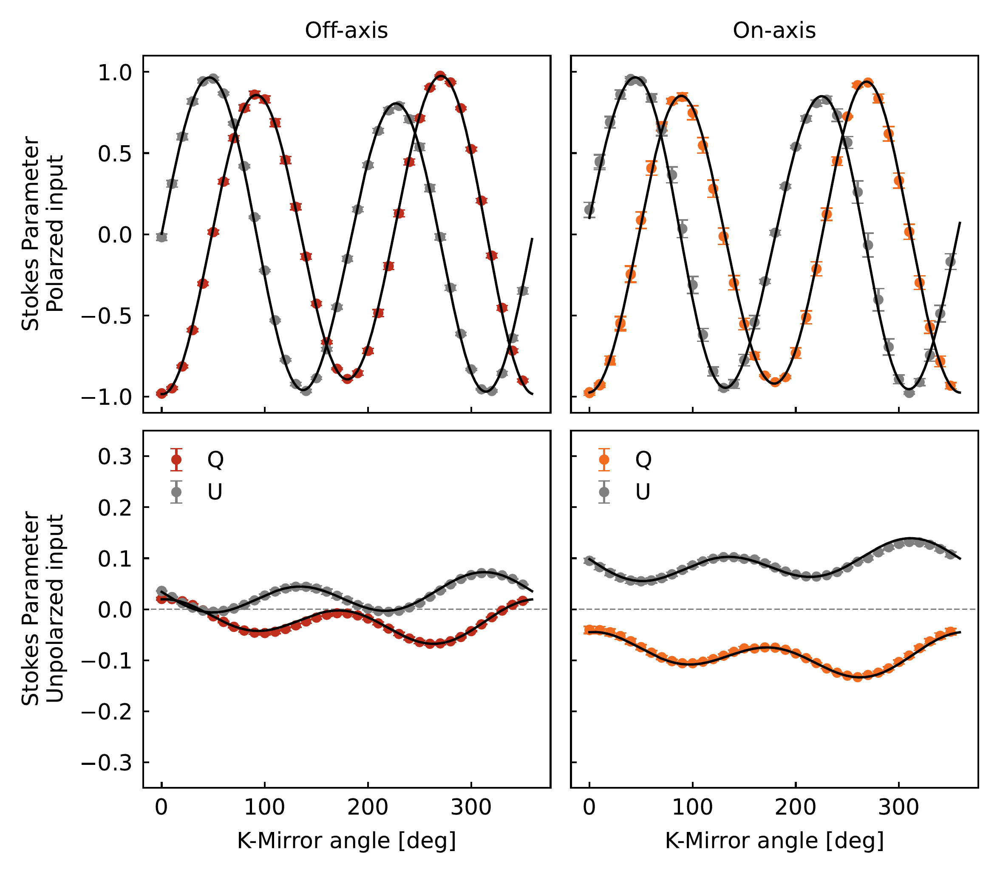
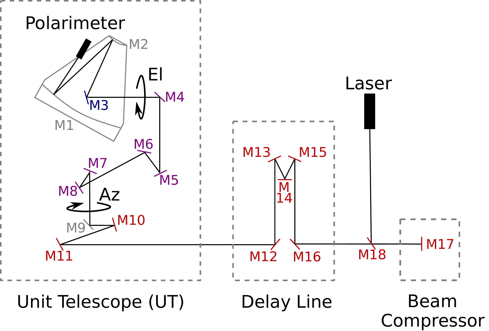
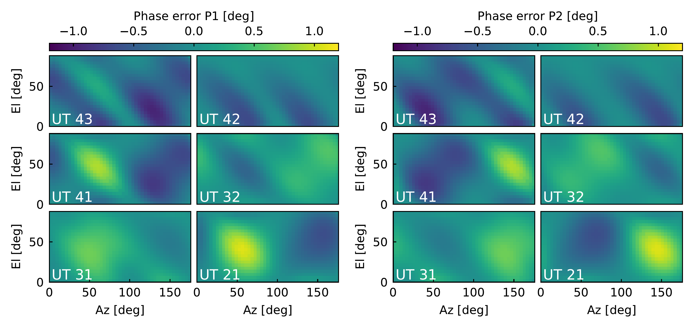

$\newcommand{\ensuremath}{}$
$\newcommand{\xspace}{}$
$\newcommand{\object}[1]{\texttt{#1}}$
$\newcommand{\farcs}{{.}''}$
$\newcommand{\farcm}{{.}'}$
$\newcommand{\arcsec}{''}$
$\newcommand{\arcmin}{'}$
$\newcommand{\ion}[2]{#1#2}$
$\newcommand{\textsc}[1]{\textrm{#1}}$
$\newcommand{\hl}[1]{\textrm{#1}}$
$\newcommand{\footnote}[1]{}$

# Polarization analysis of the VLTI and GRAVITY

<mark>Appeared on: 2023-11-08</mark> -  _Accepted by A&A_

G. Collaboration, et al. -- incl., <mark>S. Scheithauer</mark>

**Abstract:** The goal of this work is to characterize the polarization effects of the VLTI and GRAVITY. This is needed to calibrate polarimetric observations with GRAVITY for instrumental effects and to understand the systematic error introduced to the astrometry due to birefringence when observing targets with a significant intrinsic polarization. By combining a model of the VLTI light path and its mirrors and dedicated experimental data, we construct a full polarization model of the VLTI UTs and the GRAVITY instrument. We first characterize all telescopes together to construct a UT calibration model for polarized targets. We then expand the model to include the differential birefringence. With this, we can constrain the systematic errors for highly polarized targets. Together with this paper, we publish a standalone Python package to calibrate the instrumental effects on polarimetric observations. This enables the community to use GRAVITY to observe targets in a polarimetric observing mode. We demonstrate the calibration model with the galactic center star IRS 16C. For this source, we can constrain the polarization degree to within 0.4 % and the polarization angle within 5 deg while being consistent with the literature. Furthermore, we show that there is no significant contrast loss, even if the science and fringe-tracker targets have significantly different polarization, and we determine that the phase error in such an observation is smaller than 1 deg, corresponding to an astrometric error of 10 {\mu}as. With this work, we enable the use of the polarimetric mode with GRAVITY/UTs and outline the steps necessary to observe and calibrate polarized targets. We demonstrate that it is possible to measure the intrinsic polarization of astrophysical sources with high precision and that polarization effects do not limit astrometric observations of polarized targets. 

**Figure 18. -** Measured polarization with GRAVITY in the different observing modes. The left column shows the measurement in the off-axis mode, and the right column in the on-axis mode. In the top row, the linear polarization filter is used for the input light source; in the bottom, it is not. In all plots, the Stokes Q data points are shown in red/orange and the Stokes U in grey. The data is the average over all four GRAVITY beams. The results from the fitted model are shown in black lines. (*fig:grav_full*)

**Figure 12. -** Simplified version of the VLTI light path from \autoref{fig:sketch_path} to show the modeling and the experimental setup. The black rectangles show where the laser is launched and where the polarimeter is mounted. The names of the mirrors used in the text are given. The color of the mirror number shows the grouping which was used for the fitting. Grey mirrors are not fitted in our calibration model. Each colored group is located in one common plane: M4-M8 are in one vertical plane, and M10 - M18 are in one horizontal plane. (*fig:sketch_exp*)

**Figure 20. -** Error in the visibility phases due to differential birefringence for all telescope positions. The left two columns show the error for the first polarization P1 and the right two for the second polarization P2. (*fig:ev_phaseerr*)

