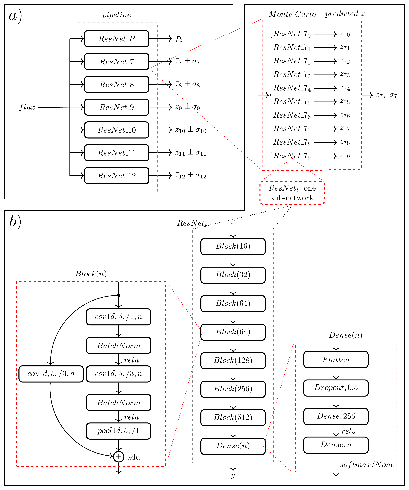
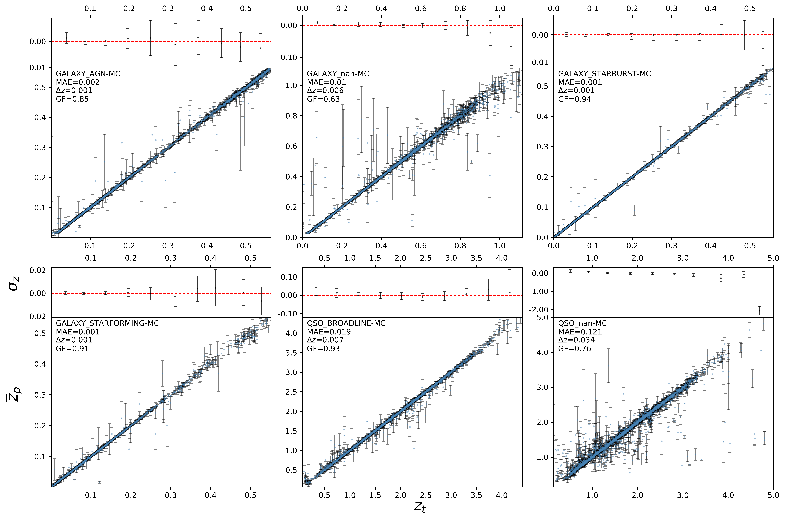
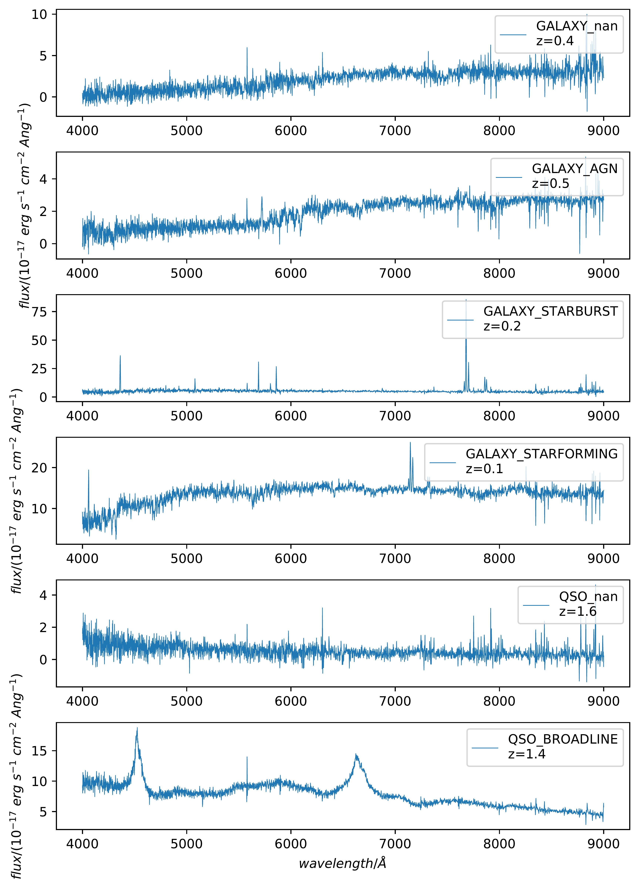

$\newcommand{\ensuremath}{}$
$\newcommand{\xspace}{}$
$\newcommand{\object}[1]{\texttt{#1}}$
$\newcommand{\farcs}{{.}''}$
$\newcommand{\farcm}{{.}'}$
$\newcommand{\arcsec}{''}$
$\newcommand{\arcmin}{'}$
$\newcommand{\ion}[2]{#1#2}$
$\newcommand{\textsc}[1]{\textrm{#1}}$
$\newcommand{\hl}[1]{\textrm{#1}}$
$\newcommand{\footnote}[1]{}$
$\newcommand{\zhong}[1]{{\color{black}{#1}}}$
$\newcommand{\zhongblue}[1]{{\color{black}{#1}}}$
$\newcommand{\nic}[1]{{\color{magenta}{#1}}}$

# Galaxy Spectra neural Network (GaSNet). II. Using Deep Learning for Spectral Classification and Redshift Predictions

<mark>Appeared on: 2023-11-08</mark> -  _23 pages and 31 figures. The draft has been submitted to MNRAS_

F. Zhong, et al. -- incl., <mark>G. Guiglion</mark>

**Abstract:** Large sky spectroscopic surveys have reached the scale of photometric surveys in terms of sample sizes and data complexity. These huge datasets require efficient, accurate, and flexible automated tools for data analysis and science exploitation. We present the Galaxy Spectra Network/GaSNet-II, a supervised multi-network deep learning tool for spectra classification and redshift prediction. GaSNet-II can be trained to identify a customized number of classes and optimize the redshift predictions for classified objects in each of them.It also provides redshift errors, using a network-of-networks that reproduces a Monte Carlo test on each spectrum, by randomizing their weight initialization.As a demonstration of the capability of the deep learning pipeline, we use 260k Sloan Digital Sky Survey spectra from Data Release 16, separated into 13 classes including 140k galactic, and 120k extragalactic objects.GaSNet-II achieves 92.4 \% average classification accuracy over the 13 classes (larger than 90 \% for the majority of them), and an average redshift error of approximately 0.23 \% for galaxies and 2.1 \% for quasars.We further train/test the same pipeline to classify spectra and predict redshifts for a sample of 200k 4MOST mock spectra and 21k publicly released DESI spectra. On 4MOST mock data, we reach 93.4 \% accuracy in 10-class classification and an average redshift error of 0.55 \% for galaxies and 0.3 \% for active galactic nuclei. On DESI data, we reach 96 \% accuracy in (star/galaxy/quasar only) classification and an average redshift error of 2.8 \% for galaxies and 4.8 \% for quasars, despite the small sample size available. GaSNet-II can process $\sim40$ k spectra in less than one minute, on a normal Desktop GPU. This makes the pipeline particularly suitable for real-time analyses of Stage-IV survey observations and an ideal tool for feedback loops aimed at night-by-night survey strategy optimization.

**Figure 30. -** _ Panel a)_: the general structure of the multi-networks pipeline. $\it ResNet\_P$ is used as a classifier and  $\it ResNet\_7-12$ is used for redshift prediction of extragalactic targets (note that $\it ResNet\_0-6$ are missing because we do not need to predict the redshift of stars). One of the advantages of this structure is that it is simple and controllable, and can be trained and predicted in parallel. _ Panel b)_: the detailed description of single sub-network $\it ResNet_i$(bottom figures) architecture, made by small blocks. The input of the network is 5001-pixel spectrum flux, and the output is the probability or redshift. The difference between classification ($\it n=13,  softmax$) and redshift prediction ($\it n=1,  None$) is the output dimension and the activation in the last layer. A feature-extract block $\it Block(n)$ and a fully connected block $\it Dense(n)$ are shown. $\it cov1d$ is the 1-D convolution layer. In one $\it cov1d$ rectangle, $5$ is the kernel size; $/3$ is the stride size; $n$ is the number of channels. $\it relu$, $\it softmax$ are the activate function, $\it None$ represents no activate function here, that means liner. The left $\it cov1d$ in the $\it Block(n)$ shortcut is used to match the shape. $\it pool1d$ is a 1-D Maxpooling layer. As a schematic, the top right panel shows how to predict the redshift error of the label 7 (GALAXY\_nan) subclass in parallel. Though 10 (customized) same sub-networks, trained by the same data but with different initial weights, 10 different redshifts were obtained from a single spectrum input. The expectation and error can be calculated. Other redshift errors are obtained in the same way. (*fig: full pipeline*)

**Figure 32. -** The mean redshift predictions and errors of the 6 extragalactic SDSS subclasses. The error bar of each sample point represents the standard deviation obtained from the MC estimation of 10 sub-networks. In the top left of each main panel the subclass name, MAE, $\Delta z$, and the GF are displayed. The points in the top panels display the mean of the distribution of the $\overline{z}_p$ residuals ($\overline{z}_p-z_t$) with respect to the true values ($z_t$) in each bin, and error bars corresponding mean $\sigma_z$ values (see text).
     (*fig: redshift error*)

**Figure 2. -** Example spectra of SDSS extragalactic sub-classes,
    as listed in Table \ref{Table:1}. We can clearly see the different features characterizing the different classes. From top to bottom, in particular, we can notice the increasing importance of the emission lines that play an important role in redshift prediction. The `nan' type spectra generally lack such emission lines, although they might still contain some low-SNR ones, which are hard to see. This means that the `nan' sample might overlap with other emission line classes. QSOs also show a power-law continuum that does not carry any redshift information. (*fig: spectra_2*)

