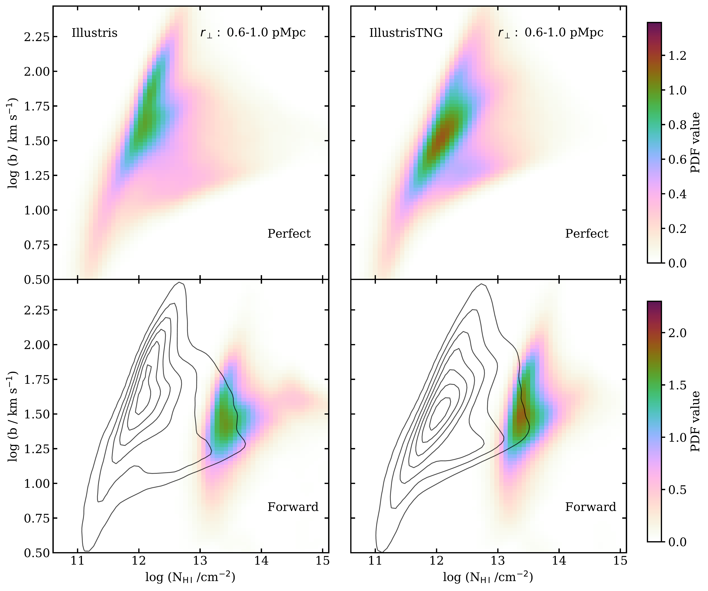
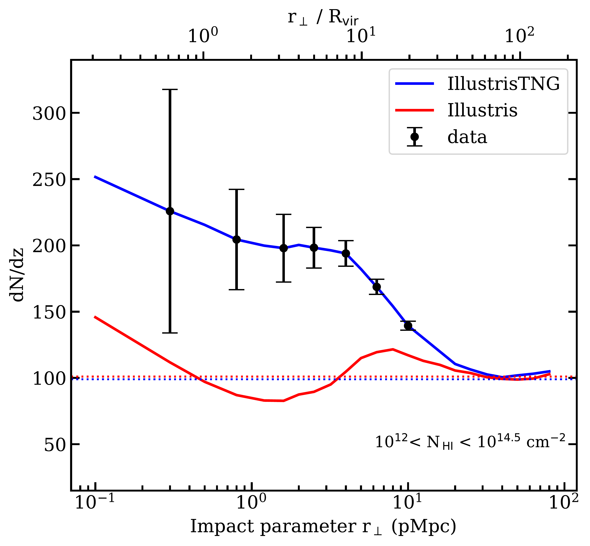
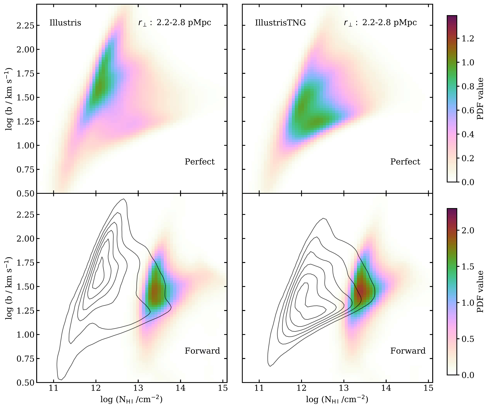

$\newcommand{\ensuremath}{}$
$\newcommand{\xspace}{}$
$\newcommand{\object}[1]{\texttt{#1}}$
$\newcommand{\farcs}{{.}''}$
$\newcommand{\farcm}{{.}'}$
$\newcommand{\arcsec}{''}$
$\newcommand{\arcmin}{'}$
$\newcommand{\ion}[2]{#1#2}$
$\newcommand{\textsc}[1]{\textrm{#1}}$
$\newcommand{\hl}[1]{\textrm{#1}}$
$\newcommand{\footnote}[1]{}$
$\newcommand{\vdag}{(v)^\dagger}$
$\newcommand$
$\newcommand$
$\newcommand{\HI}{H {\sc i}}$
$\newcommand{\HII}{\ion{H}{2}}$
$\newcommand{\HeI}{\ion{He}{1}}$
$\newcommand{\HeII}{\ion{He}{2}}$
$\newcommand{\HeIII}{\ion{He}{3}}$
$\newcommand{\SiIII}{\ion{Si}{3}}$
$\newcommand{\gHI}{\Gamma_{\ion{H}{1}}}$
$\newcommand{\nhi}{N_{\rm H I}}$
$\newcommand{\lya}{Ly\alpha}$
$\newcommand{\mathHI}{{\mbox{\scriptsize \HI}}}$
$\newcommand{\mathHII}{{\mbox{\scriptsize \HII}}}$
$\newcommand{\mathHeI}{{\mbox{\scriptsize \HeI}}}$
$\newcommand{\mathHeII}{{\mbox{\scriptsize \HeII}}}$
$\newcommand{\mathHeIII}{{\mbox{\scriptsize \HeIII}}}$
$\newcommand{\mathSiIII}{{\mbox{\scriptsize \SiIII}}}$
$\newcommand{\Msun}{M\textsubscript{\(\odot\)}}$

# $\huge$Searching for the Imprints of AGN Feedback on the Lyman AlphaForest Around Luminous Red Galaxies

<mark>Appeared on: 2023-11-16</mark> -  _21 pages (including 4 page appendix), Submitted to MNRAS_

V. Khaire, et al. -- incl., <mark>F. Davies</mark>

**Abstract:** We explore the potential of using the low-redshift Lyman- $\alpha$ (Ly $\alpha$ ) forest surroundingluminous red galaxies (LRGs) as a tool to constrain active galactic nuclei (AGN)feedback models. Our analysis is based on snapshots from the Illustris and IllustrisTNGsimulations at a redshift of $z=0.1$ . These simulations offer an ideal platform for studying the influence of AGN feedbackon the gas surrounding galaxies, as they share the same initial conditions and underlying codebut incorporatedifferent feedback prescriptions.Both simulations show significant impacts of feedback on the temperature and density ofthe gas around massive halos. Following our previous work, we adjusted the UV background inboth simulations to align with the observed number density of Ly $\alpha$ lines ( $\rm dN/dz$ ) inthe intergalactic medium and  study the Ly $\alpha$ forest around massive halos hostingLRGs, at impact parameters ( $r_{\perp}$ ) ranging from 0.1 to 100 pMpc.Our findings reveal that $\rm dN/dz$ , as a function of $r_{\perp}$ , isapproximately 1.5 to 2 times higher in IllustrisTNG compared to Illustris up to $r_{\perp}$ of $\sim 10$ pMpc. To further assess whether existing data can effectivelydiscern these differences, we search for archival data containing spectra of background quasarsprobing foreground LRGs. Through a feasibility analysis based on this data,we demonstrate that ${\rm dN/dz} (r_{\perp})$ measurements can distinguish betweenfeedback models of IllustrisTNG and Illustris with a precision exceeding 12 $\sigma$ .This underscores the potential of ${\rm dN/dz} (r_{\perp})$ measurements around LRGsas a valuable benchmark observation for discriminating between different feedback models.

**Figure 6. -** The KDE estimated 2D $b-$\nhi distribution for the halo sightlines
(within $\pm 500$ km $s^{-1}$) drawn from  the impact parameter bin
$0.6 <r{_\perp}< 1$ pMpc
of Illustris (left-hand panel)
and the IllustrisTNG (right-hand panel) halos for perfect (top)
and forward (bottom) models.
The distributions from perfect and forward models look similar expect
the normalization shown with colors.
In the bottom panel, we show $b-$\nhi distribution from perfect models
with contours. The forward models shift $b-$\nhi distribution  towards higher
$\nhi$ and lower $b$ values in both simulations.  (*fig.kde_small_impact*)

**Figure 1. -** The line density profile
${\rm dN/dz} (r_{\perp})$ for $10^{12} <N_{\rm HI} < 10 ^{14.5}  { \rm cm^{-2} }$ absorbers
obtained from
forward modeled mock spectra around LRG host
halos within $\pm 500 {\rm km s^{-1}}$ along line-of-sights.
IllustrisTNG (blue) gives a factor of $\sim 1.5-2$ higher
${\rm dN\slash dz}$ as compared to Illustris (red)
out to $r_\perp\lesssim$$5$$ {\rm pMpc}$($\sim 10   R_{\rm vir}$).
By construction, both simulations converge to the expected IGM ${\rm dN/dz}$(dotted lines) at large distances from halos.
The black points with error bars show the expected precision using
archival data assuming IllustrisTNG is the true model (see
section \ref{sec.data}
for more details). With this data, we can distinguish between
Illustris and IllustrisTNG
feedback models at 12$\sigma$ statistical significance. (*fig.dndz*)

**Figure 7. -** 
The KDE estimated 2D $b-$\nhi distribution for the halo sightlines
(within $\pm 500$ km $s^{-1}$) drawn from  the impact parameter bin
$2.2 <r{_\perp}< 2.8$ pMpc
of Illustris (left-hand panel)
and the IllustrisTNG (right-hand panel) halos for perfect (top)
and forward (bottom) models.
The effect of feedback can be seen
in the difference in the distributions (in top panels) for perfect sightlines.
The hot gas in the Illustris
results in many absorption lines with low $\nhi$ high and $b$ values whereas
the  IllustrisTNG
shows both the low $\nhi$-high $b$ and high $\nhi$-low $b$ absorption lines.
These differences in the shape of $b-$\nhi get washed out in forward-modelled
sightlines as shown in the bottom panel where the black contours indicate
distribution from the perfect model shown on the top panel. However, the normalization of
distribution showing different numbers of lines,
indicated by the color bars is still
significantly different even in the distribution from forward-modeled sightlines.  (*fig.kde_intermediate_impact*)

