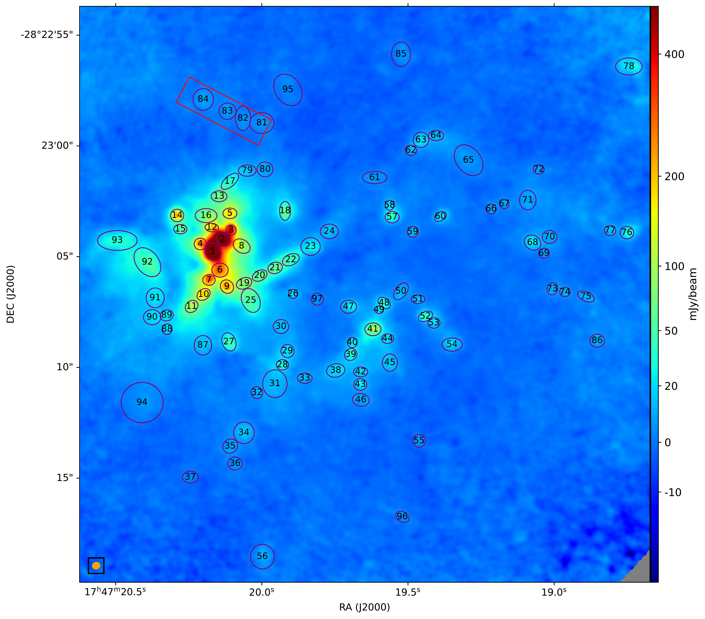
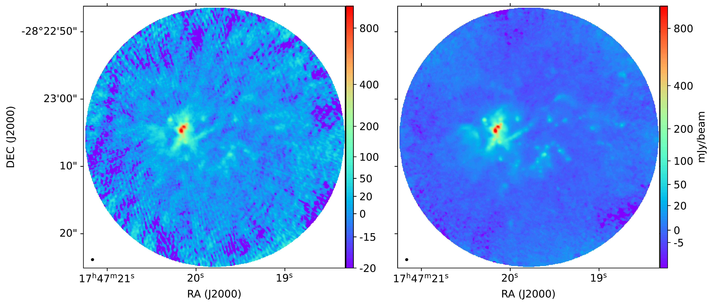
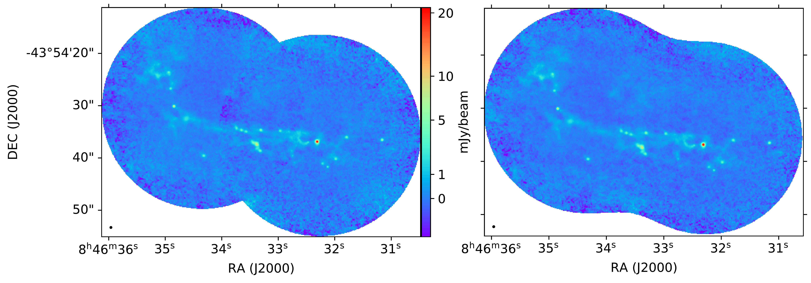
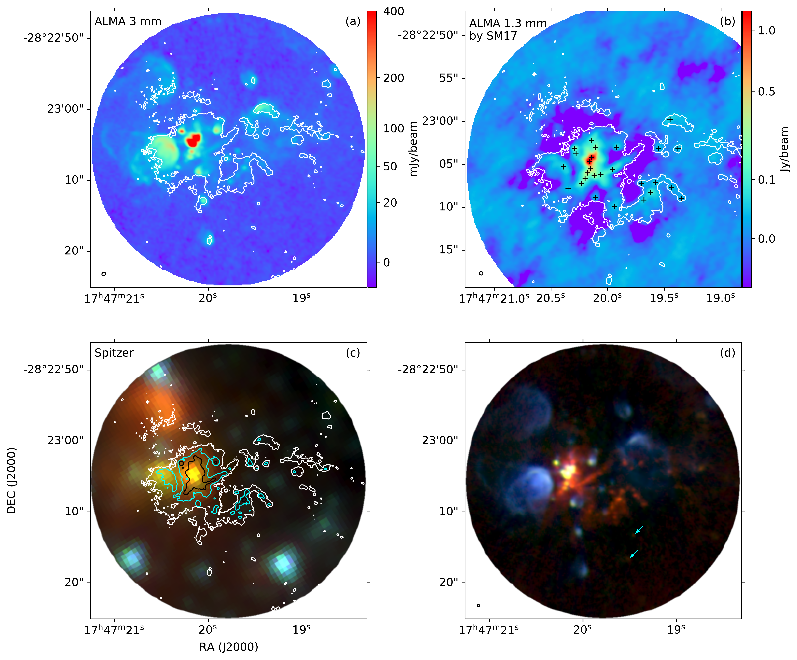

$\newcommand{\ensuremath}{}$
$\newcommand{\xspace}{}$
$\newcommand{\object}[1]{\texttt{#1}}$
$\newcommand{\farcs}{{.}''}$
$\newcommand{\farcm}{{.}'}$
$\newcommand{\arcsec}{''}$
$\newcommand{\arcmin}{'}$
$\newcommand{\ion}[2]{#1#2}$
$\newcommand{\textsc}[1]{\textrm{#1}}$
$\newcommand{\hl}[1]{\textrm{#1}}$
$\newcommand{\footnote}[1]{}$
$\newcommand$

# The ALMA-QUARKS survey:-- I. Survey description and data reduction

<mark>Appeared on: 2023-11-16</mark> -  _9 figures, 4 tables, accepted by RAA_

X. Liu, et al. -- incl., <mark>S. Li</mark>, <mark>J. He</mark>

**Abstract:** This paper presents an overview of the QUARKS survey,which stands for `Querying Underlying mechanisms of massive star formation with ALMA-Resolved gasKinematics and Structures'. The QUARKS surveyis observing 139 massive  clumps covered by 156 pointings at ALMA Band 6  ( $\lambda\sim$ 1.3 mm).In conjunction with data obtained from the ALMA-ATOMS survey at Band 3 ( $\lambda\sim$ 3 mm), QUARKS aims to  carry out an unbiased statisticalinvestigation of massive star formation process within  protoclusters down to a scale of 1000 au.This overview paper describes the observations and data reduction of the QUARKS survey,and gives a first look at an exemplar source, the mini-starburst Sgr B2(M).The wide-bandwidth (7.5 GHz) and high-angular-resolution ( $\sim 0.3\arcsec$ ) observations of the QUARKS surveyallow to resolve much more compact cores than could be done by the ATOMS survey, and to detectpreviously unrevealed fainter filamentary structures.The spectral windows cover transitions of species including CO, SO, $N_2$ D $^+$ , SiO, H $_{30}\alpha$ , $H_2$ CO, $CH_3$ CN and many othercomplex organic molecules, tracing gas components with different temperatures and spatial extents.QUARKS aims to deepen our understanding of several scientific topics of massive star formation, such as the mass transport within protoclusters by(hub-)filamentary structures, the existence of massive starless cores, the physical and chemical propertiesof dense cores within protoclusters, and the feedback from already formed high-mass young protostars. $\keywords{stars: formation --- stars: kinematics and dynamics --- ISM: clouds --- ISM: molecules}$

**Figure 6. -** Zoom in image of the right panel of Figure \ref{fig_sgrb2_compareselfcal}.
The purple ellipses and black numbers marked the cores and substructures of Sgr B2(M) detected in the Band-6 continuum image
(Section \ref{sec_srgb2cores}).
The red rectangle marks the north arc of the Sgr B2(M).
The orange  ellipse in the lower-left corner represents the synthesized
beam size.  (*fig_sgrb2cores*)

**Figure 4. -** The ALMA Band 6 continuum of Sgr B2(M) (upper) and IRAS 08448-4343 (lower).
For Sgr B2(M), the upper right and upper left panels are the images
with and without selfcalibration, respectively.
For IRAS 08448-4343,  the lower left panel shows the  image stitched from two independently cleaned images,
and the lower right panel shows the  the image cleaned from the combined visibility data.
The two lower panels share the same colorbar.
In each panel, primary beam correction has been applied, and
the black small ellipse in the lower-left corner represents the synthesized
beam.  (*fig_sgrb2_compareselfcal*)

**Figure 5. -** (a) Image of the ALMA Band 3  continuum emission of Sgr B2(M) with a resolution of $\sim 0.5$\arcsec$$ by [Ginsburg, Bally and Barnes (2018)]().
The beam size  is shown as an ellipse at the lower-left corner. The white contour shows the
ALMA Band 6 (at 1.3 mm) continuum emission from the QUARKS survey at the level of  5$\sigma$(2.5 mJy beam$^{-1}$).
(b) Image of the ALMA Band 6 continuum emission  from SM17  ([Sánchez-Monge, Schilke and Schmiedeke 2017]()) .
The fields of view of SM17 and the QUARKS survey are not identical,
but all 27 cores identified by [Sánchez-Monge, Schilke and Schmiedeke (2017)]() marked by the black crosses
are shown in this panel.
Contour is the same as in panel (a).
Note that the color map (_ rainbow_  with a power-law normalization with a power index of 0.4)
is similar to that of
Figure \ref{fig_sgrb2_compareselfcal}, where the  ALMA Band 6 continuum  of the QUARKS survey is shown.
(c) Three-color image composed by the Spitzer 8 (red), 4.5 (green), 3.4 (blue) $\mu$m continuum.
The white, cyan and black contours show the ALMA Band 6 continuum of the QUARKS survey, at the levels
2.5, 15, and 50 mJy beam$^{-1}$, respectively. (d) Three-color image composed of the
ALMA Band 6 continuum of the QUARKS survey in red, the ALMA Band 3 continuum  by [Ginsburg, Bally and Barnes (2018)]() in green,
and the VLA Band C (at $\sim$6 GHz) continuum by [Meng, Sánchez-Monge and Schilke (2022)]() in blue.
The cyan arrows pinpoint Cores 55 and 96 (see Figure \ref{fig_sgrb2cores} and Section \ref{sec_selfcali_check}).
The beam size of the QUARKS survey is shown as an ellipse at the lower-left corner.
 (*fig_colorimages*)

