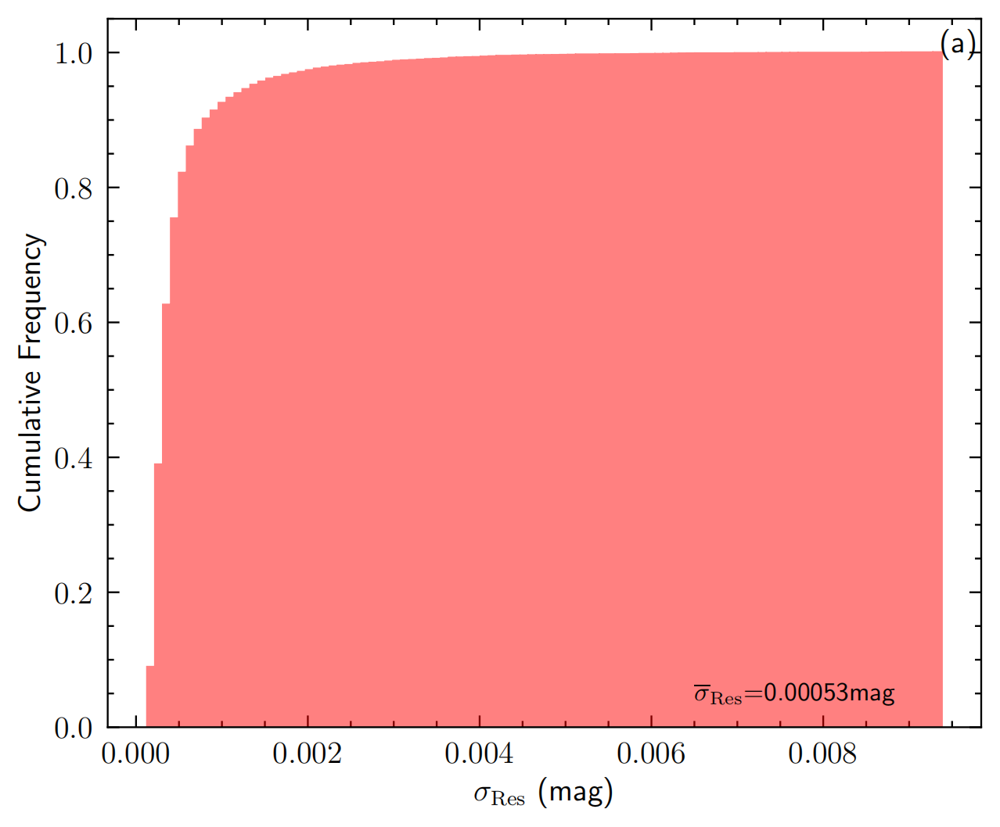
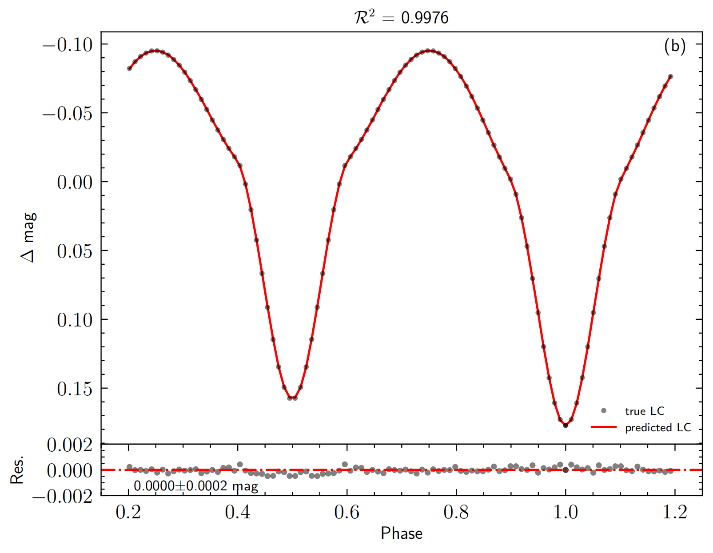
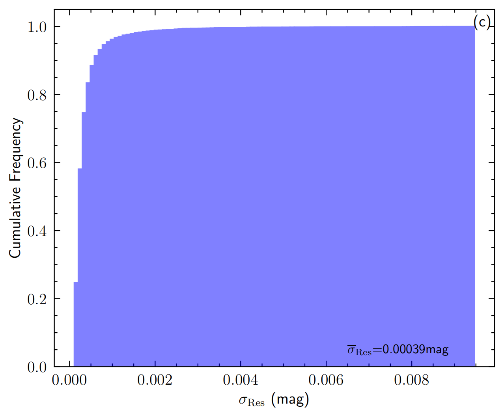
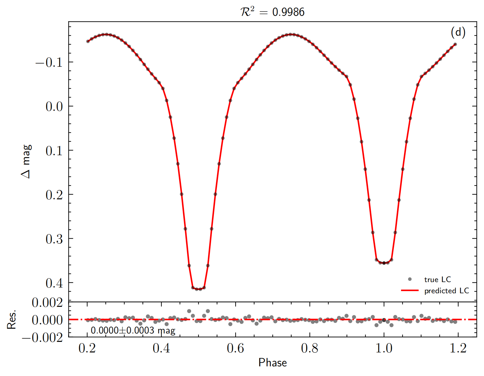
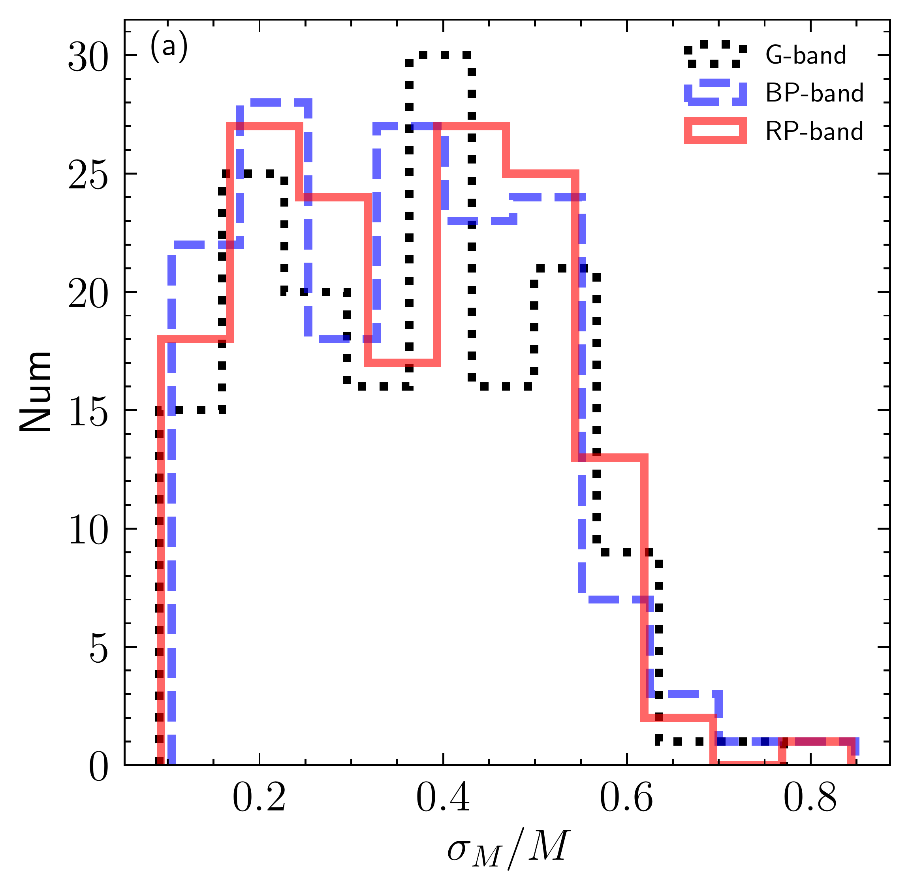
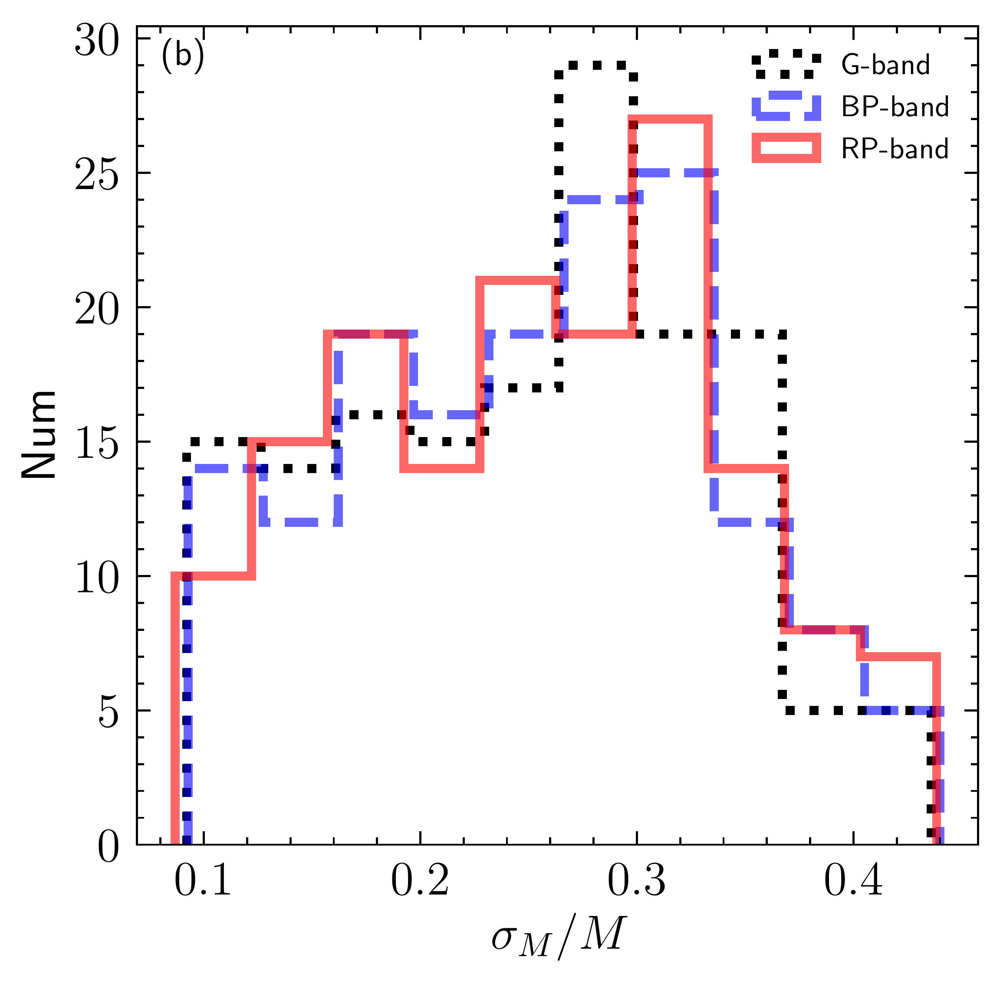
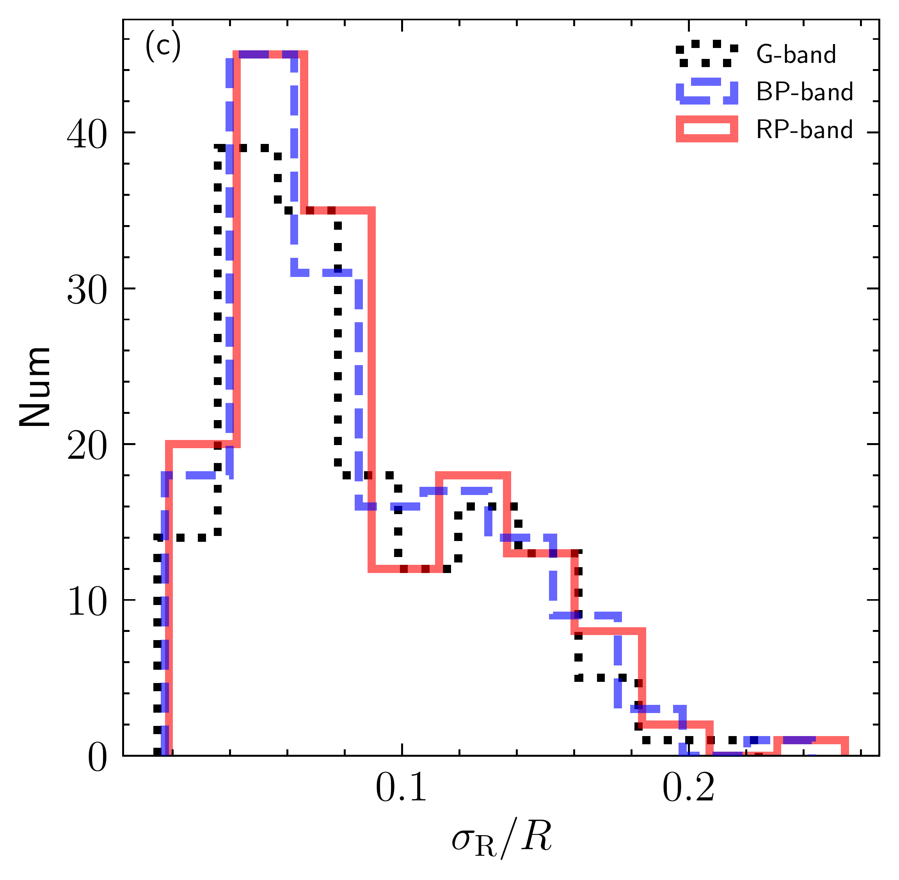
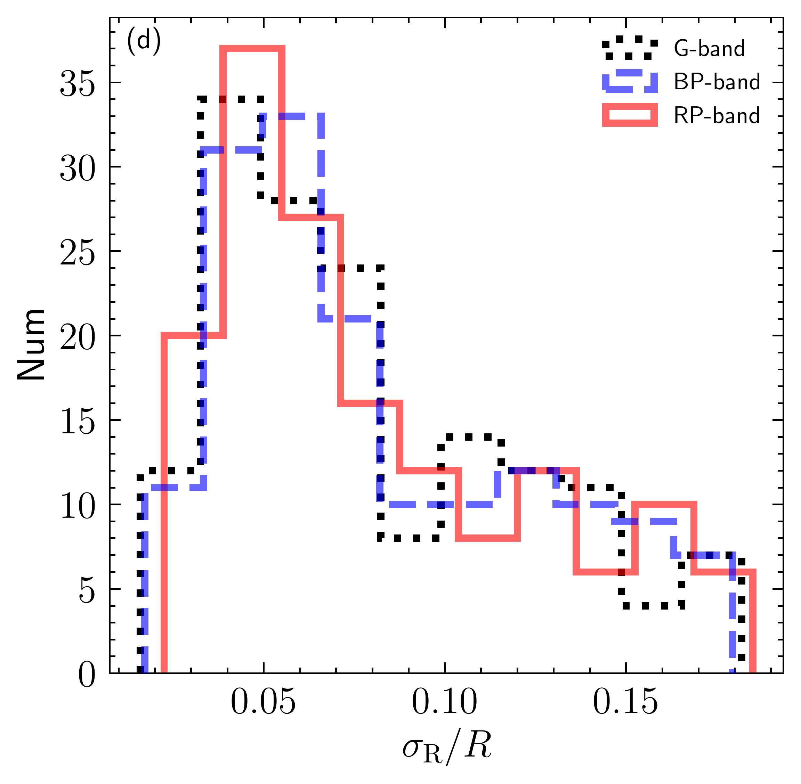

, including the ZAMS in dashed lines, the LHG (late Hertzsprung–Russell gap) in dotted lines, and the BRGB (base of the red giant branch) in solid lines. The red star markers represent our semi-detached binary candidates, while the black dots correspond to the literature samples. (*fig:PQ*)

**Figure 3. -** The upper plots display the results of the model with a more massive component filling its Roche lobe, while the bottom panels show the results of the model with a less massive component filling its Roche lobe. Panels (a) and (c) are cumulative histograms for standard deviations of the residuals ($\sigma\rm_{Res}$) between the predicted light curves and the simulated light curves. Panel (b) shows a direct comparison between the predicted light curve (red solid line) and the true light curve (black dots) for a target with the more massive component filling its Roche lobe, and the parameters are $T\rm_{1}$= 37768 K, $i$=68.97$^{\circ}$, $R\rm_{2}/a$=0.265, $q$=0.924, and $T\rm_{2}$/$T\rm_{1}$=0.892. Similarly, panel (d) presents a direct comparison for a target with the less massive component filling its Roche lobe, with the parameters being $T\rm_{1}$= 29179 K, $i$=89.90$^{\circ}$, $R\rm_{1}/a$=0.235, $q$=0.756, and $T\rm_{2}$/$T\rm_{1}$=1.118. In panels (b) and (d), the corresponding residuals between predictions and true values are shown at the bottom. (*fig:model_precision*)

**Figure 9. -** The distribution of relative uncertainties ($\sigma_{M}/M$ and $\sigma_{R}/R$) on masses ((a) and (b)) and radii ((c)and (d)) for our candidates that derived from Gaia three bands by using the parameters from Gaia golden sample. The black dotted, blue dashed, and red solid represent the relative uncertainties for Gaia’s
G-, BP- and RP-band, respectively. (*fig:MR_sec_precision*)

