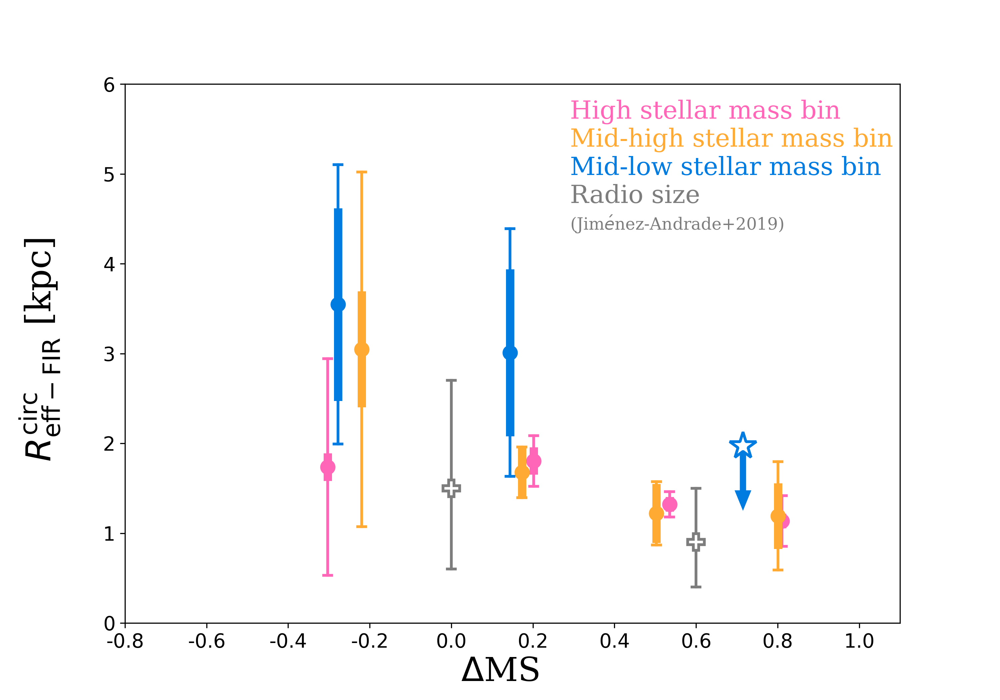
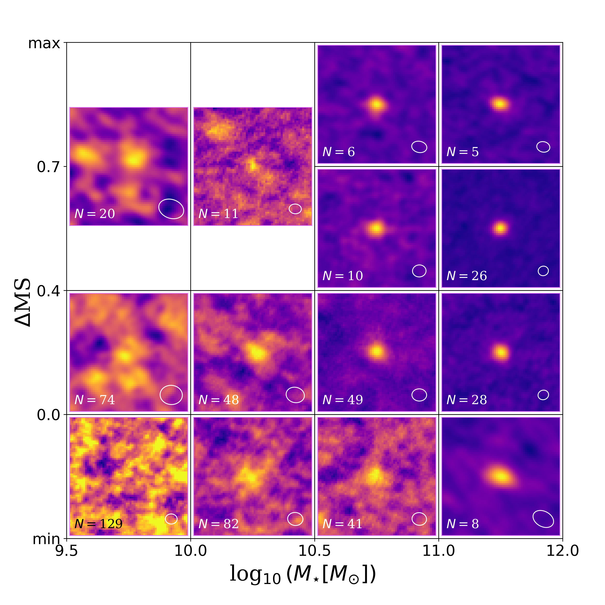
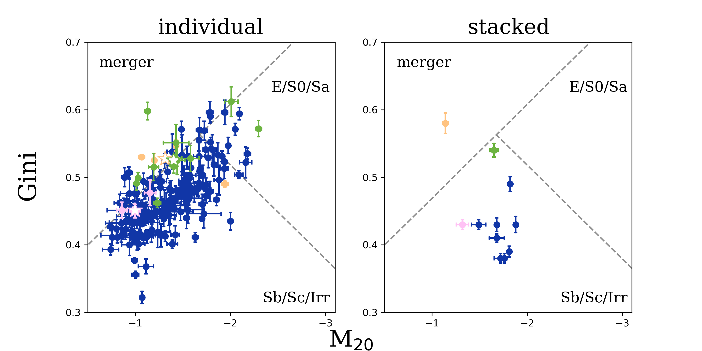

$\newcommand{\ensuremath}{}$
$\newcommand{\xspace}{}$
$\newcommand{\object}[1]{\texttt{#1}}$
$\newcommand{\farcs}{{.}''}$
$\newcommand{\farcm}{{.}'}$
$\newcommand{\arcsec}{''}$
$\newcommand{\arcmin}{'}$
$\newcommand{\ion}[2]{#1#2}$
$\newcommand{\textsc}[1]{\textrm{#1}}$
$\newcommand{\hl}[1]{\textrm{#1}}$
$\newcommand{\footnote}[1]{}$

# A$^{3}$COSMOS: Dissecting the gas content of star-forming galaxies across the main sequence at 1.2 $\leq z$ < 1.6

<mark>Appeared on: 2023-11-21</mark> -  _20 pages, 17 figures_

T.-M. Wang, et al. -- incl., <mark>E. Schinnerer</mark>

**Abstract:** We aim to understand the physical mechanisms that drive star formation in a sample of mass-complete (>10$^{9.5}M_{\odot}$) star-forming galaxies (SFGs) at 1.2 $\leq z$ < 1.6. We selected SFGs from the COSMOS2020 catalog and applied a $uv$-domain stacking analysis to their archival Atacama Large Millimeter/submillimeter Array (ALMA) data. Our stacking analysis provides precise measurements of the mean molecular gas mass and size of SFGs. We also applied an image-domain stacking analysis on their _HST_ $i$-band and UltraVISTA $J$- and $K_{\rm s}$-band images. Correcting these rest-frame optical sizes using the $R_{\rm half-stellar-light}$-to-$R_{\rm half-stellar-mass}$ conversion at rest 5,000 angstrom, we obtain the stellar mass size of MS galaxies. Across the MS (-0.2 < $\Delta$MS < 0.2), the mean molecular gas fraction of SFGs increases by a factor of $\sim$1.4, while their mean molecular gas depletion time decreases by a factor of $\sim$1.8. The scatter of the MS could thus be caused by variations in both the star formation efficiency and molecular gas fraction of SFGs. The majority of the SFGs lying on the MS have $R_{\rm FIR}$ $\approx$ $R_{\rm stellar}$. Their central regions are subject to large dust attenuation. Starbursts (SBs, $\Delta$MS>0.7) have a mean molecular gas fraction $\sim$2.1 times larger and mean molecular gas depletion time $\sim$3.3 times shorter than MS galaxies. Additionally, they have more compact star-forming regions ($\sim$2.5~kpc for MS galaxies vs. $\sim$1.4~kpc for SBs) and systematically disturbed rest-frame optical morphologies, which is consistent with their association with major-mergers. SBs and MS galaxies follow the same relation between their molecular gas mass and star formation rate surface densities with a slope of $\sim1.1-1.2$, that is, the so-called KS relation. 

**Figure 6. -** Circularized effective FIR radius as a function of distance to the MS. Circles and stars show the mean and upper limit FIR sizes for the resolved and unresolved stacked galaxies, respectively. Error bars are the same as in Fig. \ref{fig:gas_frac}, but for the circularized effective FIR radius. Crosses are the mean radio sizes of SFGs at $M_{\star}$ > 10$^{10.5}M_{\odot}$ from \citet[][]{2019A&A...625A.114J}. (*fig:FIR_size*)

**Figure 11. -** Results in image-domain of our ALMA stacking analysis in $uv$-domain. The maximun values of $\Delta$MS from the lowest to highest stellar mass bins are 1.3, 0.9, 1.0, and 1.1; and the minimum values from the lowest to highest stellar mass bins are -0.7, -0.7, -0.7, and -0.6, respectively. Each panel has a size of 6 arcsec $\times$ 6 arcsec. The synthesized beam of the image is shown in the right-bottom corner of each panel. (*fig:ALMA_img*)

**Figure 13. -** Morphological classification of our $M_{\star}$> $10^{10}M_{\odot}$ SFGs measured on their _HST_$i$-band images. Circles in the left panel are the Gini and M20 coefficient measured on _HST_$i$-band images of each individual galaxy, while the right panel shows the Gini and M20 coefficient measured for the stacked images of the different stellar mass and $\Delta$MS bin. Orange, pink, green, and dark blue show SBs ($\Delta$MS > 0.7) at 10$^{11}\leq M_{\star}/{\rm M}_{\odot}<10^{12}$, SBs at 10$^{10.5}\leq M_{\star}/{\rm M}_{\odot}<10^{11}$, SBs at 10$^{10}\leq M_{\star}/{\rm M}_{\odot}<10^{10.5}$, and $M_{\star}$> $10^{10}M_{\odot}$ SFGs without SBs ($\Delta$MS < 0.7), respectively. Stars in the left panel are the median Gini and M20 coefficients of SBs in these three stellar mass bins. Gray dashed lines are the morphology classification from \citet{2008ApJ...672..177L}. (*fig:gini_m20*)

