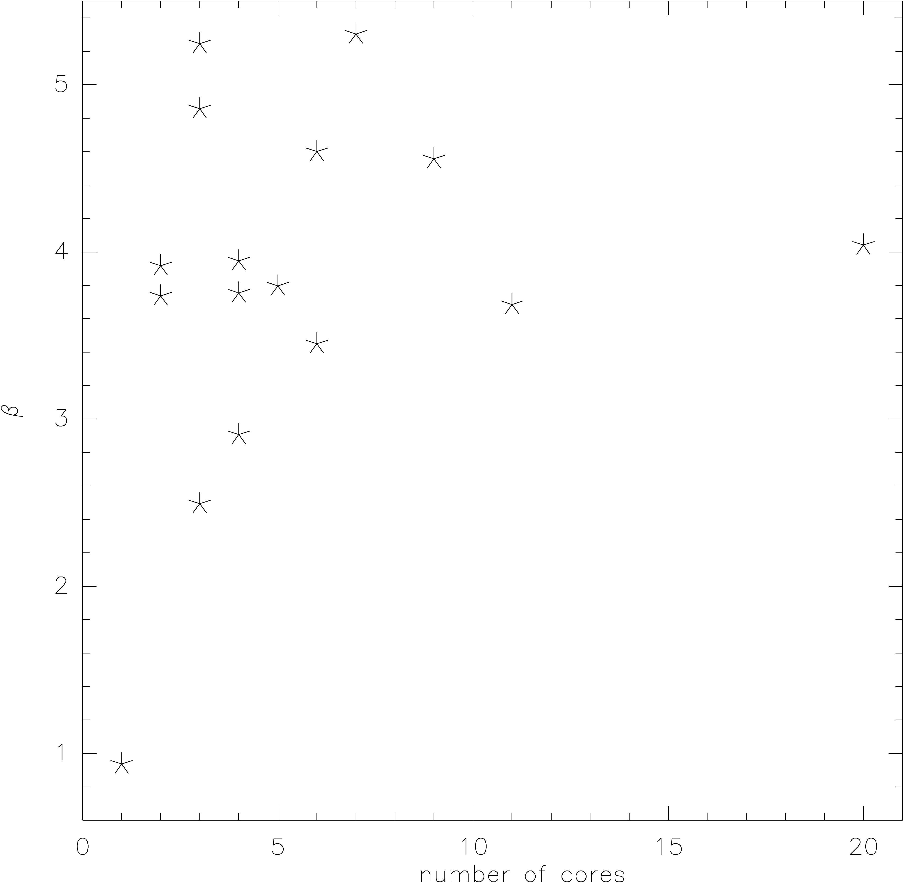
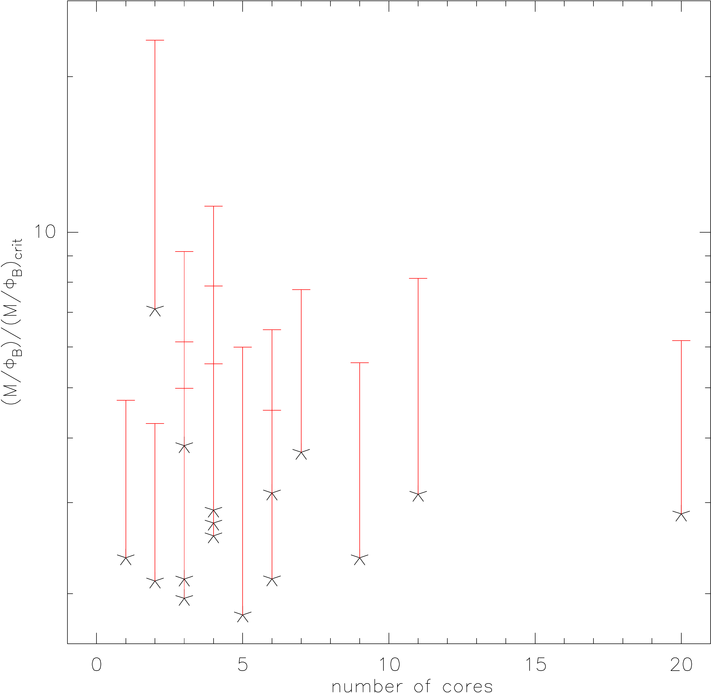

$\newcommand{\ensuremath}{}$
$\newcommand{\xspace}{}$
$\newcommand{\object}[1]{\texttt{#1}}$
$\newcommand{\farcs}{{.}''}$
$\newcommand{\farcm}{{.}'}$
$\newcommand{\arcsec}{''}$
$\newcommand{\arcmin}{'}$
$\newcommand{\ion}[2]{#1#2}$
$\newcommand{\textsc}[1]{\textrm{#1}}$
$\newcommand{\hl}[1]{\textrm{#1}}$
$\newcommand{\footnote}[1]{}$
$\newcommand{\}{natexlab}$
$\newcommand{\}{natexlab}$

# Density distributions, magnetic field structures and fragmentation in high-mass star formation

<mark>Appeared on: 2023-11-21</mark> -  _Accepted for Astronomy & Astrophysics, 14 pages, 14 figures plus appendices, also download option at this https URL_

<mark>H. Beuther</mark>, et al. -- incl., <mark>D. Semenov</mark>

**Abstract:** The fragmentation of high-mass star-forming regions depends on a variety of physical parameters, including the density, magnetic field and turbulent gas properties. We evaluate the importance of the density and magnetic field structures in relation to the fragmentation properties during high-mass star formation. Observing the large pc-scale Stokes $I$ mm dust continuum emission with the IRAM 30 m telescope and the intermediate-scale ( $<$ 0.1 pc) polarized submm dust emission with the Submillimeter Array toward a sample of 20 high-mass star-forming regions allows us to quantify the dependence of the fragmentation behaviour of these regions depending on the density and magnetic field structures. Based on the IRAM 30 m data, we infer density distributions $n\propto r^{-p}$ of the regions with typical power-law slopes $p$ around $\sim$ 1.5. There is no obvious correlation between the power-law slopes of the density structures on larger clump scales ( $\sim$ 1 pc) and the number of fragments on smaller core scales ( $<$ 0.1 pc). Comparing the large-scale single-dish density profiles to those derived earlier from interferometric observations at smaller spatial scales, we find that the smaller-scale power-law slopes are steeper, typically around $\sim$ 2.0. The flattening toward larger scales is consistent with the star-forming regions being embedded in larger cloud structures that do not decrease in density away from a particular core. Regarding the magnetic field, for several regions it appears aligned with filamentary structures leading toward the densest central cores. Furthermore, we find different polarization structures with some regions exhibiting central polarization holes whereas other regions show polarized emission also toward the central peak positions. Nevertheless, the polarized intensities are inversely related to the Stokes $I$ intensities, following roughly a power law slope of $\propto S_I^{-0.62}$ . We estimate magnetic field strengths between $\sim$ 0.2 and $\sim$ 4.5 mG, and we find no clear correlation between magnetic field strength and the fragmentation level of the regions.   Comparison of the turbulent to magnetic energies shows that they are of roughly equal importance in this sample. The mass-to-flux ratios range between $\sim$ 2 and $\sim$ 7, consistent with collapsing star-forming regions. Finding no clear correlations between the present-day large-scale density structure, the magnetic field strength and the smaller-scale fragmentation properties of the regions, indicates that the fragmentation of high-mass star-forming regions may not be affected strongly by the initial density profiles and magnetic field properties.   However, considering the limited evolutionary range and spatial scales of the presented CORE analysis, future research directions should include density structure analysis of younger regions that better resemble the initial conditions, as well as connecting the observed intermediate-scale magnetic field structure with the larger-scale magnetic fields of the parental molecular clouds.

**Figure 1. -** Plot of the ratio of turbulent to magnetic energy $\beta$ versus number of cores. Approximate uncertainties on $\beta$ are around a factor 4. (*beta*)

**Figure 2. -** Plot of the mass-to-flux ratio versus number of cores. For clarity in the logarithmic plotting, the red errorbars are only shown one-sided to higher values. (*mass_flux*)

**Figure 3. -** Plot of the ratio of turbulent to magnetic energy $\beta$ versus number of cores. Approximate uncertainties on $\beta$ are around a factor 4. (*beta*)

