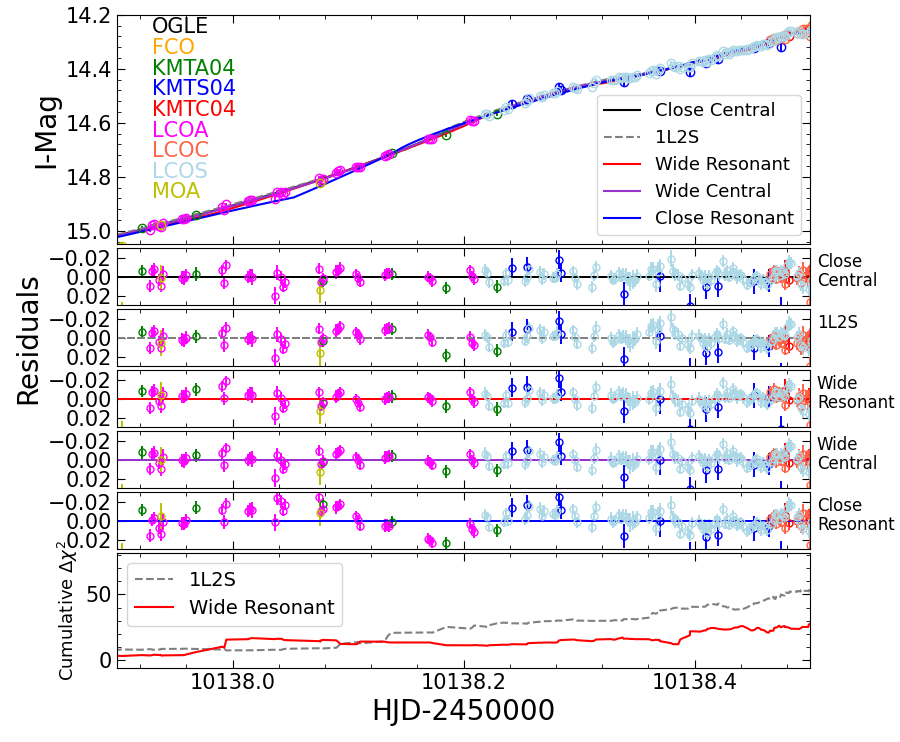
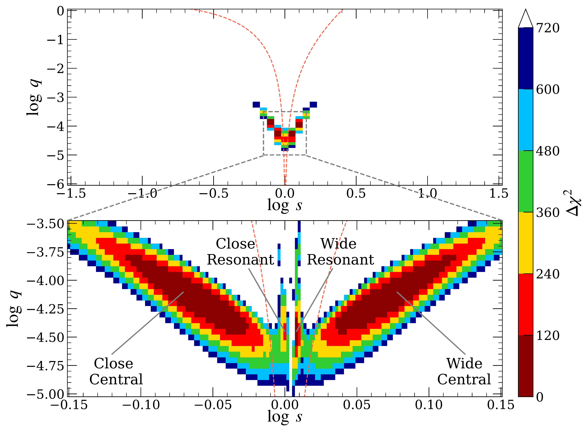
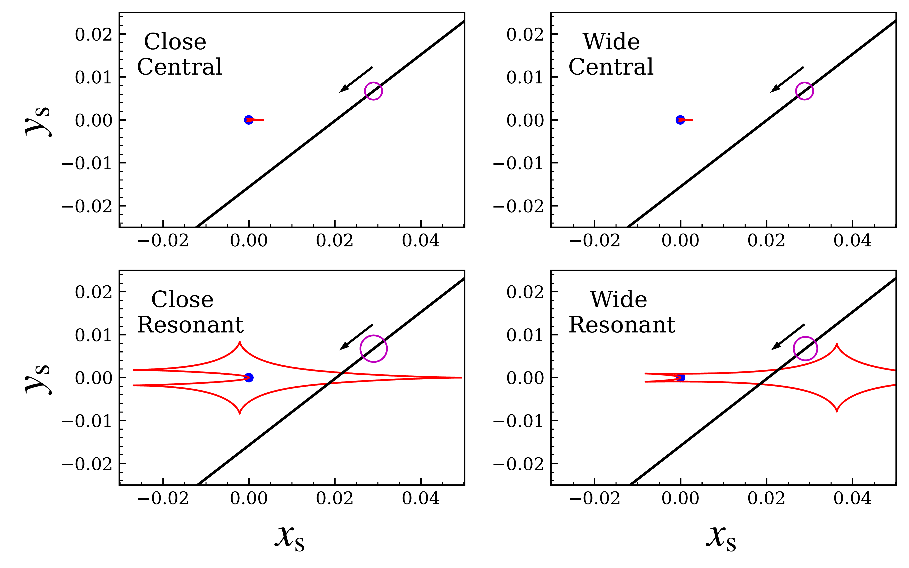

$\newcommand{\ensuremath}{}$
$\newcommand{\xspace}{}$
$\newcommand{\object}[1]{\texttt{#1}}$
$\newcommand{\farcs}{{.}''}$
$\newcommand{\farcm}{{.}'}$
$\newcommand{\arcsec}{''}$
$\newcommand{\arcmin}{'}$
$\newcommand{\ion}[2]{#1#2}$
$\newcommand{\textsc}[1]{\textrm{#1}}$
$\newcommand{\hl}[1]{\textrm{#1}}$
$\newcommand{\footnote}[1]{}$
$\newcommand{\thetae}{\theta_{\rm E}}$
$\newcommand{\teff}{t_{\rm eff}}$
$\newcommand{\Icat}{I_{\rm cat}}$
$\newcommand{\pie}{\pi_{\rm E}}$
$\newcommand{\pirel}{\pi_{\rm rel}}$
$\newcommand{\te}{t_{\rm E}}$
$\newcommand{\event}{KMT-2023-BLG-1431}$
$\newcommand{\an}{\theta_{*}}$
$\newcommand{\Sp}{{\it Spitzer}}$
$\newcommand{\hjd}{{\rm HJD}^{\prime}}$
$\newcommand$
$\newcommand$
$\newcommand{\arraystretch}{1.25}$
$\newcommand{\arraystretch}{1.4}$
$\newcommand$

# ${\large KMT-2023-BLG-1431Lb: A New $q < 10^{-4}$ Microlensing Planet from a Subtle Signature}$

<mark>Appeared on: 2023-11-23</mark> -  _PASP submitted. arXiv admin note: text overlap with arXiv:2301.06779_

A. Bell, et al. -- incl., <mark>A. Gould</mark>

**Abstract:** The current studies of microlensing planets are limited by small number statistics. Follow-up observations of high-magnification microlensing events can efficiently form a statistical planetary sample. Since 2020, the Korea Microlensing Telescope Network (KMTNet) and the Las Cumbres Observatory (LCO) global network have been conducting a follow-up program for high-magnification KMTNet events. Here, we report the detection and analysis of a microlensing planetary event, $\event$ , for which the subtle (0.05 magnitude) and short-lived (5 hours) planetary signature was characterized by the follow-up from KMTNet and LCO. A binary-lens single-source (2L1S) analysis reveals a planet/host mass ratio of $q = (0.72 \pm 0.07) \times 10^{-4}$ , and the single-lens binary-source (1L2S) model is excluded by $\Delta\chi^2 = 80$ . A Bayesian analysis using a Galactic model yields estimates of the host star mass of $M_{\rm host} = 0.57^{+0.33}_{-0.29} M_\odot$ , the planetary mass of $M_{\rm planet} = 13.5_{-6.8}^{+8.1} M_{\earth}$ , and the lens distance of $D_{\rm L} = 6.9_{-1.7}^{+0.8}$ kpc. The projected planet-host separation of $a_\perp = 2.3_{-0.5}^{+0.5}$ au or $a_\perp = 3.2_{-0.8}^{+0.7}$ , subject to the close/wide degeneracy. We also find that without the follow-up data, the survey-only data cannot break the degeneracy of central/resonant caustics and the degeneracy of 2L1S/1L2S models, showing the importance of follow-up observations for current microlensing surveys.

**Figure 5. -** Detailed comparison of the disfavored model fits to the anomaly: "Close Central", "Wide Central", "Close Resonant" "Wide Resonant",  and "1L2S". The top panel shows the models plotted with the data, while the middle panels show the residuals to the models. The "Close Resonant" models shows clear residuals and is ruled out. The deviations in the "Wide Resonant" and "1L2S" models are more subtle but (as shown in the bottom panel), amount to $\Delta\chi^2$ differences of $\sim 30$ and $\sim 80$, respectively, over the course of the anomaly. The "Close Central" model is competitive with the best-fit "Wide Central" model. (*fig:lc2*)

**Figure 1. -** $\chi^2$ surface in the ($\log s, \log q$) plane drawn from the grid search. The upper panel displays the space that is equally divided on a ($61 \times 61$) grid with ranges of $-1.5\leq\log s \leq1.5$ and $-6.0\leq \log q \leq0$, respectively. The lower panel shows the space that is equally divided on a ($151 \times 31$) grid with ranges of $-0.15\leq\log s \leq0.15$ and $-5.0\leq \log q \leq-3.5$, respectively. Grid with $\Delta \chi^2  > 720$ are marked as blank. The labels "Close Central", "Wide Central", "Close Resonant", and "Wide Resonant" in the lower panel indicate four local minima. The two red dashed lines represent the boundaries between resonant and non-resonant caustics applying Equation (59) of [ and Dominik (1999)]().
 (*fig:grid*)

**Figure 2. -** Geometries of the four 2L1S solutions. In each panel, the black line with an arrow represents the source trajectory with respect to the host star that is marked by blue dot, the red lines show the caustic structure, the axes are in units of the Einstein radius $\thetae$, and the magenta circle indicates the source radii.
     (*fig:cau*)

