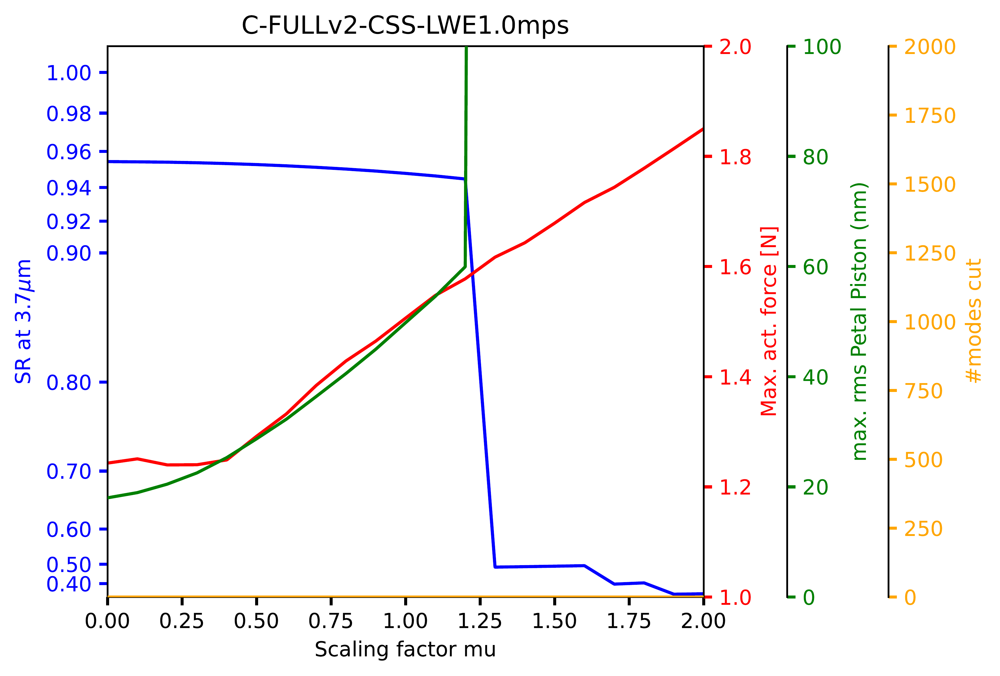
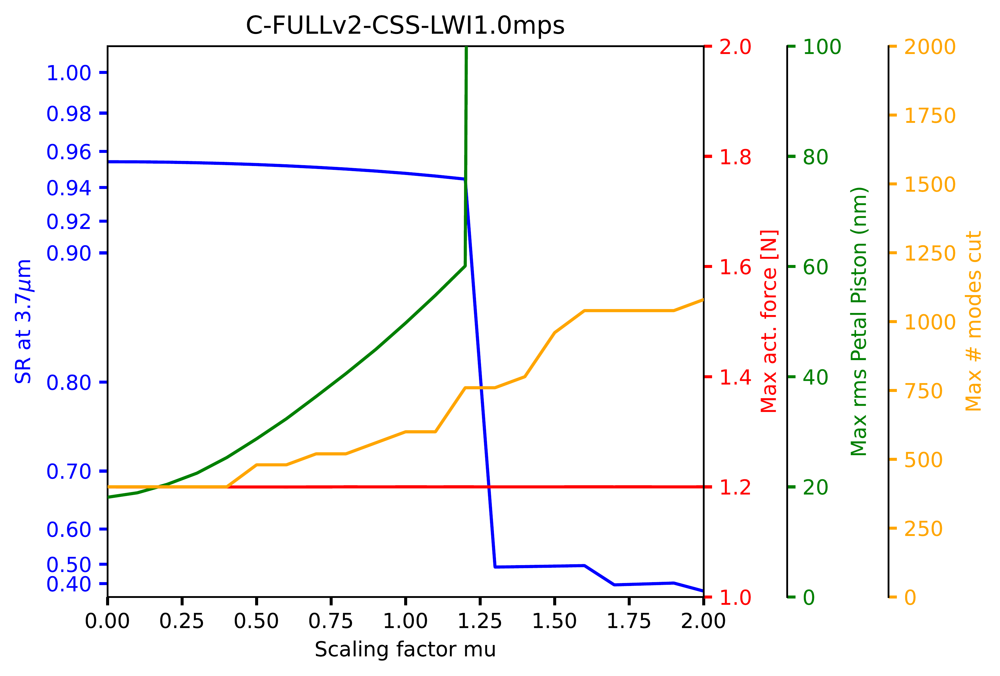
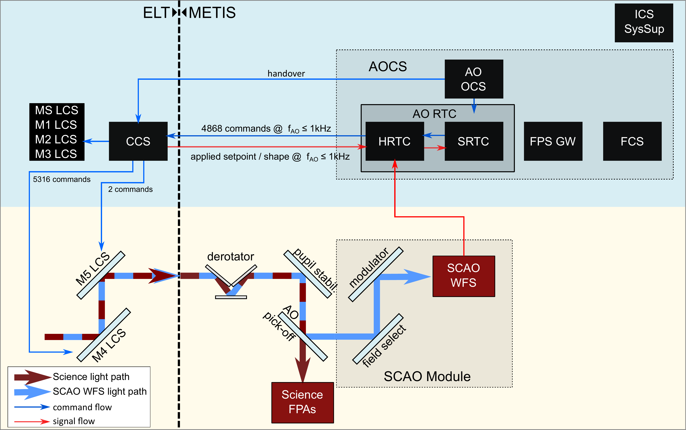
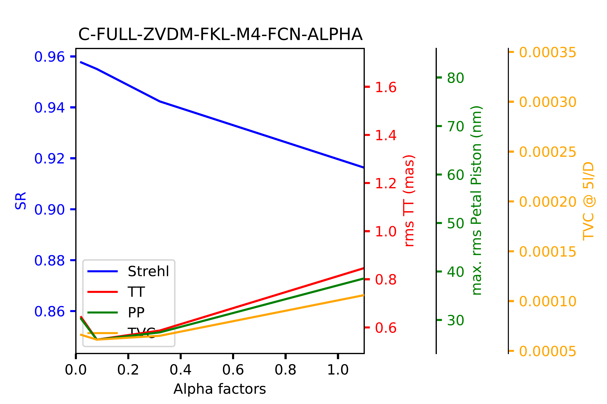

$\newcommand{\ensuremath}{}$
$\newcommand{\xspace}{}$
$\newcommand{\object}[1]{\texttt{#1}}$
$\newcommand{\farcs}{{.}''}$
$\newcommand{\farcm}{{.}'}$
$\newcommand{\arcsec}{''}$
$\newcommand{\arcmin}{'}$
$\newcommand{\ion}[2]{#1#2}$
$\newcommand{\textsc}[1]{\textrm{#1}}$
$\newcommand{\hl}[1]{\textrm{#1}}$
$\newcommand{\footnote}[1]{}$
$\newcommand{çc}[1]{{\color{red}\textrm{#1}}}$
$\newcommand{\baselinestretch}{1.0}$
$\newcommand{\@}{maketitle}$

# Simulating METIS' SCAO System

<mark>Appeared on: 2023-11-23</mark> -  _17 pages, 14 Figures, AO4ELT VII Conference - Avignon - June 2023_

<mark>M. Feldt</mark>, et al. -- incl., <mark>H. Steuer</mark>, <mark>T. Bertram</mark>

**Abstract:** METIS, the Mid-Infrared ELT Imager and Spectrograph, is one of the four first-generation ELT instruments scheduled to see first light in 2028. Its two main science modules are supported by an adaptive optics system featuring a pyramid sensor with 90x90 subapertures working in the $H$ and $K$ bands. During the PDR and FDR phases, extensive simulations were carried out to support the sensing, reconstruction, and control concept of METIS single-conjugate adaptive optics (SCAO) system.We present details on the implementation of the COMPASS-based environment used for the simulations, the metrics used for analyzing our performance expectations, an overview of the main results, and some details on special cases like non-common path aberrations (NCPA) and water vapor seeing, as well as the low-wind effect.

**Figure 12. -** 
Performance and CCS response for different scalings of the 1.0 m/s low-wind case. The blue curve denotes the Strehl ratio, red denotes the maximum force required by any actuator at any time during the simulation, green shows the measured petal piston rms as usual, and the orange curve shows the maximum number of modes dropped from the command vector at any time during the simulation. In the simulation underlying the left-hand figure, mode dropping was disabled to show the strain on the maximum actuator force when the impact of the low-wind condition increases.
 (*fig:C-FULL-CCS*)

**Figure 1. -** Simplified block diagram of the SCAO system: The Adaptive Optics Control System (AOCS) and the SCAO Module (slightly darker boxes) are the entities of the SCAO system that belong to the instrument domain. The key entities for
the real-time correction of the incoming light are located in the 'ELT' domain on the left side of the figure. In a closed wavefront control loop, the blue, near-infrared (NIR) light is used to measure the instantaneous residual
wavefront error by the WFS. The measurement signal is analyzed by the RTC, and a computed correction is sent to the Central Control System (CCS) to be applied with the M4 and ELT tip-tilt field stabilization mirror (M5) via a Local
Control System (LCS). The Focal Plane Sensor Gateway (FPS GW) provides science images to auxiliary AO loops. (*fig:SCAO-overview*)

**Figure 4. -** Typical plot of our key performance parameters against a varying input parameter, in this case both regularization strengths of the reconstructor which were kept identical. The Strehl ratio is plotted in blue, residual tip-tilt motion of the PSF in red, residual petal piston in green, and the temporal variance contrast in orange. (*fig:stdfig_example*)

