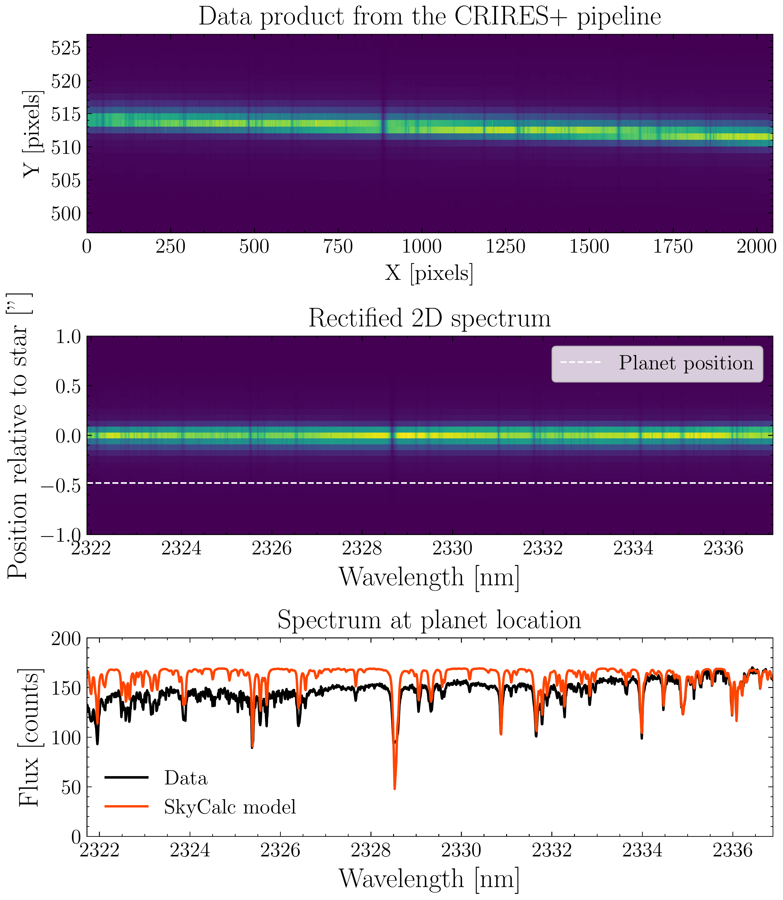
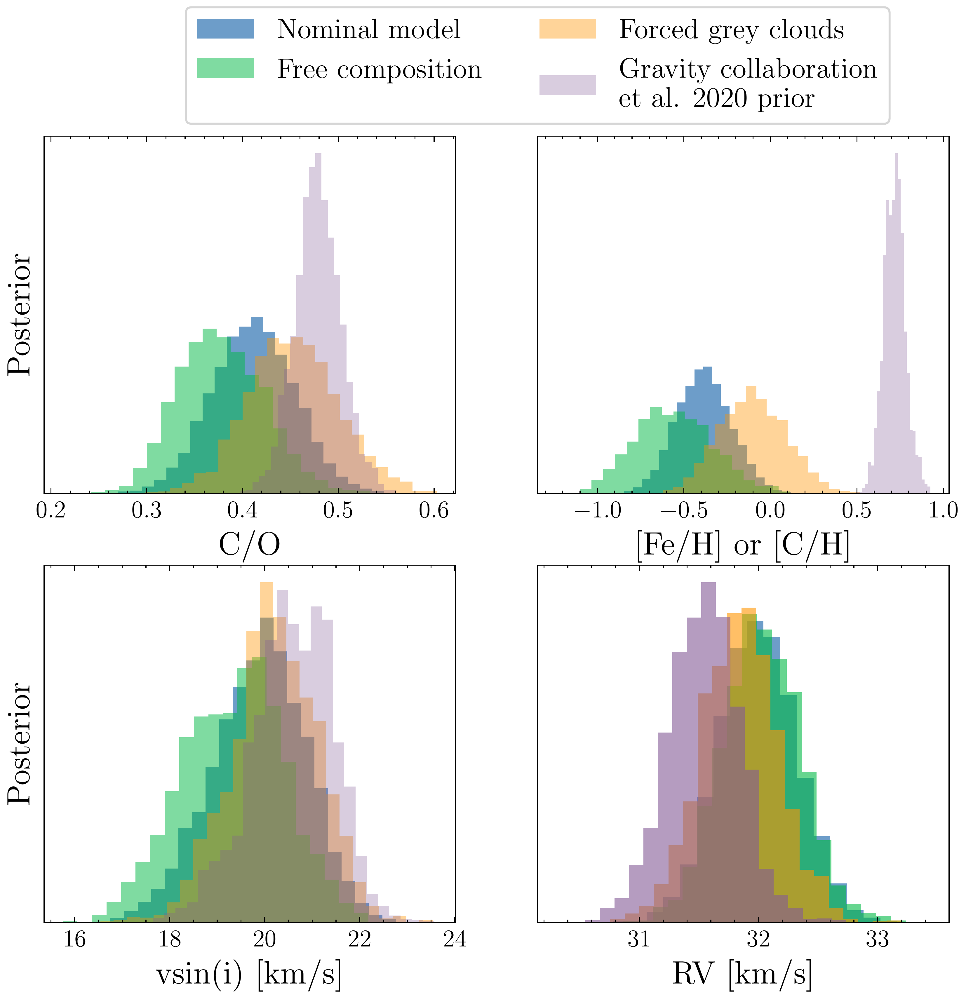
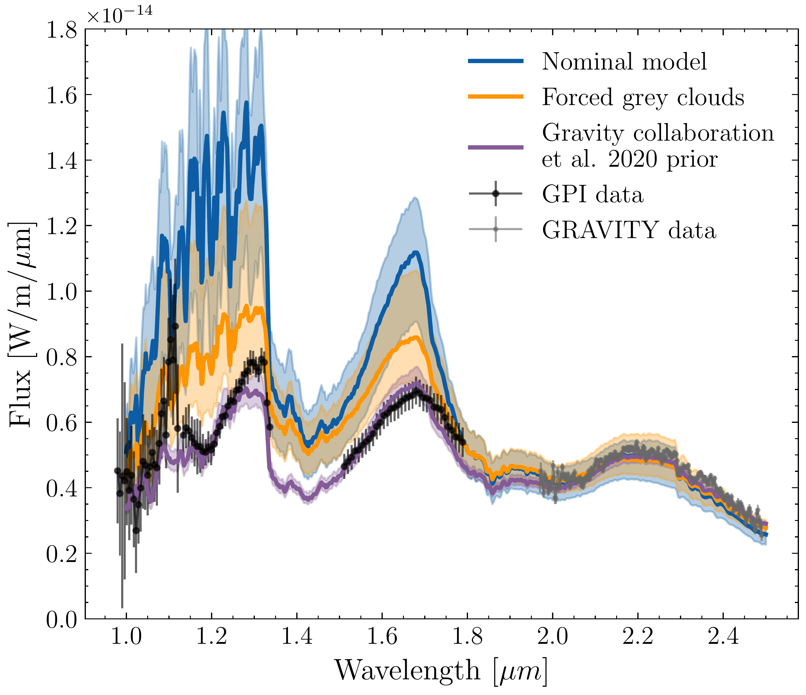

$\newcommand{\ensuremath}{}$
$\newcommand{\xspace}{}$
$\newcommand{\object}[1]{\texttt{#1}}$
$\newcommand{\farcs}{{.}''}$
$\newcommand{\farcm}{{.}'}$
$\newcommand{\arcsec}{''}$
$\newcommand{\arcmin}{'}$
$\newcommand{\ion}[2]{#1#2}$
$\newcommand{\textsc}[1]{\textrm{#1}}$
$\newcommand{\hl}[1]{\textrm{#1}}$
$\newcommand{\footnote}[1]{}$
$\newcommand{\appropto}{\mathrel{\vcenter{$
$  \offinterlineskip\halign{\hfil##\cr$
$    \propto\cr\noalign{\kern2pt}\sim\cr\noalign{\kern-2pt}}}}}$
$\newcommand{\arraystretch}{1.15}$
$\newcommand{\arraystretch}{1.2}$

# $\beta$ Pictoris b through the eyes of the upgraded CRIRES+

<mark>Appeared on: 2023-11-23</mark> -  _Accepted for publication in A&A_

R. Landman, et al. -- incl., <mark>P. Mollière</mark>

**Abstract:** High-resolution spectrographs fed by adaptive optics (AO) provide a unique opportunity to characterize directly imaged exoplanets. Observations with such instruments allow us to probe the atmospheric composition, spin rotation, and radial velocity of the planet, thereby helping to reveal information on its formation and migration history. The recent upgrade of the Cryogenic High-Resolution Infrared Echelle Spectrograph (CRIRES+) at the VLT makes it a highly suitable instrument for characterizing directly imaged exoplanets. In this work, we report on observations of $\beta$ Pictoris b with CRIRES+ and use them to constrain the planets atmospheric properties and update the estimation of its spin rotation. The data were reduced using the open-source _pycrires_ package. We subsequently forward-modeled the stellar, planetary, and systematic contribution to the data to detect molecules in the planet's atmosphere. We also used atmospheric retrievals to provide new constraints on its atmosphere. We confidently detected water and carbon monoxide in the atmosphere of $\beta$ Pictoris b and retrieved a slightly sub-solar carbon-to-oxygen ratio, which is in agreement with previous results. The interpretation is hampered by our limited knowledge of the C/O ratio of the host star. We also obtained a much improved constraint on its spin rotation of $19.9 \pm 1.0$ km/s, which gives a rotation period of $8.7 \pm 0.8$ hours, assuming no obliquity. We find that there is a degeneracy between the metallicity and clouds, but this has minimal impact on the retrieved C/O, $v\sin{i}$ , and radial velocity. Our results show that CRIRES+ is performing well and stands as a highly useful instrument for characterizing directly imaged planets.

**Figure 1. -** Visualization of the data extraction pipeline. Top row shows the product of the _obs\_nodding_ recipe from the ESO CRIRES+ data reduction pipeline. The middle row shows the rectified 2D spectrum corrected for the slit tilt and curvature using _pycrires_ and the bottom row shows the spectrum at the location of the planet, plotted together with a telluric model generated with SkyCalc. (*fig:data_reduction*)

**Figure 3. -** Constraints on a subset of the parameters from the atmospheric retrievals using the models discussed in Section \ref{sec:atmosphere_models}. The RV shown here is in the barycentric restframe. (*fig:retrieved_params*)

**Figure 5. -** Comparison of the spectral energy distributions of our retrieved models compared to the low-resolution GPI data from [Chilcote and Pueyo (2017)]() and GRAVITY data from [Nowak and Lacour (2020)](). Since we do not retrieve radius, the flux of our models is scaled such that it matches the GPI flux in the K-band. The solid line shows the median value and the colored region shows the 16th and 84th percentiles. (*fig:comp_lowres*)

