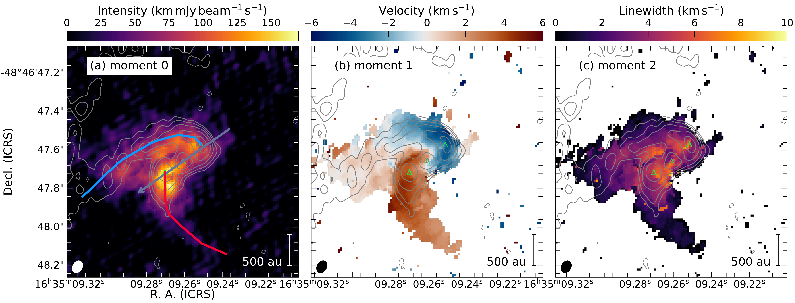
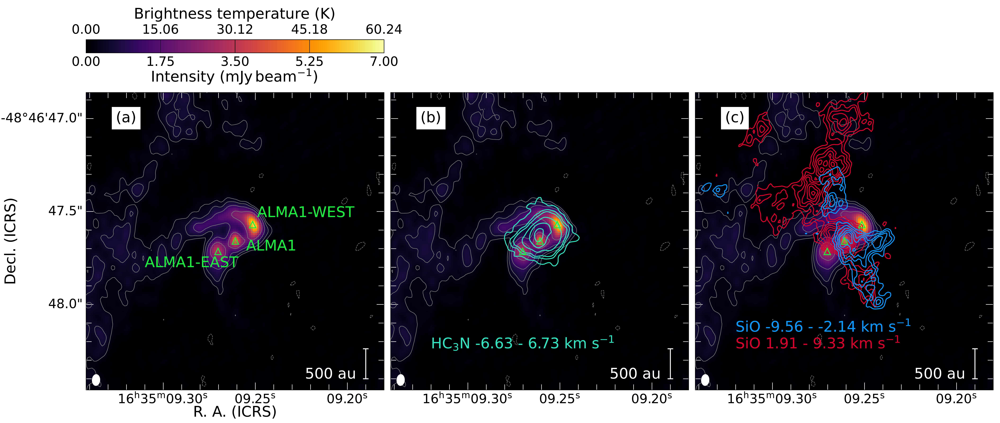
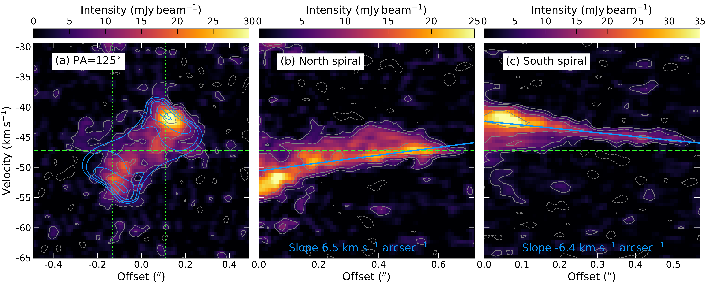

$\newcommand{\ensuremath}{}$
$\newcommand{\xspace}{}$
$\newcommand{\object}[1]{\texttt{#1}}$
$\newcommand{\farcs}{{.}''}$
$\newcommand{\farcm}{{.}'}$
$\newcommand{\arcsec}{''}$
$\newcommand{\arcmin}{'}$
$\newcommand{\ion}[2]{#1#2}$
$\newcommand{\textsc}[1]{\textrm{#1}}$
$\newcommand{\hl}[1]{\textrm{#1}}$
$\newcommand{\footnote}[1]{}$
$\newcommand{\vdag}{(v)^\dagger}$
$\newcommand$
$\newcommand$
$\newcommand{\msun}{{\rm M}_\sun}$
$\newcommand{\lsun}{{\rm L}_\sun}$
$\newcommand{\kms}{km s^{-1}}$

# Digging into the Interior of Hot Cores with ALMA: Spiral Accretion into the High-mass Protostellar Core G336.01--0.82

<mark>Appeared on: 2023-12-01</mark> -  _11 pages, 5 figures, 2 appendices. Accepted for publication in ApJL. Interactive figure available at this https URL_

F. A. Olguin, et al. -- incl., <mark>S. Li</mark>

**Abstract:** We observed the high-mass star-forming core G336.01--0.82 at 1.3 mm and 0 $\farcs$ 05 ( ${\sim}150$ au) angular resolution with the Atacama Large Millimeter/submillimeter Array (ALMA) as part of the Digging into the Interior of Hot Cores with ALMA (DIHCA) survey.These high-resolution observations reveal two spiral streamers feeding a circumstellar disk at opposite sides in great detail.Molecular line emission from $CH_3$ OH shows velocity gradients along the streamers consistent with infall.Similarly, a flattened envelope model with rotation and infall implies  a mass larger than  10 $\msun$ for the central source and a centrifugal barrier of 300 au.The location of the centrifugal barrier is consistent with local peaks in the continuum emission.We argue that gas brought by the spiral streamers is accumulating at the centrifugal barrier, which can result in future accretion burst events.A total high infall rate of ${\sim}4\times10^{-4}$ $\msun$ yr $^{-1}$ is derived by matching models to the observed velocity gradient along the streamers.Their contribution account for 20--50 \% the global infall rate of the core, indicating streamers play an important role in the formation of high-mass stars.

**Figure 7. -** $CH_3$OH $J_{K_a,K_c}=18_{3,15}-17_{4,14} A, v_t=0$ moment maps.
(a) shows the zeroth order moment map.
The blue and red lines mark the position of the north and south spiral-like features, respectively.
The arrow marks the direction of the pv map in Figure \ref{fig:ch3oh:pvmap}(a), and corresponds to the line crossing all three continuum structures (PA=125◦).
(b) shows the first order moment map, and (c) the second order moment map.
The continuum is shown in contours with the same levels as in Figure \ref{fig:continuum}, and the continuum peaks are marked with green triangles.
The beam size ellipse is shown in the lower left corner.
 (*fig:ch3oh:moment*)

**Figure 6. -** ALMA maps of G336.01--0.82.
(a) Continuum map at 1.3 mm.
The position of the three local continuum peaks is indicated by the green labeled triangles.
The contour levels are --3, 5, 10, 20, 40, $80\times\sigma_{\rm rms}$ with $\sigma_{\rm rms}=55$$\mu$Jy beam$^{-1}$.
(c) $HC_3$N $J=24-23 l=1f ,v_7=1$ zeroth moment map contours over the continuum map.
The contours are 5, 8, 10, 15, 20, $25\times\sigma_{\rm rms}$ with $\sigma_{\rm rms} = 11$ mJy beam$^{-1}$ km s$^{-1}$.
(b) SiO $J=5-4$ blue- and red-shifted, and
The contour levels are 5, 6, 7 ... $12\times\sigma_{\rm rms}$ with $\sigma_{\rm rms} = 7.7$ mJy beam$^{-1}$ km s$^{-1}$.
Velocity integration ranges with respect to the systemic velocity are annotated by the respective color.
The beam size of the continuum map is shown in the lower left corner.
 (*fig:continuum*)

**Figure 8. -** $CH_3$OH $J_{K_a,K_c}=18_{3,15}-17_{4,14} A, v_t=0$ pv maps.
(a) pv map following the gray line in Figure \ref{fig:ch3oh:moment}(a), i.e., perpendicular to the outflow/rotation axis (PA=125◦) and a slit width of 0$\farcs$1.
The dotted green lines show the offset of the continuum sources ALMA1-WEST (left) and ALMA1-EAST (right).
(b) pv map of the northern spiral-like feature following the blue line in Figure \ref{fig:ch3oh:moment}(a) and a slit width of 0$\farcs$05.
Zero offset corresponds to ALMA1-WEST.
(c) pv map of the southern spiral-like feature following the red line in Figure \ref{fig:ch3oh:moment}(a) and a slit width of 0$\farcs$05.
Gray contour levels are --6, --3, 3, 6, 12 and $24\times\sigma$ with $\sigma=1.2$ mJy beam$^{-1}$.
The blue contours in (a) are from an IRE model (see \S\ref{sec:discussion:rotation}) at the same levels as the data relative to the peak, while the blue lines in (b) and (c) correspond to linear fits to data over $10\sigma$.
Zero offset corresponds to ALMA1-EAST.
The dashed green line correspond to the systemic velocity $v_{\rm LSR}=-47.2$ km s$^{-1}$.
 (*fig:ch3oh:pvmap*)

