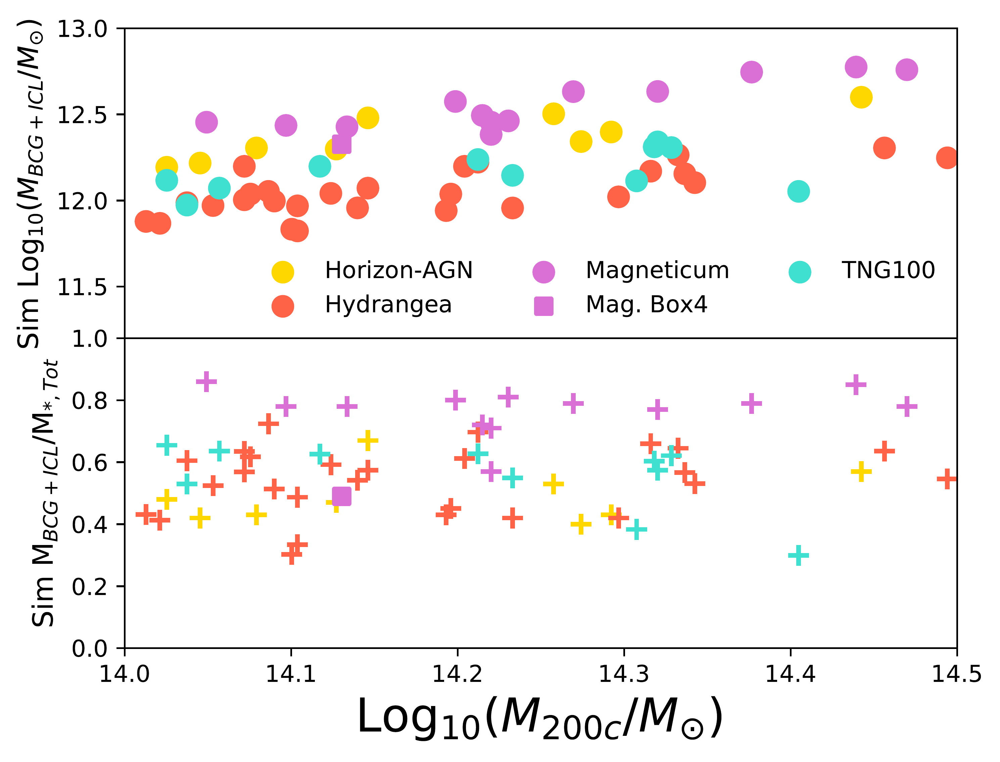
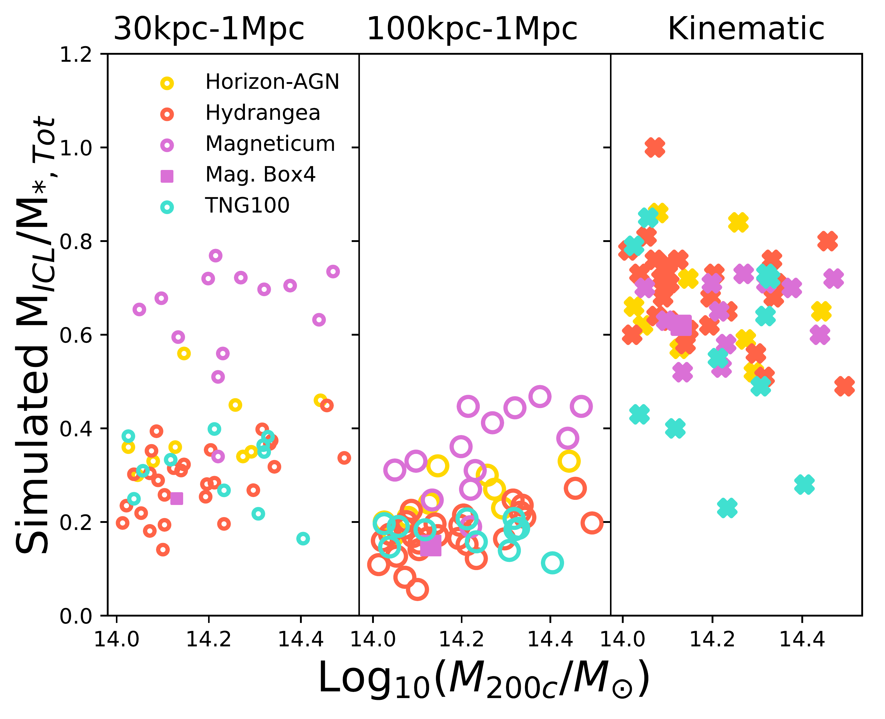
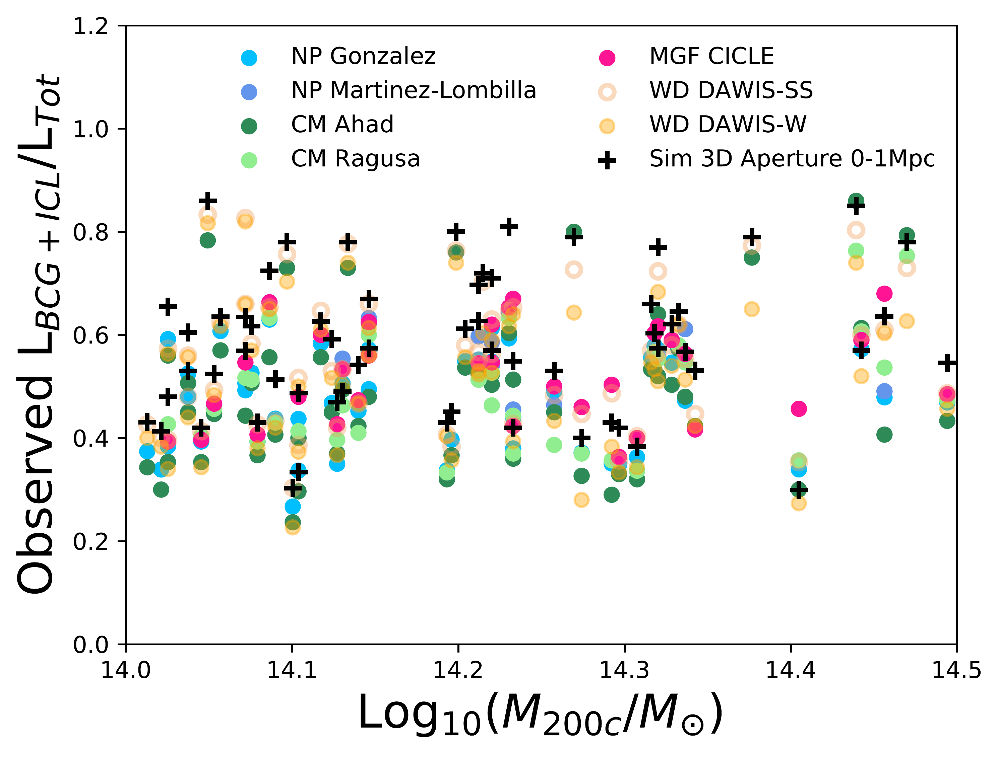
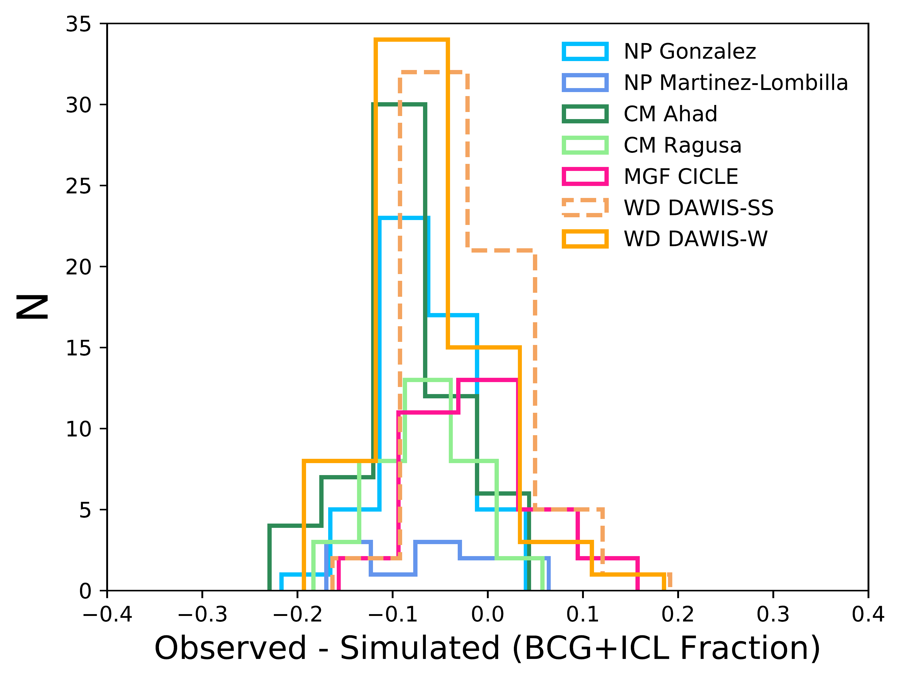
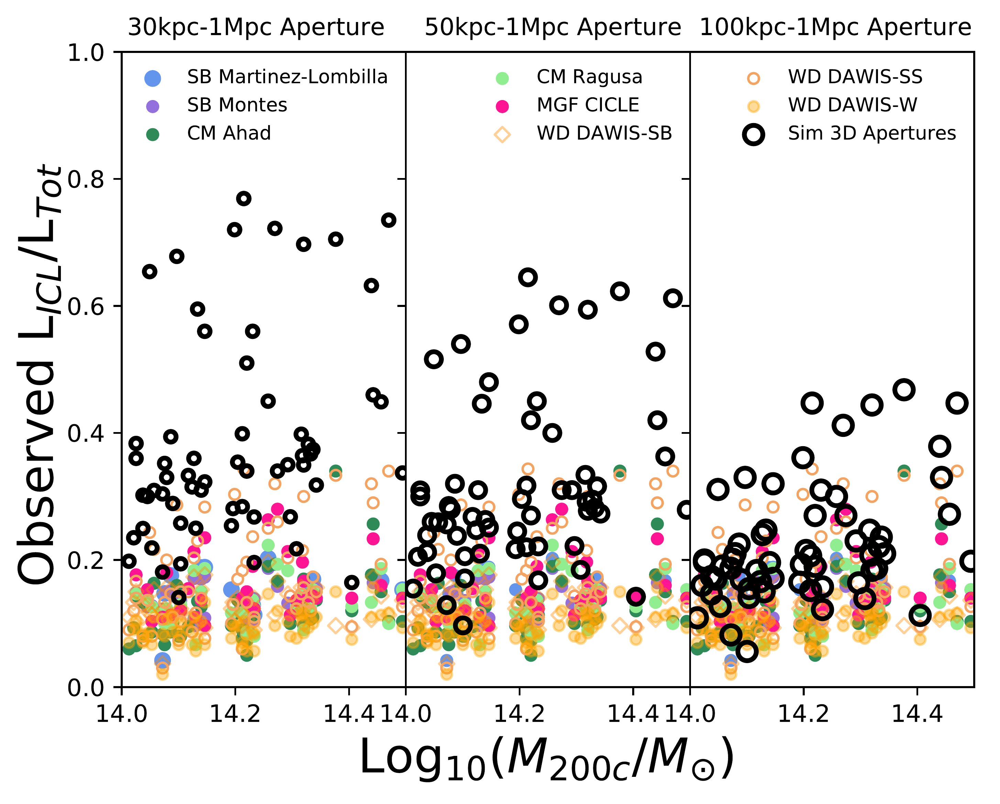

$\newcommand{\ensuremath}{}$
$\newcommand{\xspace}{}$
$\newcommand{\object}[1]{\texttt{#1}}$
$\newcommand{\farcs}{{.}''}$
$\newcommand{\farcm}{{.}'}$
$\newcommand{\arcsec}{''}$
$\newcommand{\arcmin}{'}$
$\newcommand{\ion}[2]{#1#2}$
$\newcommand{\textsc}[1]{\textrm{#1}}$
$\newcommand{\hl}[1]{\textrm{#1}}$
$\newcommand{\footnote}[1]{}$
$\newcommand{\ap}[1]{\textcolor{magenta}{#1}}$
$\newcommand{\bycristina}[1]{\textcolor{red}{#1}}$
$\newcommand{\mireia}[1]{\textcolor{purple}{#1}}$
$\newcommand{\rhealucas}[1]{{\color{lightblue}#1}}$
$\newcommand{\amael}[1]{\textcolor{brown}{#1}}$
$\newcommand{\rossella}[1]{\textcolor{cobalt}{#1}}$
$\newcommand{\yb}[1]{\textcolor{orange}{#1}}$
$\newcommand{\gm}[1]{\textcolor{emerald}{#1}}$
$\newcommand{\thebibliography}{\DeclareRobustCommand{\VAN}[3]{##3}\VANthebibliography}$
$\newcommand{\}{MSUN}$

# Preparing for low surface brightness science with the Vera C. Rubin Observatory: A Comparison of Observable and Simulated Intracluster Light Fractions

<mark>Appeared on: 2023-12-01</mark> -  _Submitted for publication in MNRAS, posted to arXiv after responding to two positive rounds of referee comments. Key results in Figs 3, 5, 6 and 11_

S. Brough, et al. -- incl., <mark>A. Pillepich</mark>

**Abstract:** Intracluster Light (ICL) provides an important record of the interactions galaxy clusters have undergone. However, we are limited in our understanding by our measurement methods. To address this we measure the fraction of cluster light that is held in the Brightest Cluster Galaxy and ICL (BCG+ICL fraction) and the ICL alone (ICL fraction) using observational methods (Surface Brightness Threshold-SB, Non-Parametric Measure-NP, Composite Models-CM, Multi-Galaxy Fitting-MGF) and new approaches under development (Wavelet Decomposition-WD) applied to mock images of 61 galaxy clusters ( $14<$ log $_{10}M_{200c}/M_{\odot}<14.5$ ) from four cosmological hydrodynamical simulations. We compare the BCG+ICL and ICL fractions from observational measures with those using simulated measures (aperture and kinematic separations). The ICL fractions measured by kinematic separation are significantly larger than observed fractions. We find the measurements are related and provide equations to estimate kinematic ICL fractions from observed fractions. The different observational techniques give consistent BCG+ICL and ICL fractions but are biased to underestimating the BCG+ICL and ICL fractions when compared with aperture simulation measures. Comparing the different methods and algorithms we find that the MGF algorithm is most consistent with the simulations, and CM and SB methods show the smallest projection effects for the BCG+ICL and ICL fractions respectively. The Ahad (CM), MGF and WD algorithms are best set up to process larger samples, however, the WD algorithm in its current form is susceptible to projection effects. We recommend that new algorithms using these methods are explored to analyse the massive samples that Rubin Observatory's Legacy Survey of Space and Time will provide.

**Figure 1. -** The simulated BCG+ICL mass (upper panel) and the simulated BCG+ICL fraction (middle panel) as a function of cluster mass. The lower panel shows the ICL fraction measured from the simulations in 2 different apertures (left panel: 30 kpc$-$1 Mpc; middle panel: 100 kpc$-$1 Mpc) and the right-hand panel shows the ICL fraction measured using kinematic separation (crosses) as a function of cluster mass. The different simulations are indicated by the legend and include the one cluster from the higher-resolution Magneticum Box4 simulation.
     (*fig:Sims_bcgmass*)

**Figure 2. -** 
    Observed BCG+ICL fraction (mean measurement over the measured projections). The upper panel shows the observed BCG+ICL fraction as a function of cluster halo mass coloured by measurement type for the 61 simulated clusters across the 4 simulations. We do not observe a dependence of any of the measures on cluster halo mass. The lower panel shows the difference between the Observed BCG+ICL fraction and the Simulated 0 - 1 Mpc Aperture measurement. The observed measurements are presented grouped by measurement type: Non-Parametric Measures (NP; Gonzalez and Martinez-Lombilla), Composite Models (CM; Ahad and Ragusa), Multi-Galaxy Fitting (MGF; CICLE) and Wavelet Decomposition (WD; DAWIS-SS and DAWIS-W). The Surface Brightness Threshold method is not included for BCG+ICL fractions as it removes the BCG by definition. The numbers of clusters measured are different for each of the observed measures.  This figure demonstrates that all methods agree to <0.1 dex in excising the contribution of satellites. (*fig:ICLBCG_Frac_clustermass*)

**Figure 11. -** Observed ICL fraction (mean measurement over simulated projections) as a function of cluster halo mass coloured by measurement type for the 61 simulated clusters across the 4 simulations. The different panels show the three Simulated aperture measures ($30-1$ Mpc, $50-1$ Mpc, $100-1$ Mpc). We do not observe a dependence of any of the measures on cluster halo mass. (*fig:ICL_Frac_clustermass_aper*)

