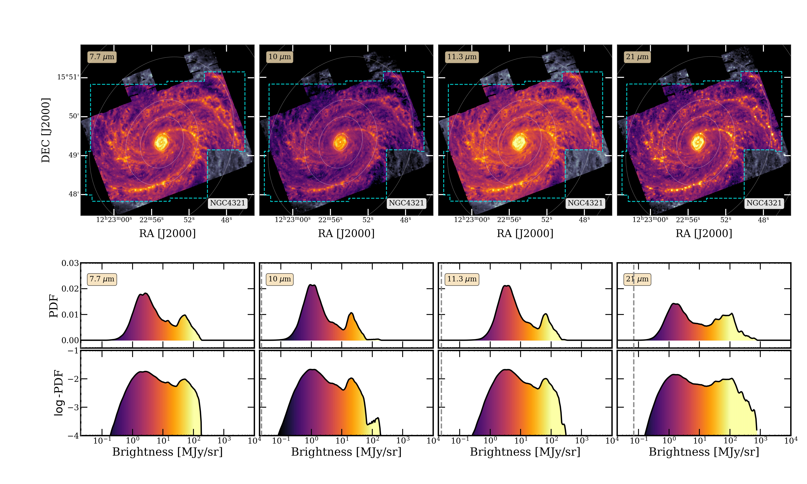
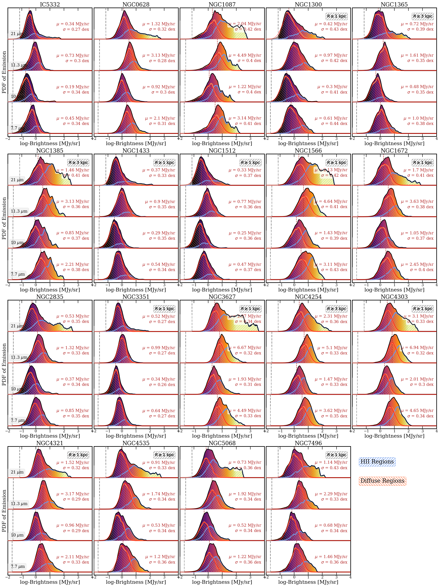
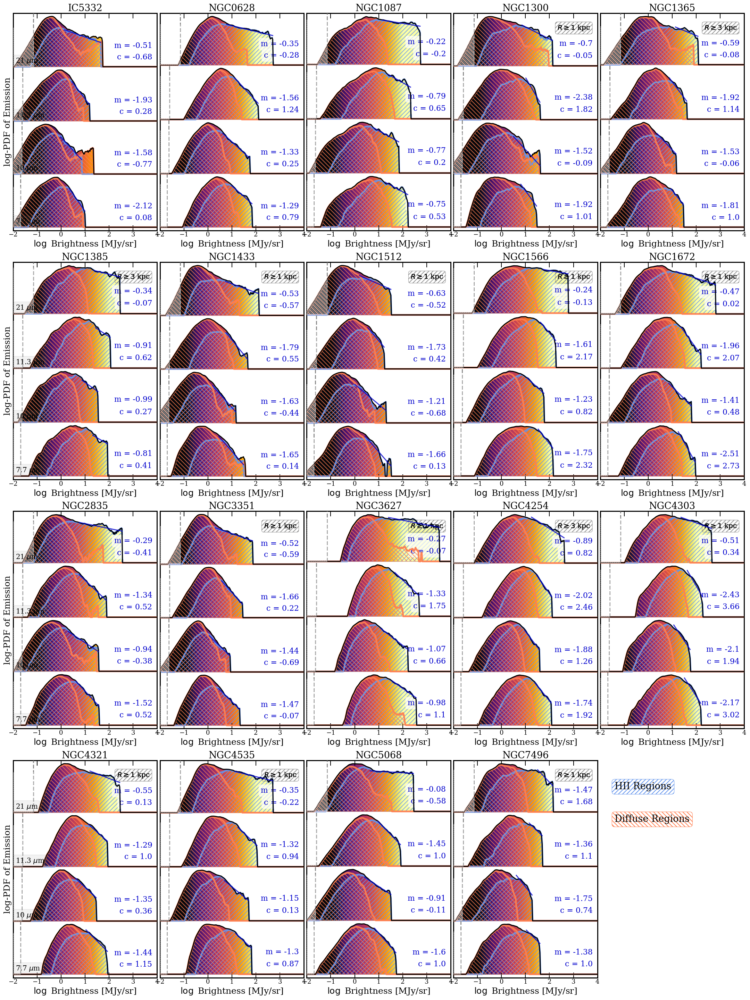

$\newcommand{\ensuremath}{}$
$\newcommand{\xspace}{}$
$\newcommand{\object}[1]{\texttt{#1}}$
$\newcommand{\farcs}{{.}''}$
$\newcommand{\farcm}{{.}'}$
$\newcommand{\arcsec}{''}$
$\newcommand{\arcmin}{'}$
$\newcommand{\ion}[2]{#1#2}$
$\newcommand{\textsc}[1]{\textrm{#1}}$
$\newcommand{\hl}[1]{\textrm{#1}}$
$\newcommand{\footnote}[1]{}$
$\newcommand{\vdag}{(v)^\dagger}$
$\newcommand$
$\newcommand$
$\newcommand{\edit}[1]$

# A Two-Component Probability Distribution Function Describes the mid-IR Emission from the Disks of Star-Forming Galaxies

<mark>Appeared on: 2023-12-01</mark> -  _30 pages without appendix, 17 figures, (with appendix images of full sample: 56 pages, 39 figures), accepted in AJ_

D. Pathak, et al. -- incl., <mark>E. Schinnerer</mark>

**Abstract:** High-resolution JWST-MIRI images of nearby spiral galaxies reveal emission with complex substructures that trace dust heated both by massive young stars and the diffuse interstellar radiation field. We present high angular ( $0\farcs85$ ) and physical resolution ( $20{-}80$ pc) measurements of the probability distribution function (PDF) of mid-infrared (mid-IR) emission (7.7--2 $\mu$ m) from $19$ nearby star-forming galaxies from the PHANGS-JWST Cycle-1 Treasury. The PDFs of mid-IR emission from the disks of all 19 galaxies consistently show two distinct components: an approximately log-normal distribution at lower intensities and a high-intensity power-law component. These two components only emerge once individual star-forming regions are resolved. Comparing with locations of $\ion{H}{2}$ regions identified from VLT/MUSE H $\alpha$ -mapping, we infer that the power-law component arises from star-forming regions and thus primarily traces dust heated by young stars. In the continuum-dominated 21 $\mu$ m band, the power-law is more prominent and contains roughly half of the total flux. At 7.7--11.3 $\mu$ m, the power-law is suppressed by the destruction of small grains (including PAHs) close to $\ion{H}{2}$ regions while the log-normal component tracing the dust column in diffuse regions appears more prominent. The width and shape of the log-normal diffuse emission PDFs in galactic disks remain consistent across our sample, implying a log-normal gas column density $N$ (H) $\approx10^{21}$ cm $^{-2}$ shaped by supersonic turbulence with typical (isothermal) turbulent Mach numbers $\approx5-15$ . Finally, we describe how the PDFs of galactic disks are assembled from dusty $\ion{H}{2}$ regions and diffuse gas, and discuss how the measured PDF parameters correlate with global properties such as star-formation rate and gas surface density.

**Figure 3. -** Images and PDFs of emission at 7.7 $\mu m$, 10 $\mu m$, 11.3 $\mu m$, and 21 $\mu m$ for NGC4321 at $0$\farcs$85$(60 pc) resolution. **Top:** JWST images for NGC4321 in each MIRI filter, restricted to the footprint of JWST-MUSE coverage ($\sim 10$ kpc, dashed blue). **Middle:** PDFs of inclination-corrected intensity from each image. The colors in the PDF map to the colorbar in intensity used to display each image. Vertical dashed lines indicate the RMS noise level in each filter at $0$\farcs$85$. **Bottom:** The same PDFs as the middle row, now with the y-axis on a logarithmic stretch to highlight features at the high-intensity end. (*fig:overall_ngc4321*)

**Figure 8. -** The galactic disk PDFs (in black) of our full sample of 19 galaxies at 7.7, 10, 11.3, and 21 $\mu$m show an overall log normal distribution with a power-law tail at higher intensities. The power-law component can be primarily attributed to emission from individual $\ion${H}{2} regions (blue) and the log normal component comes from emission from outside $\ion${H}{2} regions (red). Vertical dashed lines indicate the rms noise level in each filter for reference. The best-fit log normal mean $\mu$ and dispersion $\sigma$ are included for each PDF. (*fig:PDF_HII*)

**Figure 9. -** The disk PDFs (in black) of our sample of 19 galaxies at 7.7, 10, 11.3, and 21 $\mu$m decomposed by contributions from $\ion${H}{2} regions (blue) and outside (red). These are the same PDFs as Figure \ref{fig:PDF_HII} but in log-stretch to highlight the power-law component. The best-fit power-law is shown in dark blue. The corresponding best-fit $\ion${H}{2} region power-law index $m$ and log-log intercept $c$ for each PDF are included for each panel. (*fig:logPDF_HII*)

