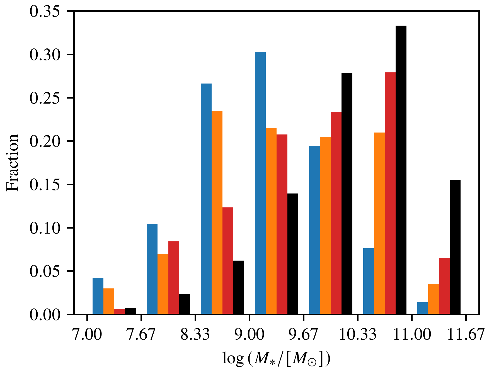
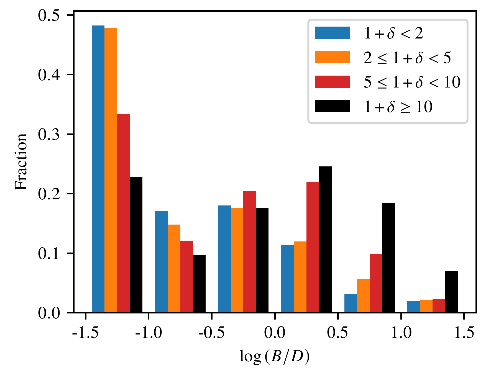
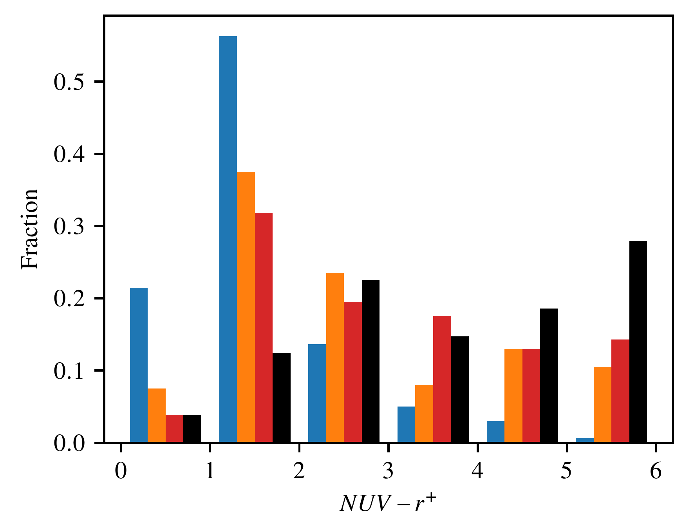
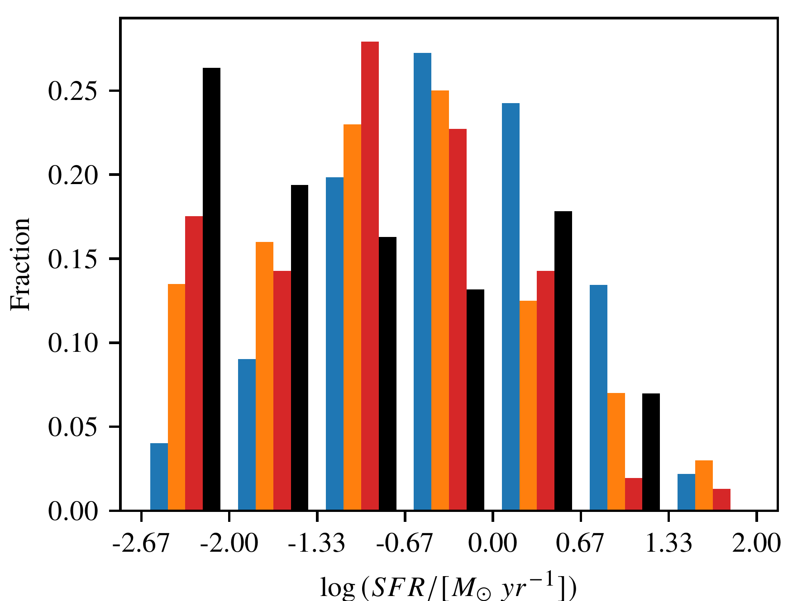
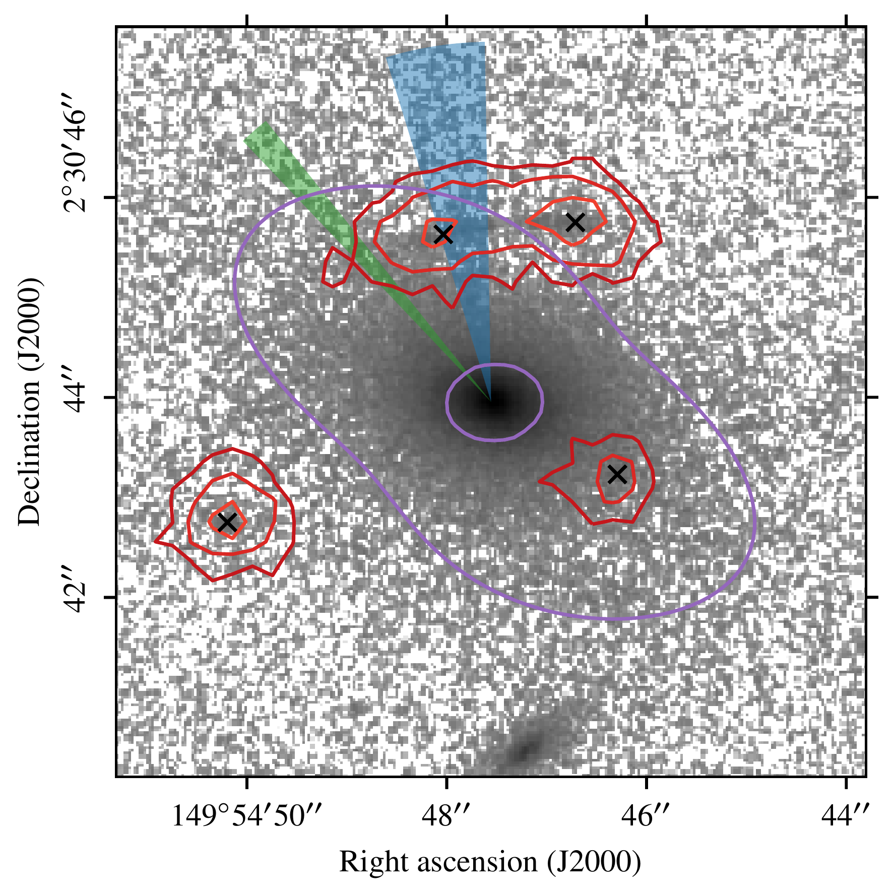
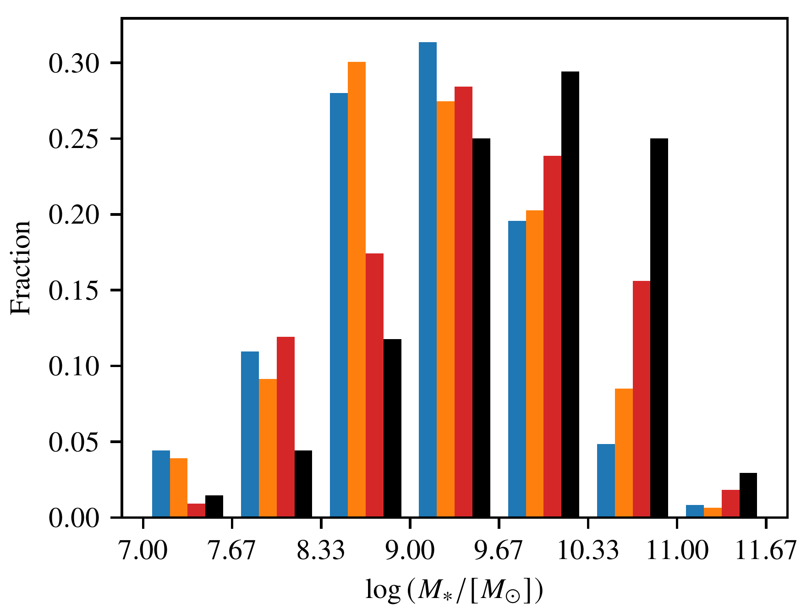
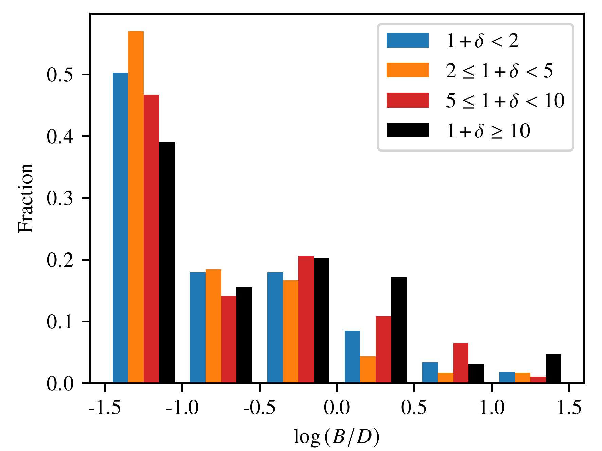

$\newcommand{\ensuremath}{}$
$\newcommand{\xspace}{}$
$\newcommand{\object}[1]{\texttt{#1}}$
$\newcommand{\farcs}{{.}''}$
$\newcommand{\farcm}{{.}'}$
$\newcommand{\arcsec}{''}$
$\newcommand{\arcmin}{'}$
$\newcommand{\ion}[2]{#1#2}$
$\newcommand{\textsc}[1]{\textrm{#1}}$
$\newcommand{\hl}[1]{\textrm{#1}}$
$\newcommand{\footnote}[1]{}$
$\newcommand{\nii}{[\ion{N}{ii}]}$
$\newcommand{\niia}{[\ion{N}{ii}]\lambda6548}$
$\newcommand{\niib}{[\ion{N}{ii}]\lambda6583}$
$\newcommand{\niiab}{[\ion{N}{ii}]\lambda\lambda6548,6583}$
$\newcommand{\sii}{[\ion{S}{ii}]}$
$\newcommand{\siia}{[\ion{S}{ii}]\lambda6716}$
$\newcommand{\siib}{[\ion{S}{ii}]\lambda6731}$
$\newcommand{\siiab}{[\ion{S}{ii}]\lambda\lambda6716,6731}$
$\newcommand{\oii}{[\ion{O}{ii}]}$
$\newcommand{\oiiab}{[\ion{O}{ii}]\lambda\lambda3727,3729}$
$\newcommand{\oiia}{[\ion{O}{ii}]\lambda3727}$
$\newcommand{\oiib}{[\ion{O}{ii}]\lambda3729}$
$\newcommand{\oiii}{[\ion{O}{iii}]}$
$\newcommand{\oiiiab}{[\ion{O}{iii}]\lambda\lambda4959,5007}$
$\newcommand{\oiiia}{[\ion{O}{iii}]\lambda5007}$
$\newcommand{\oiiib}{[\ion{O}{iii}]\lambda4959}$
$\newcommand{\oiiic}{[\ion{O}{iii}]\lambda4363}$
$\newcommand{\ciii}{\ion{C}{iii}]}$
$\newcommand{\ciiiab}{\ion{C}{iii}]\lambda\lambda1907,1909}$
$\newcommand{\ciiia}{\ion{C}{iii}]\lambda1907}$
$\newcommand{\ciiib}{\ion{C}{iii}]\lambda1909}$
$\newcommand{\ca}{[\ion{Ca}{iii}]}$
$\newcommand{\mgiiab}{\ion{Mg}{ii}\lambda\lambda2796,2803}$
$\newcommand{\mgii}{\ion{Mg}{ii}}$
$\newcommand{\ha}{H\alpha}$
$\newcommand{\haa}{H\alpha\lambda6563}$
$\newcommand{\hb}{H\beta}$
$\newcommand{\hba}{H\beta\lambda4861}$
$\newcommand{\lya}{Ly\alpha}$
$\newcommand{\lyaa}{Ly\alpha\lambda1216}$
$\newcommand{\kms}{km~s^{-1}}$
$\newcommand{\zCOSMOS}{COSMOS-z_{\rm spec}}$

# MAGIC: Muse gAlaxy Groups In Cosmos - A survey to probe the impact of environment on galaxy evolution over the last 8 Gyr   $\thanks{Based on observations made with ESO telescopes at the Paranal Observatory under programs 094.A-0247, 095.A-0118, 096.A-0596, 097.A-0254, 099.A-0246, 100.A-0607, 101.A-0282, 102.A-0327, 103.A-0563.}$

<mark>Appeared on: 2023-12-05</mark> -  _27 pages, 22 figures, accepted for publication in A&A_

B. Epinat, et al. -- incl., <mark>L. Boogaard</mark>

**Abstract:** Galaxies migrate along cosmic web filaments from small groups to clusters, which makes the evolution of their properties look stronger as environments get denser. We introduce the Muse gAlaxy Groups in Cosmos (MAGIC) survey built to study the impact of environment on galaxy evolution down to low stellar masses over the last eight Gyr. The MAGIC survey consists of 17 Multi-Unit Spectrocopic Exporer (MUSE) fields targeting 14 massive, known structures at intermediate redshift ( $0.3<z<0.8$ ) in the COSMOS area, with a total on-source exposure of 67h. We securely measure redshifts for 1419 sources and identify 76 galaxy pairs and 67 groups of at least three members using a friends-of-friends algorithm.   The environment of galaxies is quantified from group properties, as well as from global and local density estimators, inferred from galaxy number density and dynamics within groups. The MAGIC survey has increased the number of objects with a secure spectroscopic redshift over its footprint by a factor of $\sim 5$ compared to the previous extensive spectroscopic campaigns on the COSMOS field. Most of the new redshifts have apparent magnitudes in the $z^{++}$ band $z_{\rm app}^{++}>21.5$ . The spectroscopic redshift completeness is high: in the redshift range of $\oii$ emitters ( $0.25 \le z < 1.5$ ), where most of the groups are found, it globally reaches a maximum of 80 \% down to $z_{\rm app}^{++}=25.9$ , and it locally decreases from $\sim 100$ \% to $\sim50$ \% in magnitude bins from $z_{\rm app}^{++}=23-24$ to $z_{\rm app}^{++}=25.5$ .   We find that the fraction of quiescent galaxies increases with local density and with the time spent in groups. A morphological dichotomy is also found between bulge-dominated quiescent and disk-dominated star-forming galaxies. As environment gets denser, the peak of the stellar mass distribution shifts towards $M_\star>10^{10} M_\sun$ , the fraction of galaxies with $M_\star<10^9 M_\sun$ decreasing significantly, even for star-forming galaxies.   We also highlight peculiar features such as close groups, extended nebulae, and a gravitational arc. Our results suggest that galaxies are pre-processed in groups of increasing mass before entering rich groups and clusters.   We publicly release two catalogs containing the properties of galaxies and groups, respectively.

**Figure 21. -** Histograms of stellar mass (top left panel), bulge-to-disc ratio within the galaxy effective radius (top right panel), color (bottom left panel), and SFR (bottom right panel) using the four VMC overdensity classes (see Sect. \ref{sec:red_sequence} and Table \ref{tab:fraction_redseq}). For each class in each histogram, the leftmost and rightmost bins contain all objects with values respectively below and above the corresponding limits. (*fig:histograms1d*)

**Figure 17. -** F814W HST-ACS image centered on the lensing source, 152\_CGr32, at $z=0.72519$ in logarithmic scale (arbitrary unit). The red contours represent the $\lya$ emission of the lensed source at $z=4.0973$ at levels 1, 2, and $4\times 10^{-17}$ erg s$^{-1}$ cm$^{-2}$ arcsec$^{-1}$.
 It is estimated by collapsing the MUSE cube over 20 Å at the observed wavelength of the $\lya$ line, and by subtracting the continuum using 50 Å wide adjacent wavelength ranges on both sides of the $\lya$ range. The four images are identified with black crosses, the lens model critical lines are displayed in purple,
 and the blue wedge indicates the range in the directions to the massive structure responsible for the shear in the lens model, at 1-$\sigma$. The green wedge represents the center directions between the barycenter of CGr32 members inferred from MUSE data and the X-ray center. (*fig:arc_map*)

**Figure 22. -** Similar as Fig. \ref{fig:histograms1d} for the stellar mass and B/D, discarding quiescent galaxies. (*fig:histograms1d_nored*)

